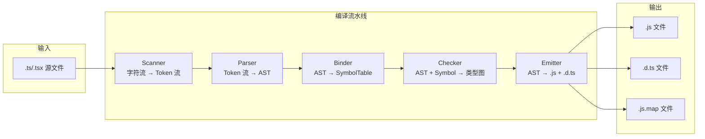
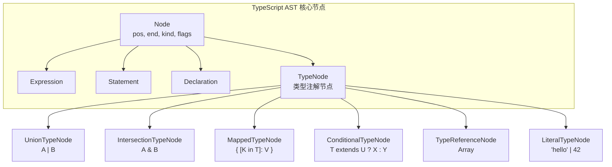
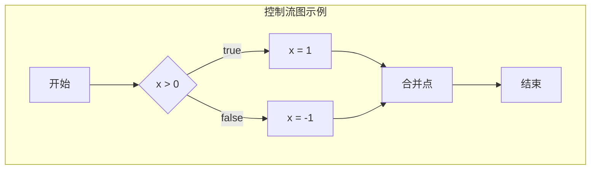
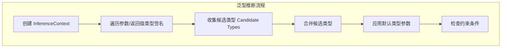

# 18 TypeScript 编译器内部 — 检查器架构、Binder 与类型关系图

:::tip 本章核心
TypeScript 编译器是约 15 万行 TypeScript 代码构成的复杂系统。其核心是**类型检查器（Checker）**——一个基于结构化子类型的、支持增量计算的、高度优化的类型推导引擎。理解编译器的内部架构，是成为 TypeScript 高手的最后一块拼图。
:::

---

## 18.1 编译器整体架构

### 18.1.1 五阶段流水线



### 18.1.2 各阶段职责对比

| 阶段 | 源文件 | 核心数据结构 | 关键输出 | 时间占比 |
|------|--------|-------------|---------|---------|
| Scanner | `scanner.ts` | `Token` 流 | 无（内存中传递） | ~5% |
| Parser | `parser.ts` | `SourceFile` (AST) | AST 节点树 | ~10% |
| Binder | `binder.ts` | `SymbolTable` | 作用域与符号绑定 | ~10% |
| Checker | `checker.ts` | `Type` 图 | 类型诊断信息 | ~65% |
| Emitter | `emitter.ts` | 无新结构 | `.js` / `.d.ts` 文本 | ~10% |

### 18.1.3 核心源码文件导航

```
TypeScript/src/compiler/
├── scanner.ts          # ~1,500 行：词法分析
├── parser.ts           # ~8,500 行：语法分析
├── binder.ts           # ~4,000 行：符号绑定
├── checker.ts          # ~48,000 行：类型检查（核心）
├── emitter.ts          # ~3,500 行：代码生成
├── transformers/       # AST 转换器
│   ├── ts.ts           # TypeScript 特性降级（enum, namespace 等）
│   ├── declarations.ts # .d.ts 生成
│   └── module/         # 模块系统转换（ESM/CJS/AMD/UMD）
└── types.ts            # 内部类型定义（TypeFlags, SyntaxKind 等）
```

> `checker.ts` 是 TypeScript 编译器中**最大的单文件**，包含类型系统的全部核心算法。

---

## 18.2 Scanner：从字符到 Token

### 18.2.1 词法分析的基本原理

```ts
// scanner.ts 的核心是一个状态机
function scan(): SyntaxKind {
  const ch = text[pos];
  switch (ch) {
    case CharacterCodes._0:
    case CharacterCodes._1:
      // ... 数字扫描
      return scanNumber();
    case CharacterCodes.doubleQuote:
    case CharacterCodes.singleQuote:
      return scanString(/*allowEscape*/ true);
    case CharacterCodes.slash:
      // 区分 /（除法）、//（注释）、/*（块注释）
      return scanSlashToken();
    // ... 更多字符处理
  }
}
```

### 18.2.2 Token 类型层级

```mermaid
classDiagram
    class Token {
        +SyntaxKind kind
        +number pos
        +number end
    }
    class Keyword {
        +"const" | "let" | "function" | "interface" ...
    }
    class Punctuation {
        +"{" | "}" | "(" | ")" | ";" | ":" ...
    }
    class Literal {
        +string value
    }
    class Identifier {
        +string text
        +number originalKeywordKind
    }
    class TemplateLiteral {
        +Token[] templateTokens
    }

    Token <|-- Keyword
    Token <|-- Punctuation
    Token <|-- Literal
    Token <|-- Identifier
    Token <|-- TemplateLiteral
```

### 18.2.3 Scanner 对类型系统的影响

```ts
// Scanner 阶段决定了类型注解能否被正确识别

// ✅ 合法：Scanner 识别出类型注解语法
let x: string = "hello";

// ❌ 非法：Scanner 将 :number 作为表达式的一部分解析
let y = x: number;
//         ^ Error: ':' expected.

// Scanner 也处理 JSDoc 注释中的类型信息
/** @type {string} */
let z; // Scanner 提取 JSDoc 类型注解供 Checker 使用
```

---

## 18.3 Parser：从 Token 到 AST

### 18.3.1 递归下降解析器

TypeScript Parser 是一个**手写递归下降解析器**（非生成的），这允许它在解析 JS 的同时处理 TS 特有的语法：

```ts
// parser.ts 中的类型注解解析
function parseTypeAnnotation(): TypeNode {
  if (token() === SyntaxKind.ColonToken) {
    nextToken();
    return parseType();
  }
  return undefined!; // 无类型注解
}

function parseType(): TypeNode {
  // 处理各种类型语法：union、intersection、mapped、conditional...
  return parseUnionTypeOrHigher();
}
```

### 18.3.2 AST 节点类型层级



### 18.3.3 类型注解的 AST 表示

```ts
// 源码：type Result = T extends string ? number : boolean;

// AST 结构（简化）：
{
  kind: SyntaxKind.TypeAliasDeclaration,
  name: { kind: SyntaxKind.Identifier, text: "Result" },
  type: {
    kind: SyntaxKind.ConditionalType,
    checkType: { kind: SyntaxKind.TypeReference, typeName: { text: "T" } },
    extendsType: { kind: SyntaxKind.TypeReference, typeName: { text: "string" } },
    trueType: { kind: SyntaxKind.TypeReference, typeName: { text: "number" } },
    falseType: { kind: SyntaxKind.TypeReference, typeName: { text: "boolean" } }
  }
}
```

---

## 18.4 Binder：构建符号表

### 18.4.1 Symbol 与 SymbolTable

Binder 的核心任务是：**遍历 AST，为每个声明创建 Symbol，并建立作用域链**。

```ts
// binder.ts 中的核心数据结构
interface Symbol {
  flags: SymbolFlags;       // 符号种类（Variable | Function | Class | Interface ...）
  escapedName: string;      // 符号名称（转义后的内部名）
  declarations?: Declaration[];  // 声明节点列表（支持声明合并）
  valueDeclaration?: Declaration; // 值声明（如变量初始化处）
  members?: SymbolTable;    // 类/接口的成员符号表
  exports?: SymbolTable;    // 模块导出符号表
}

type SymbolTable = Map<__String, Symbol>;
```

### 18.4.2 作用域链的构建

```ts
// 源码
function outer() {
  let x = 1;
  function inner() {
    console.log(x); // 闭包引用
  }
  return inner;
}

// Binder 构建的作用域树：
// GlobalScope
//   └── FunctionScope (outer)
//         ├── LocalSymbol: x
//         ├── LocalSymbol: inner
//         └── FunctionScope (inner)
//               └── ClosureReference: x → 指向 outer 的 LocalSymbol x
```

### 18.4.3 声明合并的实现

```ts
// 源码：interface 多次声明自动合并
interface Box {
  width: number;
}
interface Box {
  height: number;
}

// Binder 行为：
// 1. 第一次声明 Box → 创建 Symbol(Box, Interface)
// 2. 第二次声明 Box → 查找到已有 Symbol，将新声明加入 declarations 数组
// 3. Checker 阶段合并所有 declarations 的成员

// Symbol 内部表示：
const boxSymbol = {
  flags: SymbolFlags.Interface,
  escapedName: "Box",
  declarations: [
    { kind: SyntaxKind.InterfaceDeclaration, members: [width] },
    { kind: SyntaxKind.InterfaceDeclaration, members: [height] }
  ]
};
```

### 18.4.4 控制流图的构建



```ts
// Binder 为每个控制流节点分配 FlowNode
interface FlowNode {
  flags: FlowFlags;
  antecedent?: FlowNode;    // 前驱节点（用于类型收窄追踪）
  node?: Expression | VariableDeclaration | ArrayBindingElement;
}

// 类型收窄的关键：Binder 记录每个变量在控制流各点的可能类型
function example(x: string | number) {
  if (typeof x === "string") {
    // FlowNode: typeof x === "string" → x 收窄为 string
    x.toUpperCase(); // ✅
  }
  // FlowNode: 合并点 → x 恢复为 string | number
}
```

---

## 18.5 Checker：类型检查的核心

### 18.5.1 类型系统的内部表示

```ts
// checker.ts 中的 Type 接口（极度简化）
interface Type {
  flags: TypeFlags;           // 类型标志（String | Number | Object | Union | ...）
  symbol?: Symbol;            // 关联的 Symbol（对象类型、类类型等）
  pattern?: DestructuringPattern; // 解构模式（用于上下文类型推断）
}

// 对象类型的内部表示
interface ObjectType extends Type {
  objectFlags: ObjectFlags;
  members?: SymbolTable;      // 属性名 → Symbol
  callSignatures?: Signature[];
  constructSignatures?: Signature[];
  stringIndexInfo?: IndexInfo;
  numberIndexInfo?: IndexInfo;
}

// 联合类型 / 交叉类型的内部表示
interface UnionOrIntersectionType extends Type {
  types: Type[];              // 组成类型
  resolvedReducedType?: Type; // 缓存简化后的类型
}
```

### 18.5.2 类型标志（TypeFlags）

| 标志位 | 含义 | 示例 |
|--------|------|------|
| `TypeFlags.Any` | any 类型 | `let x: any` |
| `TypeFlags.Unknown` | unknown 类型 | `let x: unknown` |
| `TypeFlags.String` | string 基础类型 | `let x: string` |
| `TypeFlags.Number` | number 基础类型 | `let x: number` |
| `TypeFlags.Boolean` | boolean 基础类型 | `let x: boolean` |
| `TypeFlags.Enum` | enum 类型 | `enum E { A }` |
| `TypeFlags.Literal` | 字面量类型 | `"hello"`, `42`, `true` |
| `TypeFlags.Union` | 联合类型 | `string \| number` |
| `TypeFlags.Intersection` | 交叉类型 | `A & B` |
| `TypeFlags.Object` | 对象类型 | `{ a: string }` |
| `TypeFlags.TypeParameter` | 泛型参数 | `T` |
| `TypeFlags.Index` | 索引访问类型 | `T[K]` |
| `TypeFlags.Conditional` | 条件类型 | `T extends U ? X : Y` |
| `TypeFlags.Substitution` | 替换类型（infer 结果） | `infer R` 实例化后 |
| `TypeFlags.TemplateLiteral` | 模板字面量类型 | `` `hello-${T}` `` |
| `TypeFlags.StringMapping` | 内置字符串映射 | `Uppercase<T>` |

### 18.5.3 类型关系判定：`isRelatedTo`

类型检查器的核心算法是**结构化子类型判定**，入口函数为 `isRelatedTo`：

```ts
// checker.ts 中类型关系的核心逻辑（概念简化）
function isRelatedTo(source: Type, target: Type): Ternary {
  // 1. 相同类型？
  if (source === target) return Ternary.True;

  // 2. 任何类型都可以赋值给 any / 从 never 赋值
  if (target.flags & TypeFlags.Any) return Ternary.True;
  if (source.flags & TypeFlags.Never) return Ternary.True;

  // 3. unknown 只能接收 any/unknown/never
  if (target.flags & TypeFlags.Unknown) {
    return source.flags & (TypeFlags.Any | TypeFlags.Unknown | TypeFlags.Never)
      ? Ternary.True
      : Ternary.False;
  }

  // 4. 联合类型分发：source <: A | B  ↔  source <: A 或 source <: B
  if (target.flags & TypeFlags.Union) {
    return some((target as UnionType).types, t => isRelatedTo(source, t));
  }

  // 5. 交叉类型：source <: A & B  ↔  source <: A 且 source <: B
  if (target.flags & TypeFlags.Intersection) {
    return every((target as IntersectionType).types, t => isRelatedTo(source, t));
  }

  // 6. 对象类型结构化比较：逐个属性检查
  if (source.flags & TypeFlags.Object && target.flags & TypeFlags.Object) {
    return structuredTypeRelatedTo(source as ObjectType, target as ObjectType);
  }

  // ... 更多规则（泛型、条件类型、索引类型等）

  return Ternary.False;
}
```

### 18.5.4 结构化类型比较的细节

```ts
// 结构化比较的递归过程：
interface A { x: string; nested: { y: number } }
interface B { x: string; nested: { y: number; z: boolean } }

// A <: B ? 否（B.nested 比 A.nested 多一个 z 属性）
// B <: A ? 是（B 包含 A 的所有结构）

// checker.ts 中的比较逻辑：
function structuredTypeRelatedTo(source: ObjectType, target: ObjectType): Ternary {
  // 对于 target 的每个属性：
  for (const targetProp of getPropertiesOfObjectType(target)) {
    // 在 source 中查找同名属性
    const sourceProp = getPropertyOfObjectType(source, targetProp.escapedName);
    if (!sourceProp) return Ternary.False; // source 缺少必需属性

    // 属性类型递归比较（协变）
    if (!isRelatedTo(getTypeOfSymbol(sourceProp), getTypeOfSymbol(targetProp))) {
      return Ternary.False;
    }
  }

  // 检查方法参数的逆变（strictFunctionTypes）
  for (const targetSig of getSignaturesOfType(target, SignatureKind.Call)) {
    const sourceSig = getMatchingSignature(source, targetSig);
    if (!sourceSig) continue;
    if (!signatureRelatedTo(sourceSig, targetSig, /*strict*/ true)) {
      return Ternary.False;
    }
  }

  return Ternary.True;
}
```

---

## 18.6 类型推断引擎

### 18.6.1 泛型推断的两阶段算法

```ts
// 源码
function identity<T>(x: T): T { return x; }
const result = identity("hello");
// T 被推断为 "hello"（字面量类型）

// Checker 的推断过程：
// 1. 创建推断上下文 (InferenceContext)
// 2. 收集候选类型（"hello" → string literal）
// 3. 从候选类型计算最佳公共类型
// 4. 将推断结果赋给 T
```



### 18.6.2 上下文类型推断（Contextual Typing）

```ts
// 上下文类型：从外部期望类型推断内部表达式类型
const arr: string[] = []; // [] 从 string[] 获得上下文类型

// checker.ts 中的实现：
// 1. 确定 arr 的声明类型为 string[]
// 2. 初始化 [] 时，将上下文类型设为 string[]
// 3. 数组字面量推断为 string[] 而非 never[]

// 回调函数的上下文类型推断
[1, 2, 3].map(x => x.toString());
// x 的上下文类型来自 .map 的签名：number
// 因此 x 推断为 number，而非 any 或 unknown
```

### 18.6.3 infer 关键字的实现

```ts
// 源码：type ReturnType<T> = T extends (...args: any[]) => infer R ? R : never;

// Checker 处理 ConditionalType 时：
// 1. 实例化 extends 右侧，创建类型参数映射
// 2. 尝试将左侧类型与右侧模式匹配
// 3. 如果匹配成功，收集 infer 位置的类型到 inference map
// 4. 用收集到的类型替换 true 分支中的类型参数

// 内部数据结构：
interface InferenceInfo {
  typeParameter: TypeParameter;  // 待推断的类型参数 R
  candidates: Type[];            // 收集到的候选类型
  inferredType?: Type;           // 最终推断结果
}
```

---

## 18.7 控制流分析与类型收窄

### 18.7.1 类型收窄的判定机制

```ts
function example(x: string | number | boolean) {
  if (typeof x === "string") {
    x; // 收窄为 string
  } else if (x === true) {
    x; // 收窄为 true（字面量）
  } else {
    x; // 收窄为 number | false
  }
}

// Checker 使用 NarrowedType 表示收窄后的类型：
interface NarrowedType extends Type {
  // 原始联合类型
  unionType: UnionType;
  // 保留下来的成员类型
  narrowedTypes: Type[];
}
```

### 18.7.2 可辨识联合（Discriminated Union）的实现

```ts
type Shape =
  | { kind: "circle"; radius: number }
  | { kind: "square"; side: number }
  | { kind: "rectangle"; width: number; height: number };

function area(shape: Shape) {
  switch (shape.kind) {
    case "circle":
      return Math.PI * shape.radius ** 2; // shape 收窄为 Circle
    case "square":
      return shape.side ** 2;              // shape 收窄为 Square
  }
}

// Checker 识别 discriminant property 的逻辑：
// 1. 所有联合成员都是对象类型
// 2. 存在一个公共属性（如 kind），其类型在所有成员中互不相交
// 3. 当对该属性进行相等性比较时，可以从联合类型中过滤掉不匹配的成员
```

### 18.7.3 断言函数（Assertion Functions）的类型收窄

```ts
function assertIsString(x: unknown): asserts x is string {
  if (typeof x !== "string") throw new Error("Not a string");
}

function process(x: unknown) {
  assertIsString(x);
  x.toUpperCase(); // x 被收窄为 string
}

// Checker 处理 asserts 谓词：
// 1. 识别函数返回类型为 asserts 谓词
// 2. 在调用点后的控制流节点，将目标变量类型替换为谓词类型
// 3. 如果谓词失败路径（throw），标记后续代码不可达
```

---

## 18.8 Emitter：代码生成

### 18.8.1 TypeScript 到 JavaScript 的转换

```ts
// 源码（TypeScript）
interface Person {
  name: string;
}
const person: Person = { name: "Alice" };

// 输出（JavaScript）— Emitter 执行类型擦除
const person = { name: "Alice" };
```

### 18.8.2 声明文件生成

```ts
// Emitter 中的声明发射（Declaration Emit）
// 只输出公共 API 的类型信息

// 源码
function internalHelper() { return 42; }
export function publicApi(): number {
  return internalHelper();
}

// .d.ts 输出
export declare function publicApi(): number;
// internalHelper 被擦除（未 export）
```

### 18.8.3 模块系统的转换差异

| `module` 配置 | 输入（ESM） | 输出（.js） |
|--------------|-----------|-----------|
| `CommonJS` | `import { x } from "mod"` | `const mod_1 = require("mod")` |
| `ESNext` | `import { x } from "mod"` | `import { x } from "mod"`（保留） |
| `NodeNext` | `import { x } from "mod"` | 根据 package.json `type` 决定 |

```ts
// Emitter 中的模块转换逻辑（emitter.ts）
function emitImportDeclaration(node: ImportDeclaration) {
  if (moduleKind === ModuleKind.CommonJS) {
    // 生成 require()
    write("const ");
    write(getImportName(node));
    write(" = require(");
    write(node.moduleSpecifier.text);
    write(");");
  } else {
    // 保留 ESM 语法
    emit(node); // 直接输出原始 import
  }
}
```

---

## 18.9 编译器 API 与工具链

### 18.9.1 Program 与 CompilerHost

```ts
import * as ts from "typescript";

// 创建编译程序
const program = ts.createProgram(
  ["src/index.ts"],           // 入口文件列表
  { target: ts.ScriptTarget.ES2020, module: ts.ModuleKind.ESNext },
  ts.createCompilerHost({})   // 文件系统抽象
);

// 获取类型检查器
const checker = program.getTypeChecker();

// 遍历所有源文件
for (const sourceFile of program.getSourceFiles()) {
  if (!sourceFile.isDeclarationFile) {
    ts.forEachChild(sourceFile, visit);
  }
}

function visit(node: ts.Node) {
  if (ts.isIdentifier(node)) {
    const symbol = checker.getSymbolAtLocation(node);
    const type = checker.getTypeAtLocation(node);
    console.log(`${node.text}: ${checker.typeToString(type)}`);
  }
  ts.forEachChild(node, visit);
}
```

### 18.9.2 自定义 Transformer

```ts
// 在编译过程中插入自定义 AST 转换
const transformer: ts.TransformerFactory<ts.SourceFile> = (context) => {
  return (sourceFile) => {
    function visit(node: ts.Node): ts.Node {
      // 将所有 console.log 调用替换为空语句
      if (ts.isCallExpression(node) &&
          ts.isPropertyAccessExpression(node.expression) &&
          node.expression.name.text === "log") {
        return ts.factory.createEmptyStatement();
      }
      return ts.visitEachChild(node, visit, context);
    }
    return ts.visitNode(sourceFile, visit);
  };
};

const result = ts.transform(sourceFile, [transformer]);
```

---

## 18.10 本章小结

| 概念 | 一句话总结 |
|------|------------|
| Scanner | 状态机驱动的词法分析器，将字符流转换为 Token 流 |
| Parser | 递归下降语法分析器，构建 AST，支持 JS + TS 语法 |
| Binder | 遍历 AST 建立 SymbolTable 和作用域链，支持声明合并 |
| Checker | 类型系统核心，执行结构化子类型判定和类型推断 |
| Emitter | 执行类型擦除，输出 `.js` 和 `.d.ts` |
| `isRelatedTo` | 类型关系判定的入口函数，实现结构化子类型 |
| TypeFlags | 类型系统的内部位标志，精确标识每种类型种类 |
| FlowNode | 控制流图节点，记录变量在各点的收窄类型 |
| InferenceInfo | 泛型推断的上下文结构，收集候选类型并计算最佳类型 |
| Discriminated Union | 通过公共 discriminant 属性实现精确的类型收窄 |

---

## 参考与延伸阅读

1. [TypeScript Compiler Internals](https://basarat.gitbook.io/typescript/overview) — Basarat Ali Syed 的编译器内部指南
2. [Mini TypeScript](https://github.com/sandersn/mini-typescript) — Anders Hejlsberg 团队维护的简化版 TS 编译器，极佳的学习材料
3. [TypeScript Compiler API](https://github.com/microsoft/TypeScript/wiki/Using-the-Compiler-API) — 官方编译器 API 文档
4. [How TypeScript's Type Checker Works](https://www.hacklewayne.com/how-typescript-type-checker-works) — 类型检查器工作原理图解
5. [checker.ts 源码阅读](https://github.com/microsoft/TypeScript/blob/main/src/compiler/checker.ts) — 类型检查核心源码（约 48,000 行）
6. [AST Explorer](https://ts-ast-viewer.com/) — 在线查看 TypeScript AST 结构
7. [TypeScript Deep Dive](https://basarat.gitbook.io/typescript/) — 包含编译器内部细节的完整参考

---

:::info 专题完结
恭喜你完成了 TypeScript 类型系统深度专题的全部 18 章！从"类型即集合"的第一性原理，到编译器内部的 Checker 架构，你已建立起对 TypeScript 类型系统**从理论到实现**的完整认知。

**推荐后续路径**：

- 实践：[type-challenges](https://github.com/type-challenges/type-challenges) 完成 medium/hard 题目
- 源码：阅读 `checker.ts` 的 `isRelatedTo` 和 `getBaseConstraintOfType` 函数
- 生态：探索 [zod](https://zod.dev/)、[ts-pattern](https://github.com/gvergnaud/ts-pattern) 等类型驱动库
:::
