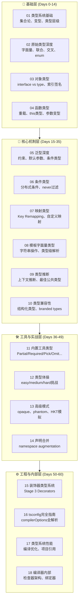
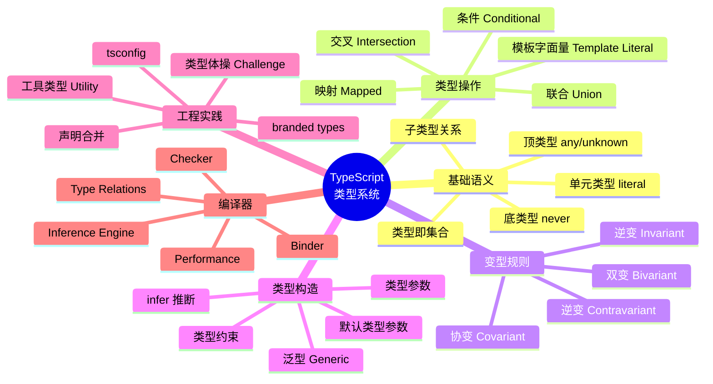

# TypeScript 类型系统深度专题

:::tip 专题定位
本专题是与 **Svelte Signals 响应式系统专题** 同等级别的旗舰内容，目标是为前端/全栈工程师提供一份关于 TypeScript 类型系统的**完整、深入、可实践**的权威参考。

> **核心主张**：TypeScript 的类型系统是一种**图灵完备的结构化类型系统**。理解它的最佳方式不是背诵语法，而是掌握其底层的**集合论语义**、**变型规则**和**类型推断算法**。
:::

---

## 全景概览

---

## 60天学习路径

| 阶段 | 天数 | 章节 | 目标 | 预计耗时 |
|------|------|------|------|----------|
| **筑基期** | Day 0-3 | [01 类型系统基础](./01-type-system-fundamentals.md) | 建立类型即集合的思维模型；掌握协变/逆变/双变/逆变四种变型 | 8h |
| | Day 4-7 | [02 原始类型深度](./02-primitive-types.md) | 精通字面量类型、联合/交叉类型、enum 的陷阱与最佳实践 | 6h |
| | Day 8-11 | [03 对象类型](./03-object-types.md) | 彻底区分 interface 与 type；掌握索引签名和映射类型基础 | 8h |
| | Day 12-14 | [04 函数类型](./04-function-types.md) | 理解函数重载、this 类型、严格函数类型、参数变型 | 6h |
| **核心机制** | Day 15-18 | 05 泛型深度 | 泛型约束、默认参数、条件类型前置、infer 关键字 | 10h |
| | Day 19-21 | *06 条件类型*（待更新） | 分布式条件类型、never 过滤、类型分配律 | 8h |
| | Day 22-25 | *07 映射类型*（待更新） | 内置映射类型原理、Key Remapping via `as`、自定义映射 | 8h |
| | Day 26-28 | *08 模板字面量类型*（待更新） | 字符串操作类型、类型级路由解析、事件名推导 | 6h |
| | Day 29-32 | *09 类型推断*（待更新） | 上下文类型推断、泛型推断、最佳公共类型、ReturnType 推导 | 8h |
| | Day 33-35 | *10 类型兼容性*（待更新） | 结构化类型系统、名义类型模拟、branded types 实战 | 6h |
| **工具与实战** | Day 36-39 | 11 内置工具类型 | 手写实现所有内置工具类型；理解其设计意图 | 8h |
| | Day 40-43 | *12 类型体操*（待更新） | 完成 easy/medium/hard 三个梯度的类型挑战 | 12h |
| | Day 44-46 | *13 高级模式*（待更新） | branded/opaque/phantom types；HKT 高阶类型模拟 | 8h |
| | Day 47-49 | *14 声明合并*（待更新） | namespace、module augmentation、全局类型扩展 | 6h |
| **工程与内部** | Day 50-52 | 15 装饰器类型系统 | Stage 3 Decorators 的类型支持、元数据类型 | 6h |
| | Day 53-55 | *16 tsconfig完全指南*（待更新） | 逐行解析 compilerOptions；针对项目类型优化配置 | 8h |
| | Day 56-58 | *17 类型系统性能*（待更新） | 复杂类型编译优化、项目引用、增量编译 | 6h |
| | Day 59-60 | *18 编译器内部*（待更新） | 类型检查器架构、绑定器、检查器、类型关系图 | 10h |

**总计**：约 140 小时，每天约 2.3 小时。

---

## 类型系统核心概念地图

---

## 各章节速览

### L0 基础层

| # | 章节 | 核心问题 | 关键产出 |
|---|------|----------|----------|
| 01 | 类型系统基础 | TypeScript 的类型系统基于什么数学模型？ | 建立集合论直觉；画出类型层级图 |
| 02 | 原始类型深度 | `string` 和 `String` 有何本质区别？ | 掌握字面量类型和 const 断言 |
| 03 | 对象类型 | `interface` 和 `type` 何时等价、何时不等价？ | 能设计复杂的对象类型契约 |
| 04 | 函数类型 | 为什么回调函数的参数是逆变的？ | 理解 `--strictFunctionTypes` 的必要性 |

### L1 核心机制层

| # | 章节 | 核心问题 | 关键产出 |
|---|------|----------|----------|
| 05 | 泛型深度 | 如何约束泛型参数使其"足够窄但不过窄"？ | 设计高复用的泛型工具 |
| 06 | 条件类型 | 分布式条件类型的展开规则是什么？ | 手写 `Exclude` / `Extract` / `Flatten` |
| 07 | 映射类型 | `Key Remapping` 和 `Mapped Type Modifiers` 如何组合？ | 实现深层 Readonly / Partial |
| 08 | 模板字面量类型 | 如何在类型层面解析 URL 路径参数？ | 类型级字符串解析器 |
| 09 | 类型推断 | TypeScript 如何选择"最佳公共类型"？ | 理解为什么 `['x', 1]` 推断为 `(string\|number)[]` |
| 10 | 类型兼容性 | 结构化类型的"鸭式辨型"边界在哪里？ | 设计名义类型安全的 ID 类型 |

### L2 工具与实战层

| # | 章节 | 核心问题 | 关键产出 |
|---|------|----------|----------|
| 11 | 内置工具类型 | `Pick<T, K>` 和 `Omit<T, K>` 的边界条件是什么？ | 手写全部 20+ 内置工具类型 |
| 12 | 类型体操 | `TupleToUnion`、`Currying`、`DeepReadonly` 如何实现？ | 通过 type-challenges  medium 以上题目 |
| 13 | 高级模式 | TypeScript 能模拟 HKT（高阶类型）吗？ | 实现类型安全的管道函数 `pipe` |
| 14 | 声明合并 | 如何安全地扩展第三方库的类型定义？ | 编写 `.d.ts` 扩展模块 |

### L3 工程与内部层

| # | 章节 | 核心问题 | 关键产出 |
|---|------|----------|----------|
| 15 | 装饰器类型系统 | Stage 3 Decorators 的类型上下文如何传递？ | 为类/方法/属性编写类型安全的装饰器 |
| 16 | tsconfig完全指南 | `strict` 系列标志背后的类型系统变化是什么？ | 为不同项目类型选择最优配置 |
| 17 | 类型系统性能 | 什么代码模式会导致类型检查时间指数级增长？ | 诊断和优化类型检查性能 |
| 18 | 编译器内部 | 类型检查器如何处理 `a.b.c.d` 这样的属性访问链？ | 理解 TS 编译器架构，能阅读 checker.ts |

---

## 前置要求

在开始本专题之前，建议你已经：

1. **熟练使用 TypeScript 编写应用代码**（至少 6 个月日常开发经验）
2. **理解基本的类型注解**：`let x: string`, `function f(n: number): void`
3. **有 JavaScript 运行时语义的基础**：原型链、闭包、this 绑定
4. **（可选）了解基础集合论**：集合、子集、交集、并集

:::warning 不适合的人群

- 从未写过 TypeScript 的初学者（请先完成官方 Handbook）
- 仅将 TypeScript 视为"带类型提示的 JavaScript"的开发者（你需要 mindset 转换）
:::

---

## 如何阅读本专题

### 模式一：线性学习（推荐）

按照 60 天学习路径，每天完成对应的章节阅读和代码练习。每章末尾有**自测题**，完成 80% 以上再进入下一章。

### 模式二：问题导向

遇到具体问题时，查阅对应的章节：

| 问题 | 目标章节 |
|------|----------|
| 为什么我的泛型推断为 `unknown`？ | 05, 09 |
| 如何写出类型安全的 EventEmitter？ | 05, 06, 08 |
| 如何禁止对象字面量的额外属性？ | 03, 10 |
| 类型检查太慢怎么优化？ | 17 |
| 如何理解 `T extends U ? X : Y` 的展开行为？ | 06 |
| 如何为 legacy 库写类型定义？ | 14 |

### 模式三：源码伴读

每章引用 TypeScript 编译器源码（`src/compiler/`）的相关部分。如果你想深入编译器实现，请 clone [microsoft/TypeScript](https://github.com/microsoft/TypeScript) 并配合阅读。

---

## 配套资源

- **官方文档**: [TypeScript Handbook](https://www.typescriptlang.org/docs/handbook/intro.html)
- **类型挑战**: [type-challenges](https://github.com/type-challenges/type-challenges)
- **AST Explorer**: [ts-ast-viewer](https://ts-ast-viewer.com/)
- **编译器源码**: [checker.ts](https://github.com/microsoft/TypeScript/blob/main/src/compiler/checker.ts)（类型检查核心，约 5 万行）
- **Playground**: [TypeScript Playground](https://www.typescriptlang.org/play)

---

## 术语约定

| 术语 | 英文 | 含义 |
|------|------|------|
| 类型构造器 | Type Constructor | 接收类型参数并产出类型的语法构造，如 `Array<T>`、`Pick<T, K>` |
| 变型 | Variance | 描述复合类型的子类型关系如何依赖于其组成部分的子类型关系 |
| 类型层级 | Type Hierarchy | 类型按包含关系排列的偏序结构，`never` 在底，`unknown` 在顶 |
| 类型体操 | Type Gymnastics / Type Challenge | 利用 TS 类型系统解决算法问题的实践活动 |
| 名义类型 | Nominal Typing | 基于类型声明名称（而非结构）判断兼容性的类型系统 |
| 结构化类型 | Structural Typing | 基于类型成员结构判断兼容性的类型系统，TS 属于此类 |

---

## 贡献与反馈

本专题持续迭代。如果你发现：

- 代码示例在最新 TS 版本（≥5.4）下行为变更
- 某个概念的讲解有误导性
- 希望增加新的子主题

请在项目仓库提交 Issue 或 PR。

---

:::info 下一章
准备好进入类型系统的集合论世界了吗？→ [01 类型系统基础：类型即集合](./01-type-system-fundamentals.md)
:::
