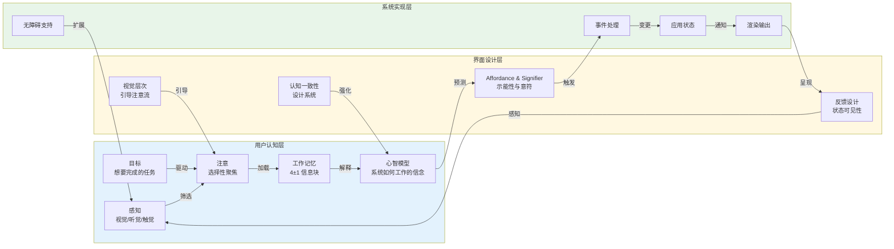
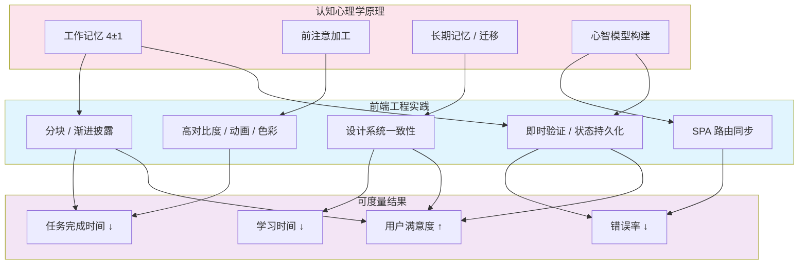

# 人机交互基础：从心理学到设计

## 引言

人机交互（Human-Computer Interaction, HCI）是一个横跨计算机科学、认知心理学、设计学和社会学的交叉学科。
对于前端工程师而言，HCI 并非「设计师才需要关心的事」——每一个 DOM 元素的摆放、每一次状态变更的反馈、每一个路由跳转的行为，都在塑造用户与系统之间的交互体验。
理解 HCI 的理论基础，能够帮助工程师在编码阶段就做出符合人类认知规律的决策，而非在测试阶段被动修复「体验问题」。

本文将从认知心理学的基本原理出发，经由心智模型、示能性（affordance）、交互设计原则等核心概念，最终映射到现代 Web 应用的工程实践。
我们将看到：为什么 SPA 路由设计必须尊重用户的「刷新心智模型」；
为什么设计系统的认知一致性能够降低团队的学习成本；
以及如何利用认知走查（Cognitive Walkthrough）等方法在开发阶段预判可用性问题。

---

## 理论严格表述

### 2.1 HCI 的学科定义与历史演进

人机交互作为一门正式学科，起源于 1980 年代图形用户界面（GUI）的兴起。其学科定义可表述为：

> **HCI 是研究人类与计算系统之间交互关系的学科，其目标是设计、评估和实现能够有效率、有效果、令人满意地支持人类活动的交互式计算系统。**

学科的发展经历了三个主要阶段：

| 阶段 | 时间 | 核心关注点 | 代表性技术 |
|------|------|-----------|-----------|
| 批处理时代 | 1940s-1960s | 机器效率最大化 | 打孔卡片、命令行批处理 |
| 命令行时代 | 1960s-1980s | 用户表达能力 | Shell、Unix 工具链 |
| 图形界面时代 | 1980s-至今 | 直接操纵与视觉反馈 | GUI、WIMP 范式、触摸屏 |
| 自然交互时代 | 2000s-至今 | 多模态与情境感知 | 语音、手势、AR/VR、脑机接口 |

在 Web 前端语境下，我们主要关注图形界面时代的交互原则在浏览器环境中的具体实现。

### 2.2 认知心理学基础

认知心理学是 HCI 的理论根基，它研究人类如何感知、注意、记忆和学习。理解这些基本机制，是设计符合人类认知规律的界面的前提。

#### 2.2.1 感知（Perception）

感知是信息进入认知系统的第一道门户。人类视觉系统并非被动接收像素，而是主动构建对环境的理解。关键原理包括：

- **格式塔原理（Gestalt Principles）**：人类倾向于将视觉元素组织为有意义的整体（详见本系列下一篇《视觉感知：格式塔原理与色彩理论》）
- **前注意加工（Pre-attentive Processing）**：某些视觉特征（颜色、大小、运动）可以在 200ms 内被无意识地检测，无需集中注意
- **颜色恒常性（Color Constancy）**：人类对物体颜色的感知会自适应光照条件，这解释了为什么同一网页在不同显示器上看起来「差不多」

#### 2.2.2 注意（Attention）

注意是认知资源的有限分配机制。人类无法同时处理大量信息，注意系统通过选择性过滤决定哪些信息进入工作记忆。

- **选择性注意（Selective Attention）**：在多个刺激源中选择关注目标（如「鸡尾酒会效应」）
- **分散注意（Divided Attention）**：同时处理多个任务的有限能力
- **持续性注意（Sustained Attention）**：长时间维持对单一任务的关注

在界面设计中，**视觉层次（Visual Hierarchy）** 的本质就是利用注意机制：通过大小、颜色、对比度和位置的差异化，引导用户的注意流（Attention Flow）。

#### 2.2.3 记忆（Memory）

人类记忆系统通常分为三个子系统：

- **感觉记忆（Sensory Memory）**：视觉（图像记忆，约 250ms）和听觉（回声记忆，约 3-4s）的极短缓存
- **工作记忆（Working Memory）**：容量有限的临时存储，通常认为是 7±2 个信息块（Miller, 1956），后修正为 4±1 个（Cowan, 2001）
- **长时记忆（Long-term Memory）**：几乎无限的永久存储，分为陈述性记忆（事实）和程序性记忆（技能）

工作记忆的有限容量是界面设计中最关键的约束之一。复杂的表单、冗长的导航菜单、需要同时追踪多个状态的操作流程，都会超出工作记忆的容量，导致错误和挫败感。

#### 2.2.4 学习（Learning）

学习是长时记忆的持久性改变。与界面设计相关的学习理论包括：

- **练习效应（Practice Effect）**：重复执行同一任务会提高效率和准确性
- **迁移（Transfer）**：在一项任务中获得的技能对另一项任务的影响（正迁移或负迁移）
- **心智模型构建（Mental Model Construction）**：用户通过与系统交互，逐步建立对系统内部工作机制的理解

### 2.3 心智模型理论

心智模型（Mental Models）是 HCI 中最具影响力的理论框架之一。Donald Norman 将其定义为：

> **心智模型是人们在心中形成的关于系统如何工作的认知表征。它不一定是准确的，但必须足够有用，以支持预测和解释。**[^1]

心智模型理论提出了三个核心概念的三元组：

1. **系统映像（System Image）**：系统实际呈现给用户的可感知部分——界面、反馈、文档
2. **用户的心智模型（User's Mental Model）**：用户心中对系统如何工作的理解
3. **设计者的模型（Designer's Model）**：设计者心中对系统如何工作的理解

理想的设计目标是使「系统映像」尽可能准确地传达「设计者的模型」，从而帮助用户建立有效的心智模型。当三者不一致时，就会产生可用性问题。

例如，用户在网页上点击一个链接，期望页面跳转到新内容。如果实际是使用 JavaScript 拦截点击事件并在当前页面加载内容（SPA 路由），而 URL 没有变化，用户的心智模型（「链接 = 新页面 = URL 变化」）就会与系统映像冲突，导致刷新后丢失状态的困惑。

### 2.4 示能性（Affordance）与意符（Signifier）

Donald Norman 在《设计心理学》中引入了 affordance（示能性）这一概念，源自心理学家 James Gibson 的生态知觉理论[^1]。

**示能性（Affordance）** 是指物体本身具有的、与行动者能力相匹配的潜在行动可能性。例如：

- 椅子「可供坐」
- 门把手「可供拉/推」
- 按钮「可供按」

示能性是物体与行动者之间的关系属性，而非物体的独立属性。一个台阶对成人「可供踩」，对婴儿则不一定。

在数字界面中，由于像素本身不具备物理属性，**纯粹的 affordance 很少存在**。因此 Norman 引入了 **意符（Signifier）** 的概念：

> **意符是任何信号、标记或指示，它告诉用户 affordance 的存在位置。**

在 Web 界面中：

- 蓝色下划线文本是「链接」的意符
- 阴影和圆角是「按钮」的意符
- 输入框的边框是「可输入」的意符
- 放大镜图标是「搜索」的意符

一个常见的工程陷阱是：为了视觉极简主义而移除意符。例如将按钮设计成纯文本而无任何边框或背景变化，这会使用户无法识别其可点击性。

### 2.5 交互设计的目标与度量

交互设计的核心目标通常归纳为四个维度：

| 目标 | 定义 | 度量指标 |
|------|------|---------|
| 效率（Efficiency） | 完成任务所需的时间/操作数 | 任务完成时间、操作步骤数 |
| 满意度（Satisfaction） | 用户使用系统的主观愉悦程度 | 问卷评分（SUS, NPS） |
| 错误率（Error Rate） | 操作失误的频率和严重性 | 错误次数、恢复时间 |
| 易学性（Learnability） | 新手达到熟练所需的时间和练习量 | 学习曲线、首次成功率 |

Jakob Nielsen 提出的「可用性启发原则（Usability Heuristics）」是交互设计中最广泛使用的检查清单，包括：系统状态可见性、系统与真实世界的匹配、用户控制与自由、一致性与标准、错误预防、识别而非回忆、灵活性与效率、美学与极简设计、帮助用户识别和恢复错误、帮助文档[^3]。

### 2.6 GOMS 模型与 KLM

GOMS（Goals, Operators, Methods, Selection Rules）是 Card、Moran 和 Newell 在 1983 年提出的用户交互认知模型[^2]。它将用户行为分解为四个层次：

- **Goals（目标）**：用户想要达到的最终状态
- **Operators（操作）**：不可再分解的基本动作（如按键、点击、眼动）
- **Methods（方法）**：完成目标的操作序列
- **Selection Rules（选择规则）**：当存在多种方法时，选择哪一种的规则

KLM（Keystroke-Level Model）是 GOMS 的简化版本，用于预测专家用户在无错误条件下完成任务的时间。KLM 将操作编码为：

| 操作符 | 含义 | 典型时间 |
|--------|------|---------|
| K | 按键 | 0.2s |
| P | 指向（鼠标移动到目标） | 1.1s |
| B | 按钮按下或释放 | 0.1s |
| H | 手在键盘和鼠标之间移动 | 0.4s |
| M | 心理准备 | 1.2s |
| R(t) | 系统响应等待 | t |

KLM 的价值在于：**它提供了量化预测界面效率的工程工具**。前端工程师可以使用 KLM 估算不同交互方案的操作时间，从而在编码前就做出有数据支撑的设计决策。

### 2.7 认知走查（Cognitive Walkthrough）

认知走查是一种以学习过程为中心的可用性评估方法。评估者模拟新手用户，逐步执行任务的每一步，并回答四个问题[^2]：

1. 用户是否试图完成正确的目标？
2. 用户是否注意到正确的操作控件？
3. 用户是否将控件与目标关联起来？
4. 执行操作后，用户是否能从反馈中理解进度？

认知走查的优势在于**可以在没有真实用户的情况下进行**，特别适合在开发阶段早期发现设计缺陷。

---

## 工程实践映射

### 3.1 Web 应用中的 Affordance 设计

在 Web 前端开发中，affordance 和 signifier 的实现主要依赖 CSS 和 HTML 语义：

#### 按钮的 Affordance

```html
<!-- ✅ 良好的意符：阴影、圆角、悬停反馈 -->
<button class="btn-primary">
  提交订单
</button>

<style>
.btn-primary {
  padding: 12px 24px;
  background: #2563eb;
  color: white;
  border: none;
  border-radius: 6px;
  box-shadow: 0 2px 4px rgba(0,0,0,0.1);
  cursor: pointer;
  transition: all 0.2s;
}
.btn-primary:hover {
  background: #1d4ed8;
  transform: translateY(-1px);
  box-shadow: 0 4px 8px rgba(0,0,0,0.15);
}
.btn-primary:active {
  transform: translateY(0);
}
</style>
```

上述代码通过多重意符传达「可点击性」：

- 背景色与文字色的高对比度（视觉突出）
- 圆角和阴影（模拟物理按钮的立体性）
- `cursor: pointer`（鼠标悬停时的手型光标）
- 悬停时的颜色加深和微上浮（交互反馈）
- 按下时的下沉感（触觉隐喻）

#### 链接的 Affordance

```css
/* ✅ 符合用户心智模型的链接样式 */
.article-content a {
  color: #2563eb;
  text-decoration: underline;
  text-underline-offset: 2px;
}
.article-content a:hover {
  color: #1d4ed8;
  text-decoration-thickness: 2px;
}
.article-content a:visited {
  color: #7c3aed;
}
```

蓝色下划线是万维网早期就建立的链接意符。改变这一约定（如使用纯黑色无下划线文本作为链接）会增加用户的认知负担，因为用户需要额外学习新的视觉编码。

### 3.2 心智模型在 SPA 路由设计中的应用

单页应用（SPA）的路由系统是心智模型冲突的高发区。用户在多年使用传统多页网站的过程中，已经建立了根深蒂固的心智模型：

- **链接点击 → URL 变化 → 新页面加载**
- **后退按钮 → 回到上一页**
- **刷新 → 当前页面重新加载，保持位置**
- **URL 分享 → 对方看到相同内容**

SPA 的前端路由打破了其中一些预期，必须通过工程手段修复心智模型的断裂：

```javascript
// ✅ Vue Router：保持 URL 与状态的同步
import { createRouter, createWebHistory } from 'vue-router'

const router = createRouter({
  history: createWebHistory(), // 使用 History API，URL 真实变化
  routes: [
    { path: '/products/:id', component: ProductDetail }
  ]
})

// 导航时更新浏览器地址栏，支持后退/前进
router.push('/products/123')

// ✅ 页面刷新后恢复滚动位置
router.afterEach((to, from, savedPosition) => {
  if (savedPosition) {
    return savedPosition
  }
  if (to.hash) {
    return { el: to.hash, behavior: 'smooth' }
  }
  return { top: 0 }
})
```

关键工程实践：

- 使用 `history` 模式而非 `hash` 模式，使 URL 符合用户预期
- 确保「刷新页面」后能够恢复到相同状态（服务端渲染或状态持久化）
- 保持「后退/前进」按钮的行为一致性
- 提供加载状态的视觉反馈，弥补「无页面闪烁」带来的进度不确定感

### 3.3 利用认知心理学设计表单

表单是 Web 应用中工作记忆负荷最集中的场景。根据认知心理学的原理，表单优化应遵循以下策略：

#### 减少工作记忆负荷

```html
<!-- ❌ 工作记忆超负荷：用户需要在多个字段间来回核对 -->
<form>
  <input placeholder="密码" type="password" />
  <input placeholder="确认密码" type="password" />
  <p>密码必须包含：大写字母、小写字母、数字、特殊符号，长度 8-20 位</p>
</form>

<!-- ✅ 即时验证 + 视觉反馈，卸载工作记忆 -->
<form>
  <label for="password">密码</label>
  <input id="password" type="password" aria-describedby="pwd-help" />
  <ul id="pwd-help" class="validation-list">
    <li class="valid">✓ 至少 8 个字符</li>
    <li class="invalid">✗ 包含大写字母</li>
    <li class="pending">○ 包含数字</li>
  </ul>
</form>
```

将验证规则外化为界面的持久性视觉状态，用户无需在脑中记住规则清单，只需对照界面上的检查项即可。

#### 分块（Chunking）与渐进披露

```vue
<script setup>
import { ref } from 'vue'
const step = ref(1)
</script>

<template>
  <!-- ✅ 多步骤表单：每步只处理 4±1 个信息块 -->
  <div class="step-indicator">
    <span :class="{ active: step >= 1 }">1. 基本信息</span>
    <span :class="{ active: step >= 2 }">2. 联系方式</span>
    <span :class="{ active: step >= 3 }">3. 确认提交</span>
  </div>

  <form v-if="step === 1">
    <input placeholder="姓名" />
    <input placeholder="身份证号" />
    <button @click="step++">下一步</button>
  </form>
  <!-- ... -->
</template>
```

将长表单拆分为多个步骤，每步只呈现少量字段，符合工作记忆的容量限制（4±1 原则）。

### 3.4 设计系统的认知一致性

设计系统（Design System）的价值不仅是视觉统一，更是**认知一致性**的工程保障。当界面元素在不同页面中保持一致的视觉编码和行为模式时，用户可以将在一处学到的知识迁移到另一处。

```css
/* ✅ 设计系统 Tokens：一致的认知映射 */
:root {
  /* 颜色语义映射：跨组件一致 */
  --color-primary: #2563eb;      /* 主要操作 */
  --color-success: #16a34a;      /* 成功状态 */
  --color-warning: #ca8a04;      /* 警告状态 */
  --color-danger: #dc2626;       /* 错误/危险 */
  --color-info: #0891b2;         /* 信息提示 */

  /* 交互状态映射：跨组件一致 */
  --state-hover-translate: -1px;
  --state-active-scale: 0.98;
  --focus-ring: 0 0 0 3px rgba(37, 99, 235, 0.3);
}
```

认知一致性降低学习成本的机制：

- **正迁移**：在 A 页面学会的交互模式可以直接应用于 B 页面
- **减少探索成本**：用户不需要重新理解每个新页面的交互规则
- **建立信任**：一致的行为模式增强用户对系统可预测性的信心

### 3.5 CLI vs GUI 的心智模型差异

命令行界面（CLI）与图形用户界面（GUI）代表了两种截然不同的心智模型，理解它们的差异有助于设计混合界面的交互策略：

| 维度 | CLI | GUI |
|------|-----|-----|
| 记忆负荷 | 高（需记住命令和参数） | 低（视觉发现） |
| 效率（专家） | 高（键盘快捷、可脚本化） | 中（受限于界面元素） |
| 反馈模式 | 文本输出、延迟确认 | 即时视觉反馈 |
| 错误恢复 | 复杂（需理解命令语义） | 直观（撤销、取消按钮） |
| 探索性 | 低（试错成本高） | 高（视觉浏览） |

现代开发者工具（如 Vite、Docker Desktop、GitKraken）通常采用「GUI 外壳 + CLI 内核」的混合模式：GUI 降低学习门槛，CLI 满足高级用户的效率需求。

在前端开发中，这一映射表现为：

- **GUI 优先**：面向终端用户的消费者应用（电商、社交、内容平台）
- **CLI 优先**：面向开发者的工具链（构建工具、脚手架、包管理器）
- **混合模式**：低代码平台、DevOps 仪表盘、数据库管理工具

---

## Mermaid 图表

### 图1：用户认知→界面设计→系统反馈的交互循环



### 图2：认知心理学原理到前端工程实践的映射



---

## 理论要点总结

1. **HCI 是前端工程师的必修课，而非设计师的专属领域**。每一个技术决策（路由模式、状态管理、组件粒度）都会影响用户的认知负荷和交互效率。

2. **工作记忆的 4±1 限制是界面设计的最硬约束**。任何要求用户同时追踪超过 4 个信息块的界面设计，都必然导致错误和挫败感。

3. **心智模型的一致性比界面美观更重要**。当系统映像（界面实际行为）与用户心智模型冲突时，即使视觉设计再精美，用户也会感到困惑和不信任。

4. **Affordance 在数字界面中主要通过 Signifier 实现**。由于像素不具备物理属性，开发者必须主动提供视觉、动效和光标反馈等意符，帮助用户识别可交互元素。

5. **设计系统的核心价值是认知一致性**。通过统一的视觉编码和交互模式，降低用户的学习成本和迁移成本，建立系统的可预测性。

6. **SPA 路由设计必须尊重用户的「刷新心智模型」**。URL 同步、历史栈管理、滚动恢复不是锦上添花的功能，而是修复心智模型断裂的必要工程手段。

7. **认知走查和 KLM 等方法可以在开发阶段早期预判可用性问题**。将这些方法纳入代码评审流程，可以显著降低后期修复成本。

---

## 参考资源

[^1]: Norman, Donald A. *The Design of Everyday Things: Revised and Expanded Edition*. Basic Books, 2013. —— 设计心理学经典著作，系统阐述了心智模型、affordance、signifier 和反馈设计等核心概念，是 HCI 领域的入门必读。

[^2]: Card, Stuart K., Thomas P. Moran, and Allen Newell. *The Psychology of Human-Computer Interaction*. Lawrence Erlbaum Associates, 1983. —— HCI 学科奠基之作，提出了 GOMS 模型和 Keystroke-Level Model（KLM），为交互效率的量化分析提供了科学方法。

[^3]: Nielsen, Jakob. *Usability Engineering*. Morgan Kaufmann, 1993. —— 可用性工程的经典教材，提出了十大可用性启发原则、认知走查方法以及可用性度量的系统框架。


---

> **延伸阅读**：
>
> - Dix, Alan, et al. *Human-Computer Interaction*. 4th ed., Pearson, 2004. —— 综合性 HCI 教材，涵盖从理论基础到评估方法的完整体系。
> - Krug, Steve. *Don't Make Me Think: A Common Sense Approach to Web Usability*. New Riders, 2014. —— 面向实践的 Web 可用性指南，强调直觉式设计和减少用户思考负担。
> - 本文属于「UI 原理」系列的基础篇，建议配合「视觉感知：格式塔原理与色彩理论」共同阅读，以建立从认知心理学到视觉设计的完整认知链条。
