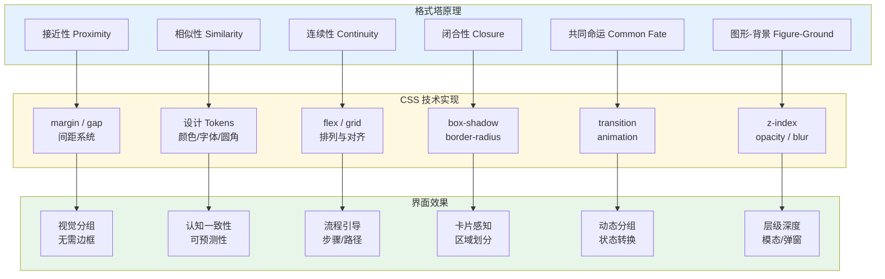
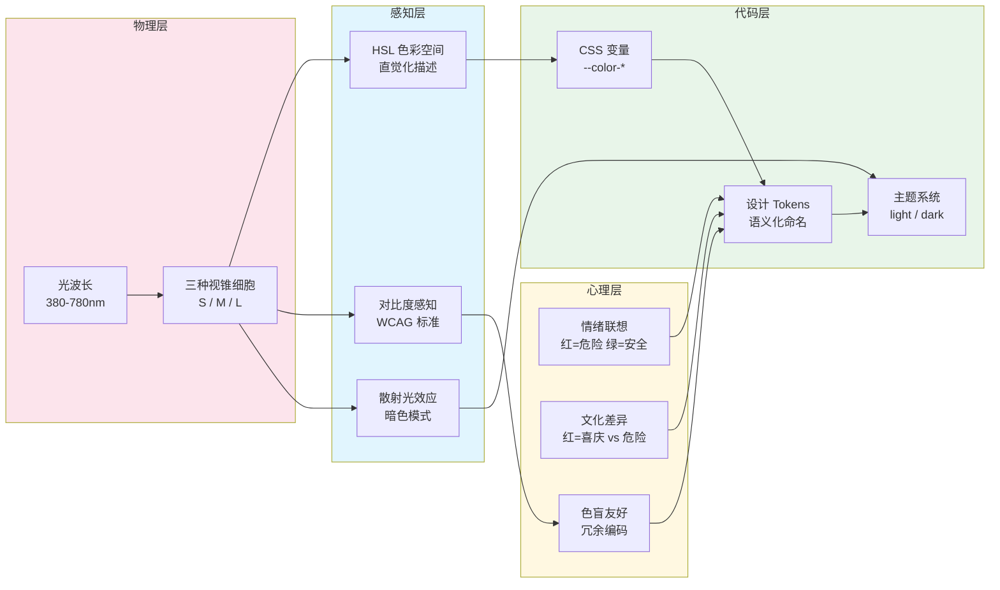

# 视觉感知：格式塔原理与色彩理论

## 引言

人类视觉系统并非一台忠实的相机，而是一部主动的「意义制造机」。
我们看到的不是视网膜上的像素阵列，而是经过大脑多层次加工后构建出的结构化世界。
格式塔心理学（Gestalt Psychology）揭示了这一加工过程的基本规律：人类视觉系统天生倾向于将离散元素感知为有组织的整体。
色彩理论则解释了光波如何转化为情感、语义和文化符号。
对于前端工程师而言，理解这些原理意味着能够从「调 CSS 属性」上升到「设计视觉认知体验」——每一次 `margin` 的调整、每一个 `color` 的选择、每一行 Grid 的定义，都在影响用户如何组织和理解界面信息。

本文将从格式塔原理的理论根基出发，经由色彩科学与视觉层次，最终映射到 CSS 工程实践、响应式设计、暗色模式以及现代设计系统的构建策略。

---

## 理论严格表述

### 2.1 格式塔原理：视觉组织的先天法则

格式塔心理学诞生于 1910 年代的德国，由 Max Wertheimer、Kurt Koffka 和 Wolfgang Köhler 创立。其核心命题是：

> **「整体不同于部分之和」（The whole is other than the sum of its parts）。人类视觉系统会主动将感官元素组织为统一的整体（Gestalten），而非孤立地感知各个元素。**

格式塔原理描述了这种组织过程的先天规则。
以下六大原理是界面设计中最具工程指导价值的：

#### 2.1.1 接近性（Proximity）

空间上相邻的元素倾向于被感知为同一组。
距离越近， grouping 越强。
这一原理的生理基础在于视觉皮层的邻接神经元具有协同激活特性。

#### 2.1.2 相似性（Similarity）

在颜色、形状、大小、纹理或方向上相似的元素倾向于被感知为同一组。
即使空间距离较远，相似性也能 override 接近性产生 grouping。

#### 2.1.3 连续性（Continuity）

视觉系统倾向于沿着平滑的曲线或直线感知元素，而非在角度处断裂。
眼睛会「追随」线条的自然延伸方向。

#### 2.1.4 闭合性（Closure）

视觉系统倾向于将不完整的形状「补全」为完整的、熟悉的图形。即使部分边界缺失，大脑也会自动填充以形成闭合区域。

#### 2.1.5 共同命运（Common Fate）

朝相同方向运动或以相同方式变化的元素倾向于被感知为同一组。
这一原理在动画设计中尤为重要。

#### 2.1.6 图形-背景（Figure-Ground）

视觉场被自动分割为「图形」（前景，注意的焦点）和「背景」（衬托图形的环境）。
图形具有明确的轮廓和结构，背景则相对均质和模糊。

### 2.2 色彩理论：从物理光波到心理感知

#### 2.2.1 色彩的物理基础

色彩是可见光（波长约 380nm-780nm）与视觉系统相互作用的结果。
视网膜上的视锥细胞负责色彩感知，分为三种类型：

- **S-视锥**：短波敏感（蓝-紫，峰值约 420nm）
- **M-视锥**：中波敏感（绿，峰值约 530nm）
- **L-视锥**：长波敏感（黄-红，峰值约 560nm）

三种视锥细胞的响应比例决定了我们对色彩的感知。
这种三变量编码系统意味着人类色彩空间是三维的，任何色彩都可以由三个独立维度描述。

#### 2.2.2 HSL 色彩模型

HSL（Hue, Saturation, Lightness）是基于人类感知直觉的色彩模型：

- **色相（Hue）**：色彩在色轮上的位置，0°-360°，决定「是什么颜色」
- **饱和度（Saturation）**：色彩的纯度，0%-100%，0% 为灰色，100% 为纯色
- **明度（Lightness）**：色彩的明暗程度，0% 为纯黑，100% 为纯白，50% 为纯色

HSL 相比 RGB 的优势在于**语义化**：调整明度只需改变 L 值，而无需在 R、G、B 三个通道上进行不直观的平衡计算。
这使得 HSL 成为设计系统和 CSS 变量的首选色彩空间。

#### 2.2.3 色彩心理学

色彩对人类情绪和认知的影响具有跨文化的一致性，但也存在文化特异性：

| 色彩 | 普遍联想 | 西方文化 | 东亚文化 |
|------|---------|---------|---------|
| 红色 | 危险、激情、重要 | 停止、爱情 | 喜庆、幸运 |
| 绿色 | 自然、生长、安全 | 通行、环保 | 生机、青春 |
| 蓝色 | 冷静、信任、稳定 | 企业、科技 | 纯净、深远 |
| 黄色 | 警告、能量、乐观 |  caution、快乐 | 皇权、尊贵 |
| 黑色 | 权威、神秘、优雅 | 哀悼、高端 | 严肃、正式 |

在界面设计中，色彩语义的标准化（错误=红、成功=绿、警告=黄）利用了色彩心理学的跨文化一致性，降低了用户的认知负荷。

#### 2.2.4 色盲与无障碍设计

约 8% 的男性和 0.5% 的女性患有某种形式的色觉缺陷。
最常见的类型是红绿色盲（Deuteranopia/Protanopia），患者难以区分红色和绿色。

无障碍设计原则要求：**色彩不能是传达信息的唯一渠道**。
必须辅以形状、图标、文字标签或纹理等冗余编码：

```css
/* ✅ 不仅依赖颜色，还使用图标和文字标签 */
.status-badge {
  display: inline-flex;
  align-items: center;
  gap: 4px;
}
.status-badge.success::before {
  content: "✓";
}
.status-badge.error::before {
  content: "✕";
}
.status-badge.warning::before {
  content: "⚠";
}
```

### 2.3 视觉层次与信息架构

视觉层次（Visual Hierarchy）是指界面元素通过视觉属性的差异化排列，形成的重要性等级结构。
它回答了用户进入页面后的核心问题：**先看什么，后看什么，再看什么**。

视觉层次的构建手段按效力排序：

1. **大小（Size）**：最大的元素获得最多注意
2. **颜色（Color）**：高对比度或饱和度的元素跳出
3. **对比度（Contrast）**：与背景差异最大的元素最突出
4. **留白（White Space）**：被包围的元素获得聚焦
5. **位置（Position）**：左上区域（对于 LTR 语言）获得优先扫描
6. **动效（Motion）**：运动的元素自动吸引注意（慎用）

### 2.4 F 型与 Z 型阅读模式

眼动追踪研究揭示了用户在网页上的典型扫描模式：

**F 型模式**：用户首先水平扫描页面顶部（形成 F 的上横），然后向下移动并再次水平扫描较短距离（形成 F 的中横），最后垂直扫描左侧（形成 F 的竖线）。
F 型模式适用于文本密集型页面（如搜索结果、新闻文章）。

**Z 型模式**：用户的视线从左上角开始，水平移动到右上角，然后对角线移动到左下角，最后水平移动到右下角，形成 Z 字形。
Z 型模式适用于视觉层次简单、行动号召（CTA）明确的页面（如落地页、产品首页）。

这两种模式共同提示：**将最重要的信息放置在扫描路径的关键节点上**。

### 2.5 视觉搜索与特征整合理论

Anne Treisman 的特征整合理论（Feature Integration Theory）解释了视觉搜索的认知机制[^1]：

- **前注意阶段（Pre-attentive Stage）**：视觉特征（颜色、方向、大小、运动）在无需集中注意的情况下被并行处理
- **聚焦注意阶段（Focused Attention Stage）**：特征被「绑定」到特定位置的对象上，形成对物体的识别

前注意加工的速度（约 150-200ms）使得某些视觉搜索任务几乎是「瞬间」完成的（如「在一群灰色圆点中找红色圆点」），而特征组合搜索（如「找红色方形」）则需要逐个项目扫描。

这一理论对界面设计的工程启示是：**利用前注意特征引导用户的注意分配**。
例如，错误提示使用红色（颜色特征）和抖动动画（运动特征），可以在用户尚未主动寻找错误时就吸引其注意。

### 2.6 暗色模式的视觉感知原理

暗色模式（Dark Mode）的流行不仅仅是审美趋势，更有其视觉生理学依据：

- **瞳孔调节**：在暗环境中，瞳孔放大以接收更多光线。暗色背景减少了屏幕发出的总光量，降低瞳孔调节负担
- **眩光减少**：亮背景在暗环境中产生眩光效应（disability glare），降低对比敏感度
- **散射光（Halation）**：在暗背景下，明亮文字的光线会向周围视网膜区域散射，造成文字边缘模糊。
  这就是为什么暗色模式不应使用纯白色（`#ffffff`）文字，而应使用稍暗的白色（如 `#e4e4e7`）

关键工程原则：**暗色模式不是简单的颜色反转**。
必须重新调整对比度、阴影逻辑和强调色饱和度，以维持可读性和视觉层次。

---

## 工程实践映射

### 3.1 CSS Grid 与 Flexbox：格式塔原理的工程实现

#### 接近性原理与布局间距

```css
/* ✅ 利用 margin 创建分组：接近性原理 */
.form-group {
  margin-bottom: 24px; /* 组间大间距 */
}
.form-group label {
  display: block;
  margin-bottom: 4px; /* 标签与输入框间小间距 */
}
.form-group input {
  width: 100%;
}

/* 组内元素间距小，组间间距大 → 视觉自动分组 */
```

通过系统化的间距比例（如 4px/8px/16px/24px/32px/48px 的等比或等差序列），利用接近性原理在无需额外边框的情况下创建清晰的视觉分组。

#### 相似性原理与设计系统

```css
/* ✅ 相似性：同一语义层级的元素保持视觉一致性 */
.btn {
  padding: 8px 16px;
  border-radius: 6px;
  font-weight: 500;
}
.btn-primary {
  background: var(--color-primary);
  color: white;
}
.btn-secondary {
  background: var(--color-surface);
  color: var(--color-text);
  border: 1px solid var(--color-border);
}
.btn-danger {
  background: var(--color-danger);
  color: white;
}

/* 所有按钮共享相同的大小和圆角（形状相似）→ 被感知为同一类别 */
/* 不同变体通过颜色区分（功能差异）→ 子类别识别 */
```

#### 连续性原理与视觉引导

```css
/* ✅ 连续性：步骤指示器的视觉连接 */
.stepper {
  display: flex;
  align-items: center;
}
.step {
  display: flex;
  align-items: center;
  gap: 8px;
}
.step::after {
  content: "";
  width: 40px;
  height: 2px;
  background: var(--color-border);
}
.step.active::after {
  background: var(--color-primary);
}
/* 水平线条连接各步骤 → 视觉连续性引导流程感知 */
```

#### 闭合性原理与极简设计

```css
/* ✅ 闭合性：无需完整边框即可感知卡片边界 */
.card {
  background: white;
  border-radius: 12px;
  padding: 24px;
  box-shadow: 0 1px 3px rgba(0,0,0,0.1);
}
/* 圆角 + 阴影 + 背景色对比 → 大脑自动补全卡片边界 */
/* 比完整边框更简洁，同时保持清晰的区域感知 */
```

### 3.2 设计系统中的色彩 Tokens 与心理学依据

现代设计系统使用语义化的色彩 Tokens，将色彩心理学映射为可维护的代码：

```css
/* ✅ 语义化色彩 Tokens：心理学 → 工程映射 */
:root {
  /* 基础色板：HSL 模型 */
  --hue-primary: 220;
  --hue-success: 142;
  --hue-warning: 45;
  --hue-danger: 0;
  --hue-info: 190;

  /* 功能语义映射：跨文化一致性 */
  --color-primary: hsl(var(--hue-primary) 90% 50%);
  --color-success: hsl(var(--hue-success) 70% 45%);
  --color-warning: hsl(var(--hue-warning) 90% 50%);
  --color-danger: hsl(var(--hue-danger) 80% 55%);
  --color-info: hsl(var(--hue-info) 80% 45%);

  /* 状态层：基于同一色相的明度变化 */
  --color-primary-50: hsl(var(--hue-primary) 90% 96%);
  --color-primary-100: hsl(var(--hue-primary) 90% 92%);
  --color-primary-200: hsl(var(--hue-primary) 90% 85%);
  --color-primary-300: hsl(var(--hue-primary) 90% 75%);
  --color-primary-400: hsl(var(--hue-primary) 90% 65%);
  --color-primary-500: hsl(var(--hue-primary) 90% 50%);
  --color-primary-600: hsl(var(--hue-primary) 90% 42%);
  --color-primary-700: hsl(var(--hue-primary) 90% 35%);
  --color-primary-800: hsl(var(--hue-primary) 90% 28%);
  --color-primary-900: hsl(var(--hue-primary) 90% 20%);
}
```

HSL 模型的工程优势：

- **调整明度只需改变 L 值**：生成色阶时保持色相和饱和度不变，确保色彩和谐
- **动态主题**：通过 CSS 变量修改色相值，可以一键切换品牌色
- **暗色模式适配**：降低 L 值即可生成暗色版本，无需重新设计色板

### 3.3 响应式设计的视觉层次调整

不同屏幕尺寸下的阅读模式和视觉容量不同，需要主动调整视觉层次：

```css
/* ✅ 响应式视觉层次：桌面端 vs 移动端 */
.page-title {
  font-size: 2.5rem;
  font-weight: 700;
  line-height: 1.2;
  margin-bottom: 1rem;
}

/* 移动端：减小标题尺寸，保持相对层次 */
@media (max-width: 768px) {
  .page-title {
    font-size: 1.75rem; /* 绝对尺寸减小，但相对于正文的比率保持 */
    line-height: 1.3;
  }
}

/* 桌面端：侧边栏次要信息；移动端：折叠或下移 */
.sidebar {
  order: 2;
}
.main-content {
  order: 1;
}
@media (min-width: 1024px) {
  .sidebar {
    order: 1;
  }
  .main-content {
    order: 2;
  }
}

/* 移动端：单列布局减少视觉竞争 */
/* 桌面端：多列布局利用水平空间 */
.grid-layout {
  display: grid;
  gap: 24px;
}
@media (min-width: 768px) {
  .grid-layout {
    grid-template-columns: repeat(2, 1fr);
  }
}
@media (min-width: 1024px) {
  .grid-layout {
    grid-template-columns: repeat(3, 1fr);
  }
}
```

移动端视觉层次的关键调整原则：

- **减少同时可见的信息块数量**：工作记忆限制在移动端更严格（屏幕更小，上下文更少）
- **增大触摸目标的尺寸**：Fitts 定律指出，目标越小、距离越远，命中时间越长。移动端按钮至少 44×44 CSS 像素
- **重新排列信息优先级**：移动端通常将行动号召（CTA）上移至首屏

### 3.4 暗色模式的视觉感知工程

暗色模式的实现不仅是颜色替换，而是需要系统性地重新计算对比度和视觉层次：

```css
/* ✅ 暗色模式的系统性实现 */
:root {
  /* 明度映射：暗色模式下反转逻辑 */
  --bg-base: #ffffff;
  --bg-elevated: #f4f4f5;
  --bg-overlay: #e4e4e7;
  --text-primary: #18181b;
  --text-secondary: #71717a;
  --text-tertiary: #a1a1aa;
  --border-subtle: #e4e4e7;
}

[data-theme="dark"] {
  /* 暗色模式：不是简单反转，而是重新校准 */
  --bg-base: #09090b;
  --bg-elevated: #18181b;
  --bg-overlay: #27272a;
  --text-primary: #fafafa;      /* 非纯白，减少 halation */
  --text-secondary: #a1a1aa;    /* 降低次要文字对比度，减少视觉噪音 */
  --text-tertiary: #71717a;
  --border-subtle: #27272a;     /* 边框在暗背景下应更暗，而非更亮 */
}

/* 暗色模式中的阴影逻辑反转 */
.shadow-elevated {
  box-shadow: 0 4px 6px -1px rgba(0, 0, 0, 0.1);
}
[data-theme="dark"] .shadow-elevated {
  /* 暗色模式下使用「光晕」而非「阴影」表达层级 */
  box-shadow: 0 4px 6px -1px rgba(0, 0, 0, 0.5),
              0 0 0 1px rgba(255, 255, 255, 0.05);
}

/* 暗色模式中的饱和度调整 */
[data-theme="dark"] .accent-color {
  /* 暗色背景下，相同饱和度看起来更「冲」，需要降低 */
  filter: saturate(0.85);
}
```

暗色模式的工程陷阱：

- **纯黑背景（`#000000`）**：导致 OLED 屏幕的像素完全关闭，在滚动时产生「拖影」感；建议使用 `#09090b` 或 `#0f0f11`
- **纯白色文字**：产生 halation 效应，降低可读性；建议使用 `#fafafa` 或 `#e4e4e7`
- **直接反转阴影**：暗色模式中的层级应通过「亮度提升」和「边框高光」表达，而非黑色阴影

### 3.5 Tailwind 的色彩系统与 HSL 模型

Tailwind CSS 的色彩系统是现代设计系统中 HSL 模型的成功工程实践：

```javascript
// tailwind.config.js —— 自定义 HSL 色彩系统
module.exports = {
  theme: {
    extend: {
      colors: {
        brand: {
          50: 'hsl(220 90% 96%)',
          100: 'hsl(220 90% 92%)',
          200: 'hsl(220 90% 85%)',
          300: 'hsl(220 90% 75%)',
          400: 'hsl(220 90% 65%)',
          500: 'hsl(220 90% 50%)',
          600: 'hsl(220 90% 42%)',
          700: 'hsl(220 90% 35%)',
          800: 'hsl(220 90% 28%)',
          900: 'hsl(220 90% 20%)',
          950: 'hsl(220 90% 15%)',
        }
      }
    }
  }
}
```

Tailwind 的色彩系统利用了 HSL 的以下特性：

- **固定色相 + 固定饱和度**：确保同一色族的和谐性
- **明度梯度**：从 50（接近白）到 950（接近黑），覆盖全部使用场景
- **语义化使用**：`text-brand-600`（主操作）、`bg-brand-50`（轻量背景）、`border-brand-200`（微妙边框）

通过 CSS 变量的动态更新，可以实现暗色模式的自动适配：

```css
/* ✅ 使用 CSS 变量桥接 Tailwind 与暗色模式 */
@layer base {
  :root {
    --color-text-base: 220 13% 9%;
    --color-text-muted: 220 9% 46%;
    --color-bg-base: 0 0% 100%;
    --color-bg-elevated: 220 14% 96%;
  }
  .dark {
    --color-text-base: 0 0% 98%;
    --color-text-muted: 220 9% 64%;
    --color-bg-base: 240 10% 4%;
    --color-bg-elevated: 240 6% 10%;
  }
}
```

### 3.6 无障碍设计：超越色彩的冗余编码

根据 WCAG 2.1 标准，信息不能仅通过色彩传达。工程实现必须提供冗余通道：

```vue
<script setup>
const props = defineProps({
  status: {
    type: String,
    validator: (v) => ['success', 'warning', 'error', 'info'].includes(v)
  }
})
</script>

<template>
  <!-- ✅ 多通道信息编码：颜色 + 图标 + 文字标签 -->
  <span
    class="inline-flex items-center gap-1.5 px-2.5 py-0.5 rounded-full text-sm font-medium"
    :class="{
      'bg-green-100 text-green-800': status === 'success',
      'bg-yellow-100 text-yellow-800': status === 'warning',
      'bg-red-100 text-red-800': status === 'error',
      'bg-blue-100 text-blue-800': status === 'info',
    }"
  >
    <svg v-if="status === 'success'" class="w-4 h-4" fill="currentColor" viewBox="0 0 20 20">
      <path fill-rule="evenodd" d="M10 18a8 8 0 100-16 8 8 0 000 16zm3.707-9.293a1 1 0 00-1.414-1.414L9 10.586 7.707 9.293a1 1 0 00-1.414 1.414l2 2a1 1 0 001.414 0l4-4z" clip-rule="evenodd"/>
    </svg>
    <svg v-else-if="status === 'warning'" class="w-4 h-4" fill="currentColor" viewBox="0 0 20 20">
      <path fill-rule="evenodd" d="M8.257 3.099c.765-1.36 2.722-1.36 3.486 0l5.58 9.92c.75 1.334-.213 2.98-1.742 2.98H4.42c-1.53 0-2.493-1.646-1.743-2.98l5.58-9.92zM11 13a1 1 0 11-2 0 1 1 0 012 0zm-1-8a1 1 0 00-1 1v3a1 1 0 002 0V6a1 1 0 00-1-1z" clip-rule="evenodd"/>
    </svg>
    <svg v-else-if="status === 'error'" class="w-4 h-4" fill="currentColor" viewBox="0 0 20 20">
      <path fill-rule="evenodd" d="M10 18a8 8 0 100-16 8 8 0 000 16zM8.707 7.293a1 1 0 00-1.414 1.414L8.586 10l-1.293 1.293a1 1 0 101.414 1.414L10 11.414l1.293 1.293a1 1 0 001.414-1.414L11.414 10l1.293-1.293a1 1 0 00-1.414-1.414L10 8.586 8.707 7.293z" clip-rule="evenodd"/>
    </svg>
    <svg v-else class="w-4 h-4" fill="currentColor" viewBox="0 0 20 20">
      <path fill-rule="evenodd" d="M18 10a8 8 0 11-16 0 8 8 0 0116 0zm-7-4a1 1 0 11-2 0 1 1 0 012 0zM9 9a1 1 0 000 2v3a1 1 0 001 1h1a1 1 0 100-2v-3a1 1 0 00-1-1H9z" clip-rule="evenodd"/>
    </svg>
    <!-- 文字标签提供语义冗余 -->
    <span class="sr-only">{{ status }}:</span>
    <slot />
  </span>
</template>
```

上述组件同时利用了三种信息通道：

- **颜色通道**：背景色和文字色的色彩编码
- **图标通道**：不同形状的几何图标（✓、⚠、✕、ℹ）
- **语义通道**：`sr-only` 文字标签供屏幕阅读器使用

---

## Mermaid 图表

### 图1：格式塔原理 → CSS 技术 → 界面效果的映射



### 图2：色彩理论 → 设计决策 → 代码实现的完整链条



---

## 理论要点总结

1. **格式塔原理不是设计技巧，而是人类视觉系统的先天加工规则**。接近性、相似性、连续性、闭合性、共同命运和图形-背景六大原理，为 CSS 布局、间距系统和组件设计提供了坚实的认知科学基础。

2. **HSL 色彩模型比 RGB 更符合人类感知直觉，是设计系统的首选色彩空间**。固定色相和饱和度、调整明度生成色阶的方法，确保了色彩的和谐性与可维护性。

3. **色彩心理学存在跨文化一致性（如红-错误、绿-成功），但也存在文化特异性**。国际化产品的色彩设计应在核心语义上保持一致，在文化表达上保持灵活。

4. **暗色模式不是颜色反转，而是需要系统性的视觉重校准**。纯黑背景和纯白文字都会带来视觉生理问题；正确的做法是基于 HSL 明度重新设计完整的暗色色板。

5. **信息不能仅通过色彩传达**。WCAG 标准要求提供冗余编码通道（图标、文字标签、纹理），这是前端无障碍工程的底线要求。

6. **响应式设计不仅是布局适配，更是视觉层次的重新编排**。移动端的更小屏幕和不同阅读模式（Z 型为主）要求重新评估信息优先级和视觉权重。

7. **Tailwind 的色彩系统是成功将色彩理论工程化的范例**。其固定色相 + 明度梯度的设计，使得色彩选择从「艺术直觉」转化为「工程决策」。

---

## 参考资源

[^1]: Palmer, Stephen E. *Vision Science: Photons to Phenomenology*. MIT Press, 1999. —— 视觉科学的权威综合著作，从视网膜生理机制到高级视觉认知，系统阐述了颜色感知、格式塔组织和物体识别的科学原理。


---

> **延伸阅读**：
>
> - Changizi, Mark A. *The Vision Revolution*. BenBella Books, 2009. —— 从进化视角解释人类视觉系统的设计原理，包括为什么我们会看到颜色、为什么会有视觉错觉。
> - Tondello, Gustavo F., and Lennart E. Nacke. "Elements of Gameful Design in Gamification." *Gamification User Types and Design*, Springer, 2019. —— 虽然聚焦游戏化，但其对视觉层次和色彩激励的理论分析对一般界面设计同样适用。
> - 本文属于「UI 原理」系列的视觉篇，建议配合「人机交互基础：从心理学到设计」共同阅读，以建立从认知心理到视觉设计的完整认知框架。
