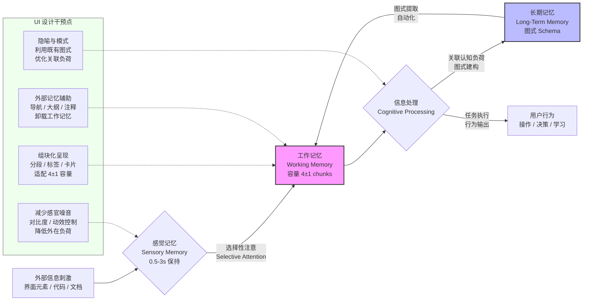

# 认知负荷理论：信息架构与心智模型

## 引言

在设计复杂系统的人机交互界面时，设计者常常面临一个根本性的矛盾：系统功能的丰富性与用户认知资源的有限性之间的张力。现代前端应用——无论是基于 Vue、React 还是 Svelte 构建的单页应用（SPA）——往往承载着大量的信息、操作路径与状态转换。如果设计者忽视人类信息处理系统的生物学约束，再精美的视觉层也无法挽救用户体验的崩塌。

认知负荷理论（Cognitive Load Theory, CLT）由教育心理学家 John Sweller 于 1988 年系统提出，其核心洞见在于：人类的工作记忆（Working Memory）容量极为有限，而学习与技术交互本质上是将外部信息编码为长期记忆（Long-Term Memory）中稳定图式（Schema）的过程。本文以双轨并行的方式展开：在理论轨道，我们严格表述 CLT 的三元结构、工作记忆模型、心智模型理论与图式建构机制；在工程轨道，我们将这些原理映射到 UI 设计、代码编写、组件 API 设计与文档信息架构的具体决策中，揭示为什么「简单」从来不是审美的选择，而是认知的必然。

## 理论严格表述

### 2.1 认知负荷理论的三元结构

Sweller 将认知负荷（Cognitive Load）界定为执行特定任务时工作记忆所承受的信息处理压力。依据负荷的来源与性质，CLT 将其划分为三种互相关联的类型：

**内在认知负荷（Intrinsic Cognitive Load）** 由任务本身的复杂度决定，与材料元素之间的交互性（Element Interactivity）直接相关。例如，理解一个涉及多变量耦合的算法所必需的负荷是内在的，无法通过界面美化消除，只能通过分解任务或提升学习者前置知识来降低。在 UI 语境下，用户需要理解「状态管理 + 副作用 + 异步数据流」三者如何协作时，所承受的负荷即属于内在认知负荷。

**外在认知负荷（Extraneous Cognitive Load）** 源于信息的呈现方式与任务无关的设计噪音。它不服务于任务目标本身，却占用宝贵的工作记忆资源。例如，一个表单将相关字段分散在三个不连续的标签页中，迫使用户在工作记忆中维持中间状态，这种因不良布局产生的负荷即是外在认知负荷。CLT 的核心工程目标就是最小化外在认知负荷。

**关联认知负荷（Germane Cognitive Load）** 指用于建构与自动化图式的那部分认知资源。与外在负荷不同，关联负荷是「值得投入」的——它直接促进学习、深度理解与技能迁移。在 UI 设计中，通过提供揭示底层系统结构的隐喻（如文件夹隐喻、购物车隐喻）来引导用户建立正确的心智模型，所消耗的正是关联认知负荷。优秀的设计不是消除所有负荷，而是将用户的认知资源从外在负荷中解放出来，导向关联负荷。

三种负荷之和受工作记忆总容量的硬约束。用形式化语言表述：

$$Total\ Cognitive\ Load = Intrinsic + Extraneous + Germane \leq Working\ Memory\ Capacity$$

当总负荷超过容量阈值时，用户表现出错误率上升、操作停滞、路径迷失甚至放弃任务。

### 2.2 工作记忆的容量限制

工作记忆是 Baddeley & Hitch 于 1974 年提出的多组件系统，负责信息的短暂保持与加工。关于其容量限制，心理学界存在两个经典表述：

**Miller 的 7±2 法则**。George Miller 在 1956 年的经典论文《The Magical Number Seven, Plus or Minus Two》中指出，人类在绝对判断与即时记忆广度上的平均极限约为 7 个信息单元（chunks）。这一数字并非精确的神经生理学常数，而是一个经验性的功能上限。Miller 强调，「chunking」（组块化）是突破此限制的关键机制——通过将离散信息组织为有意义的模式，工作记忆可以处理远超 7 个原始比特的信息。

**Cowan 的 4±1 假说**。Nelson Cowan 于 2001 年通过更严格的实验控制（排除复述与组块化策略）提出，工作记忆的真正核心容量可能仅为 4 个左右的中立 chunk。在涉及复杂推理与多步骤操作的界面任务中，Cowan 的估计往往更具解释力。对于前端工程师而言，这意味着用户在操作一个对话框时，能够同时关注的独立信息单元可能不超过 4 个。

这两个数字并非矛盾，而是描述了不同实验条件下的功能极限。对于 UI 设计的启示是保守的：**永远假设用户的工作记忆容量不超过 4-5 个活跃单元**，任何需要同时追踪更多独立状态的界面都必然导致外在认知负荷的飙升。

### 2.3 心智模型（Mental Models）

心智模型概念源自 Scottish psychologist Kenneth Craik（1943），后经 Donald Norman 在《The Design of Everyday Things》（1988）中引入设计领域。心智模型是用户在心中对外部系统运行方式的内化表征——它不是工程师的技术规范，而是用户基于经验、隐喻与直觉建构的「小型理论」。

心智模型具有三个关键属性：

1. **不完全性（Incomplete）**：用户的心智模型永远滞后于系统的完整状态空间。
2. **错误可塑性（Erroneous & Plastic）**：用户会根据反馈不断修正模型，但错误反馈会导致错误模型固化。
3. **功能性优先（Functional）**：用户只关心「我执行操作 X，系统如何响应」，而非「系统内部状态机如何转换」。

在软件系统中，用户的心智模型与系统的「概念模型」（Conceptual Model，即设计者意图）以及「呈现模型」（Represented Model，即界面实际表现）之间存在三层张力。当呈现模型偏离用户既有心智模型时，外在认知负荷急剧增加——用户不得不花费资源去重建模型，而非完成任务。

### 2.4 图式（Schema）理论

图式是长期记忆中的知识结构单元，是认知负荷理论的学习机制核心。根据 Sweller 的表述，图式是将多个低阶元素整合为高阶单元的信息结构，一旦图式被成功建构并自动化（Automatization），其处理不再占用工作记忆资源。

以阅读代码为例：初级开发者阅读 `const result = await fetch('/api').then(r => r.json())` 时，需要逐字处理 `const`、`await`、`fetch`、箭头函数等每一个元素，元素交互性高，内在负荷巨大。而专家开发者将整个模式识别为一个「异步数据获取」图式，几乎不占用工作记忆容量。这就是图式自动化的力量。

在 UI 设计中，设计模式（Design Patterns）——如「汉堡菜单代表导航」、「放大镜代表搜索」、「齿轮代表设置」——本质上是图式在用户群体中的社会性建构。遵循已建立图式的设计是「认知免费」的；违背图式的设计则强迫用户从零开始建构新图式，消耗大量关联认知负荷。

### 2.5 专家-新手差异

专家与新手的差异不仅在于知识量，更在于信息组织方式。de Groot（1965）在象棋研究中的经典发现表明：专家棋手能在几秒内复现真实棋局，因为他们在长期记忆中拥有庞大的棋局图式；但对随机排列的棋子，专家与新手的表现无差异。

映射到软件工程：

- **专家开发者**依赖图式快速识别代码结构，阅读代码时采用「自上而下」的策略，先定位架构模式再填充细节。
- **新手开发者**则采用「自下而上」的策略，逐行解析语法，工作记忆迅速饱和。

这一差异对设计有深刻启示：为专家优化的界面（如大量快捷键、紧凑的信息密度）对新手可能是灾难性的；而为新手设计的冗长向导又会让专家感到乏味。优秀的系统设计必须提供「渐进式披露」（Progressive Disclosure）机制，允许用户依据自身图式丰富度调整信息密度。

### 2.6 认知效率（Cognitive Efficiency）

认知效率是关联认知负荷与总认知负荷的比值，衡量单位认知投入所获得的学习收益：

$$Cognitive\ Efficiency = \frac{Germane\ Load}{Intrinsic\ Load + Extraneous\ Load + Germane\ Load}$$

高效的学习与交互环境具有以下特征：在保持必要内在负荷的前提下，将外在负荷压缩至最低，从而释放资源用于图式建构。在 UI 工程中，这意味着：

- 减少无关的视觉噪音与操作步骤（降低外在负荷）
- 保持任务的核心复杂度不变（尊重内在负荷）
- 通过隐喻、反馈与结构化引导促进用户理解系统逻辑（提升关联负荷）

## 工程实践映射

### 3.1 降低外在认知负荷的 UI 设计策略

外在认知负荷是界面设计者最能直接干预的变量。以下是经过实证研究支持的工程策略：

**减少无关信息（Redundancy Reduction）**。根据冗余效应（Redundancy Effect），当相同信息以多种 modality（如同时展示文字、图表与音频叙述）重复呈现时，学习者会不自觉地试图整合这些冗余源，导致外在负荷增加。在 Web UI 中，这意味着：

- 避免在一个表单字段旁同时放置图标、标签文字与浮动提示说明显示相同信息。
- 不要使用同时闪烁、变色与震动的多重提示来传达单一错误状态。
- 模态对话框（Modal）的标题、图标与主按钮文案应各司其职，而非重复同一语义。

**一致布局与位置编码（Consistency & Spatial Coding）**。工作记忆对空间位置敏感。当导航、操作按钮与状态指示器在页面间保持恒定空间位置时，用户可以将「在哪里找什么」编码为空间图式，实现自动化检索。具体实践：

- 将主导航固定在视觉层级顶部或左侧，避免在页面跳转时改变位置。
- 保持全局操作（保存、取消、返回）在模态框中的按钮顺序一致（如主操作总在右侧）。
- 使用设计系统（Design System）约束组件的空间变量，避免同一 `Button` 组件在不同页面呈现不同的内边距与圆角。

**渐进披露（Progressive Disclosure）**。通过分层展示信息，确保用户在任一时刻只面对与当前子任务相关的元素。这在复杂表单与配置面板中尤为重要：

- 将高级选项折叠在「高级设置」折叠面板（Collapsible Panel）之下，默认仅暴露核心字段。
- 使用步骤条（Stepper）将长流程分解为若干独立页面，每页遵循 4±1 的信息单元原则。
- 在代码编辑器中，通过代码折叠（Code Folding）与大纲视图（Outline View）允许开发者按需展开细节。

### 3.2 代码中的认知负荷

软件代码是另一种形式的用户界面——其用户是开发者。CLT 在代码层面的映射已有大量实证研究支持：

**函数长度与嵌套深度**。当函数超过 30-40 行或嵌套深度超过 3-4 层时，开发者需要在工作记忆中同时维持多个作用域上下文与条件分支状态，外在负荷显著上升。实践准则：

- 遵循「单一职责原则」，将长函数拆分为命名良好的辅助函数。
- 使用卫语句（Guard Clauses）提前返回，减少嵌套层级。
- 避免深层回调嵌套；在现代 JavaScript/TypeScript 中，优先使用 `async/await` 替代 Promise 链式调用。

**命名质量与图式激活**。变量名与函数名是触发长期记忆图式的线索。模糊的命名如 `data`、`handleClick`、`tmp` 无法激活任何既有图式，迫使开发者回到自下而上的解析模式。良好的命名应：

- 包含领域语义（Domain Semantics），如 `validateUserRegistrationInput` 而非 `check`。
- 保持一致的抽象层级。如果一个函数名为 `initializeDashboard`，其内部不应直接操作 DOM 或调用底层 API。
- 避免缩写，除非该缩写已是行业通用图式（如 `URL`、`API`、`DOM`）。

**注释与文档的外部记忆功能**。工作记忆容量有限，但代码中的良好注释可以作为「外部记忆」（External Memory）卸载信息。当一段算法涉及复杂的业务规则时，显式注释其「为什么」而非「做什么」（后者应从代码本身读出），可以将关联负荷转化为外部存储，降低工作记忆压力。

### 3.3 组件 API 设计的心智模型映射

在现代前端框架中，组件是用户（开发者）与系统交互的主要接口。组件 API 的设计直接决定了用户需要建构何种心智模型来正确使用它。

**简单 Props 优于复杂配置对象**。假设一个 `DataTable` 组件提供两种 API 风格：

风格 A（扁平 Props）：

```vue
<DataTable
  :columns="columns"
  :data="data"
  :sortable="true"
  :page-size="20"
/>
```

风格 B（嵌套配置对象）：

```vue
<DataTable
  :config="{
    columns: columns,
    pagination: { size: 20, enabled: true },
    sorting: { enabled: true, mode: 'multi' }
  }"
/>
```

从 CLT 视角，风格 A 的外在认知负荷显著更低。每个 prop 都是一个独立的、命名自解释的 chunk，开发者可以逐项理解与记忆。风格 B 要求开发者同时理解配置对象的整体结构、嵌套层级与默认值策略，元素交互性高，工作记忆极易超载。此外，风格 A 与 HTML 属性（attributes）的图式一致，利用了开发者既有的心智模型；风格 B 则要求建构新的「配置对象」图式。

**默认约定优于显式配置**。心智模型倾向于「除非必要，不配置」。优秀的组件库（如 Radix UI、shadcn/ui）通过 sensible defaults 大幅减少用户需要显式处理的 props 数量。例如，一个 `Toast` 组件默认提供合理的持续时间、动画与位置，用户只需传入 `title` 与 `description` 即可工作。

**组合模式（Composition Pattern）与图式扩展**。React 的 `children` prop、Vue 的插槽（Slots）机制允许用户通过嵌套已知组件来建构复杂 UI。这种组合模式利用了开发者对 HTML 嵌套结构的既有图式，降低了学习成本。相比之下，一个通过单一 JSON schema 描述整棵 UI 树的组件（如某些低代码平台的做法）虽然功能强大，却要求用户掌握全新的声明式语法，关联认知负荷极高。

### 3.4 文档的信息架构

技术文档是降低用户外在认知负荷的关键基础设施。文档的信息架构（Information Architecture, IA）遵循 CLT 原则时，可以显著加速用户从新手到专家的过渡。

**左侧导航 + 右侧大纲的标准模式**。这一布局之所以成为 VitePress、Docusaurus、GitBook 等文档站点的共识，并非偶然，而是对工作记忆空间结构的优化：

- 左侧导航提供全局空间定位图式，用户随时可以确认「我在哪里」，降低导航焦虑。
- 右侧大纲（Table of Contents）提供当前页面的层级结构，允许用户将长文内容 chunk 化为可扫描的标题单元。
- 中间内容区保持聚焦，避免同时呈现过多跨页面信息。

Miller 的 7±2 法则直接约束导航设计：主导航的顶级分类不应超过 7 个；每个分类下的次级条目同样应受约束。超过此阈值，用户需要在工作记忆中进行多次扫描与比较，决策时间按 Hick-Hyman 定律对数增长。

**搜索优先（Search-First）的信息获取**。当文档规模超过数百页时，任何层级导航都无法避免 Hick 定律的惩罚。提供高性能的全文搜索（如 Algolia DocSearch、MiniSearch）允许用户绕过层级浏览，直接从长期记忆中提取关键词进行匹配，将导航的决策负荷转化为更高效的检索负荷。

**信息线索（Information Scent）设计**。用户在点击链接前需要评估该链接是否包含目标信息。清晰的链接文案、层级标题与摘要预览提供了强「信息气味」（Information Scent），减少错误点击带来的外在负荷。

### 3.5 错误消息设计：帮助修复而非仅仅告知

错误状态是认知负荷的峰值时刻。用户通常在工作记忆已满载（试图完成某项任务）时遭遇错误，此时系统提供的反馈质量决定了用户是快速恢复还是彻底放弃。

**告知问题，更提供路径**。CLT 视角下，一条仅显示「Error 400: Bad Request」的消息没有激活任何有用的图式，用户被迫自行诊断原因。优秀的错误消息应：

- 用人话描述发生了什么（「保存失败，因为服务器检测到重复的用户名」）。
- 提供明确的修复行动（「请尝试使用不同的用户名，或点击此处恢复之前的值」）。
- 如果技术细节对排错有用，将其折叠在「查看详情」之下，避免向所有用户暴露噪音。

**就近反馈（Proximity of Feedback）**。错误提示应出现在引发错误的上下文附近，而非统一的顶部通知栏。当用户在表单的第 12 个字段犯错时，屏幕顶部的红色横幅迫使用户在工作记忆中维持错误内容与字段位置的映射，增加外在负荷。内联验证（Inline Validation）将反馈直接绑定到输入控件，卸载了这种空间记忆负担。

**可恢复性（Recoverability）**。心智模型在错误中受到挑战。如果系统提供一键撤销（Undo）、自动保存草稿（Auto-save）与默认值恢复，用户可以安全地探索，因为他们知道错误不会导致不可逆后果。这种「安全探索」的环境降低了任务焦虑，间接释放了认知资源用于学习。

## Mermaid 图表

认知负荷理论提供了一个完整的信息处理框架。下图展示了从外部刺激到长期记忆图式的认知流程，以及在每个阶段 UI 设计可以施加的干预：



上图揭示了 UI 设计的四个核心干预杠杆：

1. **感觉记忆阶段**：通过控制视觉对比度、动画时长与听觉信号，确保只有任务相关的信息进入选择性注意通道，从源头减少外在认知负荷。
2. **工作记忆阶段**：通过组块化（chunking）布局、分段表单与卡片式信息架构，将原始信息压缩为符合 4±1 容量限制的 chunk。
3. **信息处理阶段**：通过设计隐喻（如文件夹、购物车、画布）激活用户长期记忆中的既有图式，将关联认知负荷导向有效的模型建构。
4. **工作记忆卸载**：通过持久的导航结构、文档大纲与代码注释充当「外部记忆」，减少工作记忆需要维持的活跃信息单元。

## 理论要点总结

认知负荷理论为 UI 设计与信息架构提供了坚实的心理学基础，其核心要点可归纳为以下六条：

1. **三元分类原则**：总认知负荷由内在、外在与关联负荷组成。设计者虽无法改变任务的内在复杂度，却可以通过信息架构与交互设计将外在负荷压缩至最低，从而为用户释放建构图式的认知空间。
2. **工作记忆硬约束**：无论采用 Miller 的 7±2 还是 Cowan 的 4±1 作为设计基准，工作记忆的容量限制是绝对的。任何需要在同一时刻处理超过 4-5 个独立信息单元的界面设计都必然导致性能下降。
3. **图式是效率之源**：专家与新手的根本差异在于长期记忆中图式的丰富度与自动化程度。优秀的设计应利用社会性建构的图式（如标准图标、惯用布局、HTML 嵌套隐喻），而非强迫用户从零开始建立新图式。
4. **心智模型的三层对齐**：用户的「心智模型」、设计者的「概念模型」与界面的「呈现模型」之间的一致性，决定了交互的流畅度。不一致迫使用户将认知资源耗费在模型修正上，而非任务完成上。
5. **渐进披露是最小化外在负荷的通用策略**：通过分层、分步、折叠与按需展开，确保用户在任一时刻只面对当前子任务所需的信息，这是对工作记忆容量限制的直接尊重。
6. **错误反馈是认知负荷的峰值窗口**：在错误时刻，用户的工作记忆往往已接近饱和。此时系统应提供上下文相关的、可执行的修复建议，而非抽象的错误码，以降低恢复成本并维护用户的心智模型稳定性。

## 参考资源

- Sweller, J. (1988). Cognitive Load During Problem Solving: Effects on Learning. *Cognitive Science*, 12(2), 257–285. <https://doi.org/10.1207/s15516709cog1202_4>
- Miller, G. A. (1956). The Magical Number Seven, Plus or Minus Two: Some Limits on Our Capacity for Processing Information. *Psychological Review*, 63(2), 81–97. <https://doi.org/10.1037/h0043158>
- Cowan, N. (2001). The Magical Number 4 in Short-Term Memory: A Reconsideration of Mental Storage Capacity. *Behavioral and Brain Sciences*, 24(1), 87–114. <https://doi.org/10.1017/S0140525X01003922>
- Norman, D. A. (1988). *The Design of Everyday Things*. New York: Basic Books.
- Sweller, J., van Merriënboer, J. J. G., & Paas, F. (1998). Cognitive Architecture and Instructional Design. *Educational Psychology Review*, 10(3), 251–296. <https://doi.org/10.1023/A:1022193728205>
