# 交互设计定律：Fitts/Hick/Miller/Steering

## 引言

人机交互（Human-Computer Interaction, HCI）并非一门纯凭直觉的技艺。自二十世纪中叶以来，实验心理学与人因工程学（Human Factors Engineering）为我们提供了一系列经过严格数学表述的定律，用以预测和解释用户在数字界面中的行为表现。这些定律——Fitts 定律、Hick-Hyman 定律、Miller 定律与 Steering 定律——构成了交互设计的「物理学基础」。

在前端工程实践中，开发者常常面临这样的抉择：导航菜单应该放在顶部还是侧边？分页应该显示多少条目？按钮应该多大？加载动画应该持续多久？如果仅凭审美偏好或个人经验回答这些问题，设计决策将陷入不可证伪的主观争论。而交互设计定律提供了一套客观的、可量化的框架，使我们可以用预测模型替代猜测。

本文同样以双轨并行展开：理论轨道严格推导四大定律的数学形式与边界条件，并延伸至 Power 定律、Weber 定律与时间阈值模型；工程轨道将这些定律映射到 Web 设计、导航架构、信息分页、加载状态与跨平台响应策略的具体技术决策中。

## 理论严格表述

### 2.1 Fitts 定律：目标获取的时空模型

Fitts 定律由 Paul Fitts 于 1954 年提出，是人机交互领域最稳健、最具预测力的模型之一。它描述了用户从起始位置移动到目标区域所需的时间与目标距离及宽度之间的关系：

$$T = a + b \cdot \log_2\left(\frac{2D}{W}\right)$$

其中：

- $T$ 为运动时间（Movement Time, MT）
- $D$ 为起始点到目标中心点的距离（Amplitude）
- $W$ 为目标在运动轴向上的宽度（Target Width）
- $a$ 与 $b$ 为经验常数，取决于输入设备、用户群体与环境因素
- $\log_2(2D/W)$ 被称为难度指数（Index of Difficulty, ID），单位为比特（bits）

Fitts 定律的深层含义在于：目标获取任务的信息论本质。用户需要将运动幅度精确到 $W$ 的公差范围内，这相当于从 $D/W$ 的空间分辨率中做出选择。ID 度量了这一选择的信息量。

**Shannon 形式**。MacKenzie（1992）提出了更符合信息论规范的 Shannon 形式，将 $2D/W$ 修正为 $1 + D/W$，以避免当 $D=0$ 时的奇点问题：

$$T = a + b \cdot \log_2\left(\frac{D}{W} + 1\right)$$

在 Web 与移动端工程实践中，Shannon 形式被广泛采用。

**有效宽度（Effective Width, We）**。实际用户运动轨迹存在空间散布（Spatial Scatter），目标的实际有效宽度往往大于其物理宽度。对于高精度点击任务，应考虑使用有效宽度替代物理宽度进行建模。

### 2.2 Hick-Hyman 定律：决策时间的对数模型

Hick 定律（Hick's Law），又称 Hick-Hyman 定律，由 William Hick 于 1952 年提出，Ray Hyman 于 1953 年独立验证。它描述了用户在 $n$ 个等概率选项中做出二元决策（binary choice）所需的时间：

$$T = a + b \cdot \log_2(n + 1)$$

其中：

- $n$ 为等概率选项的数量
- $a$ 为截距（非决策时间，如感知与运动执行时间）
- $b$ 为斜率（每比特信息处理时间）

Hick 定律的信息论解释是：决策过程本质上是将 $n$ 个选项的熵 $H = \log_2(n)$ 逐步削减至零的过程。当选项概率不均等时，应使用 Shannon 熵 $H = -\sum p_i \log_2(p_i)$ 替代 $\log_2(n)$。

**边界条件**。Hick 定律在 $n$ 较小时（$n < 2$）预测力下降；当选项超过一定阈值（通常 $n > 25$）时，用户会转向其他策略（如搜索、扫描），此时对数模型可能低估实际决策时间。在 UI 设计中，这意味着层级菜单优于超长平铺列表。

### 2.3 Miller 定律：工作记忆的组块极限

George Miller 于 1956 年发表的《The Magical Number Seven, Plus or Minus Two》是心理学史上被引用最多的论文之一。Miller 定律指出：人类在即时记忆广度（Immediate Memory Span）与绝对判断（Absolute Judgment）任务中的平均容量上限约为 7 个信息组块（chunks），范围通常为 5 到 9。

**关键概念：组块（Chunk）**。组块不是信息比特，而是有意义的认知单元。一个经验丰富的程序员可以将 `Array.prototype.map.call` 视为一个组块；而对新手而言，这可能是四个独立组块。Miller 定律的实用表述是：**界面在任一时刻呈现给用户的选择或信息单元，应控制在 5-9 个组块以内，理想情况下不超过 4 个**（兼容 Cowan 的更为保守的估计）。

**与 Hick 定律的协同**。Miller 定律定义了工作记忆容量，Hick 定律定义了决策时间随选项增长的趋势。两者共同约束了导航菜单、标签页（Tabs）、面包屑（Breadcrumbs）与分页控件的设计空间。

### 2.4 Steering 定律：轨迹约束下的运动控制

Steering 定律由 Johnny Accot 与 Shumin Zhai 于 1997 年正式提出，可视为 Fitts 定律在轨迹约束场景下的扩展。它描述用户沿着一条狭窄路径（Tunnel）从起点引导到终点所需的时间：

$$T = a + b \cdot \int_{C} \frac{ds}{W(s)}$$

其中：

- $C$ 为路径曲线
- $ds$ 为路径微元
- $W(s)$ 为路径在位置 $s$ 处的宽度

对于直线路径，Steering 定律简化为：

$$T = a + b \cdot \frac{D}{W}$$

注意这里的线性关系 $D/W$（而非 Fitts 的对数关系 $\log(D/W)$）。这意味着在狭窄路径上的运动控制远比无约束指向更为困难，且对路径宽度极度敏感。

**工程启示**：级联菜单（Cascading Menus）、滑块（Slider）控件、手势解锁路径与拖拽排序（Drag-and-Drop）都涉及 Steering 任务。路径越窄、越长，完成时间越长。

### 2.5 Power 定律：学习曲线与技能获取

Power 定律（Power Law of Learning）描述了练习与表现之间的关系：随着练习次数增加，任务完成时间或错误率按幂函数下降：

$$T_n = T_1 \cdot n^{-\alpha}$$

其中 $n$ 为练习次数，$\alpha$ 为学习率参数（通常在 0.2-0.6 之间）。

在交互设计中，这意味着用户首次使用界面时的表现远差于第十次。设计目标不是优化首次使用速度，而是确保学习曲线陡峭且存在平台期。通过遵循既有设计惯例（standard patterns），可以利用用户的正向迁移（Positive Transfer），使 $\alpha$ 值增大，加速技能获取。

### 2.6 Weber 定律：最小可觉差与反馈粒度

Weber 定律（Weber-Fechner Law）源于心理物理学，表述为：

$$\frac{\Delta I}{I} = k$$

其中 $I$ 为刺激强度，$\Delta I$ 为刚好能被察觉的差异（Just Noticeable Difference, JND），$k$ 为常数。

在数字界面中，Weber 定律解释了为什么：

- 在亮背景上，按钮阴影的 1px 差异容易被察觉；在暗背景上，需要更大的差异才能产生同等感知效果。
- 进度条在 0-10% 阶段的 1% 前进用户几乎无法感知；但在 90-100% 阶段，同样的 1% 前进却显得缓慢。
- 触觉反馈（Haptic Feedback）与声音反馈的强度需要与操作的重要性成正比。

### 2.7 时间阈值：响应时间的心理学意义

Jakob Nielsen 于 1993 年在《Usability Engineering》中系统化了三个关键响应时间阈值，这些阈值基于人类认知与注意力的时间特性：

- **0.1 秒（100 毫秒）**：即时反馈的极限。在此阈值内完成的操作（如按钮按下态、拖拽响应）被用户感知为「即时」的，系统似乎直接在操纵物理对象。超过此阈值，用户会感觉到系统有延迟。
- **1.0 秒**：保持流畅注意力的极限。在此阈值内完成的操作（如页面切换、模态框弹出）不会打断用户的思维流（Flow）。系统应在此时间内提供某种视觉反馈（如加载指示器），以维持用户的控制感。
- **10 秒**：保持注意力的绝对极限。超过 10 秒的操作（如大型文件上传、复杂报表生成）会使用户失去对任务的专注，开始上下文切换或怀疑系统故障。此时必须提供进度百分比、剩余时间估计与取消操作。

Card, Moran & Newell（1983）在《The Psychology of Human-Computer Interaction》中进一步细化了这些阈值，并将其纳入 GOMS 建模框架（Goals, Operators, Methods, Selection Rules），为预测用户任务执行时间提供了工程化工具。

## 工程实践映射

### 3.1 Fitts 定律在 Web 设计中的应用

Fitts 定律的数学结构直接转化为可执行的设计规则：

**更大的点击区域**。对于高频操作（如表单提交、主要导航项、移动端底部按钮），应最大化目标宽度 $W$。在移动端，推荐的最小触控区域为 44×44 CSS 像素（Apple Human Interface Guidelines）或 48×48 dp（Material Design）。这不仅是可及性（Accessibility）要求，更是 Fitts 定律的直接推论：增大 $W$ 可以线性降低难度指数 ID。

**边缘与角落的无限宽度**。Fitts 定律中的 $W$ 是目标在运动轴向上的宽度。屏幕边缘和角落的目标具有「无限宽度」——因为用户的鼠标无法超越屏幕边界，有效宽度 $W_e$ 趋于无穷大，因此 ID 趋于零。这就是 macOS 将菜单栏固定在屏幕顶部、Windows 将开始按钮固定在角落、移动端将底部导航固定的原因。在 Web 应用中：

- 将全局操作（如保存、发布、全屏切换）放置在边缘或角落。
- 使用固定定位（`position: fixed`）的底部操作栏，利用屏幕底部的边缘效应。
- 侧滑抽屉（Drawer）从屏幕边缘触发，其关闭热区可延伸至整个边缘。

**减少运动距离 $D$**。在复杂的后台管理系统中，将高频操作按钮放置在鼠标静止概率最高的区域（通常为内容区左上角或右上角）。通过眼动追踪与热力图分析确定用户的视觉焦点分布，据此优化操作按钮的空间位置。

**级联菜单的 Fitts-Steering 权衡**。级联菜单（Hover 触发的子菜单）同时涉及 Fitts 指向与 Steering 路径约束。当用户从父菜单项斜向移动到子菜单时，如果路径必须经过其他父菜单项的敏感区域，会意外触发其他子菜单，导致选择错误。经典的「Amazon 三角菜单」（现称「飞梭」机制）通过扩展目标的有效热区为一个巨大的三角形区域，消除了 Steering 约束，是 Fitts 定律在工程中的精妙应用。

### 3.2 Hick 定律在导航设计中的应用

Hick 定律的 $\log_2(n)$ 关系意味着：将选项从 16 减少到 4，决策时间并非减少 75%，而是减少约 50%（从 4 bits 到 2 bits）。但即便只是对数下降，在复杂的 Web 应用中，层级化组织仍是降低总决策时间的关键。

**减少顶级选项**。主导航的顶级条目应控制在 5-7 个（Miller 定律约束），每个顶级条目下的二级条目同样应限制数量。当导航条目必然很多时：

- 使用「更多」（More）或「菜单」折叠低优先级项。
- 采用「超级菜单」（Mega Menu）将选项按语义分组，每组内部再遵循 Hick 定律。分组将全局决策转化为两步局部决策，总信息量不变但认知处理更符合工作记忆结构。

**分组与语义聚类**。将相关选项在视觉上进行聚类（Gestalt 接近律），用户可以先在组间做出选择，再在组内做出选择。例如，电商网站的导航将「电子产品」、「家居」、「服饰」作为顶级分组，每个分组内再展开细分品类。这种层级结构将一次高熵决策转化为多次低熵决策，总时间更短且错误率更低。

**搜索优先（Search-First）策略**。当导航选项数量 $n$ 超过 20-30 时，Hick 定律的决策时间将变得不可接受。此时应提供显眼的搜索入口，允许用户直接输入关键词绕过层级决策。搜索将 $O(\log n)$ 的决策时间转化为 $O(1)$ 的检索时间（假设用户已明确知道目标关键词）。现代文档站点（如 VitePress 内置的 Local Search）与后台管理系统（如 Algolia、ElasticSearch）都将搜索作为一级导航手段。

### 3.3 Miller 定律在信息展示中的应用

Miller 定律约束了单屏或单组件内信息单元的最大数量：

**分页（Pagination）与无限滚动**。当列表项超过 7-10 个时，用户的工作记忆无法同时保持对所有条目的追踪。分页将信息流切分为可控的 chunk，每页 10-20 条是 Web 应用的常见选择。无限滚动（Infinite Scroll）虽然消除了点击成本，却破坏了用户的位置感——用户无法知道「总共有多少页」、「我现在在哪里」，这增加了外在认知负荷。对于需要回溯或定位的场景（如搜索结果、数据表格），分页优于无限滚动；对于娱乐性浏览（如社交媒体信息流），无限滚动更合适。

**标签页（Tabs）限制**。标签页是节省垂直空间的常用模式，但单组标签页超过 7 个时，标签标题会被截断或换行，用户难以快速识别目标。解决方案：

- 将标签页分组为多个标签组（Tab Groups）。
- 使用下拉菜单替代超出限制的标签页。
- 在移动端，采用横向滚动标签页时，应提供视觉提示（如渐变遮罩）指示还有更多内容。

**面包屑（Breadcrumbs）深度**。面包屑显示了用户在站点层级中的位置。当层级深度超过 5 层时，面包屑本身会成为信息负担。应提供站点地图（Sitemap）或返回上级按钮作为替代导航手段。

**命令面板（Command Palette）的条目限制**。类似 VS Code 或 GitHub 的命令面板，虽然支持模糊搜索，但初始列表的条目数仍应受 Miller 定律约束（通常显示 7-10 条最近使用或高频命令），其余结果通过输入过滤动态呈现。

### 3.4 响应时间阈值与加载状态设计

时间阈值模型为加载状态的设计提供了精确的心理学依据：

**100 毫秒以内的即时反馈**。对于按钮点击、表单输入、拖拽开始等操作，系统必须在 100ms 内提供视觉反馈（如按钮的 `:active` 状态、输入框的聚焦环、拖拽元素的半透明化）。在 Web 应用中，这意味着：

- 避免在点击事件中执行同步的复杂计算，阻塞主线程。
- 使用 `requestAnimationFrame` 确保视觉更新在下一帧渲染。
- 对于需要短暂计算的交互，使用 `transform` 与 `opacity` 的 CSS 动画，利用 GPU 合成层实现 60fps 的即时响应。

**1 秒以内的流畅反馈**。对于页面导航、数据提交、模态框弹出等操作，如果无法在 1 秒内完成，必须提供加载指示。常见的工程实践：

- **骨架屏（Skeleton Screens）**：在内容加载前展示与最终布局结构一致的灰色占位块。骨架屏比传统的旋转加载器（Spinner）更能维持用户的空间位置感，因为它提前揭示了信息的组块结构，允许用户预先将注意力分配到即将到来的内容区域。
- **乐观更新（Optimistic UI）**：在用户操作后立即更新界面状态（如点赞、发送消息、拖拽排序），同时在后台异步提交请求。如果请求失败，再回滚状态并提示错误。乐观更新将 1 秒以上的网络延迟隐藏起来，维持了用户的控制幻觉（Illusion of Control）与思维流。

**10 秒以上的进度反馈**。对于大型文件上传、复杂报表生成、批量数据处理，必须提供：

- **确定性进度条（Determinate Progress Bar）**：显示已完成的百分比。Weber 定律提示我们，进度条在低速阶段的更新应更频繁（或采用非线性加速），以维持用户的感知进度。
- **剩余时间估计（ETA）**：基于当前速度推算完成时间，帮助用户决定是否等待或切换任务。
- **取消与后台化**：允许用户将任务转入后台执行，释放界面进行其他操作。

### 3.5 原生 App 与 Web App 的交互响应差异

原生应用（Native App）与 Web 应用（Web App）在交互响应上存在系统性差异，这些差异根植于技术架构，但最终体现为用户感知层面的时间阈值惩罚：

| 维度 | 原生 App | Web App | 设计补偿策略 |
|------|----------|---------|--------------|
| **启动时间** | 毫秒级（已预编译） | 秒级（下载、解析、执行 JS） | 使用 Service Worker 预缓存；骨架屏；SSR/SSG |
| **转场动画** | 60fps 原生渲染管线 | 依赖浏览器合成层，复杂动画易掉帧 | 优先使用 `transform` 与 `opacity`；减少布局抖动（Layout Thrashing） |
| **滚动性能** | 独立的滚动线程 | 主线程阻塞导致滚动卡顿 | 虚拟滚动（Virtual Scrolling）；`content-visibility`；`will-change` |
| **触觉反馈** | 直接访问 Taptic Engine / Vibrator | 依赖 Vibration API，支持有限 | 使用视觉反馈（微动画）补偿触觉缺失 |
| **离线响应** | 本地数据优先，即时响应 | 网络请求依赖，延迟不确定 | 本地缓存（IndexedDB, Cache API）；乐观更新 |

Web 应用的核心劣势在于主线程（Main Thread）需要同时处理 JavaScript 执行、样式计算、布局与绘制，而原生应用将这些任务分配到独立的线程与 GPU 管线。然而，通过现代 Web 技术（Web Workers、OffscreenCanvas、WebGPU、WASM），这一差距正在缩小。设计者应充分认识 Web 平台的时间阈值约束，在无法达到原生响应速度的场景中，通过精心设计的加载状态与反馈机制来维持用户的控制感与满意度。

## Mermaid 图表

以下图表展示了四大交互定律如何层层映射到设计原则、Web 实现技术与最终的用户行为指标：

```mermaid
flowchart TB
    subgraph Laws ["四大交互定律"]
        F[Fitts 定律<br/>T = a + b·log₂(2D/W)<br/>目标获取时间]
        H[Hick-Hyman 定律<br/>T = a + b·log₂(n)<br/>决策时间]
        M[Miller 定律<br/>7±2 chunks<br/>工作记忆容量]
        S[Steering 定律<br/>T = a + b·∫ds/W(s)<br/>轨迹控制时间]
    end

    subgraph Principles ["设计原则"]
        FP[增大目标 / 边缘放置<br/>缩短运动距离]
        HP[减少选项 / 语义分组<br/>搜索优先]
        MP[分页 / 标签限制<br/>组块化展示]
        SP[扩展热区 / 减少路径<br/>避免狭窄通道]
    end

    subgraph Tech ["Web 实现技术"]
        FT[min-touch-target: 48px<br/>position: fixed 边缘栏<br/>CSS transform 硬件加速]
        HT[折叠导航 / 超级菜单<br/>Command Palette<br/>Algolia DocSearch]
        MT[Pagination 组件<br/>Skeleton Screen<br/>Tabs 分组与滚动]
        ST[三角形热区扩展<br/>Drawer 边缘滑动手势<br/>Drag & Drop 占位反馈]
    end

    subgraph Metrics ["用户行为指标"]
        MT1[任务完成时间 ↑<br/>点击错误率 ↓]
        MT2[导航路径长度 ↓<br/>信息发现速度 ↑]
        MT3[认知负荷 ↓<br/>页面停留合理性 ↑]
        MT4[拖拽成功率 ↑<br/>手势误触率 ↓]
    end

    F --> FP --> FT --> MT1
    H --> HP --> HT --> MT2
    M --> MP --> MT --> MT3
    S --> SP --> ST --> MT4

    style Laws fill:#e1f5fe,stroke:#01579b,stroke-width:2px
    style Principles fill:#fff3e0,stroke:#e65100,stroke-width:2px
    style Tech fill:#e8f5e9,stroke:#1b5e20,stroke-width:2px
    style Metrics fill:#f3e5f5,stroke:#4a148c,stroke-width:2px
```

此外，时间阈值模型在工程流水线中的映射可以补充如下：

```mermaid
gantt
    title 响应时间阈值与对应设计策略
    dateFormat X
    axisFormat %s ms
    section 即时反馈
    视觉响应            :0, 100
    section 流畅保持
    骨架屏 / 乐观更新    :100, 1000
    section 注意力维持
    确定性进度条 / ETA   :1000, 10000
    section 任务重规划
    后台化 / 异步通知    :10000, 15000
```



上图中的甘特图以毫秒为单位展示了四个关键阈值区间及其对应的设计策略。在 0-100ms 区间内，系统必须完成视觉响应；在 100ms-1s 区间内，骨架屏与乐观更新承担了维持流畅感的职责；在 1s-10s 区间内，确定性进度条与 ETA 估计是维持用户注意力的核心手段；超过 10s 后，任务应被后台化或通过异步通知机制告知用户完成状态，避免界面被长时间阻塞。

## 理论要点总结

交互设计定律为数字界面的工程决策提供了从心理学到数学的严格桥梁，其核心要点如下：

1. **Fitts 定律定义了指向效率的物理极限**。目标应尽可能大、尽可能靠近起点、尽可能放置在屏幕边缘以利用无限宽度。任何需要精确指向的小目标（如 8×8 px 的关闭按钮、紧密排列的图标集）都在公然违背这一定律。
2. **Hick-Hyman 定律定义了决策时间的对数增长**。导航选项的增加不是线性成本，但对数增长在 $n$ 较大时同样不可忽视。层级分组与搜索优先是将高熵决策空间转化为可管理子空间的两大工程策略。
3. **Miller 定律定义了工作记忆的组块上限**。单屏信息单元、标签页数量、分页大小与面包屑深度都应受 5-9（理想 4±1）的约束。超出此限制的界面不是在展示信息，而是在制造认知噪音。
4. **Steering 定律揭示了轨迹控制的线性难度**。拖拽、滑块、级联菜单与手势路径应避免狭窄通道。通过扩展有效热区（如三角形菜单）或提供占位反馈，可以将 Steering 任务转化为 Fitts 任务。
5. **时间阈值是用户体验的节拍器**。100ms、1s、10s 不是随意的数字，而是对应人类感知、注意力与任务规划的生理阈值。Web 应用虽受限于网络与主线程架构，但通过骨架屏、乐观更新、进度反馈与 Service Worker 缓存，可以在这三个阈值窗口内维持用户的控制感与满意度。
6. **设计定律之间并非孤立，而是协同约束**。例如，分页（Miller）减少了单屏选项数（Hick），同时影响滚动距离（Fitts）；级联菜单（Steering）的宽度设计同时受 Fitts 目标宽度与 Hick 子菜单选项数的双重约束。优秀的交互系统是在多维定律空间中寻找帕累托最优（Pareto Optimality）的解。

## 参考资源

- Fitts, P. M. (1954). The Information Capacity of the Human Motor System in Controlling the Amplitude of Movement. *Journal of Experimental Psychology*, 47(6), 381–391. <https://doi.org/10.1037/h0055392>
- Hick, W. E. (1952). On the Rate of Gain of Information. *Quarterly Journal of Experimental Psychology*, 4(1), 11–26. <https://doi.org/10.1080/17470215208416600>
- Miller, G. A. (1956). The Magical Number Seven, Plus or Minus Two: Some Limits on Our Capacity for Processing Information. *Psychological Review*, 63(2), 81–97. <https://doi.org/10.1037/h0043158>
- Card, S. K., Moran, T. P., & Newell, A. (1983). *The Psychology of Human-Computer Interaction*. Hillsdale, NJ: Lawrence Erlbaum Associates.
- Nielsen, J. (1993). *Usability Engineering*. San Diego, CA: Academic Press.
- Accot, J., & Zhai, S. (1997). Beyond Fitts' Law: Models for Trajectory-Based HCI Tasks. *Proceedings of CHI '97*, 295–302. <https://doi.org/10.1145/258549.258760>
- MacKenzie, I. S. (1992). Fitts' Law as a Research and Design Tool in Human-Computer Interaction. *Human-Computer Interaction*, 7(1), 91–139. <https://doi.org/10.1207/s15327051hci0701_3>
