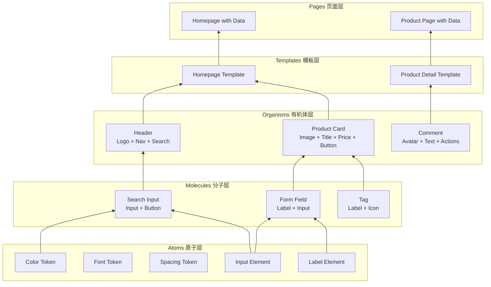
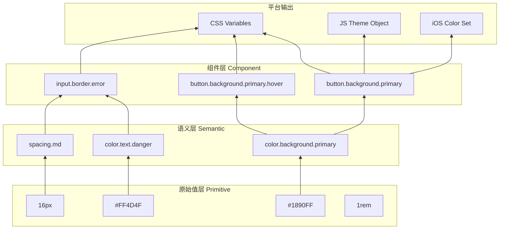
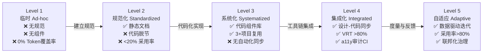
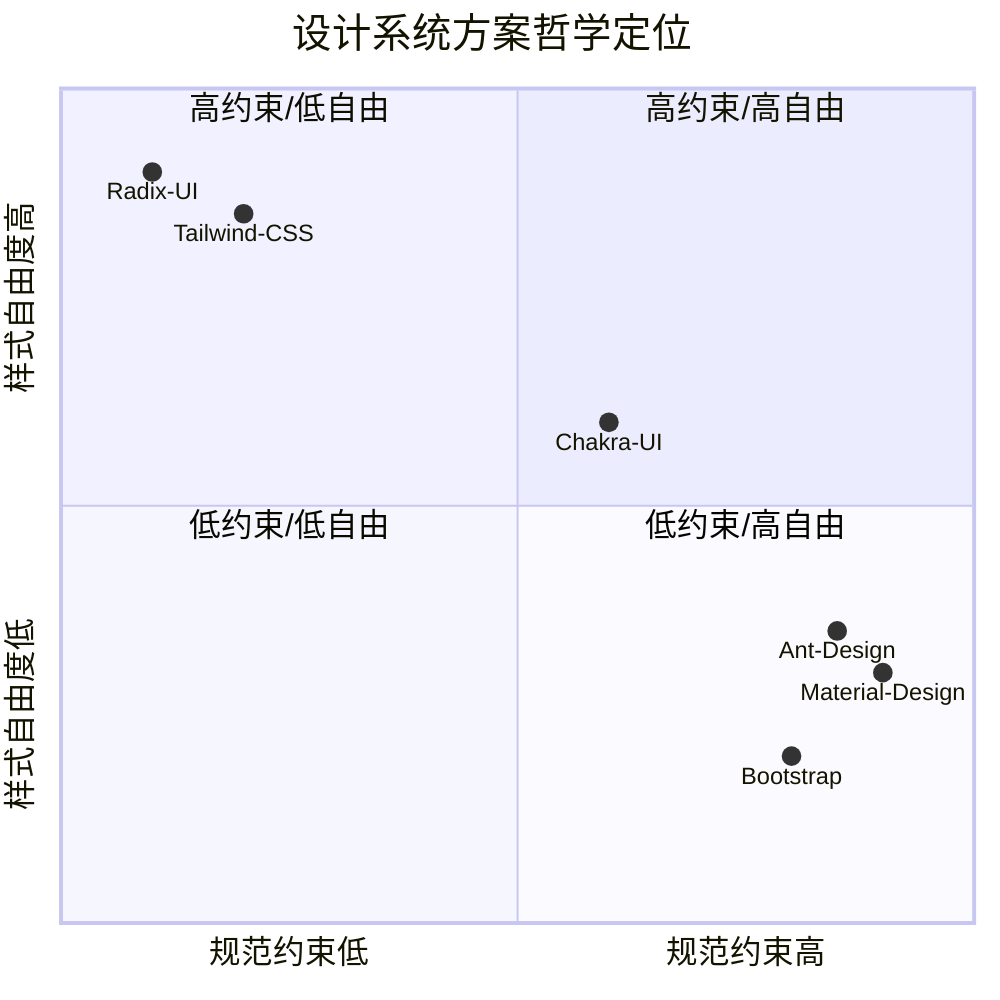

# 设计系统理论：从原子设计到Tokens

## 引言

设计系统（Design System）是连接设计意图与工程实现的桥梁，也是组织内跨职能协作的共享语言。然而，设计系统并非仅仅是「组件库的别名」或「设计规范的数字化」——它是一套用形式化方法定义、以系统化流程维护、以度量指标验证的复杂适应系统。

本章从理论基础出发，追溯设计系统的三大核心支柱（一致性、效率、可扩展性），深入剖析Brad Frost提出的Atomic Design方法论及其在组件层级组织中的应用，建立设计Tokens的语义层级模型，并引入成熟度模型作为评估组织设计系统能力的框架。在工程实践映射部分，本章将Material Design、Ant Design、Tailwind CSS、Chakra UI与Radix UI等主流方案置于同一分析平面，揭示不同哲学取向（规范优先 vs 实用优先 vs 无样式）背后的理论根源与技术权衡。

## 理论严格表述

### 设计系统的理论基础

设计系统的存在合理性建立在三个理论基础之上：

**一致性（Consistency）**：认知心理学研究表明，人类在处理界面时依赖「模式识别」（Pattern Recognition）与「心理模型」（Mental Model）的匹配。一致的视觉语言（颜色、字体、间距、交互反馈）降低了用户的认知负荷（Cognitive Load），使界面从「需要学习的工具」退化为「透明的媒介」。 Nielsen的可用性启发式原则将「一致性与标准」列为十大原则之一，正是基于这一认知科学基础。

形式化地，一致性可定义为设计决策函数 `f: Context → Decision` 的稳定性：对于相似上下文 `c₁ ≈ c₂`，设计系统应保证 `f(c₁) ≈ f(c₂)`。当这一性质被破坏时（同一操作在不同页面触发不同的反馈模式），用户的心理模型失效，错误率与挫败感上升。

**效率（Efficiency）**：设计系统通过「设计一次，复用多次」的机制降低边际成本。对于组织而言，设计系统的ROI（投资回报率）可近似表示为：

```
ROI = (N × C_custom - C_system) / C_system
```

其中 `N` 是复用该系统的项目/页面数，`C_custom` 是每个项目从零设计的成本，`C_system` 是建立与维护设计系统的成本。当 `N` 超过临界值（通常认为在3-5个主要产品之后），设计系统的ROI转正。

效率不仅体现在设计侧，也体现在开发侧。组件库将常见的UI模式封装为可复用单元，消除了重复实现。更深层地，设计Tokens将「视觉决策」从「实现细节」中抽离，使设计师可以在不修改代码的情况下调整全局视觉风格。

**可扩展性（Scalability）**：设计系统必须支持组织 growth 带来的复杂度增长，而不导致熵增失控。可扩展性包含两个维度：

- **水平扩展**：新平台（Web、iOS、Android、桌面端）可基于同一套Tokens与规范构建界面，而不需要为每个平台重新发明视觉语言。
- **垂直扩展**：新组件、新模式可在不破坏现有系统的前提下被添加。这要求系统具备**组合封闭性**与**接口稳定性**。

Alla Kholmatova在《Design Systems》中强调，设计系统的可扩展性不仅取决于技术架构，更取决于**社会结构**——是否有清晰的贡献流程、审核机制与治理模型。

### Atomic Design方法论

Brad Frost于2013年提出的Atomic Design方法论，将化学中的原子隐喻引入界面设计，建立了从最小单位到完整页面的五级层级结构。这一方法论的价值不仅在于分类学，更在于它提供了一种**思考组件组合的方式**——每个层级既是独立的设计单元，也是更高层级的构建材料。

**Atoms（原子）**：界面的最小不可分单位，无法进一步拆分而不丧失语义。例如：

- 颜色值：`color-primary-500`
- 字体族：`font-sans`
- 间距刻度：`space-4`（16px）
- 单个HTML元素：`<input>`、`<button>`

原子层对应设计系统中的Tokens与基础HTML元素。它们本身通常不承载业务语义，但构成了所有视觉表达的「元素周期表」。

**Molecules（分子）**：由两个或多个原子组合而成的、具有单一功能的简单组件。例如：

- 搜索框 = 输入框原子 + 按钮原子
- 标签页 = 多个标签原子 + 指示器原子

分子层是「功能」的最小可复用单元。一个搜索框分子可以在导航栏、首页、搜索结果页中复用，而无需关心其内部原子的具体实现。

**Organisms（有机体/组织）**：由分子与原子组成的、具有独立语义与复杂功能的组件块。例如：

- 导航栏 = Logo分子 + 导航链接分子 + 搜索框分子 + 用户菜单分子
- 商品卡片 = 图片分子 + 标题分子 + 价格分子 + 按钮分子

有机体层通常对应业务组件（Business Components），具有明确的上下文依赖。一个商品卡片组件假设了「商品」这一业务实体的存在，因此其复用范围通常限定在电商相关的页面中。

**Templates（模板）**：页面的骨架结构，定义了有机体的布局与占位关系，但不填充真实内容。模板对应前端工程中的「布局组件」或「页面框架」，回答的是「内容放在哪里」而非「内容是什么」。

**Pages（页面）**：模板填充真实内容后的最终产出，是用户实际看到的界面。页面层是设计系统与业务逻辑的最终交汇点，也是设计师与开发者的主要协作界面。

Atomic Design的层级关系可形式化为偏序集（Poset）：

```
Atom < Molecule < Organism < Template < Page
```

每一层级的组件只能依赖同级或更低层级的组件，禁止反向依赖（例如分子依赖有机体）。这一约束保证了系统的**层次化模块化**（Hierarchical Modularity），防止循环依赖导致的理解复杂度爆炸。

值得注意的是，Atomic Design是**方法论**而非**刚性规则**。实践中，某些组件的层级归属可能存在模糊地带（一个复杂的输入框组合究竟是分子还是有机体？）。关键不在于精确的归类，而在于**建立层级思维**——团队能自觉地思考「这个组件由什么构成」与「这个组件服务于什么更大的结构」。

### 设计Tokens的语义层级

设计Tokens是设计系统的「变量系统」，但其意义远超传统编程中的常量定义。一个严格的Token系统应包含三个语义层级：

**原始值层（Primitive / Raw Values）**

原始值是平台无关的最小视觉单位，直接对应物理属性：

```json
{
  "color": {
    "blue-500": { "value": "#1890FF" },
    "red-500": { "value": "#FF4D4F" }
  },
  "font": {
    "size-14": { "value": "14px" },
    "size-16": { "value": "16px" }
  },
  "space": {
    "4": { "value": "16px" },
    "8": { "value": "32px" }
  }
}
```

原始值层的设计原则：**平台无关性**（不应包含CSS特有语法如 `rem` 或 `vw`，除非该Token明确仅用于Web平台）与**命名中立性**（`blue-500` 而非 `primary`，因为品牌的「主色」可能从蓝色变为紫色，但色阶的相对位置保持不变）。

**语义层（Semantic Tokens）**

语义层将原始值映射到功能意图，实现「什么」与「怎么做」的解耦：

```json
{
  "color": {
    "background-primary": { "value": "{color.blue-500}" },
    "text-danger": { "value": "{color.red-500}" },
    "border-focus": { "value": "{color.blue-500}" }
  }
}
```

语义层是设计系统的「接口」——它向组件开发者暴露了稳定、意图明确的API，而隐藏了底层原始值的具体数值。当品牌升级将主色从 `#1890FF` 改为 `#1677FF` 时，只需修改 `color.blue-500` 的值，所有引用 `color.background-primary` 的组件自动更新。

语义Token的命名应回答「用于什么场景」而非「看起来像什么」。`color-background-primary` 优于 `color-blue`，因为前者描述了使用场景（主背景色），后者描述了物理属性（蓝色）——当品牌色改变时，描述物理属性的命名会失效。

**组件层（Component Tokens）**

组件层针对特定组件的上下文化需求，允许在不破坏全局语义体系的前提下进行局部定制：

```json
{
  "button": {
    "background-primary": { "value": "{color.background-primary}" },
    "background-primary-hover": { "value": "{color.blue-600}" },
    "padding-horizontal": { "value": "{space.4}" }
  }
}
```

组件Token继承自语义Token，形成层级化的引用链：`button.background-primary → color.background-primary → color.blue-500`。这一引用链保证了变更的局部传播：修改 `color.blue-500` 影响所有蓝色相关的语义与组件Token；修改 `button.background-primary-hover` 仅影响按钮的悬停状态。

三层的依赖关系构成有向无环图（DAG），禁止循环引用。Style Dictionary等工具在编译时解析这一DAG，检测循环依赖并生成平台特定的输出。

### 设计系统的成熟度模型

设计系统并非一蹴而就，而是随组织演化逐步成熟的渐进过程。成熟度模型（Maturity Model）为评估当前状态与规划演进路线提供了框架。一个综合的成熟度模型可包含五个等级：

**Level 1: 临时（Ad-hoc）**

- 特征：无统一规范，每个项目独立设计。颜色、字体、间距在项目间重复定义。
- 问题：视觉不一致、重复劳动、设计债务累积。
- 指标：无共享组件，Token覆盖率为0%。

**Level 2: 规范化（Standardized）**

- 特征：发布了静态设计规范（PDF、Wiki页面），定义了颜色板、字体栈与基础组件。
- 问题：规范与实现脱节，开发者不阅读文档，规范沦为「设计遗迹」。
- 指标：有设计文档，但无代码级实现，采用率<20%。

**Level 3: 系统化（Systematized）**

- 特征：建立了代码级组件库与Token系统，在多个项目中复用。有基础的文档站点（Storybook、Docusaurus）。
- 问题：贡献流程不清晰，版本管理混乱，缺乏治理。
- 指标：组件库npm包发布，3+项目采用，有基础CI/CD。

**Level 4: 集成化（Integrated）**

- 特征：设计工具（Figma）与代码库双向同步，Token变更自动传播。视觉回归测试（Chromatic）与可访问性审计集成至CI。
- 问题：跨平台一致性挑战，移动端与桌面端的Token映射复杂。
- 指标：设计-代码同步自动化，VRT覆盖率>80%，a11y检查通过。

**Level 5: 自适应（Adaptive）**

- 特征：设计系统具备数据反馈闭环——通过埋点分析组件采用率、用户交互数据驱动设计迭代。AI辅助生成新组件与Token建议。联邦化治理模型成熟，业务团队可安全地贡献领域组件。
- 指标：定量度量仪表盘，采用率>80%，外部贡献占比>30%。

成熟度模型的价值不在于「达到Level 5」的虚荣，而在于**识别当前瓶颈**。一个Level 3的组织不应盲目追求Level 5的AI生成能力，而应先解决Level 4的设计-代码同步问题。

### 设计系统作为「共享心智模型」

超越技术与工具层面，设计系统的深层价值在于其**社会学功能**：它是一套组织内共享的心智模型（Shared Mental Model）。

认知科学中的「共同基础」（Common Ground）理论指出，有效沟通的前提是参与者共享足够的背景知识。在设计与开发的协作中，这一「共同基础」常常缺失：设计师使用「卡片」指代一个带阴影的圆角矩形，开发者理解为 `div` 包裹的 `box-shadow`；设计师说「主按钮」，开发者需要确认是 `<Button variant="primary">` 还是 `<Button type="main">`。

设计系统通过**命名标准化**与**实体化**（Reification）消除这种歧义。当「Card」被定义为组件库中的一个具体实体（具有明确的Props接口与视觉规范），它从模糊的直觉概念转化为精确的工程对象。这种实体化使跨职能团队得以在稳定的语义基础上协作，而不必在每次对话中重新协商术语定义。

Alla Kholmatova将此称为设计系统的「社会契约」属性：它不仅规范了「如何构建界面」，更规范了「如何沟通关于界面的决策」。

## 工程实践映射

### Material Design的设计系统架构

Google的Material Design（现为Material You / Material 3）是规范优先设计系统的典范。其架构围绕三个核心概念展开：

**Material Theming**：Material Design将设计决策编码为可配置的「主题参数」（Theme Parameters），包括：

- **Color System**：主色（Primary）、次色（Secondary）、表面色（Surface）、背景色（Background）、错误色（Error）及其在浅色/深色模式下的变体。
- **Typography Scale**：由13个字号阶梯组成的排版系统（Display Large → Label Small），每个阶梯定义了字体、字重、字号、行高与字距。
- **Shape System**：组件圆角的标准化表达，从小圆角（4dp）到完全圆角（50%）。

**Dynamic Color**：Material You（Android 12+）引入了基于壁纸的动态色彩提取算法。系统从用户壁纸中提取主色与辅色，自动生成的色彩方案仍遵循Material的色彩理论（色调协调、对比度合规），但具体内容个性化。这一功能展示了设计系统在**规范稳定性**与**内容个性化**之间的精妙平衡——规则不变，输入可变。

**跨平台一致性**：Material Design提供Web（MDC-Web）、Android（Jetpack Compose / Views）、Flutter（Material Widgets）与iOS（Material Components for iOS）的实现。各平台实现共享同一套设计原理与Token命名，但在交互细节（如涟漪动画的物理模型）上适配平台惯例。这种「全球统一，本地适配」的策略是设计系统跨平台扩展的经典范式。

### Ant Design的Token系统

Ant Design（蚂蚁设计）是中国企业级UI领域最具影响力的设计系统，其Token系统（Ant Design v5起引入的Design Token模型）展现了从「配置化」到「Token化」的演进。

**Seed Token → Map Token → Alias Token 的三层架构**：

- **Seed Token（种子Token）**：设计系统的「基因」，数量少（约20个），决定整体风格倾向。例如 `colorPrimary`、`borderRadius`、`fontSize`。修改 `colorPrimary` 会级联影响所有依赖主色的组件。
- **Map Token（映射Token）**：由Seed Token通过算法派生，定义了更具体的视觉属性。例如 `colorPrimaryBg`（主色的浅色背景，由 `colorPrimary` 混合白色生成）、`colorPrimaryBgHover`（悬停态的背景色）。Map Token的数量约为Seed Token的10倍。
- **Alias Token（别名Token）**：面向组件开发的友好命名，将Map Token映射到具体组件场景。例如 `controlOutline`（控件焦点轮廓）对应Map Token `primaryColorOutline`。

这一架构的独特之处在于**算法派生**：Map Token不是手动维护的静态值，而是通过色彩算法（Tint/Shade生成、对比度计算）从Seed Token自动计算。这保证了「修改一个Seed Token，全局风格自动协调」——主色变深时，所有衍生背景色、边框色、文字色会自动重新计算以维持可读性。

**CSS-in-JS与动态主题**：Ant Design v5抛弃了Less变量，全面采用CSS-in-JS（@ant-design/cssinjs）。动态主题成为可能：在运行时通过 `ConfigProvider` 修改Seed Token，所有子组件实时响应。代价是运行时性能开销与Server-Side Rendering的复杂度。Ant Design通过「静态提取」优化（构建时预生成常用主题）部分缓解了这一代价。

### Tailwind CSS作为实用优先的设计系统

Tailwind CSS代表了与Material Design、Ant Design截然不同的设计系统哲学：**实用优先（Utility-First）**。它不提供一个预定义的组件库，而是提供一套低级别的工具类（Utility Classes），让开发者直接在标记中组合样式。

**核心Token化策略**：Tailwind的配置文件 `tailwind.config.js` 本质上是一个设计Token系统：

```javascript
module.exports = {
  theme: {
    colors: {
      primary: {
        50: '#eff6ff',
        500: '#3b82f6',
        900: '#1e3a8a',
      },
    },
    spacing: {
      1: '0.25rem',
      4: '1rem',
    },
  },
};
```

这些配置在构建时通过JIT（Just-In-Time）引擎编译为原子CSS类（`.bg-primary-500`、`.p-4`）。每个工具类对应一个单一CSS属性，组合后即构成完整样式。

**实用优先 vs 组件优先的权衡**：

| 维度 | 组件优先（Ant Design） | 实用优先（Tailwind CSS） |
|------|------------------------|--------------------------|
| 一致性 | 高（预定义组件限制变异） | 中（依赖团队约定） |
| 灵活性 | 中（覆盖样式困难） | 高（任意组合） |
| 学习曲线 | 高（需学习组件API） | 中（需记忆工具类名） |
| 包体积 | 大（全量导入或按需） | 小（仅生成使用的类） |
| 定制化 | 难（需覆盖主题Token） | 易（直接修改类名） |
| 设计-开发协作 | 清晰（设计稿→组件映射） | 模糊（设计稿→类名组合） |

Tailwind CSS的流行揭示了设计系统的一种「去中心化」趋势：与其维护一个庞大的中心化组件库，不如提供一套「词汇表」，让开发者自主组合。这种模式在创业团队与高度定制化产品中极具吸引力，但在大规模组织中可能因「一千个开发者有一千种按钮」而导致一致性危机。

**Tailwind CSS v4的演进**：v4版本将配置从JavaScript迁移至CSS原生的 `@theme` 指令，利用CSS自定义属性作为运行时Token。这一变化反映了设计系统向「原生Web标准」回归的趋势——当CSS变量获得足够好的浏览器支持与开发体验时，专用的Token编译层可能被逐步吸收。

### Chakra UI的组件设计哲学

Chakra UI（现为Chakra UI v3）代表了「组件优先」与「实用优先」之间的中间路线。它提供了一套预构建的、可组合的React组件，同时通过Style Props系统保留了实用优先的灵活性。

**Style Props模式**：Chakra UI的组件接受直接映射到CSS属性的Props：

```jsx
<Box
  bg="blue.500"
  color="white"
  p={4}
  borderRadius="md"
  _hover={{ bg: 'blue.600' }}
>
  Hello Chakra
</Box>
```

这一模式的理论根源是**渐进式披露复杂度**（Progressive Disclosure of Complexity）：简单场景使用Style Props快速搭建，复杂场景通过 `sx` 属性或主题覆盖实现精细控制。

**主题即Token系统**：Chakra UI的主题对象是一个嵌套的JavaScript对象，包含 `colors`、`fonts`、`space`、`sizes` 等Token集合。组件的默认样式通过「样式递归合并」机制与主题关联：`Button` 的默认样式从 `theme.components.Button` 读取，而 `theme.components.Button.baseStyle` 又引用 `theme.colors.primary`。

**可访问性优先（A11y-First）**：Chakra UI的设计哲学将可访问性视为组件的「默认属性」而非「附加功能」。每个组件内部封装了WAI-ARIA规范所需的属性（`role`、`aria-*`、焦点管理、键盘导航）。例如，`Modal` 组件自动处理焦点陷阱（Focus Trap）、`Escape` 键关闭与 `aria-labelledby` 关联。这一策略降低了开发者实现可访问性的认知门槛，但代价是组件内部复杂度的增加与Bundle体积的膨胀。

### Radix UI的无样式组件模式

Radix UI将设计系统的边界推向了新的极端：**无样式组件（Unstyled Components / Headless UI）**。它提供完全无CSS、仅包含行为逻辑与可访问性实现的React组件 primitive。

**关注点分离的极致**：Radix UI认为，设计系统应被拆分为两个正交维度：

1. **行为层**（Behavior）：状态管理、焦点处理、键盘交互、ARIA属性、弹出层定位（Popper）。这是复杂且易错的逻辑，应由专业库封装。
2. **样式层**（Styling）：颜色、间距、边框、动画。这是高度品牌化的表达，应由产品团队自主决定。

Radix UI仅提供行为层，样式层通过Slot/Render Props机制完全交由使用者实现：

```jsx
import * as Dialog from '@radix-ui/react-dialog';

<Dialog.Root>
  <Dialog.Trigger>Open</Dialog.Trigger>
  <Dialog.Portal>
    <Dialog.Overlay className="fixed inset-0 bg-black/50" />
    <Dialog.Content className="fixed center bg-white p-4 rounded-lg">
      <Dialog.Title>Dialog Title</Dialog.Title>
      <Dialog.Description>Description here</Dialog.Description>
      <Dialog.Close>Close</Dialog.Close>
    </Dialog.Content>
  </Dialog.Portal>
</Dialog.Root>
```

**设计系统的「基础设施化」**：Radix UI的理论贡献在于重新定义了设计系统的边界。传统设计系统（Material Design、Ant Design）是「带样式的行为」；Radix UI是「不带样式的行为」。这类似于操作系统将「驱动程序接口」从「具体硬件实现」中分离——行为层成为基础设施，样式层成为应用层。

这一模式的代价显而易见：开发者需要为每个组件自行编写或复制样式代码，一致性保障从「库强制」退化为「团队约定」。因此，Radix UI通常与Tailwind CSS、CSS Modules或Styled Components配合使用，由团队建立自己的样式Token系统。

### CSS自定义属性作为设计Tokens

CSS自定义属性（CSS Custom Properties，又称CSS Variables）为设计Token提供了原生平台支持：

```css
:root {
  --color-primary-500: #1890FF;
  --color-background: #ffffff;
  --space-4: 1rem;
}

.button {
  background: var(--color-primary-500);
  padding: var(--space-4);
}
```

CSS自定义属性相比预处理器变量（Sass `$var`）与JavaScript对象的核心优势在于**运行时可变性**：

1. **动态主题切换**：通过修改 `:root` 或特定作用域的变量值，实现深色模式、高对比度模式或品牌切换，无需重新编译或重新加载JS Bundle。

   ```css
   [data-theme="dark"] {
     --color-background: #141414;
     --color-text: #ffffff;
   }
   ```

2. **作用域级联**：CSS变量的继承机制允许在组件级别覆盖Token，而不影响全局。

   ```css
   .card {
     --color-background: var(--color-surface-elevated);
   }
   ```

3. **浏览器DevTools原生支持**：开发者可直接在Chrome DevTools中实时调整变量值，观察变化效果，无需重新构建。

CSS自定义属性的局限在于**无类型系统**与**运行时开销**。`var(--color-primary)` 在错误拼写时不会报错（返回空值），且每次 `var()` 引用都需要浏览器的变量解析。对于高频渲染场景（如虚拟滚动列表中的数千个单元格），CSS变量的解析成本可能成为性能瓶颈。

现代设计系统通常采用**混合策略**：使用Style Dictionary等工具将源Token JSON编译为CSS自定义属性（用于静态样式与主题切换），同时生成TypeScript对象（用于JavaScript中的动态计算，如Canvas绘制、图表颜色映射）。

### 设计系统在前端框架中的实现

不同前端框架对设计系统的实现方式各有特色，反映了框架哲学与设计系统需求的互动：

**React**：React的设计系统生态最为成熟。组件通过Props接口暴露定制点，通过Context API（`ThemeProvider`）实现全局主题注入。CSS方案涵盖CSS Modules（局部作用域）、Styled Components / Emotion（CSS-in-JS）、Tailwind CSS（原子类）与CSS自定义属性。React的「组合优于继承」哲学与设计系统的层级化组件结构高度契合。

**Vue**：Vue的单文件组件（SFC）将模板、逻辑与样式封装于同一文件，天然适合组件库开发。Vue 3的 `<script setup>` 语法进一步降低了组件编写成本。样式方案上，Vue支持Scoped CSS（通过属性选择器实现局部作用域）、CSS Modules与Vite插件集成的原子CSS（UnoCSS、Tailwind）。Vue的 `provide` / `inject` API用于主题注入，功能类似React Context但使用更轻量。

**Svelte**：Svelte的编译时优化使组件库Bundle体积极小。Scoped CSS是默认行为（通过类名哈希实现），无需额外配置。Svelte的「样式即组件属性」机制（通过CSS自定义属性向组件传递样式参数）为设计Token的注入提供了原生支持：

```svelte
<!-- Button.svelte -->
<button style:--button-bg={$theme.primary}>
  <slot />
</button>

<style>
  button {
    background: var(--button-bg, #1890FF);
  }
</style>
```

Svelte的设计系统生态相对年轻，但其编译器驱动的架构为「零运行时开销的设计系统」提供了独特优势。

## Mermaid 图表

### 图表1：Atomic Design五级层级



### 图表2：设计Tokens语义层级与依赖关系



### 图表3：设计系统成熟度模型演进



### 图表4：主流设计系统方案对比



## 理论要点总结

1. **设计系统的三大支柱**：一致性降低用户认知负荷，效率通过复用降低边际成本，可扩展性支持组织增长而不失控。三者共同构成了设计系统的价值基础。

2. **Atomic Design是层级化思维工具**：Atoms → Molecules → Organisms → Templates → Pages 的五级结构提供了从最小单位到完整页面的组合框架。其核心价值不在于精确归类，而在于建立「由什么构成」与「服务于什么结构」的系统化思考方式。

3. **Tokens的三层架构实现解耦**：原始值层提供平台无关的常量基础，语义层将物理值映射到功能意图，组件层支持上下文化定制。层级间的DAG依赖保证了变更的局部传播与系统的可维护性。

4. **成熟度模型指引演进路线**：从临时（Level 1）到自适应（Level 5），设计系统的成熟是渐进过程。识别当前瓶颈比盲目追求高阶能力更重要。

5. **设计系统是社会契约**：超越技术资产，设计系统是一套组织内共享的心智模型与沟通协议。它通过命名标准化与实体化消除跨职能协作中的语义歧义。

6. **工程实践呈现光谱分布**：Material Design代表规范优先的极端，Tailwind CSS代表实用优先的极端，Radix UI代表行为-样式分离的极端，Chakra UI与Ant Design占据中间地带。没有 universally 最优的方案，只有与组织规模、产品特征与团队文化匹配的合适选择。

## 参考资源

- **Brad Frost** — *Atomic Design*（2016）：提出原子设计方法论，建立了从Atoms到Pages的五级组件层级模型，为设计系统的结构化组织提供了经典框架。
- **Alla Kholmatova** — *Design Systems*（Smashing Magazine, 2017）：从组织协作与共享语言的视角重新定义设计系统，强调设计系统作为「社会契约」而非单纯资产库的属性。
- **Google Material Design** — [https://m3.material.io](https://m3.material.io)：跨平台设计系统的标杆，其Material Theming、Dynamic Color与跨平台一致性策略为行业提供了可复用的工程范式。
- **Salesforce Lightning Design System** — [https://www.lightningdesignsystem.com](https://www.lightningdesignsystem.com)：企业级设计系统的早期实践者，其设计原理文档（Design Principles）与可访问性规范具有极高的参考价值。
- **Ant Design** — [https://ant.design/docs/react/customize-theme](https://ant.design/docs/react/customize-theme)：Ant Design v5的Design Token文档详细阐述了Seed Token → Map Token → Alias Token的三层架构与算法派生机制。
- **Tailwind CSS Documentation** — [https://tailwindcss.com/docs](https://tailwindcss.com/docs)：实用优先设计哲学的完整实现，其JIT引擎与CSS自定义属性集成展示了原子CSS的现代演进方向。
- **Radix UI Primitives** — [https://www.radix-ui.com](https://www.radix-ui.com)：无样式组件模式的代表，其将行为层与样式层彻底分离的设计理念为设计系统的边界重新定义提供了实践基础。
