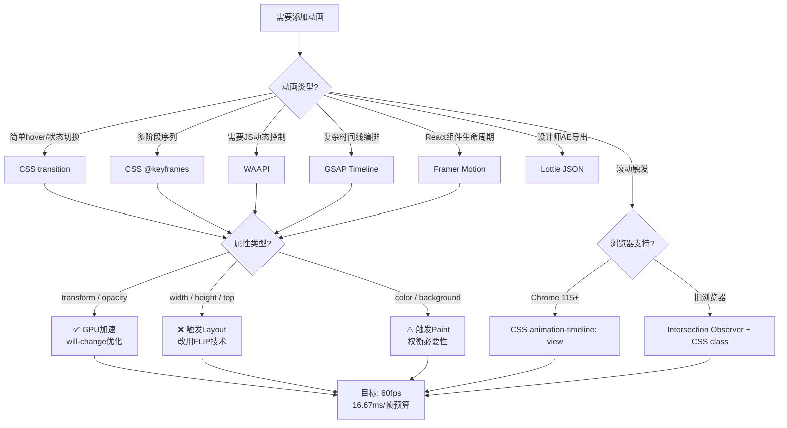

# 动效原理：从迪士尼到Web动画

## 引言

动画在数字界面中早已超越了"装饰"的范畴。一个精心设计的微交互可以在 200 毫秒内传递操作确认；一个平滑的页面过渡可以建立空间心理模型；一个加载动画可以将等待的焦虑转化为对品牌调性的感知。然而，动画也是一把双刃剑——冗余、过慢或性能低劣的动效不仅无助于体验，还会引发用户的认知负担与操作迟滞感。

本章的双轨论述从迪士尼动画的黄金时代出发：在**理论严格表述**轨道中，我们将解剖迪士尼动画 12 原则在 UI 中的映射关系，深入动画的认知心理学机制与时间函数的数学本质；在**工程实践映射**轨道中，我们将覆盖从纯 CSS 过渡、Web Animations API（WAAPI）到 GSAP、Framer Motion、Lottie 的完整技术栈，以及滚动触发动画、微交互设计与 GPU 性能优化的工程实践。

---

## 理论严格表述

### 2.1 迪士尼动画12原则在UI中的应用

1981 年，迪士尼动画师 Ollie Johnston 和 Frank Thomas 在《The Illusion of Life》中系统总结了迪士尼工作室数十年的动画经验，提炼出 **12 项基本原则**。这些原则最初针对的是手绘角色动画，但其底层原理——关于运动如何被人类视觉系统感知、如何传递质量与情感——在数字 UI 动效中同样适用。

#### 2.1.1 挤压与拉伸（Squash and Stretch）

**核心原理**：物体在运动过程中会因惯性发生形变，以强调其质量、弹性和速度。一个弹跳的球在撞击地面时压扁（squash），弹起时拉长（stretch）。

**UI 映射**：按钮点击时的轻微压扁、卡片展开时的弹性形变、Toast 通知滑入时的回弹效果。在 Web 实现中，这通常通过 `transform: scale()` 配合自定义贝塞尔曲线实现。

```css
/* 按钮点击的挤压效果 */
.btn:active {
  transform: scale(0.95, 0.95);
  transition: transform 0.1s cubic-bezier(0.34, 1.56, 0.64, 1);
}
```

注意：在 UI 中，形变应极其克制（通常在 0.95–1.05 的 scale 范围内），否则会被感知为"不稳定"或"低级趣味"。

#### 2.1.2 预备动作（Anticipation）

**核心原理**：在主要动作发生之前，一个反向的预备动作可以吸引观众注意力并为后续运动做好心理铺垫。例如，棒球投手在投球前先将手臂向后摆动。

**UI 映射**：下拉刷新时，列表先向下偏移一点再回弹；模态框打开前，触发按钮轻微缩小再恢复原状；删除操作前，项目先轻微晃动。这种反向运动给用户的大脑预留了处理时间，使后续主动作更显自然。

#### 2.1.3 演出布局（Staging）

**核心原理**：动作应发生在最清晰的视角下，避免不必要的视觉噪音干扰观众对核心事件的关注。

**UI 映射**：模态框出现时，背景通过 `opacity` 变暗，将用户的注意力聚焦于前景对话框；页面切换时，旧内容淡出，新内容淡入并占据视觉中心；引导教程（Onboarding）通过聚光灯效果（spotlight）高亮特定区域。Staging 的本质是**注意力管理**。

#### 2.1.4 连续运动 vs 姿势到姿势（Straight Ahead vs Pose-to-Pose）

**核心原理**：连续运动是逐帧绘制，线条流畅但不稳定；姿势到姿势是先定义关键帧（keyframes），再填充中间帧（inbetweens），可控性更强。

**UI 映射**：Web 动画本质上是**姿势到姿势**的——我们定义起始状态（start state）和结束状态（end state），由浏览器或动画引擎插值计算中间帧。CSS 的 `@keyframes` 和 GSAP 的 `to()`/`from()` 都是姿势到姿势范式的直接体现。这与手绘动画中"关键帧"的概念完全一致。

#### 2.1.5 跟随与重叠动作（Follow Through and Overlapping Action）

**核心原理**：物体各部分的运动不是同时开始和结束的。附属部分（如衣服的摆动、头发）会在主体停止后继续运动，然后逐渐静止。

**UI 映射**：侧边栏菜单展开时，菜单项（items）以**交错延迟（stagger）**依次滑入，而非同时出现；标签页切换时，指示器（indicator）先快速移动，再轻微过冲（overshoot）后定位。这种非同步运动使界面具有有机感（organic feel），暗示了元素的"质量"与"惯性"。

#### 2.1.6 缓入缓出（Slow In and Slow Out）

**核心原理**：物体在真实世界中不会瞬间达到全速或瞬间停止。运动始于缓慢加速（缓入），终于缓慢减速（缓出）。

**UI 映射**：这是 UI 动效中最关键的原则。线性时间函数（`linear`）在 UI 中几乎总是错误的，因为它暗示了机械、非自然的运动。CSS 的 `ease`、`ease-in-out`、自定义贝塞尔曲线都是为了模拟自然的加速与减速。

在物理层面，缓动对应于**动量（momentum）**和**摩擦力（friction）**。iOS 的滚动回弹（rubber-banding）和 Material Design 的水波纹（ripple）都是这一原则的经典实现。

#### 2.1.7 弧线运动（Arcs）

**核心原理**：自然界中的运动极少沿直线进行。手臂摆动、抛射体轨迹都遵循弧线。

**UI 映射**：页面切换动画中，元素沿弧线滑出屏幕而非直线；浮动操作按钮（FAB）展开子按钮时，子按钮沿弧形路径散开。弧线运动比直线运动更柔和、更具生命感。

#### 2.1.8 附属动作（Secondary Action）

**核心原理**：附属动作补充和强化了主要动作，但不能喧宾夺主。例如，角色走路时（主要动作），手臂自然摆动（附属动作）。

**UI 映射**：提交按钮点击后，按钮本身变灰并显示加载 spinner（主要动作），同时表单输入框的边框颜色同步变为禁用态灰色（附属动作）；抽屉菜单打开时（主要动作），页面内容轻微缩放并变暗（附属动作）。附属动作为场景增加了深度和真实感。

#### 2.1.9 时间节奏（Timing）

**核心原理**：动作的速度和帧数决定了其物理属性。同样距离的移动，帧数少显得快速轻盈，帧数多显得缓慢沉重。

**UI 映射**：在 UI 中，时间节奏直接关系到**感知的响应性**。Google Material Design 建议：

- 微交互（按钮点击、切换开关）：100–200ms
- 小型组件动画（菜单展开、提示出现）：200–300ms
- 大型区域过渡（页面切换、模态框）：300–500ms

超过 500ms 的动画会让用户感到"等待"；低于 100ms 的动画则难以被视觉系统感知，失去了反馈意义。

#### 2.1.10 夸张（Exaggeration）

**核心原理**：适度的夸张使动作更清晰、更具表现力。在卡通中，角色的惊讶表情会被极度放大。

**UI 映射**：在 UI 中，夸张必须极度克制。一个过冲（overshoot）效果——如滑块在最终位置前略过一点再回弹——就是夸张的微妙应用。Material Design 的"水波纹"扩散效果也是夸张的实例：它比物理世界的真实波纹更明显，以强化操作的确认感。

#### 2.1.11 扎实的绘画（Solid Drawing）与 2.1.12 吸引力（Appeal）

**核心原理**：扎实的绘画要求角色具有体积感和三维空间中的可信质量；吸引力要求角色具有鲜明的个性，能够引发观众的情感共鸣。

**UI 映射**：在 UI 语境下，"扎实的绘画"转化为**空间一致性**——动画应遵循真实世界的物理隐喻（如重力、惯性、摩擦力），避免元素凭空出现或消失。"吸引力"转化为**品牌调性**——动画的曲线、速度、风格应与品牌的整体人格一致。Apple 的动画流畅而克制，传递精密感；Google 的动画弹性而活泼，传递友好感。

### 2.2 动画的认知心理学

动画不仅是视觉现象，更是认知现象。理解动画如何被大脑处理，是设计有效动效的前提。

#### 2.2.1 运动如何引导注意力

人眼的视觉系统对运动具有高度敏感性——这是进化赋予的生存机制。在界面中，运动的元素会自动捕获用户的注意力，这一特性称为 **视觉显著性（visual saliency）**。

这一机制的双刃剑效应：

- **正面**：新消息提示的轻微弹跳可以引导用户注意到通知；表单错误字段的抖动可以立即吸引注意力。
- **负面**：页面上持续运动的元素（如闪烁的广告、自动轮播图）会造成**注意力劫持（attention hijacking）**，干扰用户的主要任务流。

因此，UI 动效设计的第一原则是：**只在需要引导注意力的时刻使用运动，且运动应在任务完成后迅速静止。**

#### 2.2.2 动画反馈的心理确认

动画反馈遵循 **诺曼的映射原则（Norman's Mapping Principle）**：用户执行一个操作后，系统应以可感知的方式确认该操作已被接收并正在处理。

从认知心理学角度，这种确认涉及两个层面：

1. **感知层（Perceptual Level）**：视觉运动信号被视网膜接收并传递至视觉皮层。200ms 内的反馈被认为是"即时"的，不会打断用户的思维流。
2. **认知层（Cognitive Level）**：大脑将视觉反馈与操作意图进行匹配，确认"我点击了按钮，按钮确实被按下了"。如果反馈缺失或延迟，用户会怀疑操作是否成功，产生**认知不确定性（cognitive uncertainty）**，进而导致重复点击或焦虑。

这正是为什么加载状态必须使用动画——静态的"加载中"文本无法提供**进展感（sense of progress）**，而旋转的 spinner 或进度条通过运动传递了"系统正在工作"的信号。

#### 2.2.3 心理模型与空间记忆

动画可以建立和强化用户的心智模型（mental model）。例如：

- **推送（Push）**过渡暗示了层级关系：新页面从右侧滑入，旧页面向左滑出，用户形成了"右 = 更深"的空间记忆。
- **模态框缩放**动画暗示了焦点转移：背景变暗，对话框从点击位置放大出现，建立了"对话框与触发元素相关联"的心理模型。
- **拖拽排序**中的实时位置更新，使用户能够预测释放后的结果。

破坏这些空间一致性的动画（如页面从下方滑入，但返回按钮在左上角）会导致**认知失调（cognitive dissonance）**，增加用户的学习成本。

### 2.3 时间函数（Easing Functions）的数学分类

时间函数（在 CSS 中称为 `easing`，在动画引擎中称为 `timing function`）定义了动画值随时间变化的速率曲线。它是动画"质感"的数学核心。

#### 2.3.1 贝塞尔曲线（Cubic Bézier）

CSS 和大多数动画引擎使用三次贝塞尔曲线定义时间函数：

```
B(t) = (1-t)³P₀ + 3(1-t)²tP₁ + 3(1-t)t²P₂ + t³P₃,  t ∈ [0, 1]
```

其中 P₀ = (0, 0)，P₃ = (1, 1) 固定，P₁ 和 P₂ 是控制点。CSS 的 `cubic-bezier(x1, y1, x2, y2)` 即对应 P₁ = (x1, y1) 和 P₂ = (x2, y2)。

当 y 值大于 1 或小于 0 时，产生**过冲（overshoot）**和**回弹（bounce）**效果：

```css
cubic-bezier(0.34, 1.56, 0.64, 1) /* 过冲回弹，适用于按钮点击 */
```

#### 2.3.2 数学分类体系

| 类别 | 数学特征 | 感知效果 | 典型应用 |
|------|----------|----------|----------|
| **线性（Linear）** | `f(t) = t` | 机械、恒定速度 | 颜色渐变、透明度淡入淡出 |
| **缓入（Ease-in）** | 加速度为正 | 缓慢启动，突然停止 | 元素离开屏幕 |
| **缓出（Ease-out）** | 加速度为负 | 快速启动，缓慢停止 | 元素进入屏幕 |
| **缓入缓出（Ease-in-out）** | 先正后负加速度 | 自然、有机 | 大多数 UI 过渡 |
| **弹性（Elastic）** | 衰减正弦波 | 橡皮筋般的回弹 | 强调性提示 |
| **弹跳（Bounce）** | 衰减抛物线 | 球体落地反弹 | 庆祝、成就反馈 |
| **步进（Steps）** | 离散跳跃 | 逐帧、机械 | 打字机效果、加载指示器 |

#### 2.3.3 物理仿真函数

高级动画引擎（如 Framer Motion、GSAP）支持基于物理的动画：

- **弹簧（Spring）**：由刚度（stiffness）、阻尼（damping）、质量（mass）参数定义，模拟真实弹簧的简谐振动。
- **衰减（Decay）**：模拟摩擦力作用下的速度衰减，如 iOS 的惯性滚动。
- **重力（Gravity）**：模拟自由落体或抛射体运动。

这些函数的优势在于：给定初始速度和物理参数，动画会自动计算自然的结果，无需指定持续时间。例如，Framer Motion 的弹簧动画：

```jsx
<motion.div
  animate={{ x: 100 }}
  transition={{ type: "spring", stiffness: 300, damping: 20 }}
/>
```

弹簧动画的参数含义：

- **stiffness（刚度）**：弹簧的硬度，值越大，动画越快到达目标。
- **damping（阻尼）**：阻力大小，值越大，振荡衰减越快。`damping < 1` 产生持续振荡，`damping = 1` 为临界阻尼（最快无振荡到达），`damping > 1` 为过阻尼（缓慢无振荡到达）。
- **mass（质量）**：物体的惯性，值越大，加速度越慢。

---

## 工程实践映射

### 3.1 CSS 动画与过渡

CSS 动画是 Web 动效的基础设施，具有零依赖、硬件加速友好、声明式维护的优势。

#### 3.1.1 transition 的基础应用

```css
.btn {
  background-color: #3b82f6;
  transition: background-color 0.2s ease-out, transform 0.1s cubic-bezier(0.34, 1.56, 0.64, 1);
}

.btn:hover {
  background-color: #2563eb;
}

.btn:active {
  transform: scale(0.95);
}
```

`transition` 的四个子属性：

- `transition-property`：指定哪些属性变化时触发动画。
- `transition-duration`：动画持续时间。
- `transition-timing-function`：时间函数。
- `transition-delay`：延迟开始时间。

**性能关键**：`transition` 和 `animation` 应仅用于 **transform** 和 **opacity** 属性。这两个属性可以由 GPU 直接合成（composite），不触发布局（layout）或绘制（paint）阶段。对 `width`、`height`、`top`、`left`、`margin` 等属性进行动画会导致**布局抖动（layout thrashing）**——浏览器被迫在每一帧重新计算整个渲染树。

#### 3.1.2 animation 与 @keyframes

对于多阶段或循环动画，使用 `@keyframes`：

```css
@keyframes pulse {
  0%, 100% {
    opacity: 1;
    transform: scale(1);
  }
  50% {
    opacity: 0.7;
    transform: scale(1.05);
  }
}

.loading-dot {
  animation: pulse 1.5s ease-in-out infinite;
}

/* 交错延迟实现波浪效果 */
.loading-dot:nth-child(2) {
  animation-delay: 0.2s;
}
.loading-dot:nth-child(3) {
  animation-delay: 0.4s;
}
```

#### 3.1.3 CSS 动画的性能优化

```css
.animated-element {
  /* 提示浏览器该元素将发生变化 */
  will-change: transform, opacity;
  /* 强制 GPU 层提升 */
  transform: translateZ(0);
}
```

`will-change` 的使用原则：

- **提前声明**：在动画开始前足够早的时间添加（如通过 JS 在 hover 时添加），而非在动画开始瞬间添加。
- **及时移除**：动画结束后移除 `will-change`，因为每个提升的 GPU 层都会消耗额外的内存。
- **谨慎使用**：不应同时给大量元素添加 `will-change`，否则会导致内存压力反而降低性能。

### 3.2 Web Animations API（WAAPI）

WAAPI 是 JavaScript 操作动画的原生标准，提供了比 CSS 更精细的控制能力：动态开始/暂停、反向播放、速度控制、动画时间线的精确查询。

#### 3.2.1 基础用法

```javascript
const element = document.querySelector(".box");

const animation = element.animate(
  [
    { transform: "translateX(0)", opacity: 0 },
    { transform: "translateX(100px)", opacity: 1 },
  ],
  {
    duration: 500,
    easing: "cubic-bezier(0.25, 0.46, 0.45, 0.94)",
    fill: "forwards",
    iterations: 1,
  }
);

// 动画完成后的事件监听
animation.onfinish = () => {
  console.log("动画完成");
};

// 动态控制
animation.pause();
animation.play();
animation.reverse();
animation.playbackRate = 2; // 2倍速
```

#### 3.2.2 与 CSS 动画的对比

| 特性 | CSS 动画 | WAAPI |
|------|----------|-------|
| 声明方式 | 静态声明 | 动态编程 |
| 控制能力 | 有限（play-state） | 完整（暂停/反向/调速/跳转） |
| 时间线查询 | 不可查询 | `animation.currentTime` |
| 复合动画 | 复杂 | `Element.getAnimations()` 管理 |
| 序列编排 | 依赖 `animation-delay` | `AnimationTimeline` 精确控制 |

WAAPI 特别适合需要根据用户输入动态生成的动画（如拖拽跟随、手势响应）。

### 3.3 GSAP 的专业级动画库

GreenSock Animation Platform（GSAP）是业界最强大、性能最优的 JavaScript 动画库，被广泛应用于高端营销页面、数据可视化和游戏化界面。

#### 3.3.1 核心特性

```javascript
import gsap from "gsap";

// 基础 tween
gsap.to(".box", {
  x: 200,
  rotation: 360,
  duration: 1,
  ease: "power2.inOut",
});

// 从某状态动画到当前状态
gsap.from(".box", {
  opacity: 0,
  y: 50,
  duration: 0.8,
  stagger: 0.1, // 交错延迟
});

// 时间线编排复杂序列
const tl = gsap.timeline({ defaults: { ease: "power3.out" } });

tl.to(".title", { y: 0, opacity: 1, duration: 0.6 })
  .to(".subtitle", { y: 0, opacity: 1, duration: 0.5 }, "-=0.3")
  .to(".btn-group", { y: 0, opacity: 1, duration: 0.4 }, "-=0.2");
```

#### 3.3.2 GSAP 的 ScrollTrigger 插件

ScrollTrigger 是 GSAP 的滚动动画插件，将滚动位置映射到动画进度：

```javascript
import { ScrollTrigger } from "gsap/ScrollTrigger";
gsap.registerPlugin(ScrollTrigger);

gsap.to(".parallax-bg", {
  yPercent: 50,
  ease: "none",
  scrollTrigger: {
    trigger: ".section",
    start: "top bottom",
    end: "bottom top",
    scrub: true, // 滚动直接控制动画进度
  },
});
```

#### 3.3.3 GSAP 的性能优势

GSAP 在性能上的核心优化：

1. **单一 requestAnimationFrame 循环**：GSAP 使用一个全局的 RAF 循环驱动所有动画，避免多个动画各自创建 RAF 造成的调度开销。
2. **智能属性缓存**：GSAP 缓存计算值，避免每帧读取 DOM 造成的强制同步布局（forced synchronous layout）。
3. **自动 GPU 加速**：GSAP 自动为适用属性添加 `transform: translateZ(0)` 提升。

### 3.4 Framer Motion 的声明式 React 动画

Framer Motion 是 React 生态中最流行的动画库，其核心理念是**声明式 API**——将动画状态直接声明在 JSX 中，与 React 的组件模型深度整合。

#### 3.4.1 基础 API

```jsx
import { motion } from "framer-motion";

function Card({ isOpen }) {
  return (
    <motion.div
      animate={{
        scale: isOpen ? 1.1 : 1,
        opacity: isOpen ? 1 : 0.8,
      }}
      transition={{
        type: "spring",
        stiffness: 300,
        damping: 20,
      }}
      whileHover={{ scale: 1.05 }}
      whileTap={{ scale: 0.95 }}
    >
      卡片内容
    </motion.div>
  );
}
```

#### 3.4.2 AnimatePresence 与退出动画

React 的组件卸载是瞬间的，无法直接在其上定义"退出动画"。`AnimatePresence` 解决了这一难题：

```jsx
import { AnimatePresence, motion } from "framer-motion";

function Modal({ isVisible }) {
  return (
    <AnimatePresence>
      {isVisible && (
        <motion.div
          key="modal"
          initial={{ opacity: 0, scale: 0.8 }}
          animate={{ opacity: 1, scale: 1 }}
          exit={{ opacity: 0, scale: 0.8 }}
          transition={{ duration: 0.3 }}
        >
          模态框内容
        </motion.div>
      )}
    </AnimatePresence>
  );
}
```

`AnimatePresence` 会延迟组件的卸载，直到 `exit` 动画完成。这是 React 动画领域的范式突破。

#### 3.4.3 布局动画（Layout Animations）

Framer Motion 的 `layout` 属性可以自动处理布局变化动画：

```jsx
<motion.div
  layout
  style={{ borderRadius: isExpanded ? 20 : 8 }}
/>
```

当 `isExpanded` 变化导致元素的尺寸或位置变化时，Framer Motion 会自动计算 FLIP（First, Last, Invert, Play）动画，以平滑的方式过渡到新布局。这消除了手动计算 `width`、`height`、`top`、`left` 的繁琐工作。

### 3.5 Lottie 的 JSON 动画

Lottie 是 Airbnb 开源的动画格式，允许将 After Effects 动画导出为 JSON 文件，在 Web、iOS、Android 上以原生方式渲染。

#### 3.5.1 工作流程

1. 设计师在 After Effects 中创建动画。
2. 使用 Bodymovin 插件导出为 `.json` 文件。
3. 前端通过 `lottie-web` 库加载并渲染：

```javascript
import lottie from "lottie-web";

const animation = lottie.loadAnimation({
  container: document.getElementById("lottie-container"),
  renderer: "svg",
  loop: true,
  autoplay: true,
  path: "/animations/loading.json",
});

// 控制播放
animation.play();
animation.pause();
animation.setSpeed(1.5);
animation.goToAndStop(60, true); // 跳转到第60帧
```

#### 3.5.2 Lottie 的适用场景

| 场景 | 适用性 | 原因 |
|------|--------|------|
| 复杂的图标动画（如下拉刷新、成功状态） | ✅ 高 | 矢量无损缩放，文件小 |
| 全屏插画动画 | ✅ 高 | 跨平台一致性 |
| 实时数据驱动的动态图表 | ❌ 低 | Lottie 不支持动态数据绑定 |
| 需要用户交互控制的微交互 | ❌ 低 | 帧级控制不如 CSS/JS 灵活 |
| 需要即时响应手势的动画 | ❌ 低 | JSON 解析和渲染有延迟 |

### 3.6 滚动触发动画

滚动触发动画（Scroll-driven Animations）是现代 Web 体验的核心叙事工具，将滚动位置作为动画的时间线控制器。

#### 3.6.1 Intersection Observer + CSS 动画

```javascript
const observer = new IntersectionObserver(
  (entries) => {
    entries.forEach((entry) => {
      if (entry.isIntersecting) {
        entry.target.classList.add("animate-in");
      }
    });
  },
  { threshold: 0.2 }
);

document.querySelectorAll(".scroll-reveal").forEach((el) => observer.observe(el));
```

```css
.scroll-reveal {
  opacity: 0;
  transform: translateY(30px);
  transition: opacity 0.6s ease-out, transform 0.6s ease-out;
}

.scroll-reveal.animate-in {
  opacity: 1;
  transform: translateY(0);
}
```

#### 3.6.2 原生 Scroll-driven Animations

Chrome 115+ 支持原生的滚动驱动动画，无需 JavaScript：

```css
@keyframes fade-in-up {
  from {
    opacity: 0;
    transform: translateY(50px);
  }
  to {
    opacity: 1;
    transform: translateY(0);
  }
}

.scroll-element {
  animation: fade-in-up linear both;
  animation-timeline: view();
  animation-range: entry 25% cover 50%;
}
```

`animation-timeline: view()` 将元素的可见性进度直接映射为动画进度。当元素进入视口 25% 时动画开始，当元素覆盖视口 50% 时动画完成。

### 3.7 微交互设计

微交互（Micro-interactions）是围绕单一任务的细微动画，通常持续 200–400ms。Dan Saffer 将其定义为：

> "围绕单一用例的包含触发器、规则、反馈和循环/模式的产品时刻。"

#### 3.7.1 按钮点击反馈

```css
.btn {
  transition: transform 0.15s cubic-bezier(0.34, 1.56, 0.64, 1),
              background-color 0.2s ease;
}

.btn:hover {
  background-color: var(--color-primary-hover);
}

.btn:active {
  transform: scale(0.96);
}

.btn:disabled {
  opacity: 0.5;
  cursor: not-allowed;
  transform: none;
}
```

#### 3.7.2 加载动画

加载动画的核心功能是**时间感知管理（time perception management）**。研究表明，有动画的等待时间比静态等待时间**主观上缩短约 20%**。

```jsx
// 骨架屏 + 渐进加载
function SkeletonCard() {
  return (
    <motion.div
      initial={{ opacity: 0.5 }}
      animate={{ opacity: [0.5, 1, 0.5] }}
      transition={{ duration: 1.5, repeat: Infinity, ease: "easeInOut" }}
      className="skeleton-card"
    >
      <div className="skeleton-header" />
      <div className="skeleton-body" />
    </motion.div>
  );
}
```

#### 3.7.3 状态切换

```jsx
// 开关组件的平滑过渡
<motion.div
  className="toggle-track"
  onClick={() => setIsOn(!isOn)}
  style={{ backgroundColor: isOn ? "#3b82f6" : "#d1d5db" }}
>
  <motion.div
    className="toggle-thumb"
    layout
    transition={{ type: "spring", stiffness: 500, damping: 30 }}
    style={{ x: isOn ? 24 : 0 }}
  />
</motion.div>
```

### 3.8 性能优化

动画性能是用户体验的硬约束。60fps 意味着每帧只有 16.67ms 的渲染预算，任何超出都会导致**掉帧（jank）**。

#### 3.8.1 渲染管道优化

浏览器的渲染管道（Rendering Pipeline）分为五个阶段：JavaScript → Style → Layout → Paint → Composite。

| 动画属性 | 触发阶段 | 性能开销 |
|----------|----------|----------|
| `transform`（translate/scale/rotate） | Composite only | ✅ 最优 |
| `opacity` | Composite only | ✅ 最优 |
| `filter`（部分） | Paint + Composite | ⚠️ 中等 |
| `width`, `height`, `top`, `left` | Layout + Paint + Composite | ❌ 昂贵 |
| `margin`, `padding` | Layout + Paint + Composite | ❌ 昂贵 |
| `border-radius` | Paint + Composite | ⚠️ 中等 |
| `box-shadow` | Paint + Composite | ⚠️ 中等 |

**黄金法则**：只动画 `transform` 和 `opacity`。

#### 3.8.2 GPU 加速与层提升

```css
.gpu-layer {
  /* 强制创建合成层 */
  transform: translateZ(0);
  /* 或 */
  will-change: transform;
}
```

合成层（Composited Layer）由 GPU 直接渲染，不占用主线程。但每个合成层都会消耗额外的 GPU 内存（尤其在移动端），因此应**仅在动画期间**创建层，动画结束后移除。

#### 3.8.3 避免布局抖动（Layout Thrashing）

布局抖动是指在 JavaScript 中交替读取和写入布局属性，迫使浏览器同步计算布局：

```javascript
// ❌ 坏：读写交替，强制同步布局
for (let i = 0; i < elements.length; i++) {
  const height = elements[i].offsetHeight; // 读取（触发布局计算）
  elements[i].style.height = height + 10 + "px"; // 写入（使布局失效）
}

// ✅ 好：批量读取，批量写入
const heights = elements.map((el) => el.offsetHeight); // 批量读取
heights.forEach((h, i) => {
  elements[i].style.height = h + 10 + "px"; // 批量写入
});
```

#### 3.8.4 FLIP 动画技术

FLIP（First, Last, Invert, Play）是一种高性能的布局动画技术，由 Paul Lewis 提出：

1. **First**：记录元素的初始状态（位置、尺寸）。
2. **Last**：将元素变换到最终状态，记录新位置/尺寸。
3. **Invert**：通过 `transform` 将元素从最终状态"反转"回初始状态的视觉位置（此时元素的实际布局已在最终状态）。
4. **Play**：启用 `transition`，移除反转的 `transform`，让浏览器以硬件加速的方式平滑过渡到最终状态。

FLIP 的精髓在于：通过 `transform` 模拟布局变化，避免了每帧触发布局重新计算。

```javascript
function flipAnimate(element, callback) {
  const first = element.getBoundingClientRect();
  callback(); // 执行导致布局变化的 DOM 操作
  const last = element.getBoundingClientRect();

  const deltaX = first.left - last.left;
  const deltaY = first.top - last.top;
  const deltaW = first.width / last.width;
  const deltaH = first.height / last.height;

  element.style.transform = `translate(${deltaX}px, ${deltaY}px) scale(${deltaW}, ${deltaH})`;
  element.style.transition = "none";

  requestAnimationFrame(() => {
    element.style.transition = "transform 0.3s ease";
    element.style.transform = "";
  });
}
```

Framer Motion 的 `layout` 属性内部即使用了 FLIP 技术。

---

## Mermaid 图表

### 迪士尼12原则到Web技术栈的映射架构

```mermaid
graph TD
    subgraph 理论原则["📐 迪士尼动画12原则"]
        P1[挤压与拉伸<br/>Squash & Stretch]
        P2[预备动作<br/>Anticipation]
        P3[演出布局<br/>Staging]
        P4[连续/姿势<br/>Straight/Pose-to-Pose]
        P5[跟随重叠<br/>Follow Through]
        P6[缓入缓出<br/>Slow In/Out]
        P7[弧线运动<br/>Arcs]
        P8[附属动作<br/>Secondary Action]
        P9[时间节奏<br/>Timing]
        P10[夸张<br/>Exaggeration]
    end

    subgraph 认知机制["🧠 认知心理学机制"]
        C1[注意力引导<br/>视觉显著性]
        C2[操作确认<br/>200ms反馈阈值]
        C3[心理模型构建<br/>空间一致性]
        C4[时间感知管理<br/>等待体验]
    end

    subgraph 工程实现["⚙️ Web工程实现"]
        E1[CSS transition / animation<br/>@keyframes]
        E2[Web Animations API<br/>WAAPI]
        E3[GSAP<br/>Timeline / ScrollTrigger]
        E4[Framer Motion<br/>AnimatePresence / Layout]
        E5[Lottie<br/>After Effects → JSON]
        E6[Intersection Observer<br/>Scroll-driven]
        E7[FLIP技术<br/>高性能布局动画]
    end

    P1 -->|transform: scale()| E1
    P2 -->|反向偏移 + 回弹| E4
    P3 -->|opacity遮罩 / backdrop-filter| E1
    P5 -->|stagger交错延迟| E3
    P6 -->|cubic-bezier / spring physics| E1
    P6 -->|type: "spring"| E4
    P9 -->|duration: 100-500ms| E1
    P10 -->|overshoot easing| E1
    C1 -->|motion + 颜色对比| E1
    C2 -->|按钮反馈 / 加载状态| E4
    C3 -->|页面过渡动画| E3
    C4 -->|骨架屏动画| E1
    E2 -->|动态控制播放状态| E3
    E7 -->|Framer Motion layout属性| E4
    E5 -->|复杂矢量动画| E6
```

### 动画性能决策矩阵



---

## 理论要点总结

1. **迪士尼12原则是跨媒介的动画通用语法**：从手绘卡通到 Web 按钮，挤压与拉伸、缓入缓出、时间节奏等原则定义了运动如何被人类感知为"自然"。在 UI 中，这些原则需要极度克制地应用，scale 通常限制在 0.95–1.05 范围内。

2. **动画的认知价值大于装饰价值**：200ms 内的反馈动画消除认知不确定性；滚动触发的进入动画引导叙事节奏；空间一致的过渡动画构建用户的心理模型。动画是界面语言的一部分。

3. **时间函数是动画质感的数学核心**：贝塞尔曲线、弹簧物理、衰减模型定义了动画的"手感"。线性时间函数在 UI 中几乎总是错误的，因为真实世界的运动必然包含加速与减速。

4. **性能是动画体验的硬约束**：60fps 要求每帧渲染预算不超过 16.67ms。只动画 `transform` 和 `opacity`，使用 `will-change` 进行 GPU 层提升，避免布局抖动，是动画性能的三条铁律。

5. **技术选择取决于控制粒度**：CSS 适合声明式简单动画，WAAPI 适合需要 JS 动态控制的场景，GSAP 适合复杂时间线编排，Framer Motion 适合 React 生态的声明式组件动画，Lottie 适合设计师主导的复杂矢量动画。

6. **FLIP 是高性价比的布局动画方案**：通过 `transform` 模拟布局变化，避免了昂贵的 Layout 阶段，是实现列表重排、网格重排等布局动画的最优工程模式。

---

## 参考资源

1. **Thomas, Frank, and Ollie Johnston.** *The Illusion of Life: Disney Animation*. Revised ed. Disney Editions, 1995. 迪士尼动画的权威著作，系统阐述了12项动画基本原则，是理解动画本质的必读经典。

2. **Head, Val.** *Designing Interface Animation: Meaningful Motion for User Experience*. Rosenfeld Media, 2016. 从 UX 视角系统论述了 UI 动画的设计原则、时间节奏、缓动选择和无障碍考虑，结合了大量真实案例。

3. **Lewis, Paul.** *FLIP Your Animations*. Google Developers Blog, 2015. <https://aerotwist.com/blog/flip-your-animations/> 提出了 FLIP 高性能动画技术，详细解释了如何通过 `transform` 避免布局抖动，实现 60fps 的布局动画。

4. **W3C.** *Web Animations API*. W3C Candidate Recommendation, 2023. <https://www.w3.org/TR/web-animations-1/> WAAPI 的标准规范文档，定义了浏览器原生动画控制的编程接口、时间模型和事件系统。

5. **Saffer, Dan.** *Microinteractions: Designing with Details*. O'Reilly Media, 2013. 微交互设计的开创性著作，系统阐述了触发器、规则、反馈和循环四大组成部分，以及微交互在用户体验中的战略价值。
