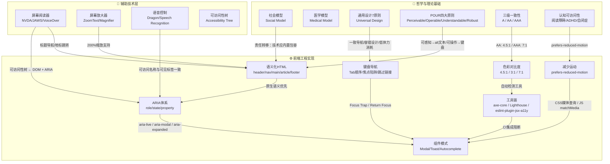
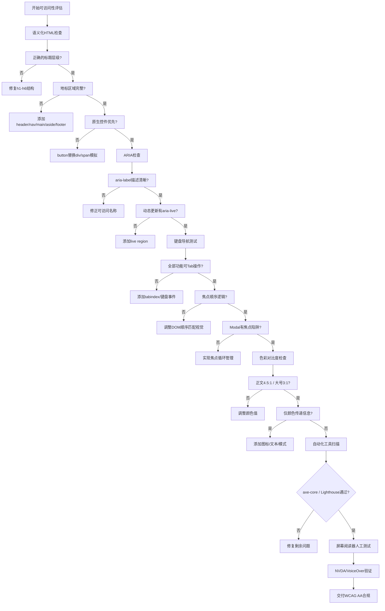

# 可访问性理论：包容式设计模型

## 引言

可访问性（Accessibility，常简写为 a11y）不是技术合规清单的勾选游戏，而是一种关于"谁有权使用技术"的伦理立场。
当一位视障用户通过屏幕阅读器浏览网页，当一位运动障碍用户仅用键盘完成在线购物，当一位认知障碍用户在无干扰的简洁界面中完成表单填写——这些场景的背后，是数十年来从"医学模型"到"社会模型"的范式转变，是 WCAG 规范从 1.0 到 2.2 的迭代演进，也是前端工程从"事后修补"到"内置设计"的方法论升级。

本章的双轨并行论述将首先澄清可访问性的哲学根基：在**理论严格表述**轨道中，我们将剖析社会模型与医学模型的根本分野，深入 WCAG 2.2 四大原则与三级一致性的标准结构，探讨辅助技术的工作原理以及认知可访问性的前沿议题；
在**工程实践映射**轨道中，我们将系统覆盖 ARIA 的角色-状态-属性体系、键盘导航的完整实现、色彩对比度的精确计算、屏幕阅读器测试方法、前端可访问性工具链，以及 Modal 焦点陷阱、Toast 实时区域、Autocomplete 组合框等核心组件模式。

---

## 理论严格表述

### 2.1 可访问性的社会模型 vs 医学模型

可访问性理论的哲学根基在于我们如何理解"障碍（disability）"。
这一理解经历了从医学模型到社会模型的深刻范式转变。

#### 2.1.1 医学模型（Medical Model）

医学模型将障碍视为个体身体或心智的**缺陷（deficiency）**，解决问题的路径是"修复"或"治愈"个体。
在这一框架下，失明是眼睛的缺陷，失聪是耳朵的缺陷，运动障碍是神经系统的缺陷。
技术的设计假设是"正常"用户，而障碍用户需要通过辅助设备去适应这个为"正常"人设计的世界。

医学模型的局限在于：**它将责任完全置于个体身上**，忽视了环境、社会结构和技术设计本身可能是障碍的真正来源。
一个轮椅使用者无法进入某栋建筑，在医学模型中这是"他无法行走"的问题；而在社会模型中，这是"建筑没有坡道"的问题。

#### 2.1.2 社会模型（Social Model）

社会模型由英国残疾人权利运动在 1980 年代提出，核心命题是：

> "障碍不是由身体的损伤造成的，而是由排斥和歧视性的社会造成的。"

在社会模型中，**障碍（disability）**与**损伤（impairment）**被严格区分：损伤是个体身体或心智的客观状态（如视力丧失），障碍是损伤与社会环境相互作用的结果。
当网页没有为屏幕阅读器提供语义化标记时，视障用户面对的障碍不是失明本身，而是**设计决策造成的信息壁垒**。

社会模型对技术设计的深远影响：

- **责任转移**：从"用户需要特殊的辅助设备"转向"技术应当内置包容性"。
- **普适设计（Universal Design）**：与其为"特殊群体"设计特殊方案，不如设计对尽可能多的人可用的单一方案。
- **情境多样性**：障碍不是二元的"有/无"，而是一个光谱——临时性障碍（手臂骨折）、情境性障碍（强光下看不清屏幕）、永久性障碍（失明）都应被纳入设计考量。

Microsoft 的 Inclusive Design 方法论将这一思想发展为三个核心原则：

1. **识别排斥（Recognize Exclusion）**：排斥产生于我们在设计时假设了"典型用户"。
2. **学习多样性（Learn from Diversity）**：边缘用户的需求往往是创新最强大的驱动力。
3. **解决一个人，扩展到许多人（Solve for One, Extend to Many）**：为永久性障碍用户设计的解决方案往往也惠及临时性和情境性障碍用户。

### 2.2 WCAG 2.2 的四大原则与三级一致性

Web Content Accessibility Guidelines（WCAG）是 W3C 发布的 Web 可访问性国际标准。
WCAG 2.2（2023 年 10 月发布）在 2.1 基础上新增了 9 条成功标准，进一步覆盖认知障碍、低视力用户和移动设备场景。

#### 2.2.1 四大原则（POUR）

WCAG 的所有成功标准都围绕四大原则组织，首字母缩写为 **POUR**：

**可感知（Perceivable）**

信息及其用户界面组件必须能够以用户可能感知的方式呈现。这意味着：

- 所有非文本内容（图片、图表、音频、视频）都必须提供文本替代（alt text、字幕、转录）。
- 颜色不能是传递信息的唯一方式（如错误提示不能只变红，还需图标或文字说明）。
- 内容必须支持用户调整（如文本大小可放大至 200% 不丢失功能，对比度可调节）。

**可操作（Operable）**

用户界面组件和导航必须可操作。这意味着：

- 所有功能必须可以通过键盘操作（无鼠标依赖）。
- 用户必须有足够的时间阅读和操作内容（无自动超时，或超时前可延长）。
- 内容不能包含已知会引发癫痫或物理反应的设计（如每秒闪烁 3 次以上的内容）。
- 必须提供导航帮助（如页面标题、焦点指示器、跳过链接）。

**可理解（Understandable）**

信息和用户界面的操作必须可理解。这意味着：

- 文本内容必须可读、可理解（避免专业术语，或提供定义）。
- 网页必须以可预测的方式出现和操作（一致的导航、一致的标识）。
- 必须帮助用户避免和纠正错误（清晰的错误提示、撤销操作）。

**健壮性（Robust）**

内容必须足够健壮，能够被各类用户代理（包括辅助技术）可靠地解析。这意味着：

- 使用有效的 HTML 语义标记（如 `button` 而非 `div` 模拟按钮）。
- 使用标准的 ARIA 角色、状态和属性，确保辅助技术可以正确解释。

#### 2.2.2 三级一致性（Conformance Levels）

WCAG 定义了三个一致性等级：**A（最低）、AA（推荐）、AAA（最高）**。

| 等级 | 性质 | 关键要求 |
|------|------|----------|
| **A** | 基础门槛 | 键盘可操作、替代文本、不依赖颜色、焦点指示器 |
| **AA** | 行业标准 | A + 对比度 4.5:1（正文）、文本可缩放 200%、一致导航 |
| **AAA** | 最高标准 | AA + 对比度 7:1（正文）、手语翻译、简化语言、上下文帮助 |

在工程实践中，**AA 级是法律合规的普遍要求**（如美国 ADA、欧盟 EAA、中国《无障碍环境建设法》）。
AAA 级往往因与品牌设计冲突（如高对比度要求）而难以全面达成，但应在关键流程（如支付、医疗）中尽可能应用。

#### 2.2.3 WCAG 2.2 新增成功标准

WCAG 2.2 引入了以下重要新增标准：

- **2.4.11 Focus Not Obscured (Minimum) - AA**：键盘焦点元素不被其他内容完全遮挡。
- **2.4.12 Focus Not Obscured (Enhanced) - AAA**：键盘焦点元素不被其他内容部分遮挡。
- **2.4.13 Focus Appearance - AAA**：焦点指示器具有明确的大小、颜色和对比度。
- **2.5.7 Dragging Movements - AA**：拖拽操作必须提供单指针替代方案（如点击+移动）。
- **2.5.8 Target Size (Minimum) - AA**：可点击目标的最小尺寸为 24×24 CSS 像素（允许间距补偿）。

### 2.3 辅助技术的工作原理

辅助技术（Assistive Technologies, AT）是用户代理（浏览器、操作系统）与残障用户之间的转换层。
理解其工作原理是前端工程师实现可访问性的前提。

#### 2.3.1 屏幕阅读器（Screen Reader）

屏幕阅读器将视觉信息转换为听觉（语音合成）或触觉（盲文显示器）输出。主流屏幕阅读器包括：

- **NVDA**（NonVisual Desktop Access）：Windows 平台免费开源，市场占有率最高。
- **JAWS**（Job Access With Speech）：Windows 平台商业软件，企业级支持最完善。
- **VoiceOver**：macOS 和 iOS 内置，与 Apple 生态深度整合。
- **TalkBack**：Android 内置屏幕阅读器。

屏幕阅读器的核心工作流程：

1. **DOM 遍历**：屏幕阅读器通过操作系统的可访问性 API（Windows 的 UI Automation / MSAA，macOS 的 NSAccessibility，Linux 的 AT-SPI）获取应用程序的可访问性树（accessibility tree）。
2. **语义解析**：浏览器将 HTML 元素映射为可访问性对象，包含角色（role）、名称（name）、状态（state）、值（value）等属性。
3. **语音合成**：屏幕阅读器将可访问性对象转换为自然语言（如"按钮，提交表单，已按下"）。
4. **导航模式**：用户通过专用快捷键（如 Tab、箭头键、字母快捷键）在可访问性树中导航，而非视觉上的空间位置。

**关键洞察**：屏幕阅读器用户不是"听整个页面"，而是**通过导航命令快速扫描页面结构**（如按 H 键跳转到下一个标题，按 D 键跳转到下一个地标区域）。因此，正确的标题层级（`h1`–`h6`）和地标（`header`、`nav`、`main`、`aside`、`footer`）是高效导航的基础。

#### 2.3.2 屏幕放大软件（Screen Magnifiers）

低视力用户（非全盲）使用屏幕放大软件（如 Windows Magnifier、ZoomText）将屏幕局部放大 2× 到 20×。这对设计的影响：

- **布局必须支持 200% 缩放**（WCAG 1.4.4），且不丢失功能或产生水平滚动条（在 1280px 宽视口上）。
- **焦点指示器必须清晰可见**，因为放大后的视野范围很小，容易丢失焦点位置。
- **弹出层必须跟随焦点**，避免放大后的视野中看不到弹出的提示或下拉菜单。

#### 2.3.3 语音控制（Voice Control）

语音控制软件（如 Dragon NaturallySpeaking、Windows Speech Recognition）允许用户通过语音命令操作界面。这对前端的要求：

- **所有交互元素必须具有可访问名称**，因为用户通过说出名称来触发命令（如"点击搜索"）。
- **可见标签（visible label）与可访问名称应一致**，避免用户看到"立即购买"但可访问名称是"submit-btn-primary"的尴尬。

### 2.4 认知可访问性

认知可访问性（Cognitive Accessibility）是 WCAG 2.2 加强关注的领域，涵盖阅读障碍（Dyslexia）、自闭症谱系（Autism Spectrum）、注意力缺陷多动障碍（ADHD）、学习障碍等广泛的认知差异。

#### 2.4.1 阅读障碍（Dyslexia）

全球约 10% 的人口存在不同程度的阅读障碍。设计支持：

- **字体选择**：无衬线体通常更易读；OpenDyslexic 等专用字体通过加重字母底部来减少镜像/旋转混淆。
- **行高与行长**：更大的行高（1.8+）和适中的行长（60–70 字符）降低视觉跳跃。
- **对齐方式**：左对齐（或 CSS `text-align: start`）优于两端对齐，因为不规则的单词间距会干扰阅读节奏。
- **颜色对比度**：过高对比度（如纯黑纯白）对阅读障碍者可能造成"河流效应"（rivers），柔和对比度（如深灰 #333 配米白 #f9f9f9）往往更易读。

#### 2.4.2 自闭症谱系与感官过载

自闭症谱系用户可能对感官输入高度敏感。设计支持：

- **减少动画**：提供 `prefers-reduced-motion` 媒体查询支持，尊重用户关闭动画的系统设置。
- **简化界面**：减少视觉噪音、广告、自动播放内容。
- **一致的导航**：不可预测的界面变化会引发焦虑。

#### 2.4.3 注意力缺陷（ADHD）

ADHD 用户难以维持持续注意力。设计支持：

- **分步流程**：将复杂表单拆分为多步，每步聚焦单一任务。
- **进度指示**：清晰的进度条帮助用户理解任务剩余量。
- **错误预防**：高风险的不可逆操作（如删除）需要确认，并提供撤销机制。

### 2.5 通用设计（Universal Design）理论

通用设计由 Ronald Mace 在 1990 年代提出，最初针对建筑环境，后扩展至数字产品。其核心思想是：

> "设计应尽可能地被所有人使用，无需专门的适应或专门的设计。"

通用设计的七项原则（及其在数字产品中的映射）：

1. **公平使用（Equitable Use）**：同一界面设计对所有用户有用，而非为"特殊用户"提供降级版本。
2. **灵活使用（Flexibility in Use）**：支持用户的不同偏好和习惯（如鼠标/键盘/语音操作）。
3. **简单直观（Simple and Intuitive）**：消除不必要的复杂性，与用户的经验和直觉匹配。
4. **可感知的信息（Perceptible Information）**：信息以多种感官通道传递（视觉、听觉、触觉）。
5. **容错设计（Tolerance for Error）**：危险操作有警告和撤销机制，错误易于恢复。
6. **低体力消耗（Low Physical Effort）**：减少重复操作和疲劳，如键盘快捷键减少鼠标移动。
7. **适宜的尺寸和空间（Size and Space for Approach and Use）**：点击目标足够大，间距足够，不依赖精确操作。

---

## 工程实践映射

### 3.1 ARIA 的角色、状态与属性

Accessible Rich Internet Applications（ARIA）是 W3C 的规范，为动态内容和复杂用户界面组件提供可访问性语义。ARIA 不修改视觉呈现，只修改**可访问性树**——即屏幕阅读器等辅助技术看到的 DOM 抽象。

#### 3.1.1 核心原则：优先使用原生 HTML

ARIA 的第一条规则是：

> "如果你能使用原生 HTML 元素实现功能，并且该元素已经具有你需要的语义和行为，那么不要使用 ARIA。"

例如：

```html
<!-- ❌ 错误：用 div 模拟按钮，需要大量 ARIA 补偿 -->
<div role="button" tabindex="0" aria-label="提交">提交</div>

<!-- ✅ 正确：原生 button 自带角色、焦点、键盘事件 -->
<button type="submit">提交</button>
```

原生 `<button>` 自动具备：

- `role="button"`（ARIA 角色）
- `tabindex="0"`（可聚焦）
- 回车和空格键激活（键盘事件）
- 禁用状态的样式和语义（`disabled` 属性）

#### 3.1.2 ARIA 角色（Roles）

角色定义了元素是什么。常用角色：

| 角色 | 用途 | 示例 |
|------|------|------|
| `role="navigation"` | 导航区域 | 等同于 `<nav>` |
| `role="main"` | 主内容区 | 等同于 `<main>` |
| `role="search"` | 搜索区域 | 无直接 HTML 等价物 |
| `role="dialog"` | 模态对话框 | 配合 `aria-modal="true"` |
| `role="tablist"` | 标签页容器 | 配合 `tab`、`tabpanel` |
| `role="alert"` | 重要警告 | 自动被屏幕阅读器朗读 |
| `role="status"` | 状态更新 | 较 `alert` 优先级低 |
| `role="img"` | 图像容器 | 用于 SVG 或背景图 |

#### 3.1.3 ARIA 状态与属性（States & Properties）

状态是随时间变化的动态属性；属性是相对静态的元数据。

**关键状态：**

```html
<!-- aria-expanded：控制内容的展开/折叠状态 -->
<button aria-expanded="false" aria-controls="menu-content">
  展开菜单
</button>
<div id="menu-content" hidden>菜单内容</div>

<!-- aria-pressed：切换按钮的按下状态 -->
<button aria-pressed="true">粗体</button>

<!-- aria-selected：选项卡或列表项的选中状态 -->
<li role="option" aria-selected="true">选项一</li>

<!-- aria-hidden：从可访问性树中移除元素 -->
<div aria-hidden="true">
  <svg><!-- 纯装饰性图标 --></svg>
</div>
```

**关键属性：**

```html
<!-- aria-label：当可见标签不存在时提供名称 -->
<button aria-label="关闭对话框">×</button>

<!-- aria-labelledby：引用另一个元素作为标签 -->
<h2 id="modal-title">确认删除</h2>
<div role="dialog" aria-labelledby="modal-title">
  您确定要删除此项目吗？
</div>

<!-- aria-describedby：提供额外描述 -->
<input
  type="password"
  aria-describedby="password-hint"
/>
<p id="password-hint">密码必须至少8位，包含字母和数字。</p>

<!-- aria-live：定义动态更新区域的播报行为 -->
<div aria-live="polite" aria-atomic="true">
  <p>购物车中有 <span id="cart-count">3</span> 件商品</p>
</div>
```

`aria-live` 的三个级别：

- `off`（默认）：更新不自动播报。
- `polite`：当前语音输出完成后播报更新，不打断用户。
- `assertive`：立即中断当前语音输出播报更新，仅用于真正紧急的信息（如表单提交错误、安全警告）。

### 3.2 键盘导航

键盘导航是可访问性的底线要求。所有交互功能必须可以通过键盘操作，且焦点顺序必须逻辑合理。

#### 3.2.1 Tab 顺序与焦点管理

默认情况下，`Tab` 键按 DOM 顺序遍历所有 `tabindex="0"` 的元素和原生可聚焦元素（链接、按钮、表单控件）。

```html
<!-- Tab 顺序示例 -->
<a href="/home">首页</a>      <!-- Tab 第1个 -->
<a href="/about">关于</a>     <!-- Tab 第2个 -->
<button>登录</button>          <!-- Tab 第3个 -->
<input type="search" />        <!-- Tab 第4个 -->
```

**陷阱**：使用 CSS `float`、`flex-direction: row-reverse`、`order` 等改变视觉顺序时，必须确保 DOM 顺序与视觉顺序一致，否则键盘用户会在混乱的顺序中导航。

#### 3.2.2 自定义 tabindex

```html
<!-- tabindex="0"：元素可聚焦，按 DOM 顺序 -->
<div tabindex="0">可聚焦的自定义组件</div>

<!-- tabindex="-1"：元素可通过 JS focus() 聚焦，但不在 Tab 序列中 -->
<div tabindex="-1" id="error-summary">错误摘要（程序聚焦）</div>

<!-- ❌ 避免： tabindex > 0 会跳到 Tab 序列前端，破坏逻辑顺序 -->
<div tabindex="5">不要这样做</div>
```

#### 3.2.3 焦点指示器（Focus Indicator）

WCAG 2.2 的 2.4.13 Focus Appearance（AAA）要求焦点指示器满足：

- 焦点区域的最小尺寸为 2 CSS 像素厚。
- 焦点指示器与相邻颜色具有至少 3:1 的对比度。

现代 CSS 实现：

```css
/* 避免 outline: none 的粗暴重置 */
:focus {
  outline: 2px solid #2563eb;
  outline-offset: 2px;
}

/* :focus-visible 只在键盘导航时显示焦点环，鼠标点击时不显示 */
:focus:not(:focus-visible) {
  outline: none;
}

:focus-visible {
  outline: 2px solid #2563eb;
  outline-offset: 2px;
  border-radius: 2px;
}
```

#### 3.2.4 跳过链接（Skip Link）

跳过链接允许键盘用户跳过重复的导航内容，直接跳到主内容区：

```html
<!-- 跳过链接：默认隐藏，聚焦时显示 -->
<a href="#main-content" class="skip-link">跳到主内容</a>

<nav><!-- 冗长的导航菜单 --></nav>

<main id="main-content" tabindex="-1">
  <!-- 主内容区 -->
</main>
```

```css
.skip-link {
  position: absolute;
  top: -40px;
  left: 0;
  background: #000;
  color: #fff;
  padding: 8px 16px;
  z-index: 100;
  transition: top 0.2s;
}

.skip-link:focus {
  top: 0;
}
```

### 3.3 色彩对比度

色彩对比度是可访问性中最容易量化、也最容易被忽视的指标。

#### 3.3.1 WCAG 对比度要求

WCAG 使用 **相对亮度（Relative Luminance）** 公式计算对比度：

```
(L1 + 0.05) / (L2 + 0.05)
```

其中 L1 和 L2 是两种颜色的相对亮度，范围从 0（纯黑）到 1（纯白）。

| 场景 | AA 级 | AAA 级 |
|------|-------|--------|
| 常规正文文本（< 18pt / < 24px） | 4.5:1 | 7:1 |
| 大号文本（≥ 18pt / ≥ 24px，或 ≥ 14pt 加粗） | 3:1 | 4.5:1 |
| 用户界面组件（边框、焦点指示器）和图形 | 3:1 | 无明确要求 |

#### 3.3.2 对比度计算工具

```javascript
// 相对亮度计算（sRGB 到线性 RGB 转换）
function getLuminance(r, g, b) {
  const [rs, gs, bs] = [r, g, b].map((c) => {
    c = c / 255;
    return c <= 0.03928 ? c / 12.92 : Math.pow((c + 0.055) / 1.055, 2.4);
  });
  return 0.2126 * rs + 0.7152 * gs + 0.0722 * bs;
}

function getContrastRatio(hex1, hex2) {
  const rgb1 = hexToRgb(hex1);
  const rgb2 = hexToRgb(hex2);
  const l1 = getLuminance(rgb1.r, rgb1.g, rgb1.b);
  const l2 = getLuminance(rgb2.r, rgb2.g, rgb2.b);
  const lighter = Math.max(l1, l2);
  const darker = Math.min(l1, l2);
  return (lighter + 0.05) / (darker + 0.05);
}

// 示例：#3b82f6（蓝色）在白色背景上的对比度
console.log(getContrastRatio("#3b82f6", "#ffffff")); // ~3.3:1 — 不满足正文 AA 级
console.log(getContrastRatio("#2563eb", "#ffffff")); // ~4.5:1 — 满足正文 AA 级
```

#### 3.3.3 仅依赖颜色的陷阱

WCAG 1.4.1 要求颜色不能是传递信息的唯一视觉手段。

```html
<!-- ❌ 错误：仅用颜色表示状态 -->
<span style="color: red">错误</span>
<span style="color: green">成功</span>

<!-- ✅ 正确：颜色 + 图标 + 文本 -->
<span style="color: #dc2626">
  <svg aria-hidden="true"><!-- 错误图标 --></svg>
  错误：请输入有效的邮箱地址
</span>
<span style="color: #16a34a">
  <svg aria-hidden="true"><!-- 成功图标 --></svg>
  成功：您的资料已更新
</span>
```

### 3.4 屏幕阅读器测试

#### 3.4.1 NVDA 测试（Windows）

NVDA 是免费开源的 Windows 屏幕阅读器，是前端可访问性测试的事实标准工具。

**核心快捷键：**

| 快捷键 | 功能 |
|--------|------|
| `Insert + Q` | 退出 NVDA |
| `Tab` / `Shift + Tab` | 在可聚焦元素间导航 |
| `H` / `Shift + H` | 跳转到下一个/上一个标题 |
| `D` / `Shift + D` | 跳转到下一个/上一个地标（landmark） |
| `F` / `Shift + F` | 跳转到下一个/上一个表单控件 |
| `T` / `Shift + T` | 跳转到下一个/上一个表格 |
| `Insert + F7` | 打开元素列表对话框 |
| `Insert + 空格` | 切换焦点/浏览模式 |

#### 3.4.2 VoiceOver 测试（macOS/iOS）

macOS 内置的 VoiceOver 快捷键：

| 快捷键 | 功能 |
|--------|------|
| `Cmd + F5` | 开启/关闭 VoiceOver |
| `Ctrl + Option + 右箭头` | 朗读下一个元素 |
| `Ctrl + Option + Cmd + H` | 跳转到下一个标题 |
| `Ctrl + Option + U` | 打开转子（Rotor）菜单，快速跳转 |

#### 3.4.3 自动化屏幕阅读器测试

`axe-core` 和 `@testing-library/jest-dom` 可以捕获大量可访问性问题，但无法完全替代人工屏幕阅读器测试。建议的测试金字塔：

1. **底层**：自动化工具捕获 60–70% 的问题（颜色对比度、缺失 alt 文本、错误 ARIA 用法）。
2. **中层**：键盘导航测试捕获 20–30% 的问题（焦点陷阱、Tab 顺序、跳过链接）。
3. **顶层**：屏幕阅读器人工测试捕获剩余 10–20% 的问题（语音输出质量、上下文语义、实际使用体验）。

### 3.5 前端可访问性工具链

#### 3.5.1 axe-core

axe-core 是 Deque Systems 开发的开源可访问性测试引擎，是 Lighthouse a11y audit 的底层引擎。

```javascript
import { axe } from "jest-axe";
import { render } from "@testing-library/react";
import MyComponent from "./MyComponent";

it("should have no accessibility violations", async () => {
  const { container } = render(<MyComponent />);
  const results = await axe(container);
  expect(results).toHaveNoViolations();
});
```

axe-core 可以检测的问题类型：

- 颜色对比度不足
- 缺失的 alt 文本
- 错误的 ARIA 用法（如 `aria-hidden="true"` 的元素包含可聚焦子元素）
- 表单控件缺少关联标签
- 页面缺少标题或语言属性
- 重复的 ID

#### 3.5.2 Lighthouse a11y audit

Chrome DevTools 的 Lighthouse 面板提供一键式可访问性审计：

1. 打开 DevTools → Lighthouse 面板。
2. 选择"Accessibility"类别。
3. 点击"Analyze page load"。

Lighthouse 会生成 0–100 分的可访问性评分，并列出通过/失败的审计项。注意：Lighthouse 只能检测自动化可访问性规则，无法评估键盘导航流畅度或屏幕阅读器体验。

#### 3.5.3 eslint-plugin-jsx-a11y

对于 React 项目，`eslint-plugin-jsx-a11y` 可以在编码阶段捕获可访问性问题：

```javascript
// .eslintrc.js
module.exports = {
  extends: ["plugin:jsx-a11y/recommended"],
  plugins: ["jsx-a11y"],
  rules: {
    "jsx-a11y/alt-text": "error",
    "jsx-a11y/anchor-is-valid": "error",
    "jsx-a11y/label-has-associated-control": "error",
    "jsx-a11y/no-autofocus": "warn",
    "jsx-a11y/click-events-have-key-events": "error",
    "jsx-a11y/no-static-element-interactions": "warn",
  },
};
```

该插件的规则示例：

| 规则 | 检测内容 |
|------|----------|
| `alt-text` | `` 必须具有 `alt` 属性 |
| `anchor-is-valid` | `<a>` 必须有 `href` 或有效的路由行为 |
| `click-events-have-key-events` | 有 `onClick` 的元素必须有对应的键盘事件 |
| `no-static-element-interactions` | 避免在 `div`、`span` 上绑定点击事件 |
| `aria-props` | 验证 ARIA 属性的有效性 |

### 3.6 可访问性组件模式

#### 3.6.1 Modal 的焦点陷阱（Focus Trap）

模态框打开时，键盘焦点必须被"困"在模态框内，不能 Tab 到背后的页面内容；关闭时，焦点应返回到触发元素。

```jsx
import { useEffect, useRef } from "react";

function Modal({ isOpen, onClose, children }) {
  const modalRef = useRef(null);
  const triggerRef = useRef(null); // 存储触发元素

  useEffect(() => {
    if (!isOpen) return;

    const modal = modalRef.current;
    const focusableElements = modal.querySelectorAll(
      'button, [href], input, select, textarea, [tabindex]:not([tabindex="-1"])'
    );
    const firstFocusable = focusableElements[0];
    const lastFocusable = focusableElements[focusableElements.length - 1];

    // 打开时将焦点移到模态框
    firstFocusable?.focus();

    const handleKeyDown = (e) => {
      if (e.key !== "Tab") return;

      if (e.shiftKey && document.activeElement === firstFocusable) {
        e.preventDefault();
        lastFocusable.focus();
      } else if (!e.shiftKey && document.activeElement === lastFocusable) {
        e.preventDefault();
        firstFocusable.focus();
      }
    };

    const handleEscape = (e) => {
      if (e.key === "Escape") onClose();
    };

    modal.addEventListener("keydown", handleKeyDown);
    document.addEventListener("keydown", handleEscape);

    return () => {
      modal.removeEventListener("keydown", handleKeyDown);
      document.removeEventListener("keydown", handleEscape);
      triggerRef.current?.focus(); // 关闭时返回焦点
    };
  }, [isOpen, onClose]);

  if (!isOpen) return null;

  return (
    <div
      ref={modalRef}
      role="dialog"
      aria-modal="true"
      aria-labelledby="modal-title"
    >
      <h2 id="modal-title">模态框标题</h2>
      {children}
      <button onClick={onClose}>关闭</button>
    </div>
  );
}
```

#### 3.6.2 Toast 的 aria-live 区域

Toast 通知需要在出现时自动被屏幕阅读器播报，但不能打断用户的当前操作。

```jsx
import { useEffect, useState } from "react";

// 全局 live region 容器，通常放在应用根部
function LiveRegion() {
  const [announcement, setAnnouncement] = useState("");

  useEffect(() => {
    if (!announcement) return;
    const timer = setTimeout(() => setAnnouncement(""), 1000);
    return () => clearTimeout(timer);
  }, [announcement]);

  return (
    <div
      aria-live="polite"
      aria-atomic="true"
      className="sr-only"
    >
      {announcement}
    </div>
  );
}

// Toast 组件
function Toast({ message, type }) {
  useEffect(() => {
    // 触发 live region 播报
    const event = new CustomEvent("announce", { detail: message });
    window.dispatchEvent(event);
  }, [message]);

  return (
    <div role="status" className={`toast toast-${type}`}>
      {type === "success" && (
        <svg aria-hidden="true"><!-- 成功图标 --></svg>
      )}
      {message}
    </div>
  );
}
```

**关键点**：

- `aria-live="polite"` 确保 Toast 不会打断用户当前的屏幕阅读器输出。
- `role="status"` 为 Toast 提供语义角色（等同于 `aria-live="polite"` + `aria-atomic="true"`）。
- 视觉图标应设置 `aria-hidden="true"`，避免屏幕阅读器重复朗读"图像，成功"。

#### 3.6.3 Autocomplete 的 Combobox 模式

Autocomplete 组件是 ARIA 设计模式中最复杂的之一，需要正确实现 `combobox`、`listbox`、`option` 的交互关系。

```jsx
function Autocomplete({ options, label }) {
  const [isOpen, setIsOpen] = useState(false);
  const [inputValue, setInputValue] = useState("");
  const [activeIndex, setActiveIndex] = useState(-1);
  const listboxId = "autocomplete-listbox";

  const filtered = options.filter((o) =>
    o.toLowerCase().includes(inputValue.toLowerCase())
  );

  const handleKeyDown = (e) => {
    switch (e.key) {
      case "ArrowDown":
        e.preventDefault();
        setIsOpen(true);
        setActiveIndex((i) => Math.min(i + 1, filtered.length - 1));
        break;
      case "ArrowUp":
        e.preventDefault();
        setActiveIndex((i) => Math.max(i - 1, 0));
        break;
      case "Enter":
        if (activeIndex >= 0) {
          setInputValue(filtered[activeIndex]);
          setIsOpen(false);
          setActiveIndex(-1);
        }
        break;
      case "Escape":
        setIsOpen(false);
        setActiveIndex(-1);
        break;
    }
  };

  return (
    <div className="autocomplete">
      <label htmlFor="autocomplete-input">{label}</label>
      <input
        id="autocomplete-input"
        type="text"
        role="combobox"
        aria-expanded={isOpen}
        aria-controls={listboxId}
        aria-activedescendant={
          activeIndex >= 0 ? `option-${activeIndex}` : undefined
        }
        value={inputValue}
        onChange={(e) => {
          setInputValue(e.target.value);
          setIsOpen(true);
          setActiveIndex(-1);
        }}
        onKeyDown={handleKeyDown}
        onBlur={() => setTimeout(() => setIsOpen(false), 200)}
        aria-autocomplete="list"
      />
      {isOpen && filtered.length > 0 && (
        <ul id={listboxId} role="listbox" className="autocomplete-list">
          {filtered.map((option, index) => (
            <li
              key={option}
              id={`option-${index}`}
              role="option"
              aria-selected={index === activeIndex}
              className={index === activeIndex ? "active" : ""}
              onMouseDown={() => {
                setInputValue(option);
                setIsOpen(false);
              }}
            >
              {option}
            </li>
          ))}
        </ul>
      )}
    </div>
  );
}
```

**ARIA 模式要点：**

- `input` 的 `role="combobox"` 声明其为组合框。
- `aria-expanded` 反映下拉列表的展开状态。
- `aria-controls` 关联输入框与列表框。
- `aria-activedescendant` 将焦点语义转移到当前高亮的选项，而不移动实际键盘焦点。
- `role="listbox"` 和 `role="option"` 为列表项提供正确的语义。
- `aria-selected` 反映当前选中项。

### 3.7 减少运动偏好

`prefers-reduced-motion` 是 CSS 媒体查询，检测用户是否在系统设置中请求减少动画。

```css
/* 默认动画 */
.modal {
  animation: slideIn 0.3s ease-out;
}

/* 尊重用户偏好 */
@media (prefers-reduced-motion: reduce) {
  .modal {
    animation: none;
    opacity: 1;
    transform: none;
  }

  *,
  *::before,
  *::after {
    animation-duration: 0.01ms !important;
    animation-iteration-count: 1 !important;
    transition-duration: 0.01ms !important;
  }
}
```

在 JavaScript 动画库中：

```javascript
const prefersReducedMotion = window.matchMedia(
  "(prefers-reduced-motion: reduce)"
).matches;

gsap.to(".modal", {
  y: prefersReducedMotion ? 0 : -50,
  opacity: 1,
  duration: prefersReducedMotion ? 0 : 0.3,
});
```

---

## Mermaid 图表

### 可访问性理论到工程实践的完整映射



### WCAG 2.2 合规性检查流程



---

## 理论要点总结

1. **可访问性的哲学根基是社会模型**：障碍不是个体的缺陷，而是社会环境与个体损伤相互作用的结果。技术设计的责任是消除环境壁垒，而非要求用户去"适应"。

2. **WCAG 的 POUR 框架是可访问性的系统结构**：可感知（替代文本、不依赖颜色）、可操作（键盘导航、充足时间）、可理解（可预测、错误预防）、健壮性（有效语义、标准 ARIA）。

3. **AA 级是法律合规的底线，AAA 级是追求卓越的方向**：正文对比度 4.5:1、文本可缩放 200%、一致的导航标识，是 AA 级的核心工程要求。

4. **屏幕阅读器用户通过结构导航，而非线性听读**：正确的标题层级（`h1`–`h6`）、地标区域（`header`、`nav`、`main`）、表单标签关联，决定了导航效率。

5. **认知可访问性是可访问性的前沿领域**：尊重 `prefers-reduced-motion`、提供简洁一致的界面、分步流程降低认知负荷，不仅惠及永久性认知障碍用户，也惠及临时性和情境性障碍场景。

6. **ARIA 是补充而非替代**：优先使用具有正确语义的原生 HTML 元素。当原生元素无法满足复杂交互需求时，ARIA 的角色、状态和属性是连接自定义组件与辅助技术的桥梁。

7. **可访问性测试需要三层金字塔**：自动化工具（axe-core、Lighthouse）捕获基础问题，键盘导航测试验证交互链路的完整性，屏幕阅读器人工测试验证真实用户体验。三者缺一不可。

8. **通用设计是终极目标**：为边缘用户设计的解决方案（如高对比度模式、语音控制、大点击目标）往往惠及更广泛的用户群体（如老年用户、驾车中的用户、手持设备的用户）。包容性设计不是成本，而是创新的驱动力。

---

## 参考资源

1. **W3C.** *Web Content Accessibility Guidelines (WCAG) 2.2*. W3C Recommendation, 5 October 2023. <https://www.w3.org/TR/WCAG22/> Web 可访问性的权威国际标准文档，系统定义了四大原则、三级一致性、成功标准及测试方法。

2. **W3C.** *Accessible Rich Internet Applications (WAI-ARIA) 1.2*. W3C Recommendation, 6 June 2023. <https://www.w3.org/TR/wai-aria-1.2/> ARIA 规范的官方文档，详细定义了角色（roles）、状态（states）和属性（properties）的语义、用法及平台映射关系。

3. **Microsoft.** *Inclusive Design Toolkit*. Microsoft Design, 2016. <https://www.microsoft.com/design/inclusive/> 微软包容性设计方法论的官方资源，包含"识别排斥、学习多样性、解决一个人扩展到许多人"三大原则及丰富的案例研究。

4. **Pickering, Heydon.** *Inclusive Components*. Heydon Works, 2018. <https://inclusive-components.design/> 可访问性组件模式的权威在线书籍，详细实现了模态框、标签页、手风琴、工具提示等核心组件的包容性设计模式。

5. **W3C.** *Cognitive Accessibility User Research*. W3C Working Group Note, 2023. <https://www.w3.org/TR/coga-user-research/> W3C 认知与学习能力障碍无障碍工作组的调研报告，系统梳理了阅读障碍、ADHD、自闭症谱系等认知差异用户的需求与设计对策。
