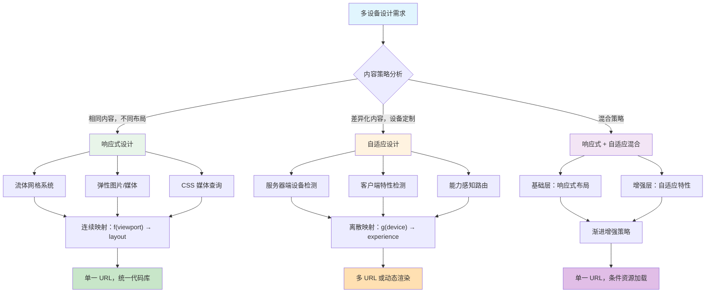
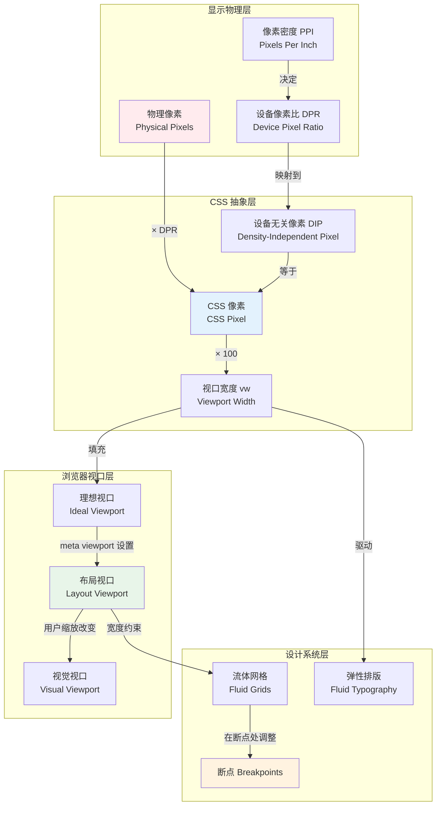
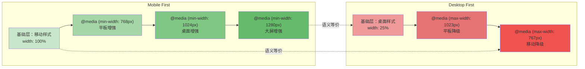

# 响应式与自适应：多设备设计理论

## 引言

2010年5月25日，Ethan Marcotte 在 A List Apart 上发表了一篇题为《Responsive Web Design》的文章，首次将建筑领域的"响应式建筑"（responsive architecture）概念引入 Web 设计领域。这篇文章不仅定义了一个时代的前端开发范式，更在深层次上挑战了当时主流的"为每个设备创建独立站点"的设计哲学。Marcotte 提出的三大技术支柱——流体网格（fluid grids）、弹性图片（flexible images）和 媒体查询（media queries）——至今仍是现代 Web 开发的基石。然而，响应式设计所蕴含的理论深度远不止于 CSS 技术层面。它涉及视觉感知的生理学基础、设备显示技术的物理原理、人机交互的认知心理学，以及统计学习在断点选择中的应用。

与此同时，自适应设计（Adaptive Design）作为另一种多设备策略，与响应式设计形成了既竞争又互补的关系。Aaron Gustafson 在《Adaptive Web Design》一书中将自适应设计定义为"渐进增强的实践应用"，强调根据设备能力而非仅仅是屏幕尺寸来提供差异化的体验。这两种设计哲学之间的张力，折射出 Web 开发中长期存在的"一个 URL 还是多个 URL"、"内容优先还是设备优先"、"统一体验还是定制体验"等根本性问题。

本文从理论严格表述与工程实践映射的双轨视角，系统梳理响应式与自适应设计的完整知识谱系。我们将从流体网格的数学基础出发，经过设备无关像素（DPR）的显示物理，到达移动优先设计哲学的认知科学根源，最终落脚于现代前端框架和工具链中的具体实现模式。通过这一系统性梳理，读者将能够在面对"是否应该使用响应式设计""断点应该设在哪里""如何处理高 DPR 屏幕的图片"等工程决策时，拥有坚实的理论依据。

## 理论严格表述

### 2.1 响应式设计的三大理论支柱

Ethan Marcotte 在 2010 年提出的响应式 Web 设计（Responsive Web Design, RWD）并非单纯的技术方案，而是一套完整的、基于 Web 本质特性的设计方法论。其核心建立在三个相互支撑的理论支柱之上：流体网格系统、弹性媒体处理和媒体查询机制。这三者的结合使得 Web 页面能够在连续变化的视口维度空间中保持布局的完整性和可读性。

#### 2.1.1 流体网格：从固定像素到比例空间

流体网格的理论基础可以追溯到比例排版（proportional typography）和模块化尺度（modular scale）的概念。在传统印刷设计中，页面布局依赖于固定物理尺寸（如毫米或英寸）和绝对单位（如点）。Web 早期也延续了这一思维，使用固定像素宽度（如 `width: 960px`）来定义布局。然而，Web 的本质特性——不知道其将被渲染在何种尺寸的屏幕上——使得固定布局在数学上是不完备的。

流体网格通过将布局维度从绝对单位转换为相对比例，解决了这一问题。其数学形式可以表述为：

```
target ÷ context = result
```

其中，`target` 是元素的目标宽度（以像素为单位），`context` 是其父容器的宽度，`result` 是百分比值。这一公式的本质是将绝对空间映射到相对空间，使得布局元素的比例关系在任意父容器宽度下保持不变。

从更严格的数学视角看，流体网格定义了一个连续映射函数 `f: ℝ⁺ → [0, 1]`，将像素空间映射到比例空间。对于一个具有最大宽度 `W_max` 的设计系统，任意元素宽度 `w` 对应的比例值为 `w / W_max`。当视口宽度 `W_viewport` 变化时，元素的实际渲染宽度为 `(w / W_max) × W_viewport`（在容器无额外约束时）。这种线性映射保持了元素间的相对比例关系，构成了响应式布局的拓扑不变性。

然而，流体网格也存在固有的数学限制。当 `W_viewport` 极端缩小或放大时，基于比例的尺寸可能导致可读性问题（如过小的文字或过度拉伸的图片）。这正是媒体查询被引入的原因——在比例空间中加入分段常数调节，以维持可用性的约束条件。

#### 2.1.2 弹性图片与内在比例

图片的响应式处理涉及一个根本性的矛盾：图片作为栅格数据，具有固定的像素维度；而响应式布局要求元素能够适应连续的尺寸变化。解决这一矛盾的理论工具是"弹性图片"（flexible images）和"内在比例"（intrinsic ratio）。

弹性图片的核心规则非常简单：`img { max-width: 100%; height: auto; }`。这行 CSS 在数学上定义了一个约束优化问题：图片的宽度被约束为不超过其容器的宽度，而高度则根据图片的内在宽高比（aspect ratio）自动调整。设图片原始尺寸为 `(W_orig, H_orig)`，容器宽度为 `W_container`，则渲染后的图片尺寸 `(W_render, H_render)` 满足：

```
W_render = min(W_orig, W_container)
H_render = W_render × (H_orig / W_orig)
```

这种处理方式保持了图片的视觉比例（宽高比），同时防止了图片溢出容器。然而，它并未解决另一个关键问题：当 `W_container` 远小于 `W_orig` 时，用户下载了远超需要的像素数据，造成了带宽浪费。这一问题后来通过 `srcset` 和 `sizes` 属性得到解决，我们将在工程实践映射部分详细讨论。

#### 2.1.3 媒体查询：连续空间的分段离散化

媒体查询（Media Queries）是 CSS3 中引入的条件机制，允许开发者根据设备特性（如视口宽度、高度、方向、分辨率等）应用不同的样式规则。从理论角度看，媒体查询实现了对连续设备参数空间的**分段离散化**（piecewise discretization）。

设设备参数空间为 `Θ = {θ₁, θ₂, ..., θₙ}`，其中每个 `θᵢ` 代表一个设备特性（如视口宽度）。媒体查询定义了一组谓词 `P₁, P₂, ..., Pₘ`，每个谓词对应一个样式规则集 `Sⱼ`。对于任意设备状态 `θ`，应用的有效样式为所有满足 `Pⱼ(θ) = true` 的规则集的并集：`S(θ) = ⋃{Sⱼ | Pⱼ(θ) = true}`。

这种分段离散化在数学上是一种**简单函数**（simple function）逼近：在复杂的连续响应函数难以直接表达时，用有限个区间上的常数函数来近似。虽然这种逼近在数学上不是最优的（傅里叶分析或样条插值可能提供更好的连续逼近），但它在工程上具有决定性的优势：可解释性、可维护性和浏览器实现的可行性。

媒体查询的理论完备性还体现在其与**特征检测**（feature detection）的区分上。媒体查询属于**声明式**的条件应用，而特征检测（如 Modernizr 提供的 JavaScript 检测）属于**命令式**的能力探测。这种区分对应于逻辑编程与命令式编程的哲学分野。

### 2.2 设备无关像素与视口理论

#### 2.2.1 设备像素比：显示物理的抽象层

现代显示设备的物理分辨率（以像素/英寸或 PPI 衡量）千差万别。早期的 Web 开发隐含假设了"CSS 像素 = 设备像素"的一一映射，这一假设在 Apple 于 2010 年推出配备 Retina 显示屏的 iPhone 4 时被彻底打破。Retina 显示屏的物理分辨率（960×640）是逻辑分辨率（480×320）的两倍，引入了**设备像素比**（Device Pixel Ratio, DPR）的概念。

DPR 的正式定义为：

```
DPR = 物理像素分辨率 / CSS 像素分辨率
```

对于 Retina 显示屏，`DPR = 2`。后续设备进一步扩展了这一比例，如 iPhone Plus 系列的 `DPR = 3`，Android 设备常见的 `DPR = 2.625` 或 `DPR = 1.75`。

从信号处理的角度看，DPR 是一个上采样因子。当 DPR > 1 时，浏览器将 CSS 像素坐标系中的内容光栅化到更高密度的物理像素网格上。如果一个图片的 CSS 尺寸为 `300px × 200px`，在 `DPR = 2` 的设备上，浏览器需要 `600 × 400` 的物理像素数据才能避免插值模糊。这就是 `@2x`、`@3x` 图片命名约定的物理基础。

DPR 的存在引入了前端开发中的一个核心张力：**分辨率独立性**（resolution independence）与**像素精度**（pixel perfection）之间的对立。矢量图形（SVG、CSS 形状、字体）天然具有分辨率独立性，可以在任意 DPR 下完美渲染。而栅格图片（位图）则必须在分辨率与带宽之间做出权衡。

#### 2.2.2 视口的层次结构：布局视口、视觉视口与理想视口

在移动浏览器的发展史上，视口（viewport）概念的演进是一个关键的理论里程碑。桌面浏览器中，视口通常等同于浏览器窗口的可见区域。但移动设备引入了三层不同的视口概念，每层对应一个不同的抽象层次：

1. **布局视口**（Layout Viewport）：CSS 布局计算所依据的虚拟画布。在移动浏览器中，布局视口的默认宽度通常为 980px（iOS Safari）或 1024px，以兼容为桌面设计的固定宽度网站。
2. **视觉视口**（Visual Viewport）：用户实际可见的物理屏幕区域。当用户缩放页面时，视觉视口变化而布局视口保持不变。
3. **理想视口**（Ideal Viewport）：与设备屏幕宽度相匹配的视口，即 `layout viewport width = device width`。这是响应式设计的基准视口状态。

这三层视口的关系可以通过 Peter-Paul Koch 提出的视口公式来描述：

```
缩放比例 = 理想视口宽度 / 视觉视口宽度
         = 布局视口宽度 / 视觉视口宽度（在默认缩放状态下）
```

`meta viewport` 标签的核心作用是将布局视口的宽度设置为理想视口的宽度，从而打破移动浏览器默认的桌面兼容模式：

```html
<meta name="viewport" content="width=device-width, initial-scale=1.0">
```

从形式语义学的角度看，这个标签是一个**上下文切换指令**（context-switching directive），它改变了 CSS 像素到物理像素的映射关系，使得响应式媒体查询能够以设备宽度为基准进行判断。

### 2.3 移动优先 vs 桌面优先：设计哲学的认知基础

#### 2.3.1 设计哲学的范式转换

"移动优先"（Mobile First）是 Luke Wroblewski 于 2009 年提出的设计策略，主张从最小的屏幕尺寸开始设计，然后逐步增加复杂性以适配更大的屏幕。与之相对的是"桌面优先"（Desktop First），即从最大屏幕开始，然后通过媒体查询削减内容以适配小屏幕。

这两种策略不仅仅是技术实现顺序的差异，它们代表了两种根本不同的设计哲学：

**移动优先 = 渐进增强**（Progressive Enhancement）：从核心内容和功能出发，根据设备能力的增加逐步添加增强层。其认知基础是"加法思维"——先确保基础体验在所有设备上可用，再为能力更强的设备提供增值体验。

**桌面优先 = 优雅降级**（Graceful Degradation）：从完整体验出发，为能力较弱的设备提供简化版本。其认知基础是"减法思维"——先构建理想体验，再处理边缘情况的兼容性。

从信息论的角度看，移动优先更接近**最大熵原理**（maximum entropy principle）的实践：在信息最少（屏幕最小、交互最受限）的约束下，优先保证核心信息传输的效率。而桌面优先则更接近**最小惊讶原则**（principle of least astonishment）的应用：先构建开发者最熟悉、功能最完整的版本。

#### 2.3.2 约束驱动创新的设计理论

移动优先之所以成为现代响应式设计的默认范式，其深层原因在于**约束驱动创新**（constraint-driven innovation）的设计理论。小屏幕的硬约束（有限的显示面积、触摸交互的粗粒度、网络带宽的不确定性）迫使设计师和开发者做出艰难的内容优先级决策。这些决策在后续扩展到大屏幕时往往被证明是普适的——因为内容的优先级层次并不随屏幕尺寸改变。

这种约束驱动的方法与**帕累托最优**（Pareto optimality）概念存在有趣的映射：在资源受限（小屏幕）时达到的内容-空间最优配置，在资源充裕（大屏幕）时仍然是有效的，尽管不再唯一最优。移动优先确保了设计系统在所有资源水平上都处于帕累托前沿上。

在 CSS 的层面上，移动优先对应于**最小断点**媒体查询策略：基础样式定义移动端样式，然后通过 `min-width` 媒体查询为更大的屏幕添加或覆盖样式。这与桌面优先的 `max-width` 策略形成对比：

```css
/* 移动优先 */
.card { padding: 1rem; }
@media (min-width: 768px) { .card { padding: 1.5rem; } }

/* 桌面优先 */
.card { padding: 1.5rem; }
@media (max-width: 767px) { .card { padding: 1rem; } }
```

从代码可维护性的角度看，移动优先通常产生更清晰的样式层叠关系，因为新增的大屏幕样式通常是添加性的而非覆盖性的。

### 2.4 断点选择的统计学基础

#### 2.4.1 断点作为设计系统的分位数

断点（Breakpoint）是响应式设计中最具争议也最缺乏系统方法的决策点。常见的断点值——`320px`、`768px`、`1024px`、`1440px`——往往源于历史惯例（iPhone 原始宽度、iPad 宽度）而非系统分析。从统计学角度看，更科学的断点选择方法应基于**设备视口宽度的分布分位数**。

假设我们收集了大量真实用户的视口宽度数据，形成样本 `X = {x₁, x₂, ..., xₙ}`。断点选择的优化问题可以表述为：寻找 `k` 个断点 `b₁ < b₂ < ... < bₖ`，使得在每个区间 `(bᵢ, bᵢ₊₁]` 内的视口宽度变异性最小化。这等价于在设备宽度分布上进行**最优分箱**（optimal binning）或**一维 k-means 聚类**。

Google 的 Material Design 和 Apple 的 Human Interface Guidelines 都在内部使用了这种数据驱动的断点选择方法。Material Design 3 定义了四个断点范围：

- **Compact**（< 600px）：手机竖屏
- **Medium**（600-839px）：大屏手机、小平板
- **Expanded**（840-1199px）：平板、小笔记本
- **Large**（≥ 1200px）：桌面显示器

这些数值并非随意选择，而是基于 Android 设备生态系统的视口宽度分布统计得出的经验分位数。

#### 2.4.2 断点命名与语义化

从软件工程的角度看，断点命名比断点数值更重要。使用语义化名称（如 `sm`、`md`、`lg`、`xl`）而非具体像素值，可以在设计系统演化时保持代码的稳定性。Tailwind CSS 的断点命名体系就是这一原则的成功实践：

```
sm: 640px   /* 小屏幕手机横屏 */
md: 768px   /* 平板竖屏 */
lg: 1024px  /* 平板横屏/小笔记本 */
xl: 1280px  /* 桌面显示器 */
2xl: 1536px /* 大屏桌面 */
```

这种命名策略的深层理论依据是**间接层**（indirection）原则：在软件设计中，通过引入命名抽象来隔离变化的实现细节。当设备生态系统的统计分布变化时，可以调整断点数值而无需修改组件代码中的断点引用。

### 2.5 自适应设计：能力感知的差异化服务

#### 2.5.1 响应式与自适应的形式化区分

响应式与自适应这两个术语在实践中经常被混用，但在理论上存在明确的区分。我们可以用形式化的方式定义两者的差异：

**响应式设计**基于**设备状态函数** `f(θ)`，其中 `θ` 是设备的可观测状态参数（主要是视口尺寸）。响应式系统的输出（渲染结果）完全由当前状态决定：`output = f(θ)`。这是一种**无记忆**的（memoryless）、**纯函数式**的映射。

**自适应设计**基于**设备能力模型** `g(C)`，其中 `C` 是设备的能力集合（包括屏幕尺寸、触摸支持、网络类型、CPU 性能、存储空间等）。自适应系统不仅考虑当前状态，还考虑能力边界和最优体验策略：`output = g(C) × h(θ)`，其中 `h(θ)` 是响应式组件。自适应设计是一种**有状态**的、**策略驱动**的映射。

在实际应用中，自适应设计常常通过以下机制实现：

- **服务器端设备检测**（Device Detection）：基于 User-Agent 字符串或客户端提示（Client Hints）在服务器端选择不同的 HTML/CSS/JS 资源。
- **特性查询**（Feature Queries）：使用 CSS 的 `@supports` 根据浏览器特性支持情况应用样式。
- **渐进增强层**：通过 `script` 标签的 `type="module"` 与 `nomodule` 属性，或 `link` 标签的 `media` 属性，提供差异化的资源加载策略。

#### 2.5.2 自适应设计的决策理论框架

自适应设计可以纳入**决策理论**（Decision Theory）的分析框架。设用户群体为 `U`，设备集合为 `D`，体验策略集合为 `S`。自适应设计的目标是找到一个策略映射 `π: D → S`，使得总体期望效用最大化：

```
π* = argmax_π Σ_{u∈U} Σ_{d∈D} P(u, d) × Utility(u, π(d))
```

其中 `P(u, d)` 是用户-设备联合分布，`Utility(u, s)` 是用户 `u` 在体验策略 `s` 下的效用函数。响应式设计是这一框架的特例：当 `S` 被限制为连续参数化族（如 `f(θ; w)`，其中 `w` 是可学习的宽度参数）时，优化问题简化为寻找最优的连续映射。

自适应设计的优势在于它可以处理响应式设计无法解决的**非连续性能力差异**。例如，一个具有电子墨水屏的设备和一个具有 OLED 屏幕的设备，即使在相同视口宽度下，也应采用完全不同的颜色策略（深色模式 vs 高对比度模式）。响应式设计无法捕捉这种差异，而自适应设计可以。

### 2.6 渐进增强与优雅降级：鲁棒性设计理论

#### 2.6.1 渐进增强的层次模型

渐进增强（Progressive Enhancement）是一种从 HTML 语义层开始，逐步叠加 CSS 表现层和 JavaScript 行为层的设计策略。其理论基础是**分层鲁棒性**（layered robustness）：每一层都以前一层为基础，当某一层失效时，系统回退到前一层仍保持可用。

这一策略可以形式化为一个三层栈：

1. **内容层**（HTML）：承载核心语义信息，在所有设备上均可访问。
2. **表现层**（CSS）：增强视觉呈现，在不支持 CSS 或 CSS 被禁用的环境中内容仍可消费。
3. **行为层**（JavaScript）：提供交互增强，在不支持 JS 的环境中核心功能仍通过表单提交等传统机制实现。

这种层次结构与计算机网络协议栈（如 TCP/IP）具有同构性：每一层都向上层提供服务，同时屏蔽下层的变化。HTML 是"物理层"，CSS 是"链路层"，JavaScript 是"传输层"，而用户的交互体验是"应用层"。

#### 2.6.2 优雅降级的风险管理

优雅降级（Graceful Degradation）与渐进增强的目标相同——在能力受限的环境中保持可用性——但实施方向相反。从风险管理的角度看，渐进增强是一种**预防性策略**（preventive strategy），在问题发生前构建冗余层；优雅降级是一种**缓解性策略**（mitigative strategy），在问题发生后提供备用方案。

在现代 Web 开发中，渐进增强已成为主流范式，这主要是因为：

1. **可维护性**：从简单到复杂的增量构建比从复杂到简单的削减更容易保证正确性。
2. **性能**：加载"基础体验 + 增量增强"通常比加载"完整体验 + 降级脚本"更高效。
3. **可访问性**：渐进增强天然与语义化 HTML 和无障碍设计（a11y）兼容。

然而，优雅降级在特定场景中仍有其价值。例如，当使用 WebGL 构建 3D 可视化时，为不支持 WebGL 的浏览器提供静态图片降级，是一种务实的工程折中。

## 工程实践映射

### 3.1 CSS 媒体查询的最佳实践

#### 3.1.1 媒体查询的现代语法

CSS 媒体查询的语法在 Media Queries Level 4 和 Level 5 规范中得到了显著增强。现代媒体查询不仅支持范围语法（range syntax），还支持自定义媒体查询和容器查询（Container Queries）。

范围语法使得媒体查询更具可读性和数学严谨性：

```css
/* 旧语法 */
@media (min-width: 768px) and (max-width: 1023px) { /* ... */ }

/* 范围语法 */
@media (768px <= width < 1024px) { /* ... */ }
```

这种语法在数学上更直接地表达了区间成员关系，减少了 `min-` 和 `max-` 前缀带来的认知负担。

容器查询是媒体查询的重要演进，它将条件判断的基准从视口（全局状态）转移到容器（局部状态）：

```css
@container (min-width: 400px) {
  .card { flex-direction: row; }
}
```

容器查询的理论意义在于它实现了响应式的**局部化**：组件可以根据其所在的容器尺寸自适应，而非全局视口尺寸。这与软件工程中"高内聚、低耦合"的原则一致。

#### 3.1.2 逻辑媒体查询与复杂条件

Media Queries Level 4 引入了逻辑操作符，支持更复杂的条件组合：

```css
/* "或" 条件 */
@media (width < 768px) or (width >= 1200px) { /* ... */ }

/* "非" 条件 */
@media not (prefers-reduced-motion: reduce) { /* ... */ }

/* "与" 条件（逗号分隔已支持） */
@media screen and (min-width: 768px) { /* ... */ }
```

这些逻辑操作符使得媒体查询能够表达更精确的设备条件集合。例如，`prefers-reduced-motion` 媒体特性是一个重要的可访问性特性，它检测用户是否在操作系统级别设置了减少动画的偏好：

```css
.animation {
  transition: transform 0.3s ease;
}

@media (prefers-reduced-motion: reduce) {
  .animation {
    transition: none;
  }
}
```

这种设计将用户的系统级偏好传播到 Web 内容层面，实现了跨应用的一致体验。

### 3.2 响应式图片工程

#### 3.2.1 `srcset` 与 `sizes`：密度描述符与宽度描述符

HTML5 引入的 `srcset` 和 `sizes` 属性为响应式图片提供了声明式的解决方案。这两者的组合使得浏览器能够在下载图片前做出最优的资源选择决策。

**密度描述符**（x-descriptor）用于处理 DPR 差异：

```html

```

在这种模式下，浏览器根据设备的 `window.devicePixelRatio` 选择对应的图片源。当 `DPR = 2` 时，浏览器下载 `photo-800.jpg` 并将其渲染到 `400px` 的 CSS 空间中，每个 CSS 像素对应 2×2 的物理像素。

**宽度描述符**（w-descriptor）更为强大，它允许浏览器根据图片在页面中的实际渲染尺寸来选择资源：

```html

```

`sizes` 属性告诉浏览器图片在不同媒体条件下的预期渲染宽度。浏览器结合 `sizes`、`srcset` 和设备 DPR，计算出最优图片源。这一过程可以形式化为：

```
所需物理像素 = sizes 计算值 × DPR
最优图片源 = argmin_{s ∈ srcset} |s.width - 所需物理像素|
```

浏览器的资源选择算法还包括网络条件（如 Data Saver 模式）和缓存状态的考量，因此上述公式是一个简化模型。

#### 3.2.2 `picture` 元素：艺术方向与格式协商

当需要在不同视口尺寸下显示完全不同的图片（而不仅仅是同一图片的不同分辨率版本）时，`<picture>` 元素提供了**艺术方向**（Art Direction）的支持：

```html
<picture>
  <source media="(min-width: 800px)" srcset="hero-wide.jpg">
  <source media="(min-width: 450px)" srcset="hero-medium.jpg">
  
</picture>
```

`<picture>` 元素还支持格式协商（format negotiation），允许浏览器选择其原生支持的最高效图片格式：

```html
<picture>
  <source type="image/avif" srcset="photo.avif">
  <source type="image/webp" srcset="photo.webp">
  
</picture>
```

这种渐进式格式策略利用了浏览器的特性检测能力，在不支持 AVIF 的浏览器上回退到 WebP 或 JPEG。

#### 3.2.3 Next.js 的图片优化

在现代 React 生态中，Next.js 的 `<Image>` 组件将响应式图片的工程实践封装为框架级别的抽象：

```jsx
import Image from 'next/image';

export default function Hero() {
  return (
    <Image
      src="/hero.jpg"
      alt="英雄图片"
      width={800}
      height={600}
      sizes="(max-width: 768px) 100vw, 50vw"
      priority
    />
  );
}
```

Next.js 的 Image 组件自动处理以下工程细节：

1. **自动生成 `srcset`**：基于提供的 `width` 和 `height`，自动生成多分辨率版本。
2. **懒加载**（Lazy Loading）：默认使用 `loading="lazy"`，仅当图片进入视口时才加载。
3. **占位符**（Placeholder）：在图片加载期间显示模糊占位符（blur-up）或纯色占位符。
4. **格式转换**：根据浏览器支持情况自动提供 WebP 或 AVIF 格式。
5. **缓存优化**：通过内部 CDN 或图片优化服务（如 Vercel Edge Network）缓存优化后的图片。

从软件架构的角度看，Next.js Image 组件是一个**策略模式**（Strategy Pattern）的实现：它将图片加载的复杂性（格式选择、分辨率选择、懒加载策略）封装在一个统一的组件接口背后，使得开发者可以专注于内容而非工程细节。

### 3.3 移动端触摸目标大小

#### 3.3.1 人机交互的最小目标尺寸

触摸交互与鼠标交互的根本区别在于输入精度。鼠标指针的精确度约为 1-2 像素，而成人手指尖的接触面积直径约为 8-10mm。这一生理约束直接转化为设计规范中的最小触摸目标尺寸。

Google Material Design 3 规定触摸目标的最小尺寸为 **48×48 密度无关像素**（density-independent pixels, dp）。Apple 的 Human Interface Guidelines 推荐的最小触摸目标尺寸为 **44×44 点**（points）。这两个数值都基于人体测量学数据，确保 95% 的用户能够准确触摸目标。

从工程实现角度，CSS 中可以通过 `min-width`、`min-height` 和 `padding` 来确保触摸目标的最小尺寸：

```css
.touch-target {
  min-width: 44px;
  min-height: 44px;
  padding: 12px;
}
```

对于视觉上较小的按钮（如图标按钮），可以通过扩大其点击区域来满足触摸目标要求，同时保持视觉设计的精致性：

```css
.icon-button {
  position: relative;
  padding: 12px;
}
.icon-button::before {
  content: '';
  position: absolute;
  inset: -8px;
}
```

这种"隐形扩展"技术在保持视觉设计意图的同时，满足了人机交互的生理约束。

### 3.4 视口元标签的工程实践

#### 3.4.1 `viewport` meta 标签的完整配置

`viewport` meta 标签是响应式设计的基石配置。一个完整的、生产级的 viewport 配置应包含以下属性：

```html
<meta name="viewport" content="width=device-width, initial-scale=1.0, viewport-fit=cover">
```

各属性的含义如下：

- `width=device-width`：将布局视口宽度设置为设备理想视口宽度。
- `initial-scale=1.0`：设置初始缩放比例为 1.0，确保 CSS 像素与设备无关像素的一一对应。
- `viewport-fit=cover`：在刘海屏（notch）设备上，将视口扩展至整个屏幕区域，允许内容延伸到安全区域之外（需配合 CSS `env(safe-area-inset-*)` 使用）。

不推荐使用的属性包括 `user-scalable=no` 和 `maximum-scale=1.0`。这些属性禁用了用户的缩放能力，违反了可访问性原则（WCAG 1.4.4 要求文本应可在 200% 范围内缩放）。

#### 3.4.2 CSS 安全区域适配

对于具有圆角屏幕、刘海或灵动岛（Dynamic Island）的设备，CSS 提供了 `env()` 函数来访问安全区域（safe area）的边距：

```css
.header {
  padding-top: env(safe-area-inset-top);
  padding-left: env(safe-area-inset-left);
  padding-right: env(safe-area-inset-right);
}

.footer {
  padding-bottom: env(safe-area-inset-bottom);
}
```

这种适配确保了重要 UI 元素不会被设备的物理特性遮挡，同时允许背景内容延伸到整个屏幕区域。

### 3.5 响应式排版

#### 3.5.1 流体排版：`clamp()`、`min()`、`max()`

CSS 的数学函数为响应式排版提供了强大的工具。`clamp()` 函数定义了一个**有界线性插值**：

```css
h1 {
  font-size: clamp(1.5rem, 4vw + 1rem, 3rem);
}
```

这行 CSS 的数学含义是：`font-size` 的值为 `4vw + 1rem`，但强制限制在 `[1.5rem, 3rem]` 区间内。当视口宽度变化时，字体大小在最小值和最大值之间平滑过渡，避免了媒体查询带来的离散跳跃。

`clamp()` 的通用形式为 `clamp(min, preferred, max)`，其中 `preferred` 通常是一个视口相对单位（`vw`、`vh`）与固定单位的线性组合。这种设计使得排版尺度可以在一定范围内"呼吸"，适应不同的视口条件。

#### 3.5.2 现代 CSS 单位的响应式策略

现代 CSS 提供了丰富的相对单位，每个单位对应不同的参考基准：

| 单位 | 参考基准 | 适用场景 |
|------|----------|----------|
| `rem` | 根元素字体大小 | 全局可缩放的尺寸 |
| `em` | 父元素字体大小 | 组件内部的相对比例 |
| `vw` | 视口宽度的 1% | 流体排版、全宽布局 |
| `vh` | 视口高度的 1% | 全屏区块、视口锁定 |
| `dvw`/`dvh` | 动态视口宽/高度 | 处理移动端地址栏显隐 |
| `ch` | 数字 0 的宽度 | 文本列宽控制 |
| `ex` | 小写字母 x 的高度 | 垂直节奏微调 |

`dvw`（dynamic viewport width）和 `dvh`（dynamic viewport height）是 CSS Values and Units Module Level 4 中引入的单位，用于解决移动端浏览器中地址栏和工具栏显隐导致的视口高度变化问题。在需要精确占据整个视口的场景中（如全屏 Hero 区块），`100dvh` 比 `100vh` 更可靠。

### 3.6 Tailwind CSS 的响应式前缀

#### 3.6.1 工具类优先的响应式策略

Tailwind CSS 将响应式设计集成到其工具类（utility class）体系中，通过**前缀修饰符**（prefix modifiers）实现了声明式的响应式样式：

```html
<div class="grid grid-cols-1 sm:grid-cols-2 md:grid-cols-3 lg:grid-cols-4 gap-4">
  <!-- 内容 -->
</div>
```

在这个例子中，`.grid-cols-1` 是基础样式（对应移动优先策略），而 `sm:`、`md:`、`lg:` 前缀分别在不同断点下覆盖或添加样式。Tailwind 的断点值默认为：

```js
// tailwind.config.js 默认断点
module.exports = {
  theme: {
    screens: {
      'sm': '640px',
      'md': '768px',
      'lg': '1024px',
      'xl': '1280px',
      '2xl': '1536px',
    },
  },
};
```

这些断点值是基于 2018-2020 年间全球设备统计数据的经验选择。对于特定项目，可以根据用户分析数据自定义断点：

```js
module.exports = {
  theme: {
    screens: {
      'tablet': '640px',
      'laptop': '1024px',
      'desktop': '1280px',
    },
  },
};
```

#### 3.6.2 任意值与容器查询

Tailwind 3.2+ 支持任意值（arbitrary values）和容器查询，进一步扩展了响应式表达能力：

```html
<!-- 任意断点 -->
<div class="min-[320px]:text-sm max-[600px]:text-xs">
  内容
</div>

<!-- 容器查询 -->
<div class="@container">
  <div class="@md:grid-cols-2 @lg:grid-cols-3">
    <!-- 内容 -->
  </div>
</div>
```

容器查询前缀 `@md:` 使得组件可以根据其所在容器而非全局视口来调整布局，这是组件驱动开发（Component-Driven Development）理念在样式层的自然延伸。

## Mermaid 图表

### 图表1：响应式与自适应设计的决策流程



### 图表2：视口层次结构与像素映射



### 图表3：移动优先与桌面优先的层叠模型



## 理论要点总结

1. **响应式设计的三大支柱**——流体网格、弹性图片和媒体查询——共同构成了一个从连续视口空间到布局状态的映射系统。流体网格提供了比例不变性，弹性图片保持了媒体内容的内在比例，媒体查询在关键断点处进行分段调节。

2. **设备像素比（DPR）**是连接 CSS 抽象像素与物理显示像素的关键参数。理解 DPR 的物理含义对于图片资源优化、SVG 与位图的选择决策以及高清屏幕的视觉保真至关重要。

3. **三层视口模型**（布局视口、视觉视口、理想视口）揭示了移动端浏览器为兼容桌面网站而引入的复杂性。`meta viewport` 标签的本质是一个上下文切换指令，将布局视口与理想视口对齐，使响应式媒体查询能够正确工作。

4. **移动优先**不仅是技术实现顺序，更是一种约束驱动创新的设计哲学。它强制在资源最受限的环境中进行内容优先级决策，这些决策在资源充裕时仍然有效，体现了帕累托最优的思想。

5. **断点选择应基于统计数据**而非设备型号。将设备视口宽度分布的分位数作为断点选择的依据，能够使设计系统覆盖最大比例的用户群体。语义化命名（`sm`、`md`、`lg`）通过间接层隔离了断点数值的演化。

6. **自适应设计与响应式设计的根本区别**在于前者基于设备能力模型，后者基于设备状态函数。自适应设计能够处理非连续的能力差异（如电子墨水屏与 OLED 屏的颜色策略），但实现复杂度更高。

7. **渐进增强**通过分层鲁棒性确保系统的可用性底线，而**优雅降级**通过风险缓解策略处理兼容性问题。现代 Web 开发中，渐进增强因其可维护性和可访问性优势已成为主流范式。

8. **响应式排版**的现代工具（`clamp()`、`min()`、`max()`、容器查询）使得排版可以在连续范围内"呼吸"，避免了传统媒体查询带来的离散跳跃，提供了更流畅的跨设备阅读体验。

## 参考资源

1. **Marcotte, E.** (2010). *Responsive Web Design*. A List Apart, No. 306. [https://alistapart.com/article/responsive-web-design/](https://alistapart.com/article/responsive-web-design/) —— 响应式 Web 设计的奠基性文章，首次系统阐述了流体网格、弹性图片和媒体查询三大技术支柱。

2. **W3C.** (2022). *CSS Media Queries Level 5*. W3C Working Draft. [https://www.w3.org/TR/mediaqueries-5/](https://www.w3.org/TR/mediaqueries-5/) —— CSS 媒体查询规范的权威定义，包含范围语法、自定义媒体查询、特性查询等最新进展。

3. **Google.** (2023). *Material Design 3: Applying Layout*. Material Design Guidelines. [https://m3.material.io/foundations/layout/applying-layout](https://m3.material.io/foundations/layout/applying-layout) —— Google Material Design 系统的布局指南，提供了基于统计数据驱动的断点选择方法和响应式网格系统规范。

4. **Apple Inc.** (2024). *Human Interface Guidelines: Layout*. Apple Developer Documentation. [https://developer.apple.com/design/human-interface-guidelines/layout](https://developer.apple.com/design/human-interface-guidelines/layout) —— Apple 人机界面指南中的布局章节，涵盖了安全区域、触摸目标尺寸、动态类型等 iOS/macOS 平台的多设备设计原则。

5. **Wroblewski, L.** (2011). *Mobile First*. A Book Apart. —— 移动优先设计策略的系统性阐述，从用户体验和商业策略角度论证了从小屏幕开始设计的价值。

6. **Gustafson, A.** (2011). *Adaptive Web Design: Crafting Rich Experiences with Progressive Enhancement*. Easy Readers. —— 自适应 Web 设计的权威著作，将渐进增强理论化为可操作的工程实践框架。

7. **Frain, B.** (2020). *Responsive Web Design with HTML5 and CSS* (3rd ed.). Packt Publishing. —— 响应式 Web 设计的综合技术参考书，涵盖了从基础媒体查询到 CSS Grid 和容器查询的现代技术栈。

8. **Koch, P.-P.** (2013). *A Tale of Two Viewports*. QuirksMode. —— Peter-Paul Koch 对视口理论的开创性解释，明确定义了布局视口、视觉视口和理想视口三层概念。

9. **W3C.** (2024). *CSS Values and Units Module Level 4*. W3C Candidate Recommendation. [https://www.w3.org/TR/css-values-4/](https://www.w3.org/TR/css-values-4/) —— CSS 值与单位规范的权威定义，包含 `clamp()`、`min()`、`max()` 等现代数学函数以及 `dvw`/`dvh` 动态视口单位。

10. **Coyier, C.** (2022). *A Complete Guide to CSS Media Queries*. CSS-Tricks. [https://css-tricks.com/a-complete-guide-to-css-media-queries/](https://css-tricks.com/a-complete-guide-to-css-media-queries/) —— CSS 媒体查询的全面实践指南，涵盖了从基础语法到高级特性（如容器查询、偏好查询）的完整技术细节。
