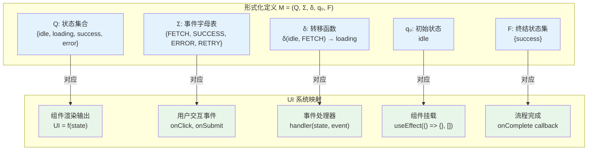
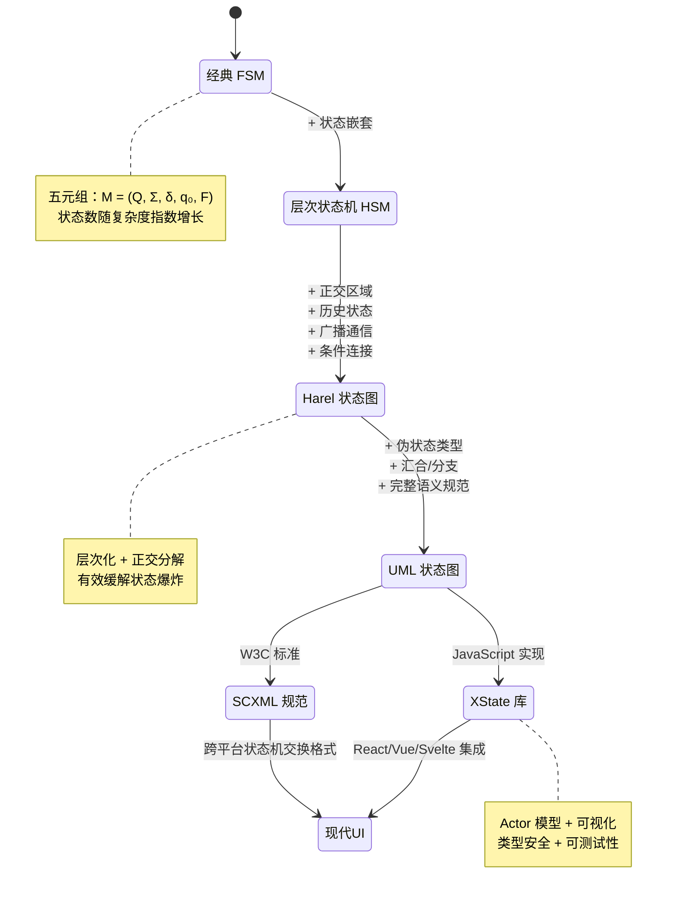
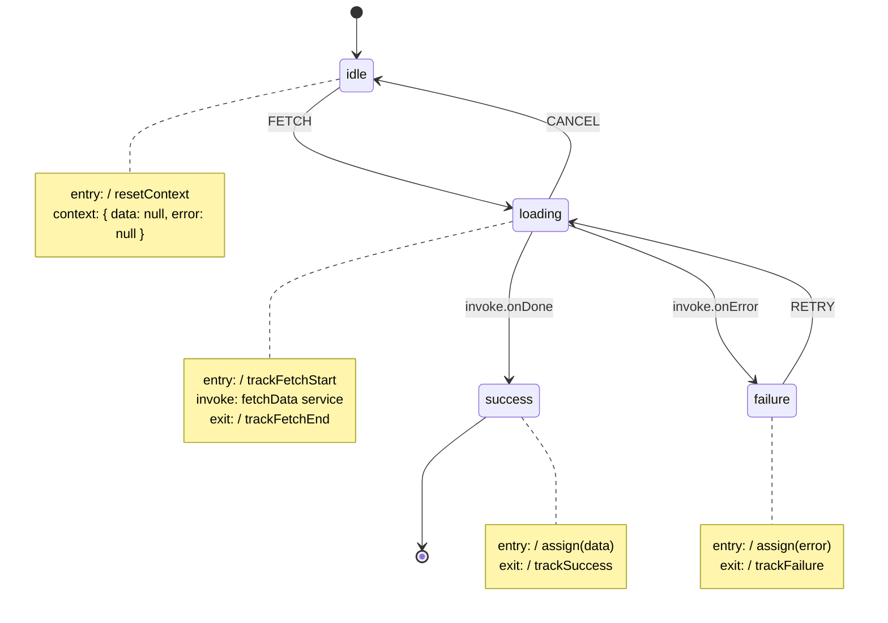
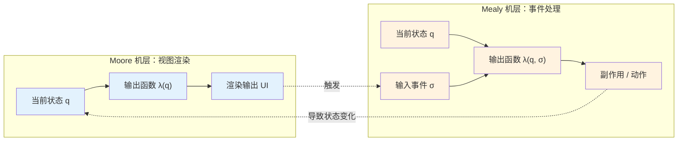

# UI状态模型：从有限状态机到状态图

## 引言

用户界面（UI）的本质是什么？从认知科学的角度看，UI 是人类意图与机器状态之间的翻译层；从计算机科学的角度看，UI 是一个离散事件系统，其输出取决于当前状态和输入事件的组合。无论采用何种框架——React、Vue、Angular 还是原生 JavaScript——所有 UI 系统都面临一个共同的核心问题：**状态管理**。当界面复杂度增长时，状态之间的隐式依赖、时序竞争和不可预测转换构成了前端开发中最棘手的错误来源。

有限状态机（Finite State Machine, FSM）作为计算理论中最古老、最成熟的形式模型之一，为 UI 状态管理提供了严格的数学基础。从 George H. Mealy 和 Edward F. Moore 在 1950 年代的开创性工作，到 David Harel 在 1987 年提出的状态图（Statecharts）理论，状态机模型经历了从简单到复杂、从理论到工程的深刻演进。今天，XState 库将状态图理论直接映射到 JavaScript 运行时，Redux 的架构设计内蕴了状态机的核心思想，而 React 的 `useReducer` Hook 本身就是 FSM 的一种轻量级实现。

然而，状态机理论在 UI 工程中的应用远非一帆风顺。状态爆炸（State Explosion）问题、并发状态的组合复杂性、历史状态的恢复语义，以及状态机与响应式编程范式之间的张力，都是现代前端架构必须面对的挑战。本文从理论严格表述与工程实践映射的双轨视角，系统梳理从有限状态机到状态图的完整知识谱系，探讨其在现代 Web 开发中的适用边界与最佳实践。

## 理论严格表述

### 2.1 有限状态机的形式化定义

#### 2.1.1 经典 FSM 的数学结构

有限状态机（Finite State Machine, FSM），又称有限自动机（Finite Automaton），是计算理论中对具有有限内部状态的离散事件系统的形式化模型。一个确定性有限状态机（Deterministic Finite State Machine, DFSM）可以严格定义为五元组：

```
M = (Q, Σ, δ, q₀, F)
```

其中各分量的含义为：

- **Q**：有限非空状态集合（`Q ≠ ∅`，`|Q| < ∞`）。在 UI 上下文中，每个状态对应界面的一种可辨识配置（如 `"idle"`、`"loading"`、`"success"`、`"error"`）。
- **Σ**：有限非空输入字母表（Alphabet），即所有可能事件的集合。在 UI 中，输入事件通常是用户操作（如 `"CLICK"`、 `"SUBMIT"`）或系统事件（如 `"FETCH_SUCCESS"`、 `"TIMEOUT"`）。
- **δ**：状态转移函数（Transition Function），`δ: Q × Σ → Q`。对于确定性 FSM，给定当前状态 `q ∈ Q` 和输入事件 `σ ∈ Σ`，下一个状态 `q' = δ(q, σ)` 是唯一确定的。
- **q₀**：初始状态（Initial State），`q₀ ∈ Q`。表示系统启动时的默认配置。
- **F**：终结状态集合（Final States / Accepting States），`F ⊆ Q`。在某些 FSM 变体中，终结状态表示任务完成或流程终止。在 UI 状态机中，终结状态的概念往往被推广为"目标状态"或"稳定状态"。

从范畴论的角度看，状态转移函数 `δ` 定义了一个**幺半群作用**（monoid action）：自由幺半群 `Σ*`（所有有限事件序列的集合）在状态集合 `Q` 上作用。对于空序列 `ε`，`δ*(q, ε) = q`；对于序列拼接，`δ*(q, σ₁σ₂) = δ(δ*(q, σ₁), σ₂)`。这种结构保证了状态机的行为是**组合性**的：复杂序列的效果可以分解为单个事件效果的顺序组合。

#### 2.1.2 非确定性有限状态机

非确定性有限状态机（Nondeterministic Finite State Machine, NFSM）放松了转移函数的确定性约束，允许 `δ: Q × Σ → P(Q)`，其中 `P(Q)` 是 `Q` 的幂集。在 UI 上下文中，非确定性可能源于并发事件的竞态条件：当用户快速连续点击两个按钮时，系统可能进入不同的后续状态，取决于事件处理的时序。

尽管 NFSM 在表达能力上与 DFSM 等价（通过子集构造法可以相互转换），但非确定性在 UI 工程中通常是需要**消除**的反模式。一个表现良好的 UI 系统应当是确定性的：给定相同的初始状态和事件序列，总是产生相同的最终状态和输出。

### 2.2 Mealy 机与 Moore 机

#### 2.2.1 输出的时序差异

经典 FSM 只定义了状态转移，没有显式建模输出。为了将 FSM 扩展为能够产生输出的转换器（Transducer），Mealy 和 Moore 分别提出了两种形式化模型，其核心差异在于**输出与状态的绑定时机**。

**Moore 机**将输出与状态绑定。一个 Moore 机定义为六元组：

```
M = (Q, Σ, Δ, δ, λ, q₀)
```

其中 `Δ` 是输出字母表，`λ: Q → Δ` 是输出函数。在 Moore 机中，输出仅取决于当前状态：`output = λ(q)`。这意味着输出在状态进入时产生，并在整个状态持续期间保持不变。

**Mealy 机**将输出与转移绑定。一个 Mealy 机同样定义为六元组：

```
M = (Q, Σ, Δ, δ, λ, q₀)
```

但输出函数的形式为 `λ: Q × Σ → Δ`。在 Mealy 机中，输出取决于当前状态和输入事件的组合：`output = λ(q, σ)`。这意味着输出在状态转移的瞬间产生。

#### 2.2.2 UI 系统中的 Mealy/Moore 映射

在 UI 工程中，Moore 机和 Mealy 机都有自然的映射：

**Moore 机映射**：React/Vue 组件的渲染输出仅取决于当前状态（props + internal state）。给定相同的状态，组件总是渲染相同的 UI。这符合 Moore 机的语义：`UI = render(state)`。Redux 架构也是 Moore 式的：store 的状态快照决定了整个应用的视图。

**Mealy 机映射**：事件处理函数（如 `onClick`、`onSubmit`）产生副作用（网络请求、路由跳转、日志记录），这些副作用取决于当前状态和触发事件的组合。一个按钮点击在 `"idle"` 状态下发起 API 请求，在 `"loading"` 状态下则可能被忽略——这是典型的 Mealy 行为：`sideEffect = handler(state, event)`。

Mealy 机和 Moore 机在表达能力上是等价的：任何 Mealy 机都可以转换为等价的 Moore 机（通过将输出信息编码到状态中），反之亦然。然而，转换可能导致状态数量的膨胀。在 UI 工程中选择 Mealy 还是 Moore 的表示方式，取决于哪个视角更自然、更易于维护。

XState 采用了 Mealy 机的输出语义：在状态转移时执行动作（actions），这些动作可以包括副作用。但 XState 也支持进入（entry）和退出（exit）动作，这些更接近 Moore 机的状态绑定输出。因此，XState 实际上是一种**混合模型**，结合了两种形式化体系的优点。

### 2.3 状态爆炸问题

#### 2.3.1 组合状态空间的指数增长

状态爆炸（State Explosion）是 FSM 在复杂系统中应用时面临的核心障碍。当系统由多个相对独立的子系统组成时，整体状态空间是各子系统状态空间的笛卡尔积：

```
|Q_total| = |Q₁| × |Q₂| × ... × |Qₙ|
```

考虑一个典型的表单提交界面：

- 网络状态：`idle`、`loading`、`success`、`error`（4 个状态）
- 表单验证状态：`valid`、`invalid`（2 个状态）
- 用户认证状态：`anonymous`、`authenticated`（2 个状态）
- 模态框状态：`closed`、`open`（2 个状态）

如果将这些状态显式组合，总状态数为 `4 × 2 × 2 × 2 = 32` 个。当增加更多的独立维度（如主题模式、通知状态、实时协作状态）时，状态数呈指数增长，迅速变得不可管理。

状态爆炸的数学本质在于：**FSM 的扁平化表示无法利用状态空间的结构性稀疏性**。在实际系统中，许多状态组合是不可能出现的（如 "loading" 与 "modal open" 可能互斥），但经典 FSM 无法显式表达这些约束。

#### 2.3.2 状态爆炸的缓解策略

从理论角度看，缓解状态爆炸主要有三种策略：

1. **正交分解**（Orthogonal Decomposition）：将状态空间分解为相互独立的子空间，各子空间的状态机并行运行。这正是 Harel 状态图中"正交区域"（orthogonal regions）的理论基础。

2. **层次抽象**（Hierarchical Abstraction）：将相关状态聚合为超状态（superstate），超状态内部的转移对外部隐藏。这减少了外部观察者需要处理的状态数。

3. **变量扩展**（Variable Extension）：用状态变量（如计数器、布尔标志）替代显式枚举状态。这在理论上将 FSM 扩展为扩展状态机（Extended State Machine）或**状态转移系统**（Transition System），其中状态不仅包括控制状态，还包括数据状态。

在 UI 工程中，这三种策略分别对应：组件化状态管理（正交分解）、嵌套路由和嵌套组件（层次抽象）、以及使用 Redux/Vuex/Pinia 等 store 中的状态变量（变量扩展）。

### 2.4 层次状态机与状态图

#### 2.4.1 Harel 状态图的形式化扩展

1987 年，David Harel 在论文《Statecharts: A Visual Formalism for Complex Systems》中提出了状态图（Statecharts）理论，系统性地扩展了经典 FSM，以解决状态爆炸和表达力不足的问题。Harel 状态图在经典 FSM 的基础上引入了五个核心扩展：

1. **层次化状态**（Hierarchy / Or-states）：状态可以嵌套。如果系统处于子状态 `S₁.₁`，则隐式地也处于父状态 `S₁`。当事件在子状态中未处理时，可以"冒泡"到父状态处理。

2. **正交区域**（Orthogonality / And-states）：状态可以被划分为多个正交区域，各区域同时活跃。系统处于状态 `S` 意味着同时处于 `S` 的所有子区域中。

3. **广播通信**（Broadcast Communication）：正交区域之间通过广播事件进行通信。一个区域发送的事件可以被其他区域接收并处理。

4. **条件连接**（Conditional Connectors）：引入选择伪状态（choice pseudostate），基于守卫条件（guard conditions）进行分支转移。

5. **历史状态**（History States）：允许系统返回上次离开复合状态时的具体子状态，而非默认初始子状态。

形式化地，Harel 状态图可以定义为扩展结构：

```
H = (Q, Σ, Δ, δ, λ, q₀, ρ, χ, η)
```

其中新增的符号为：

- **ρ**：层次结构关系，`ρ: Q → P(Q)`，定义每个状态的子状态集合。
- **χ**：正交分解函数，`χ: Q → P(P(Q))`，定义状态的区域划分。
- **η**：历史函数，`η: Q → Q ∪ {∅}`，定义复合状态的历史记忆。

#### 2.4.2 UML 状态图的语义

UML（Unified Modeling Language）状态图直接继承并扩展了 Harel 状态图的理论。UML 状态图引入了更多的伪状态（pseudostate）类型和转移语义：

- **初始伪状态**（Initial Pseudostate）：标记复合状态的默认进入点。
- **终止伪状态**（Terminate Pseudostate）：指示状态机的终止。
- **浅历史伪状态**（Shallow History）：记忆并恢复复合状态的直接子状态。
- **深历史伪状态**（Deep History）：记忆并恢复复合状态的最深层嵌套子状态。
- **汇合**（Join）与**分支**（Fork）：用于同步和并发控制。

UML 状态图的语义可以用**配置**（Configuration）概念来形式化。配置是当前活跃状态的多重集合，记为 `C ⊆ Q`。状态转移不仅是单个状态的变化，而是配置的演化：`C → C'`。这种配置语义自然地支持层次化和正交性：当进入父状态时，配置包含父状态及其默认子状态；当进入正交状态时，配置包含该状态的所有正交子区域。

在 UML 状态图中，转移可以具有守卫条件（guard）、触发事件（trigger）和动作（action），完整形式为：

```
event [guard] / action
```

这种转移语义直接映射到 XState 的 `on: { EVENT: { target: 'state', cond: 'guard', actions: 'action' } }` 配置结构。

### 2.5 Petri 网在并发 UI 中的应用

#### 2.5.1 Petri 网的基本结构

Petri 网（Petri Net）由 Carl Adam Petri 于 1962 年提出，是另一种用于建模并发系统的形式化工具。与 FSM 不同，Petri 网显式地建模了系统的**局部状态**（通过位置 places）和**状态变化**（通过变迁 transitions），并通过**令牌**（tokens）在位置间的流动来表示系统的动态行为。

一个 Petri 网定义为四元组：

```
N = (P, T, F, M₀)
```

其中：

- **P**：有限位置集合（places），表示系统的局部状态或条件。
- **T**：有限变迁集合（transitions），表示事件或操作。
- **F**：流关系（flow relation），`F ⊆ (P × T) ∪ (T × P)`，定义了位置和变迁之间的有向弧。
- **M₀**：初始标记（initial marking），`M₀: P → ℕ`，定义了每个位置中的初始令牌数。

Petri 网的执行规则（ firing rule ）为：一个变迁 `t ∈ T` 是**可触发**的，当且仅当对于所有输入位置 `p ∈ •t`（`t` 的前集），`M(p) ≥ 1`。当 `t` 触发时，从每个输入位置消耗一个令牌，向每个输出位置 `p ∈ t•`（`t` 的后集）产生一个令牌。

#### 2.5.2 并发 UI 的 Petri 网建模

Petri 网在并发 UI 建模中的独特价值在于其**天然支持并发和同步**。考虑一个需要同时加载用户资料和订单列表的仪表盘界面：

- 两个独立的 API 请求可以建模为两个并行的变迁序列。
- "加载完成"状态需要等待两个请求都成功，这可以通过一个汇合（join）结构建模：一个变迁只有在两个输入位置都有令牌时才可触发。
- 竞态条件（如用户在加载完成前点击刷新）可以通过令牌竞争来建模。

虽然 Petri 网在 UI 工程中的直接应用不如状态机广泛，但它在分析和验证并发系统性质方面具有独特优势：

- **可达性分析**（Reachability Analysis）：确定系统是否可能到达某个状态（如"死锁"）。
- **有界性分析**（Boundedness Analysis）：确定某个位置中的令牌数是否有上界（对应于 UI 中的队列长度限制）。
- **活性分析**（Liveness Analysis）：确定某个变迁是否最终能够触发（对应于 UI 中的操作是否总是可执行）。

在工程实践中，Petri 网的思想间接体现在 Promise.all、async/await 和并发状态管理库（如 Redux-Saga 的 `all` effect）的设计中。

### 2.6 状态机与响应式编程的范式张力

#### 2.6.1 两种计算模型的对比

状态机模型和响应式编程模型（Reactive Programming）代表了两种不同的计算范式，它们在 UI 开发中的融合与张力是现代前端架构的核心主题之一。

**状态机模型**是**离散事件驱动**的：系统状态在离散的时间点发生跃迁，转移由事件触发，状态变化是瞬时的。状态机的语义是**同步**的：给定状态和事件，下一个状态立即确定。

**响应式编程模型**是**连续数据流驱动**的：系统状态随时间连续演化，变化由数据流的传播触发。响应式编程的语义是**异步**的：数据变化通过订阅-通知机制传播，传播延迟和时序是非确定性的。

这两种范式在 UI 开发中都有不可替代的价值：

- **状态机适合建模控制流**：用户流程、表单生命周期、动画状态机等具有明确阶段和转移约束的场景。
- **响应式编程适合建模数据流**：表单字段的实时验证、搜索建议的自动补全、实时数据更新等数据驱动型场景。

#### 2.6.2 融合模型：响应式状态机

现代 UI 框架尝试融合这两种范式。XState 的 Actor 模型、RxJS 与状态机的结合、以及 Vue 的响应式系统与组合式 API 的协同，都是这种融合的体现。

一个"响应式状态机"可以形式化为：

```
R = (S, E, O, δ, λ, ω, s₀)
```

其中：
- **S**：状态集合
- **E**：事件集合
- **O**：可观察数据集合（observables）
- **δ**：状态转移函数
- **λ**：输出/动作函数
- **ω**：状态到观察数据的映射，`ω: S → O`
- **s₀**：初始状态

在这种模型中，状态转移仍然是离散事件驱动的，但状态可以包含响应式数据（如从服务端订阅的实时数据流）。当响应式数据变化时，它通过 `ω` 映射影响状态的输出表现，但不直接触发状态转移。状态转移仍然由显式事件驱动，保持了状态机的确定性和可预测性。

## 工程实践映射

### 3.1 XState 库在 React/Vue 中的实现

#### 3.1.1 XState 的核心架构

XState 是目前 JavaScript 生态中最完善的状态机库，由 David Khourshid 开发，实现了完整的 SCXML（State Chart XML）语义子集。XState 的核心设计哲学是：**将业务逻辑从组件中抽离，用声明式状态机定义系统的全部行为**。

XState 的状态机定义是一个纯 JavaScript 对象，包含状态、事件、转移、动作和服务的完整配置：

```js
import { createMachine, assign } from 'xstate';

const fetchMachine = createMachine({
  id: 'fetch',
  initial: 'idle',
  context: {
    data: null,
    error: null,
  },
  states: {
    idle: {
      on: {
        FETCH: 'loading',
      },
    },
    loading: {
      entry: 'trackFetchStart',
      invoke: {
        src: 'fetchData',
        onDone: {
          target: 'success',
          actions: assign({
            data: (_, event) => event.data,
          }),
        },
        onError: {
          target: 'failure',
          actions: assign({
            error: (_, event) => event.data,
          }),
        },
      },
      on: {
        CANCEL: 'idle',
      },
    },
    success: {
      entry: 'trackFetchSuccess',
    },
    failure: {
      on: {
        RETRY: 'loading',
      },
    },
  },
}, {
  actions: {
    trackFetchStart: () => console.log('Fetch started'),
    trackFetchSuccess: () => console.log('Fetch succeeded'),
  },
  services: {
    fetchData: (_, event) =>
      fetch(event.url).then(res => res.json()),
  },
});
```

这个配置定义了一个典型的数据获取状态机，包含 `idle`、`loading`、`success`、`failure` 四个状态，以及状态之间的转移规则和副作用管理。

#### 3.1.2 XState 在 React 中的集成

在 React 中，XState 通过 `@xstate/react` 包提供的 `useMachine` Hook 与组件集成：

```jsx
import { useMachine } from '@xstate/react';
import { fetchMachine } from './fetchMachine';

export default function DataFetcher({ url }) {
  const [state, send] = useMachine(fetchMachine, {
    services: {
      fetchData: () => fetch(url).then(r => r.json()),
    },
  });

  if (state.matches('idle')) {
    return <button onClick={() => send('FETCH')}>加载数据</button>;
  }

  if (state.matches('loading')) {
    return (
      <div>
        <span>加载中...</span>
        <button onClick={() => send('CANCEL')}>取消</button>
      </div>
    );
  }

  if (state.matches('success')) {
    return <DataDisplay data={state.context.data} />;
  }

  if (state.matches('failure')) {
    return (
      <div>
        <p>错误：{state.context.error.message}</p>
        <button onClick={() => send('RETRY')}>重试</button>
      </div>
    );
  }
}
```

`useMachine` 返回的 `state` 对象包含当前状态值（`state.value`）、上下文数据（`state.context`）和匹配方法（`state.matches`）。`send` 函数用于向状态机发送事件。这种模式强制实现了**穷尽性状态处理**：TypeScript 的类型系统可以确保所有状态分支都被处理，消除了隐式的 `"undefined"` 或 `"loading"` 遗漏错误。

#### 3.1.3 XState 在 Vue 中的集成

在 Vue 3 中，XState 通过 `@xstate/vue` 包提供的 `useMachine` 组合式函数集成：

```vue
<script setup>
import { useMachine } from '@xstate/vue';
import { fetchMachine } from './fetchMachine';

const props = defineProps(['url']);

const { state, send } = useMachine(fetchMachine, {
  context: { url: props.url },
});
</script>

<template>
  <div>
    <button
      v-if="state.matches('idle')"
      @click="send('FETCH')"
    >
      加载数据
    </button>

    <div v-else-if="state.matches('loading')">
      <span>加载中...</span>
      <button @click="send('CANCEL')">取消</button>
    </div>

    <DataDisplay
      v-else-if="state.matches('success')"
      :data="state.context.data"
    />

    <div v-else-if="state.matches('failure')">
      <p>错误：{{ state.context.error.message }}</p>
      <button @click="send('RETRY')">重试</button>
    </div>
  </div>
</template>
```

Vue 的 `v-if`/`v-else-if` 链天然适合状态机的穷尽性状态渲染。与 React 不同，Vue 的响应式系统会自动追踪 `state` 对象的变化并触发重新渲染，无需显式的依赖声明。

#### 3.1.4 XState 的高级特性

XState 还提供了许多高级特性，将 Harel 状态图的理论完整映射到工程实践：

**并行状态（正交区域）**：

```js
const machine = createMachine({
  type: 'parallel',
  states: {
    visual: {
      initial: 'hidden',
      states: { hidden: {}, visible: {} },
    },
    data: {
      initial: 'idle',
      states: { idle: {}, loading: {}, loaded: {} },
    },
  },
});
```

**历史状态**：

```js
const machine = createMachine({
  states: {
    active: {
      initial: 'normal',
      states: {
        normal: {},
        expanded: {},
        H: { type: 'history' },
      },
      on: { DEACTIVATE: 'inactive' },
    },
    inactive: {
      on: { ACTIVATE: 'active.H' }, // 恢复到之前的子状态
    },
  },
});
```

**Actor 模型**：XState 4.0+ 支持 Actor 模型，允许状态机实例作为独立的计算实体相互发送消息。这实现了分布式状态管理和跨组件通信，而无需全局 store：

```js
import { createMachine, interpret } from 'xstate';

const parentMachine = createMachine({
  entry: assign({
    childRef: () => spawn(childMachine, 'child'),
  }),
  on: {
    TELL_CHILD: {
      actions: send('HELLO', { to: 'child' }),
    },
  },
});
```

### 3.2 Redux 的状态机视角

#### 3.2.1 Redux 作为 Moore 机的实现

Redux 的架构设计虽然从未明确宣称自己是状态机实现，但其核心概念与 Moore 机存在深刻的同构关系：

| Redux 概念 | Moore 机概念 |
|-----------|------------|
| Store | 当前状态 `q ∈ Q` |
| Action | 输入事件 `σ ∈ Σ` |
| Reducer | 状态转移函数 `δ: Q × Σ → Q` |
| Initial State | 初始状态 `q₀` |
| Selector | 输出函数 `λ: Q → Δ` |
| Middleware | 副作用管理（外部于纯 reducer） |

Redux 的 reducer 是一个**纯函数**，接受当前状态和 action，返回新状态：`newState = reducer(state, action)`。这完全符合确定性状态转移函数 `δ(q, σ)` 的定义。Redux 的核心约束——reducer 必须是纯函数、无副作用——正是为了确保状态机的确定性：给定相同的状态和 action，总是产生相同的新状态。

#### 3.2.2 Redux 的状态机局限性

尽管 Redux 具有状态机的核心结构，但它在以下方面与完整的状态机理论存在差距：

1. **缺乏显式状态枚举**：Redux 的 state 是任意的 JavaScript 对象，没有内置的"合法状态集合"约束。开发者可以轻易地将状态设置到逻辑上不可能的组合（如 `isLoading: true` 且 `error: null` 且 `data: []`）。

2. **缺乏转移约束**：Redux 允许从任何状态通过任何 action 转移到任何其他状态（只要 reducer 能够处理）。这与状态机的核心思想——只有特定的 (state, event) 对才允许转移——相矛盾。

3. **副作用的隐性处理**：Redux 通过 middleware（如 redux-thunk、redux-saga、redux-observable）处理副作用，但这些副作用逻辑分散在 action creators 或 sagas 中，与状态定义分离，难以进行整体性的状态机可视化分析。

#### 3.2.3 Redux Toolkit 与状态机语义

Redux Toolkit（RTK）通过 `createSlice` 和 `createAsyncThunk` 提供了更接近状态机的 API：

```js
import { createSlice, createAsyncThunk } from '@reduxjs/toolkit';

const fetchUser = createAsyncThunk('user/fetch', async (userId) => {
  const response = await fetch(`/api/users/${userId}`);
  return response.json();
});

const userSlice = createSlice({
  name: 'user',
  initialState: {
    status: 'idle', // 'idle' | 'loading' | 'succeeded' | 'failed'
    data: null,
    error: null,
  },
  reducers: {
    reset: (state) => {
      state.status = 'idle';
      state.data = null;
      state.error = null;
    },
  },
  extraReducers: (builder) => {
    builder
      .addCase(fetchUser.pending, (state) => {
        state.status = 'loading';
      })
      .addCase(fetchUser.fulfilled, (state, action) => {
        state.status = 'succeeded';
        state.data = action.payload;
      })
      .addCase(fetchUser.rejected, (state, action) => {
        state.status = 'failed';
        state.error = action.error.message;
      });
  },
});
```

在这个模式中，`status` 字段充当了状态机的控制状态，而 `data` 和 `error` 充当了扩展状态（数据状态）。`createAsyncThunk` 自动将异步操作拆分为 `pending`、`fulfilled`、`rejected` 三个状态，这实际上是一种约定俗成的状态机模式。然而，这种实现仍然是**隐式**的状态机——状态约束和转移规则散布在代码中，而非集中声明。

### 3.3 React 的 `useReducer` 作为有限状态机

#### 3.3.1 `useReducer` 的状态机本质

React 的 `useReducer` Hook 是 FSM 在组件级别的最直接实现。其签名 `const [state, dispatch] = useReducer(reducer, initialState)` 与状态机的五元组存在精确对应：

```
useReducer(reducer, initialState)
        ↓              ↓
        δ              q₀
```

`dispatch(action)` 对应于输入事件 `σ`，`reducer(state, action)` 对应于状态转移函数 `δ`，返回的 `state` 是当前状态 `q`。

一个简单的计数器状态机：

```js
const initialState = { count: 0, status: 'idle' };

function counterReducer(state, action) {
  switch (action.type) {
    case 'INCREMENT':
      if (state.status !== 'locked') {
        return { ...state, count: state.count + 1 };
      }
      return state;
    case 'DECREMENT':
      if (state.status !== 'locked' && state.count > 0) {
        return { ...state, count: state.count - 1 };
      }
      return state;
    case 'LOCK':
      return { ...state, status: 'locked' };
    case 'UNLOCK':
      return { ...state, status: 'idle' };
    default:
      return state;
  }
}

function Counter() {
  const [state, dispatch] = useReducer(counterReducer, initialState);

  return (
    <div>
      <p>Count: {state.count} (Status: {state.status})</p>
      <button onClick={() => dispatch({ type: 'INCREMENT' })}>+</button>
      <button onClick={() => dispatch({ type: 'DECREMENT' })}>-</button>
      <button onClick={() => dispatch({ type: 'LOCK' })}>Lock</button>
      <button onClick={() => dispatch({ type: 'UNLOCK' })}>Unlock</button>
    </div>
  );
}
```

这个例子中的 `status` 字段引入了控制状态的概念，`count` 是数据状态。守卫条件（如 `state.status !== 'locked'`）在 reducer 中通过 `if` 语句实现。然而，这种实现方式缺乏状态机的**可视化**和**可验证性**——状态转移图存在于开发者的头脑中，而非代码的显式结构中。

#### 3.3.2 从 `useReducer` 到 XState 的演进路径

当组件的状态复杂度增长时，`useReducer` 模式可以平滑地演进为 XState：

1. **阶段1**：简单的 `useState` 管理独立状态变量。
2. **阶段2**：`useReducer` 管理相关状态的组合和转移约束。
3. **阶段3**：将 reducer 逻辑提取为 XState 状态机，获得可视化、测试和类型安全的能力。
4. **阶段4**：使用 XState 的 Actor 模型实现跨组件状态共享，替代全局 Redux store。

这一演进路径的核心洞察是：**状态管理的复杂度存在一个阈值，超过该阈值后，显式状态机模型的收益超过其引入的学习成本和样板代码成本**。

### 3.4 UI 组件的状态模式

#### 3.4.1 组件状态模式的分类

UI 组件的状态可以依据其来源和作用域进行分类，这种分类对应于状态机理论中的不同抽象层次：

| 状态类型 | 来源 | 作用域 | 状态机映射 |
|---------|------|--------|-----------|
| 本地 UI 状态 | 用户交互 | 组件内部 | 组件级 FSM |
| 远程数据状态 | API 响应 | 组件/页面 | 异步状态机 |
| 全局共享状态 | 用户会话/应用逻辑 | 应用级 | 分布式状态机 |
| URL 状态 | 路由 | 页面级 | 导航状态机 |
| 表单状态 | 用户输入 | 表单组件 | 表单状态机 |

每种状态类型都适合用不同粒度的状态机来建模。本地 UI 状态通常可以用简单的 `useState` 或 `useReducer` 管理；远程数据状态适合用 XState 或 RTK Query 的显式状态机；全局共享状态在复杂应用中可能需要状态图或 Actor 模型；URL 状态天然对应于导航状态机（如 Vue Router 或 React Router 的路由配置）。

#### 3.4.2 复合组件模式与状态封装

复合组件（Compound Components）模式是一种将状态机封装在组件层级内部的设计模式。典型例子是 Tabs 组件：

```jsx
function Tabs({ children, defaultIndex = 0 }) {
  const [activeIndex, setActiveIndex] = useState(defaultIndex);

  return (
    <TabsContext.Provider value={{ activeIndex, setActiveIndex }}>
      {children}
    </TabsContext.Provider>
  );
}

function TabList({ children }) {
  return <div role="tablist">{children}</div>;
}

function Tab({ index, children }) {
  const { activeIndex, setActiveIndex } = useContext(TabsContext);
  const isActive = index === activeIndex;

  return (
    <button
      role="tab"
      aria-selected={isActive}
      onClick={() => setActiveIndex(index)}
    >
      {children}
    </button>
  );
}

function TabPanel({ index, children }) {
  const { activeIndex } = useContext(TabsContext);
  if (index !== activeIndex) return null;
  return <div role="tabpanel">{children}</div>;
}
```

在这个模式中，`Tabs` 组件封装了一个简单的状态机（当前激活的标签索引），并通过 React Context 将状态和控制函数分发给子组件。这种封装遵循了**信息隐藏**原则：外部使用者不需要知道内部状态机的存在，只需通过声明式的组件组合来表达意图。

### 3.5 多步骤表单的状态机建模

#### 3.5.1 向导式表单的显式状态机

多步骤表单（Wizard / Stepper）是状态机在 UI 中最直观的应用之一。每个步骤对应状态机的一个状态，步骤间的导航对应状态转移：

```js
const wizardMachine = createMachine({
  id: 'wizard',
  initial: 'personalInfo',
  states: {
    personalInfo: {
      on: {
        NEXT: {
          target: 'address',
          cond: 'isPersonalInfoValid',
        },
      },
    },
    address: {
      on: {
        PREV: 'personalInfo',
        NEXT: {
          target: 'payment',
          cond: 'isAddressValid',
        },
      },
    },
    payment: {
      on: {
        PREV: 'address',
        NEXT: {
          target: 'review',
          cond: 'isPaymentValid',
        },
      },
    },
    review: {
      on: {
        PREV: 'payment',
        SUBMIT: 'submitting',
      },
    },
    submitting: {
      invoke: {
        src: 'submitForm',
        onDone: 'success',
        onError: {
          target: 'review',
          actions: 'showError',
        },
      },
    },
    success: {
      type: 'final',
    },
  },
}, {
  guards: {
    isPersonalInfoValid: (ctx) => ctx.personalInfo.name && ctx.personalInfo.email,
    isAddressValid: (ctx) => ctx.address.city && ctx.address.street,
    isPaymentValid: (ctx) => ctx.payment.cardNumber?.length === 16,
  },
});
```

这个状态机明确编码了以下业务规则：

1. **顺序约束**：必须按 `personalInfo → address → payment → review` 的顺序进行。
2. **验证守卫**：每个 `NEXT` 转移都有守卫条件，确保只有当前步骤的数据有效时才能前进。
3. **错误恢复**：提交失败时返回 `review` 步骤，而非初始步骤，保留用户已输入的数据。
4. **终结状态**：`success` 是终结状态，表示流程完成。

#### 3.5.2 表单状态机的可访问性集成

状态机模型天然适合集成可访问性（Accessibility）需求。例如，步骤切换时的焦点管理可以通过状态机的 `entry` 动作实现：

```js
const accessibleWizardMachine = wizardMachine.withConfig({
  actions: {
    focusHeading: () => {
      const heading = document.querySelector('[role="main"] h2');
      heading?.focus();
    },
    announceStep: (ctx, event, { state }) => {
      const liveRegion = document.getElementById('step-announcer');
      if (liveRegion) {
        liveRegion.textContent = `进入步骤：${state.value}`;
      }
    },
  },
});
```

通过将焦点管理和屏幕阅读器播报绑定到状态进入动作，确保了状态变化对所有用户都是可感知的。

### 3.6 UI 动画的状态机

#### 3.6.1 动画作为状态转移的视觉化

UI 动画在理论上是状态转移的**视觉化表达**。当系统从一个状态转移到另一个状态时，动画提供了关于"发生了什么"的连续视觉反馈，减少了用户的认知负荷。

从状态机的角度看，动画可以建模为**转移的持续时间**：经典 FSM 假设状态转移是瞬时的（零时间），而动画状态机引入了**时间维度**，将转移扩展为一个持续过程：

```
(q, σ) → [动画过程，持续 t 毫秒] → q'
```

在这个过程中，系统处于一个**瞬态**（transient state）——它既不是源状态也不是目标状态，而是转移的中间表现。严格的动画状态机需要处理瞬态的语义：在动画期间接收到新事件时，系统应如何处理？

#### 3.6.2 使用 XState 建模动画状态

XState 通过 `after` 延迟转移和 `invoke` 服务提供了动画状态机的建模能力：

```js
const modalMachine = createMachine({
  id: 'modal',
  initial: 'closed',
  states: {
    closed: {
      on: { OPEN: 'opening' },
    },
    opening: {
      entry: 'animateIn',
      after: {
        300: 'open',
      },
      on: { CLOSE: 'closing' },
    },
    open: {
      on: { CLOSE: 'closing' },
    },
    closing: {
      entry: 'animateOut',
      after: {
        300: 'closed',
      },
      on: { OPEN: 'opening' },
    },
  },
});
```

在这个模型中，`opening` 和 `closing` 是显式的动画状态。`after: { 300: 'open' }` 表示在 300 毫秒后自动转移到 `open` 状态。如果在 `opening` 期间接收到 `CLOSE` 事件，状态机立即转移到 `closing`，实现了动画的中断和反向。

这种显式建模相比于 CSS 过渡或纯 JS 动画库的优势在于：

1. **可预测性**：所有动画状态和转移都是显式声明的，不存在隐式的时序依赖。
2. **可中断性**：动画状态是完整的状态机状态，可以被事件中断并进入新的状态。
3. **可测试性**：可以单元测试动画状态序列，验证在特定事件序列下系统是否经历了正确的动画状态。

#### 3.6.3 Framer Motion 与状态机的协同

Framer Motion 是 React 生态中流行的动画库，它通过 `AnimatePresence` 和 `motion` 组件提供了声明式动画 API。当与 XState 结合使用时，可以实现动画状态机的完整表达：

```jsx
import { motion, AnimatePresence } from 'framer-motion';
import { useMachine } from '@xstate/react';
import { modalMachine } from './modalMachine';

export default function Modal() {
  const [state, send] = useMachine(modalMachine);

  return (
    <AnimatePresence>
      {(state.matches('opening') || state.matches('open')) && (
        <motion.div
          initial={{ opacity: 0, scale: 0.9 }}
          animate={{ opacity: 1, scale: 1 }}
          exit={{ opacity: 0, scale: 0.9 }}
          transition={{ duration: 0.3 }}
          onAnimationComplete={() => {
            if (state.matches('opening')) send('ANIMATION_DONE');
          }}
        >
          <h2>模态框内容</h2>
          <button onClick={() => send('CLOSE')}>关闭</button>
        </motion.div>
      )}
    </AnimatePresence>
  );
}
```

在这个模式中，XState 负责管理**控制状态**（何时显示/隐藏模态框），Framer Motion 负责管理**表现状态**（显示/隐藏的视觉过渡）。两者的职责边界清晰，形成了控制与表现的分离。

### 3.7 Immer vs XState vs Redux：范式对比

#### 3.7.1 三种状态管理范式的核心差异

在现代 JavaScript 生态中，Immer、XState 和 Redux 代表了三种不同的状态管理范式。理解它们的核心差异有助于在特定场景下做出正确的技术选择。

| 维度 | Immer | XState | Redux (RTK) |
|------|-------|--------|-------------|
| **核心抽象** | 不可变数据代理 | 显式状态机 | 全局 store + reducer |
| **状态模型** | 任意数据结构 | 状态 + 上下文 | 任意对象树 |
| **状态变更** | 可变 draft → 不可变快照 | 事件驱动转移 | Action → Reducer |
| **转移约束** | 无 | 显式（状态×事件映射） | 隐式（reducer 逻辑） |
| **副作用管理** | 外部处理 | 内置 invoke/services | Middleware (thunk/saga) |
| **可视化** | 无 | Statechart 可视化 | DevTools 时间旅行 |
| **类型安全** | 良好 | 优秀 | 良好 |
| **学习曲线** | 低 | 中高 | 中 |
| **适用场景** | 复杂不可变更新 | 复杂交互流程 | 全局状态共享 |

#### 3.7.2 选择决策框架

基于上述对比，可以建立一个选择决策框架：

**选择 Immer 当**：
- 状态结构复杂，深度嵌套的对象更新频繁。
- 需要保持 Redux/Vuex/Pinia 等现有架构，仅简化不可变更新逻辑。
- 团队对状态机概念不熟悉，学习成本敏感。

**选择 XState 当**：
- UI 具有复杂的交互流程（多步骤表单、复杂的模态框状态、实时协作编辑）。
- 状态转移需要严格的业务规则约束（守卫条件、顺序限制）。
- 需要与利益相关者（产品经理、设计师）共享状态模型（通过可视化状态图）。
- 系统需要形式化验证或详尽的单元测试覆盖。

**选择 Redux (RTK) 当**：
- 应用具有大量全局共享状态，多个不相关组件需要访问相同数据。
- 团队已有 Redux 生态的投资（中间件、开发工具、最佳实践）。
- 状态更新主要是数据 CRUD 操作，而非复杂的控制流。

#### 3.7.3 混合架构实践

在大型应用中，这三种范式并非互斥，而是可以形成互补的混合架构：

```
应用层级架构：
├── 全局数据层：Redux (RTK) 管理远程数据缓存和全局共享状态
├── 页面/特性层：XState 管理复杂交互流程和局部状态机
└── 组件层：Immer（通过 RTK 内置）处理组件内的复杂不可变更新
```

这种分层架构遵循了**关注点分离**原则：Redux 负责"什么数据"，XState 负责"何时转移"，Immer 负责"如何更新"。各层通过清晰的接口边界协作，避免了状态管理风格的碎片化。

## Mermaid 图表

### 图表1：有限状态机的形式化结构与 UI 映射



### 图表2：从经典 FSM 到 Harel 状态图的演进



### 图表3：数据获取状态机的 XState 实现与状态序列



### 图表4：Mealy 机与 Moore 机在 UI 中的并行存在



## 理论要点总结

1. **有限状态机的五元组结构**（`Q, Σ, δ, q₀, F`）为 UI 状态管理提供了严格的形式化基础。确定性 FSM 的可预测性和可验证性使其成为复杂交互系统的理想建模工具。

2. **Mealy 机与 Moore 机**代表了输出的两种绑定策略：Mealy 机的输出绑定于转移（适合副作用处理），Moore 机的输出绑定于状态（适合视图渲染）。现代 UI 系统通常是两种模型的混合体。

3. **状态爆炸**是 FSM 在复杂系统中的核心障碍，其数学本质是笛卡尔积导致的指数增长。缓解策略包括正交分解（XState 的并行状态）、层次抽象（嵌套状态）和变量扩展（扩展状态机）。

4. **Harel 状态图**通过层次化、正交区域、广播通信、条件连接和历史状态五个扩展，将经典 FSM 提升为可建模复杂系统的视觉形式化工具。UML 状态图继承并扩展了这一理论。

5. **Petri 网**在并发 UI 建模中具有独特价值，其位置-变迁结构和令牌流动机制天然支持并发、同步和竞态条件分析。虽然在前端工程中应用较少，但其思想体现在 Promise.all、async/await 和并发状态管理库中。

6. **状态机与响应式编程**代表了离散事件驱动和连续数据流驱动两种计算范式。现代 UI 框架通过"响应式状态机"融合两种范式：状态转移由事件驱动保持确定性，状态数据可以包含响应式流。

7. **XState 是状态图理论的完整工程实现**，其 Actor 模型、状态可视化、类型安全和测试工具链使其成为复杂 UI 状态管理的首选方案。Redux 是 Moore 机的隐式实现，RTK 通过 `createAsyncThunk` 引入了显式状态机语义。

8. **React 的 `useReducer`** 是组件级 FSM 的最轻量实现，适合中等复杂度的局部状态管理。当状态复杂度超过阈值时，演进为 XState 可以获得可视化、可验证性和跨组件通信的能力。

9. **UI 动画是状态转移的视觉化表达**，显式建模动画状态（如 `opening`、`closing`）可以实现可预测、可中断和可测试的动画系统。XState 与 Framer Motion 的协同实现了控制状态与表现状态的清晰分离。

10. **Immer、XState 和 Redux 的选择**应基于场景特征：Immer 适合复杂不可变数据更新，XState 适合复杂交互流程，Redux 适合全局状态共享。大型应用可以采用分层混合架构，各层负责不同抽象层次的状态管理。

## 参考资源

1. **Harel, D.** (1987). Statecharts: A Visual Formalism for Complex Systems. *Science of Computer Programming*, 8(3), 231-274. [https://www.inf.ed.ac.uk/teaching/courses/seoc/2005_2006/resources/statecharts.pdf](https://www.inf.ed.ac.uk/teaching/courses/seoc/2005_2006/resources/statecharts.pdf) —— 状态图理论的奠基论文，提出了层次化、正交区域、历史状态等核心扩展，将经典 FSM 提升为可建模复杂系统的视觉形式化工具。

2. **Khourshid, D.** (2021). *XState: The Future of State Management*. CSS-Tricks. [https://css-tricks.com/xstate-the-future-of-state-management/](https://css-tricks.com/xstate-the-future-of-state-management/) —— XState 创始人 David Khourshid 对状态机在 UI 工程中应用的系统性阐述，涵盖了从理论到实践的完整链路。

3. **Mealy, G. H.** (1955). A Method for Synthesizing Sequential Circuits. *Bell System Technical Journal*, 34(5), 1045-1079. —— Mealy 机的原始论文，定义了输出绑定于转移的状态机模型，为 UI 事件处理系统的形式化分析提供了理论基础。

4. **Moore, E. F.** (1956). Gedanken-Experiments on Sequential Machines. *Automata Studies*, Annals of Mathematics Studies, No. 34, 129-153. Princeton University Press. —— Moore 机的原始论文，定义了输出绑定于状态的状态机模型，与 React 的"UI 是状态的函数"范式存在深刻对应。

5. **Khourshid, D.** (2023). *Building Accessible Components with State Machines*. Web Directions. [https://www.youtube.com/watch?v=9iNGvXbMDtI](https://www.youtube.com/watch?v=9iNGvXbMDtI) —— 探讨状态机与可访问性（A11y）的天然契合关系，包括焦点管理、ARIA 状态同步和屏幕阅读器支持。

6. **W3C.** (2015). *SCXML: State Chart XML Markup Language*. W3C Recommendation. [https://www.w3.org/TR/scxml/](https://www.w3.org/TR/scxml/) —— 状态图的 XML 标准表示，XState 的语义设计兼容 SCXML 规范，确保了跨平台和跨语言的状态机互操作性。

7. **OMG.** (2017). *OMG Unified Modeling Language Specification, Version 2.5.1*. Object Management Group. [https://www.omg.org/spec/UML/2.5.1](https://www.omg.org/spec/UML/2.5.1) —— UML 规范中关于状态图（State Machine Diagrams）的完整语义定义，包括伪状态类型、转移语义和并发控制。

8. **Petri, C. A.** (1962). *Kommunikation mit Automaten*. Ph.D. Thesis, University of Bonn. —— Petri 网的原始论文，提出了位置-变迁网络模型，为并发系统的分析和验证提供了形式化工具。

9. **Khourshid, D.** (2022). *The Actor Model in XState*. Stately Blog. [https://stately.ai/blog/introducing-actors](https://stately.ai/blog/introducing-actors) —— XState 4.0+ Actor 模型的详细介绍，探讨了状态机实例作为独立计算实体进行分布式状态管理的设计哲学。

10. **Redux Team.** (2023). *Redux Style Guide*. Redux Documentation. [https://redux.js.org/style-guide/](https://redux.js.org/style-guide/) —— Redux 官方风格指南，其中"将状态视为最小化表示"和"使用 Redux Toolkit"等最佳实践与状态机的最小状态原则相契合。

11. **React Team.** (2024). *useReducer*. React Documentation. [https://react.dev/reference/react/useReducer](https://react.dev/reference/react/useReducer) —— React 官方文档对 `useReducer` 的详细说明，将其定位为"组件中的状态机"实现方式。

12. **Murata, T.** (1989). Petri Nets: Properties, Analysis and Applications. *Proceedings of the IEEE*, 77(4), 541-580. —— Petri 网理论的综合综述，涵盖了可达性、有界性、活性和覆盖性等分析技术，为并发 UI 系统的形式化验证提供了方法论基础。
