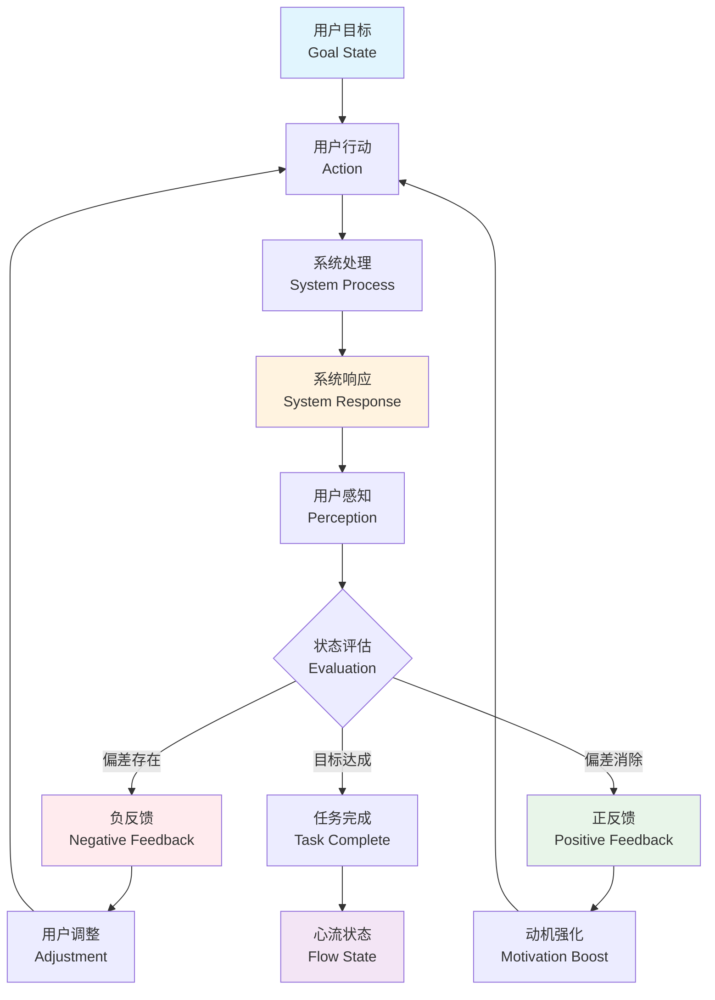
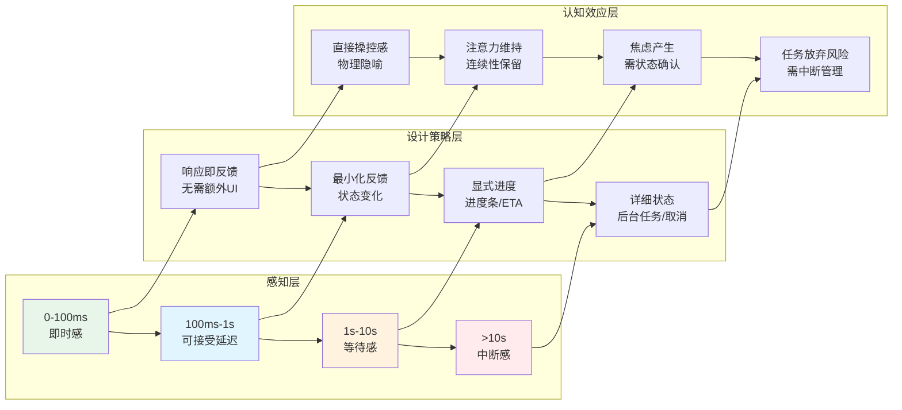
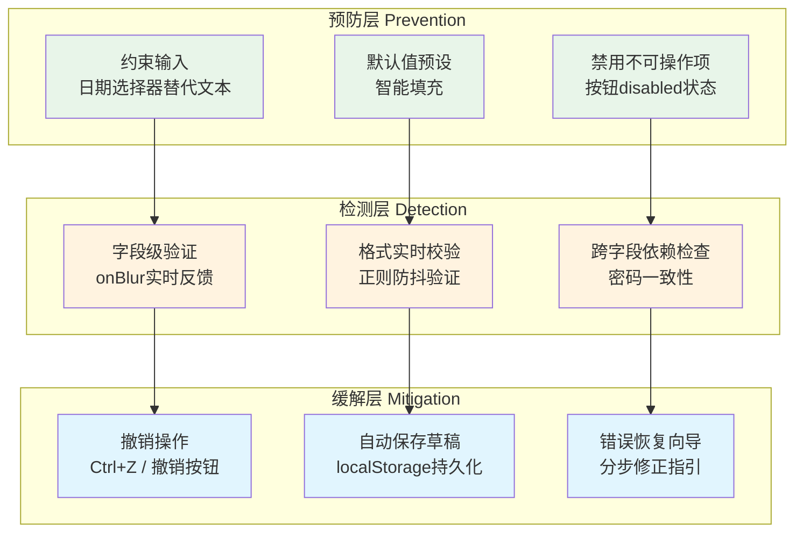

# 反馈循环：用户体验的认知闭环

## 引言

在数字界面中，用户的每一次点击、滑动、输入都构成了一个微小的行动链条。
这个链条能否顺畅运转，取决于系统是否能够在恰当的时机、以恰当的形式向用户传递恰当的信息——这就是**反馈（Feedback）**的核心命题。
反馈不仅是界面美学层面的点缀，更是认知科学、控制论与工程学交叉领域的关键概念。
从诺曼（Donald Norman）所强调的"可见性"原则，到维纳（Norbert Wiener）控制论中的信息闭环，再到契克森米哈伊（Mihaly Csikszentmihalyi）心流理论中的即时反馈条件，反馈机制始终是连接人类认知系统与数字系统的桥梁。

本文从**控制论的反馈循环模型**出发，将其映射到现代Web应用的前端工程实践中。
我们将剖析正反馈与负反馈在UX设计中的差异化应用，探讨即时反馈与延迟反馈的心理学边界，分析渐进式披露（Progressive Disclosure）作为信息反馈的策略性工具，并深入研究错误预防与恢复机制（Poka-Yoke）在软件界面中的工程实现。
最终，本文将论证：**优秀的反馈设计不是对系统状态的被动呈现，而是对用户认知模型的主动引导与校准**。

---

## 理论严格表述

### 控制论中的反馈循环：从维纳到Ashby

反馈（Feedback）一词源于控制论（Cybernetics），由诺伯特·维纳（Norbert Wiener）在1948年的著作《Cybernetics: Or Control and Communication in the Animal and the Machine》中系统阐述。
控制论研究的是**动态系统中的信息流动与调节机制**，其核心命题是：系统如何通过信息回路的闭环结构维持稳定或实现特定目标。

在控制论框架中，反馈循环（Feedback Loop）由以下要素构成：

1. **传感器（Sensor）**：感知系统当前状态的机制
2. **比较器（Comparator）**：将当前状态与目标状态进行比对
3. **执行器（Actuator）**：根据偏差值产生调节动作
4. **被控对象（Plant/Process）**：接受调节并改变状态的系统主体

维纳指出，反馈的本质是"**将系统输出的信息回传至输入端，以影响后续的输出行为**"。
这一机制既可以出现在恒温器调节室温的物理系统中，也可以出现在人类操作计算机界面的认知系统中。
W. Ross Ashby在《An Introduction to Cybernetics》中进一步将反馈区分为两种基本类型：

- **负反馈（Negative Feedback）**：反馈信号的作用是**减弱**系统的偏差，使系统趋向稳定状态。负反馈是维持系统稳态（Homeostasis）的核心机制。在用户体验中，表单验证提示、错误消息、加载状态指示器均属于负反馈——它们告知用户当前状态与预期目标之间的差距，引导用户进行修正性操作。

- **正反馈（Positive Feedback）**：反馈信号的作用是**放大**系统的偏差，使系统远离原有状态、趋向新的稳态或进入持续增长/衰减的动态过程。正反馈在自然界中常见（如麦克风的啸叫、核链式反应），在UX设计中则表现为**累积性激励**——例如社交媒体中的点赞数增长、游戏中的连击特效、进度完成度的可视化提升。正反馈的设计目标是强化用户行为，驱动用户进入更深层的参与状态。

需要严格区分的是：控制论中的"正/负"并非价值判断，而是对反馈信号与偏差之间关系的数学描述。
在UX设计中，两种反馈类型并非对立，而是**互补的调节策略**。
负反馈确保用户不偏离任务轨道（纠错与引导），正反馈则激励用户持续推进任务（强化与维持动机）。

### 用户体验中的反馈模型：行动-响应-感知-调整的闭环

Donald Norman在《The Design of Everyday Things》中提出了著名的**执行-评估鸿沟（Gulf of Execution & Gulf of Evaluation）**模型。
用户与系统交互时，需要跨越两道认知鸿沟：

- **执行鸿沟（Gulf of Execution）**：用户是否能够明确"如何操作"才能达到目标？
- **评估鸿沟（Gulf of Evaluation）**：用户是否能够感知"系统的当前状态"并判断自己是否接近目标？

反馈机制直接作用于评估鸿沟的弥合。Norman提出的交互循环可以形式化为以下四阶段模型：

$$
\text{用户行动（Action）} \rightarrow \text{系统响应（Response）} \rightarrow \text{用户感知（Perception）} \rightarrow \text{用户调整（Adjustment）}
$$

这一循环在认知心理学中对应于**感知-动作循环（Perception-Action Loop）**，在工程学中对应于**人机闭环控制（Human-in-the-Loop Control）**。
从信息论的角度，每一次循环都伴随着信息的传递、编码、解码与噪声干扰。
界面设计师的任务就是**最小化这一闭环中的信息损失与延迟**。

Jakob Nielsen在《Usability Engineering》中提出的"系统状态可见性（Visibility of System Status）"启发式原则，本质上就是要求系统在每个交互阶段提供清晰、及时的反馈信号，使用户能够持续评估自己的行动效果。
当反馈缺失或延迟时，用户会陷入"**行动真空（Action Vacuum）**"——一种因无法确认系统是否接收到输入而产生的焦虑与不确定感。

### 即时反馈与延迟反馈的心理学差异：时间阈值的认知边界

时间维度是反馈设计的核心约束条件。人类认知系统对时间延迟的敏感度并非线性，而是存在几个关键的心理阈值：

| 时间延迟区间 | 用户感知 | 认知效应 | 设计策略 |
|---|---|---|---|
| 0–100 ms | 即时（Instantaneous） | 感知为"瞬间"，用户感觉自己在直接操控物理对象 | 不需要显式反馈，响应本身即为反馈 |
| 100–1000 ms | 轻微延迟（Sluggish） | 用户注意到延迟但可接受，注意力尚未分散 | 提供最小化反馈（如按钮按下状态） |
| 1–10 s | 等待（Waiting） | 用户开始怀疑系统是否正常工作，注意力可能转移 | 必须提供进度指示（进度条、Spinner） |
| >10 s | 中断（Interrupted） | 用户认为任务失败或系统崩溃，可能放弃操作 | 提供详细进度信息、允许取消、后台执行 |

Robert B. Miller于1968年在《Response Time in Man-Computer Conversational Transactions》中首次系统研究了响应时间与用户行为的关系。
其核心发现至今仍被引用：**100毫秒是"即时感"的上限阈值**，超过此值，用户开始感知到界面的"非物理性"。
这一阈值与人类的感知-动作协调机制（Sensory-Motor Coordination）密切相关——在100毫秒内，前馈运动控制（Feedforward Motor Control）尚未需要感觉反馈的修正，因此用户将界面响应内化为自身动作的延伸。

在100毫秒至1秒的区间内，系统仍然处于用户的**短时记忆（Short-Term Memory）**和**注意力焦点（Attentional Focus）**范围内。
此时，简单的视觉状态变化（如按钮的`:active`伪类、颜色反转）足以维持用户的行动连续性。
当延迟超过1秒时，用户的认知资源开始从当前任务转移，**工作记忆（Working Memory）**中的任务上下文面临衰退风险。
此时，界面必须主动"召回"用户注意力——通过显式的进度反馈、状态说明或甚至中断性的模态对话框。

值得注意的是，延迟反馈并非总是负面的。在某些场景中，**刻意延迟**反而具有认知价值。
例如，在删除操作的确认提示中，短暂的延迟（或二次确认）可以防止用户的习惯性误操作。
这种"**摩擦性设计（Friction Design）**"本质上是将负反馈的时间维度工具化，以换取更高的操作安全性。

### 渐进式披露：信息反馈的策略性分层

渐进式披露（Progressive Disclosure）由人机交互学者Jack Carroll在20世纪80年代提出，其核心思想是：**根据用户的当前需求与能力水平，分层、分阶段地呈现信息，避免一次性暴露全部复杂度**。
从反馈的角度理解，渐进式披露是一种"**条件性反馈策略**"——系统不预先展示所有可能的状态信息，而是根据用户的行动深度逐步揭示更深层的选项与状态。

渐进式披露的理论基础包含以下认知科学原理：

1. **认知负荷理论（Cognitive Load Theory）**：人类的工作记忆容量有限（Miller的"7±2"法则，或更精确的Cowan的"4±1"法则）。界面若一次性呈现过多信息，将产生**外在认知负荷（Extraneous Cognitive Load）**，干扰用户对核心任务的处理。

2. **特征整合理论（Feature Integration Theory）**：视觉注意力通过"前注意阶段（Pre-attentive Stage）"和"聚焦注意阶段（Focused Attention Stage）"两个层次处理信息。渐进式披露利用前注意阶段处理低层级线索（如颜色、形状），仅在用户需要时才调用聚焦注意阶段处理复杂语义。

3. **信号检测理论（Signal Detection Theory）**：在噪声环境中，系统需要提高信噪比（Signal-to-Noise Ratio）。通过隐藏低频/高级功能，界面降低了背景噪声，使用户更容易检测到与当前任务相关的反馈信号。

渐进式披露在反馈设计中的典型模式包括：

- **折叠面板（Accordion/Collapsible Panels）**：在默认状态下折叠次要信息，仅在用户主动展开时提供详细反馈
- **向导式流程（Wizard/Walkthrough）**：将复杂任务分解为多步骤，每步仅暴露当前步骤所需的信息与反馈
- **上下文菜单（Context Menu）**：将高级操作隐藏于右键菜单或"更多"按钮之后，主界面仅保留核心反馈
- **工具提示（Tooltip）与气泡（Popover）**：在hover或focus时提供辅助性解释反馈，不占用常驻界面空间

### 错误预防与恢复：Poka-Yoke的数字化映射

Poka-Yoke（ポカヨケ，防错/防呆）是日本工程师新乡重夫（Shigeo Shingo）在丰田生产系统中发展的质量控制方法，意为"**避免（yokeru）无意识错误（poka）**"。
Poka-Yoke的核心理念不是依赖人的注意力与记忆力来避免错误，而是通过**重新设计流程与工具，使错误在物理或逻辑上不可能发生**，或在错误发生时立即被检测并纠正。

Poka-Yoke机制分为三个层级：

1. **预防型（Prevention）**：通过设计使错误操作无法执行。例如，USB接口的不对称设计防止反向插入；软件界面中禁用不可用的按钮。
2. **检测型（Detection）**：错误发生后立即检测并阻止其传播。例如，汽车未系安全带时的蜂鸣器警告；表单提交时的字段级验证。
3. **缓解型（Mitigation）**：错误无法避免时，最小化其后果。例如，软件中的撤销（Undo）功能；垃圾桶机制（先移入回收站再彻底删除）。

在数字界面设计中，Poka-Yoke原则通过以下反馈机制实现：

- **约束（Constraints）**：限制可执行的操作范围。例如，日期选择器仅允许选择有效日期范围；下拉菜单替代自由文本输入以减少拼写错误。
- **默认值（Defaults）**：为用户提供最可能正确的预设选项，降低决策负担与错误概率。
- **确认机制（Confirmations）**：对破坏性操作（删除、支付、发送）要求二次确认，打断用户的自动化行为链条。
- **恢复路径（Recovery Paths）**：明确提供撤销、回退、重置的入口，使用户在错误发生后能够快速恢复。

从控制论视角，Poka-Yoke是一个**强化的负反馈系统**。传统负反馈在偏差发生后才启动调节，而Poka-Yoke通过重新设计系统结构，将负反馈的触发条件前移至"偏差产生之前"或"偏差产生的瞬间"，从而实现了更高阶的系统稳定性。

### 心流状态：反馈条件的极致形式

心流（Flow State）由心理学家米哈里·契克森米哈伊（Mihaly Csikszentmihalyi）在1975年提出，描述的是一种**完全沉浸于活动中的最佳体验状态**。
在心流状态下，个体感受到高度的专注、控制感与愉悦感，时间感知发生扭曲，自我意识暂时消退。
Csikszentmihalyi在《Flow: The Psychology of Optimal Experience》中提出了心流产生的九个条件，其中与反馈直接相关的包括：

1. **清晰的目标（Clear Goals）**：用户明确知道需要达成什么
2. **即时反馈（Immediate Feedback）**：用户的每一个行动都能立即获得系统的响应信号
3. **挑战与技能的平衡（Challenge-Skill Balance）**：任务难度与用户的当前能力相匹配——过易导致厌倦，过难导致焦虑

从反馈循环的角度，心流状态对应于一种**高度优化的人机闭环**：

- **循环周期极短**：反馈延迟低于用户的感知阈值，行动与响应在认知层面融为一体
- **信噪比极高**：反馈信号精确、无歧义，用户无需进行额外的认知加工即可理解系统状态
- **偏差极小**：系统状态持续接近目标状态，负反馈的调节幅度微小且平滑，不会打断用户的沉浸体验
- **正反馈主导**：用户的每一个正确行动都得到积极的强化，形成自我维持的动机循环

心流理论对UI设计的启示在于：**反馈不仅是功能性的状态通报，更是情感性的体验塑造工具**。
当反馈设计达到心流条件时，用户不再"使用"系统，而是"与系统共舞"——界面成为用户意志的直接延伸，而非需要持续监控与解读的外部对象。

---

## 工程实践映射

### Web应用中的反馈设计模式

在现代Web前端工程中，反馈设计已从简单的"加载中"文字发展为多层次、多通道的状态传达体系。
以下是在Vue/React等现代框架中常用的反馈模式及其工程实现策略。

#### 加载指示器与Skeleton Screen

当数据获取或页面渲染需要超过1秒时，必须提供显式的加载反馈。
**Skeleton Screen（骨架屏）**相较于传统的Spinning Loader具有显著的心理学优势：它通过展示内容布局的灰色占位块，给用户一种"内容正在渐进式加载"的错觉，减少了感知等待时间（Perceived Waiting Time）。

在Vue 3工程中，骨架屏可以通过条件渲染实现：

```vue
<template>
  <div>
    <div v-if="loading" class="skeleton-container">
      <div v-for="i in 5" :key="i" class="skeleton-item">
        <div class="skeleton-avatar"></div>
        <div class="skeleton-lines">
          <div class="skeleton-line"></div>
          <div class="skeleton-line short"></div>
        </div>
      </div>
    </div>
    <div v-else class="content">
      <UserCard v-for="user in users" :key="user.id" :user="user" />
    </div>
  </div>
</template>
```

需注意：上述代码块中使用了 `<template>`、`<div>`、`<UserCard>` 等标签，它们被放置在代码块内，因此不会被Vue的模板编译器误解析。
若在Markdown正文中需要单独提及这些标签名称，必须使用反引号包裹，如 `template`、`div`、`UserCard`。

骨架屏的设计原则：

- 占位块的形状与真实内容区域的比例应大致吻合，避免布局跳动（Layout Shift）
- 使用CSS动画（`shimmer`或`pulse`效果）暗示"系统正在工作中"
- 配合 `prefers-reduced-motion` 媒体查询，为敏感用户提供静态替代方案

#### Toast通知与Snackbar

Toast通知（或Material Design中的Snackbar）是一种非模态的轻量级反馈组件，用于向用户传达操作结果、系统状态变更或后台任务完成信息。
Toast的设计需遵循以下工程约束：

- **自动消失**：通常设置3–5秒的显示时长，避免永久占用界面空间
- **可撤销操作**：对于某些Toast（如"邮件已删除"），应提供"撤销"按钮，实现Poka-Yoke的恢复路径
- **可访问性**：必须使用ARIA `role="status"` 或 `role="alert"`，确保屏幕阅读器能够播报
- **堆叠管理**：当多个Toast同时触发时，需要实现队列机制与堆叠上限（如最多显示3个）

在React工程中，可以使用类似以下的自定义Hook管理Toast：

```javascript
function useToast() {
  const [toasts, setToasts] = useState([]);

  const addToast = useCallback((message, options = {}) => {
    const id = crypto.randomUUID();
    const toast = { id, message, duration: options.duration ?? 4000, type: options.type ?? 'info' };
    setToasts(prev => [...prev.slice(-2), toast]); // 最多保留3个
    setTimeout(() => {
      setToasts(prev => prev.filter(t => t.id !== id));
    }, toast.duration);
  }, []);

  return { toasts, addToast };
}
```

#### 进度条与确定性反馈

对于持续时间较长（>5秒）且进度可量化的操作（如文件上传、批量数据处理），进度条（Progress Bar）提供了**确定性反馈（Determinate Feedback）**。
进度条的心理学效应由几个因素决定：

- **加速效应**：用户对"加速"的进度条感知更快。工程上可以通过非线性进度更新（前期快、后期慢）来优化感知速度。
- **多阶段进度**：将单一条目拆分为多个子阶段（如"解析中→上传中→处理中→完成"），每个阶段都有独立的进度指示，能够维持用户的期待感。
- **剩余时间估算**：提供ETA（Estimated Time of Arrival）可以显著降低用户的焦虑感，但估算算法需要足够平滑，避免数字剧烈跳动。

### 表单验证的即时反馈：onBlur与onSubmit的策略权衡

表单是Web应用中反馈设计最密集的场景之一。
验证时机的选择直接影响用户的认知负荷与任务完成率：

**onBlur验证（字段失焦时验证）**：

- 优点：用户在完成单个字段输入后即可获得反馈，错误纠正的上下文最近，记忆负担最小
- 缺点：如果用户只是Tab键快速浏览字段，可能在尚未输入时就看到错误提示，产生挫败感
- 工程优化：仅在字段值非空且曾被修改过（`dirty`状态）时触发验证

**onInput/onChange验证（实时验证）**：

- 优点：最即时的反馈，如密码强度指示器随输入实时更新
- 缺点：过早显示错误（如用户刚输入第一个字符就提示"邮箱格式错误"）会构成负反馈的滥用
- 工程优化：引入防抖（Debounce）机制，如延迟300ms后再执行验证；或对特定规则（如长度限制）实时反馈，对格式规则（如正则匹配）延迟反馈

**onSubmit验证（提交时验证）**：

- 优点：一次性汇总所有错误，适合跨字段依赖验证（如"结束日期必须晚于开始日期"）
- 缺点：错误纠正的上下文距离最远，用户需要回溯多个字段
- 工程优化：提交后自动将焦点（Focus）移至第一个错误字段，并滚动该字段到可视区域

在现代前端框架中，推荐采用**分层验证策略**：

```javascript
// 使用类似 VeeValidate (Vue) 或 React Hook Form + Zod (React) 的模式
const validationSchema = z.object({
  email: z.string().min(1, '邮箱不能为空').email('请输入有效的邮箱地址'),
  password: z.string().min(8, '密码至少8位'),
  confirmPassword: z.string()
}).refine(data => data.password === data.confirmPassword, {
  message: '两次输入的密码不一致',
  path: ['confirmPassword']
});
```

上述策略中，基础约束（如非空、长度）可在`onBlur`触发，格式约束（如正则）在`onBlur`或轻度防抖的`onInput`触发，跨字段约束仅在`onSubmit`触发。

### 微交互设计：从功能反馈到情感反馈

微交互（Micro-interaction）是Dan Saffer在《Microinteractions: Designing with Details》中提出的概念，指产品中承载单一功能的小型交互单元。微交互通常包含四个部分：触发器（Trigger）、规则（Rules）、反馈（Feedback）和循环/模式（Loops & Modes）。从本文的视角，微交互的核心价值在于**将原本冰冷的功能性反馈转化为具有情感温度的体验瞬间**。

#### 按钮Hover与Active状态

按钮的状态变化是最基础的微交互。CSS中的`:hover`、`:active`、`:focus-visible`伪类提供了原生的状态反馈通道。但在复杂场景中，需要更精细的工程处理：

- **涟漪效果（Ripple Effect）**：源自Material Design，点击时从触点扩散的圆形波纹，给用户一种"界面是物理的、有弹性的"触觉隐喻。在Vue中可通过自定义指令实现：

```javascript
const vRipple = {
  mounted(el) {
    el.addEventListener('click', (e) => {
      const circle = document.createElement('span');
      const diameter = Math.max(el.clientWidth, el.clientHeight);
      const radius = diameter / 2;
      circle.style.width = circle.style.height = `${diameter}px`;
      circle.style.left = `${e.clientX - el.getBoundingClientRect().left - radius}px`;
      circle.style.top = `${e.clientY - el.getBoundingClientRect().top - radius}px`;
      circle.classList.add('ripple');
      const ripple = el.getElementsByClassName('ripple')[0];
      if (ripple) ripple.remove();
      el.appendChild(circle);
    });
  }
};
```

- **加载状态融合**：当按钮触发异步操作（如"提交"）时，按钮本身可以转变为加载指示器（内部显示Spinner，文字变为"提交中..."），将操作触发与等待反馈融合于同一元素，减少用户的视觉扫描范围。

#### 切换开关（Toggle Switch）

切换开关比复选框（Checkbox）提供了更强的物理隐喻——它模拟了真实世界中电灯开关的"拨动"动作。工程实现中，切换动画的时长应控制在150–200ms之间（符合Doherty Threshold的心理预期），并使用`transform`与`opacity`属性确保60fps的流畅性。开关的颜色变化（如从灰色变为品牌色）同时提供了状态语义与情感暗示（"开启=积极"）。

#### 收藏心形动画

收藏/点赞的心形图标动画是微交互的经典案例。一个精心设计的收藏动画通常包含：

1. 点击时心形图标的颜色从灰变红（或品牌色）
2. 伴随一个弹性的缩放动画（Scale 1.0 → 1.3 → 0.9 → 1.0）
3. 周围可能迸发粒子效果（如Twitter/X的点赞动画）
4. 数字计数器以弹性动画递增

这类微交互的工程实现通常结合CSS `@keyframes` 与JavaScript状态管理。关键在于动画时序函数（Easing Function）的选择——`cubic-bezier(0.175, 0.885, 0.32, 1.275)`这类带有轻微回弹（Overshoot）的曲线能够传达"活泼"的情感品质。

### 错误状态的友好反馈：从Error Boundary到404页面

错误是用户体验中最需要谨慎处理的反馈场景。糟糕的错误反馈（如浏览器的默认白色错误页、技术栈堆栈直出）会直接破坏用户信任，而友好的错误反馈可以将危机转化为建立信任的机会。

#### React Error Boundary

Error Boundary是React提供的错误隔离机制。当组件树中的某个部分发生JavaScript错误时，Error Boundary可以捕获该错误，防止整个应用崩溃，并向用户展示降级UI（Fallback UI）。

```jsx
class ErrorBoundary extends React.Component {
  constructor(props) {
    super(props);
    this.state = { hasError: false, error: null };
  }

  static getDerivedStateFromError(error) {
    return { hasError: true, error };
  }

  componentDidCatch(error, errorInfo) {
    // 将错误日志上报至监控服务（如Sentry）
    logErrorToService(error, errorInfo);
  }

  render() {
    if (this.state.hasError) {
      return (
        <div className="error-fallback" role="alert">
          <h2>遇到了一点问题</h2>
          <p>我们已收到错误报告，正在努力修复。您可以尝试刷新页面或返回首页。</p>
          <button onClick={() => window.location.reload()}>刷新页面</button>
          <button onClick={() => this.setState({ hasError: false })}>重试</button>
        </div>
      );
    }
    return this.props.children;
  }
}
```

Error Boundary的设计原则体现了Poka-Yoke的缓解型策略：错误无法完全避免，但可以通过隔离与降级来最小化影响范围。Fallback UI应当：

- 使用非技术性的、共情的语言（"遇到了一点问题"而非"Uncaught TypeError"）
- 提供明确的恢复路径（刷新、返回、重试、联系支持）
- 在后台静默上报错误，不打扰用户
- 保持品牌视觉的一致性，避免让用户感觉"离开了应用"

#### 404页面与空状态设计

404页面（Not Found）和空状态（Empty State）是经常被忽视的错误反馈场景。优秀的404页面不仅仅是"页面不存在"的声明，更是：

- 一个**导航救援站**：提供搜索框、热门链接、返回上一页等选项
- 一个**品牌个性展示窗口**：许多网站通过幽默的插画、有趣的文案将404页面变成用户可能主动分享的"彩蛋"
- 一个**学习机会**：解释为什么用户可能到达此页面（链接过期、URL拼写错误），并教授正确的导航方式

空状态（如搜索结果为空、购物车为空、通知列表为空）同样需要精心设计。空状态不应只是空白屏幕，而应包含：

1. 解释当前状态的插图与文案（"您的购物车还是空的"）
2. 引导用户下一步行动的建议（"浏览推荐商品"）
3. 创造积极情绪的设计元素（可爱的吉祥物、品牌色调）

### 乐观更新：预期反馈的工程实现

乐观更新（Optimistic UI/Optimistic Update）是一种前端工程策略：**在服务器确认操作成功之前，客户端立即更新UI状态**。这种策略基于一个统计事实——对于常见操作（如点赞、收藏、发送消息），服务器端的成功率通常高于99%。因此，客户端可以"乐观地"假设操作会成功，先行提供反馈，若后续服务器返回失败，再回滚（Rollback）状态并通知用户。

乐观更新的本质是**将反馈的时间点从"服务器响应后"前移至"用户行动后"**，将反馈延迟从网络往返时间（RTT，通常100–500ms）压缩至接近0ms。这在心理层面创造了"界面即时响应"的幻觉，显著提升了用户感知的系统性能。

在React/Vue中，乐观更新通常通过状态管理库实现。以TanStack Query（React Query）为例：

```javascript
const mutation = useMutation({
  mutationFn: toggleLike,
  onMutate: async (postId) => {
    // 1. 取消正在进行的重新获取，避免乐观更新被覆盖
    await queryClient.cancelQueries({ queryKey: ['posts'] });
    // 2. 保存之前的快照
    const previousPosts = queryClient.getQueryData(['posts']);
    // 3. 乐观地更新缓存
    queryClient.setQueryData(['posts'], (old) =>
      old.map(post =>
        post.id === postId ? { ...post, liked: !post.liked, likeCount: post.likeCount + (post.liked ? -1 : 1) } : post
      )
    );
    return { previousPosts };
  },
  onError: (err, postId, context) => {
    // 4. 错误时回滚
    queryClient.setQueryData(['posts'], context.previousPosts);
    showToast('操作失败，请重试', { type: 'error' });
  },
  onSettled: () => {
    // 5. 无论成功与否，重新获取以确保最终一致性
    queryClient.invalidateQueries({ queryKey: ['posts'] });
  }
});
```

乐观更新的设计约束：

- **适用场景**：仅适用于可逆的、低风险的、高成功概率的操作。支付、删除等高风险操作不适用。
- **回滚策略**：回滚必须有清晰的视觉过渡（如颜色闪回、轻微抖动动画），使用户理解"刚才的即时反馈被撤回了"。
- **最终一致性**：乐观更新后的状态最终必须与服务器状态一致。`onSettled`中的重新获取或WebSocket推送是必要的补充机制。

### WebSocket实时反馈：聊天、协作与通知

当反馈需要跨越用户与系统之间的网络边界，实现多用户或服务器主动推送时，WebSocket提供了全双工通信通道。实时反馈场景包括即时通讯（聊天消息）、协同编辑（如Google Docs的多人光标）、实时通知（股价变化、比赛比分）等。

实时反馈的工程挑战在于**状态同步的复杂性**。在协同编辑场景中，多个用户同时修改同一文档时，系统需要解决操作冲突（Operational Transformation或CRDT算法）。从用户感知的角度，实时反馈必须满足：

- **操作感知的即时性**：用户A输入字符后，用户B应在<100ms内看到该字符（考虑到网络延迟，通常目标是<300ms的端到端延迟）
- **作者身份的清晰性**：通过颜色编码、头像标签、光标旗帜（Cursor Flag）等方式，让用户明确每个编辑动作的来源
- **冲突的可视化**：当冲突发生时（如两人同时编辑同一句），系统不应静默覆盖，而应通过高亮、分支视图或冲突解决UI呈现给用户

在Vue 3工程中，WebSocket通常封装为可复用的Composables：

```javascript
// useWebSocket.js
export function useWebSocket(url) {
  const socket = ref(null);
  const isConnected = ref(false);
  const lastMessage = ref(null);

  const connect = () => {
    socket.value = new WebSocket(url);
    socket.value.onopen = () => { isConnected.value = true; };
    socket.value.onclose = () => { isConnected.value = false; };
    socket.value.onmessage = (event) => { lastMessage.value = JSON.parse(event.data); };
  };

  const send = (data) => {
    if (socket.value?.readyState === WebSocket.OPEN) {
      socket.value.send(JSON.stringify(data));
    }
  };

  onMounted(connect);
  onUnmounted(() => socket.value?.close());

  return { isConnected, lastMessage, send };
}
```

实时反馈的UI设计还需考虑**连接状态的可视性**：当WebSocket断开时，界面应提供明确的连接状态指示（如顶部的"离线模式"横幅），避免用户误以为操作已同步至服务器。这再次体现了Norman的"系统状态可见性"原则在分布式系统中的延伸。

---

## Mermaid 图表

### 图表1：用户体验中的反馈循环控制论模型



该图表展示了用户与系统交互的完整反馈闭环。从用户目标出发，经过行动、系统处理、系统响应、用户感知和状态评估五个阶段。评估结果产生三种分支：负反馈驱动用户调整行动以消除偏差；正反馈强化用户动机以持续推进；当目标达成且循环高度优化时，用户进入心流状态。

### 图表2：反馈延迟阈值与对应设计策略



此图表映射了Miller与Card等人建立的时间阈值模型与对应的设计策略。关键在于：设计策略必须与用户在该时间区间内的认知效应相匹配。在即时感区间，任何额外的反馈UI都是冗余的；在中断感区间，缺乏详细状态信息将导致高放弃率。

### 图表3：Poka-Yoke防错机制在Web表单中的层级映射



该图展示了Poka-Yoke三层机制在Web表单场景中的具体映射。预防层通过重新设计交互元素使错误难以产生；检测层在用户输入过程中实时捕获偏差；缓解层在错误发生后提供恢复路径。三层机制串联形成纵深防御体系。

---

## 理论要点总结

1. **反馈循环的控制论本质**：反馈不是UI的"装饰品"，而是维持人机系统稳态的信息调节机制。负反馈用于纠错与引导，正反馈用于强化与激励，二者在优秀界面设计中协同作用。

2. **时间阈值决定反馈形态**：0–100ms区间响应本身即为反馈；100ms–1s区间需要最小化状态提示；1–10s区间必须提供显式进度；超过10s需要提供详细状态与中断管理能力。违背这些阈值的反馈设计将直接破坏用户认知连续性。

3. **渐进式披露是反馈的策略性过滤**：通过分层呈现信息，渐进式 disclosure 降低了外在认知负荷，提高了信噪比，使用户能够在前注意阶段快速定位与当前任务相关的反馈信号。

4. **Poka-Yoke将负反馈前移**：优秀的错误处理不是在错误发生后提示用户，而是通过约束、默认值和禁用状态使错误在物理或逻辑上难以发生。当错误不可避免时，必须提供清晰、低成本的恢复路径。

5. **心流状态是反馈设计的终极目标**：当反馈循环的周期极短、信噪比极高、偏差极小时，用户进入心流状态。微交互、乐观更新和实时同步都是为了压缩反馈周期、提升反馈质量而服务的工程手段。

6. **情感维度不可忽视**：反馈不仅是信息传递，更是情感塑造。微交互的动画曲线、错误页面的文案语气、空状态的插图风格都在向用户传递品牌的情感温度与对用户的尊重程度。

---

## 参考资源

1. **Wiener, N.** (1948). *Cybernetics: Or Control and Communication in the Animal and the Machine*. MIT Press. 控制论的奠基之作，系统阐述了反馈循环的数学模型与信息理论基础。

2. **Csikszentmihalyi, M.** (1990). *Flow: The Psychology of Optimal Experience*. Harper & Row. 心流理论的经典著作，明确将"即时反馈"列为心流产生的核心条件之一。

3. **Norman, D. A.** (2013). *The Design of Everyday Things: Revised and Expanded Edition*. Basic Books. 提出了执行-评估鸿沟模型与系统状态可见性原则，为反馈设计提供了认知心理学框架。

4. **Nielsen, J.** (1994). "Ten Usability Heuristics." *Nielsen Norman Group*. 系统状态可见性（Visibility of System Status）作为十大可用性启发式原则之首，构成了所有反馈设计的规范性基础。<https://www.nngroup.com/articles/ten-usability-heuristics/>

5. **Miller, R. B.** (1968). "Response Time in Man-Computer Conversational Transactions." *Proceedings of the Fall Joint Computer Conference*. 首次量化了响应时间阈值与用户行为的关系，100ms、1s、10s三个关键阈值的经典来源。

6. **Saffer, D.** (2013). *Microinteractions: Designing with Details*. O'Reilly Media. 系统论述了微交互的设计框架，将反馈从功能性层面提升至情感体验层面。

7. **Shingo, S.** (1986). *Zero Quality Control: Source Inspection and the Poka-Yoke System*. Productivity Press. 新乡重夫系统阐述了Poka-Yoke方法论，为数字界面的防错设计提供了跨领域的理论资源。

8. **Card, S. K., Moran, T. P., & Newell, A.** (1983). *The Psychology of Human-Computer Interaction*. Lawrence Erlbaum Associates. 人机交互心理学的里程碑著作，建立了GOMS模型与人类处理器模型，为反馈延迟的认知效应提供了量化分析框架。
