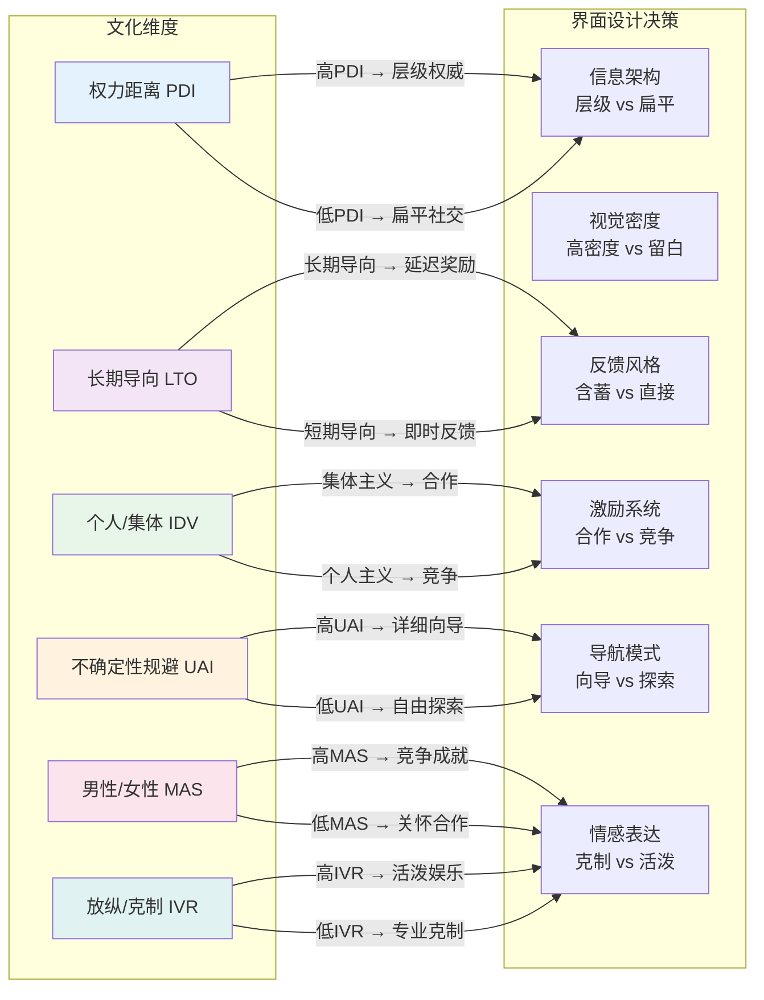
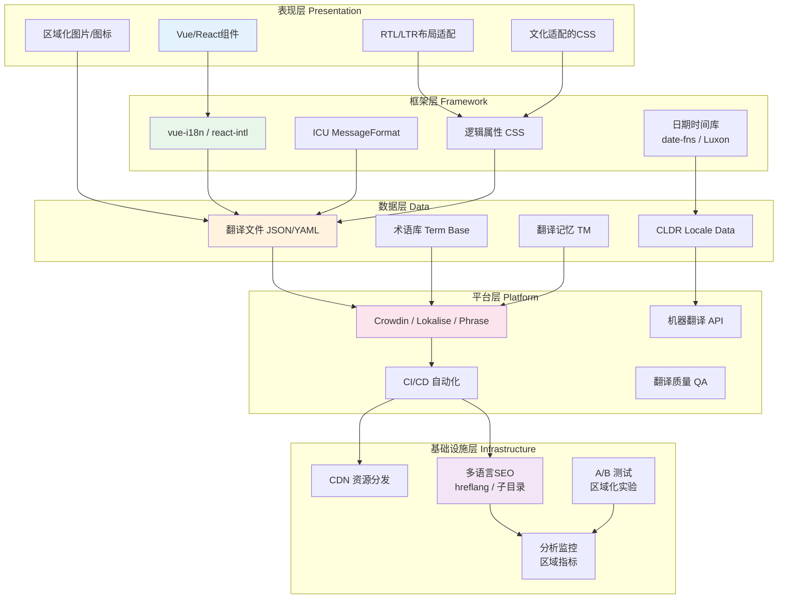

# 跨文化UI：国际化与本地化设计

## 引言

互联网的本质是连接，但连接的前提是**理解**。
当一款Web应用从硅谷走向上海、从柏林走向迪拜、从圣保罗走向雅加达时，它面临的不仅仅是语言翻译的问题，更是一整套深层文化编码系统的转译挑战。
日期格式是 `MM/DD/YYYY` 还是 `DD/MM/YYYY`？红色代表喜庆还是危险？界面布局该从左到右还是从右到左？家庭相册的封面应该展示个人肖像还是集体合影？这些问题的答案根植于不同文化群体的认知框架、价值体系与视觉惯例之中。

跨文化用户界面设计（Cross-Cultural UI Design）是一个横跨文化人类学、认知语言学、信息设计与软件工程的交叉领域。
本文从Geert Hofstede的文化维度理论出发，探讨权力距离、个人主义/集体主义等维度如何映射到界面设计决策；
深入分析RTL（从右到左）语言的排版原理与CSS工程实现；
解析色彩、日期时间格式、信息架构在不同文化语境中的语义差异；
并最终落实到现代Web前端工程中的国际化（i18n）与本地化（l10n）实现策略——从 `vue-i18n` 与 `react-intl` 的API设计，到Crowdin与Lokalise的翻译工作流，再到 `hreflang` 标签的多语言SEO与Unicode双向算法（Bidi Algorithm）的底层原理。

本文的核心理论命题是：**国际化不是功能的附加层，而是产品架构的基础维度。真正优秀的跨文化UI设计，不是将同一套界面"翻译"成多种语言，而是为不同文化群体构建各自熟悉且舒适的认知栖息地**。

---

## 理论严格表述

### Hofstede文化维度理论在UI设计中的应用

荷兰社会心理学家Geert Hofstede通过对IBM全球员工的跨文化研究，提出了**文化维度理论（Cultural Dimensions Theory）**，用以量化和比较不同国家/地区文化群体的心理程序差异。
尽管该理论在当代跨文化心理学中受到一定的简化论批评（如将复杂文化简化为国家层面的数值），但其在UI设计领域仍具有强大的启发价值——它为设计师提供了一套系统性的分析框架，用以审视自身文化偏见并预测不同文化群体的界面偏好。

#### 权力距离（Power Distance Index, PDI）

权力距离衡量的是"社会中权力较少的成员对权力分配不平等的接受程度"。
高权力距离文化（如马来西亚、危地马拉、阿拉伯国家）倾向于：

- **尊重等级与权威**：界面中应突出显示官方认证、专家推荐、品牌资历等信息
- **正式的语言风格**：使用敬语、头衔和礼貌的称呼方式
- **结构化的信息架构**：偏好清晰的层级导航、明确的权限边界和自上而下的信息流动
- **较少用户生成内容**：用户更信赖官方/专家内容，而非 peer-to-peer 的社交证明

低权力距离文化（如奥地利、以色列、丹麦）则倾向于：

- **平等主义的视觉语言**：扁平化的信息架构、社区驱动的内容排序、用户评论的突出展示
- **非正式的沟通风格**：品牌可以使用幽默、俚语和对话式语调
- **去中心化的导航**：标签云、用户推荐算法、社交网络式的信息流

在UI工程中，高PDI市场的产品可能需要强化"官方标识"的视觉权重（如更大的徽章、更权威的文案），而低PDI市场的产品则应将社交证明（评分、评论、UGC）置于更显眼的位置。

#### 个人主义/集体主义（Individualism vs. Collectivism, IDV）

个人主义文化强调个人成就、自主决策和自我表达；集体主义文化强调群体和谐、社会关系和群体利益。
这一维度对UI设计的影响尤为显著：

**个人主义界面特征**：

- **以用户为中心的内容**："您的推荐"、"您的成就"、"您的进度"
- **自定义与个性化**：丰富的主题设置、个人资料展示、个人数据统计
- **竞争性激励**：排行榜中的个人排名、个人徽章系统、独占性成就
- **直接反馈**：明确、个人的错误消息（"您输入的密码不正确"）

**集体主义界面特征**：

- **以群体为中心的叙事**："我们的社区"、"团队成就"、"大家的选择"
- **关系网络的可视化**：共同好友、群组动态、家庭共享功能的优先展示
- **合作性激励**：团队目标、群体进度条、共享奖励池
- **含蓄的反馈**：避免让用户在群体中"丢面子"的错误提示（如使用"请检查您的输入"而非"您错了"）

在图像内容策略上，个人主义文化偏好展示独立个体、独特风格和个性化场景；集体主义文化则偏好展示群体活动、家庭场景和社会关系。
这意味着同一产品的营销图片库需要针对IDV分数不同的市场进行差异化配置。

#### 不确定性规避（Uncertainty Avoidance Index, UAI）

不确定性规避衡量的是"文化成员对不确定性和模糊性的容忍程度"。高UAI文化（如希腊、葡萄牙、日本）的用户：

- **需要明确的路径指引**：更详细的向导流程、更清晰的步骤指示器、更丰富的帮助文档入口
- **偏好确定性语言**：避免"可能"、"或许"等模糊措辞；进度条优于不确定的Spinner
- **重视安全与信任信号**：SSL证书展示、隐私政策摘要、退款保障标识、客服联系方式的显著性
- **结构化的表单设计**：将长表单分解为多个明确标注的步骤，每步提供清晰的进度反馈

低UAI文化（如新加坡、丹麦、中国）的用户则更能容忍探索性的界面、模糊的导航和实验性的功能。
他们可能更欣赏"发现式"的交互模式（如手势操作、隐藏功能）而非手把手式的向导。

#### 男性化/女性化（Masculinity vs. Femininity, MAS）

Hofstede将这一维度重新命名为" Tough vs. Tender "（强硬与温和），以避免性别刻板印象的误解。
高MAS文化重视竞争、成就、物质成功和英雄主义；低MAS（高女性化）文化重视合作、关怀、生活质量和谦逊。

在UI中，高MAS市场的产品可能采用：

- **竞争性的视觉隐喻**：体育、战争、游戏化的挑战语言（"击败对手"、"赢得奖励"）
- **成就导向的文案**：强调效率、速度、力量和胜利
- **高对比度、锐利的视觉风格**：深色模式、硬朗的几何图形、强烈的色彩对比

低MAS市场的产品则倾向于：

- **合作性的视觉隐喻**：花园、社区、共同成长
- **关怀导向的文案**：强调支持、理解、平衡和幸福感
- **柔和的视觉风格**：圆角、渐变、自然色调、充裕的留白

#### 长期/短期导向（Long-Term vs. Short-Term Orientation, LTO）

长期导向文化重视毅力、节俭、长期回报和传统适应；短期导向文化重视即时满足、快速结果和传统尊重。这一维度影响：

- **奖励系统的设计**：长期导向用户更能接受延迟奖励（如"连续签到7天获得大奖"），短期导向用户偏好即时的小额奖励
- **内容的时间框架**：长期投资/储蓄类产品的界面在长期导向市场应强调未来的收益可视化，在短期导向市场应强调当下的便利性
- **传统元素的融合**：在长期导向市场（如东亚），融入传统文化符号可以增强品牌信任感

#### 放纵/克制（Indulgence vs. Restraint, IVR）

放纵型文化允许相对自由地满足基本与自然的人类欲望；克制型文化通过严格的社会规范来抑制欲望满足。这一维度影响界面的"娱乐性"与"严肃性"平衡：

- 高IVR市场的产品可以更大胆地使用动画、游戏化、表情符号和娱乐性微文案
- 低IVR市场的产品应保持更高的专业性和克制感，避免过度活泼的视觉语言

### RTL语言的排版理论：从书写方向到认知流

世界上大约有12种语言使用从右到左（Right-to-Left, RTL）的书写系统，其中最重要的是阿拉伯语（Arabic）、希伯来语（Hebrew）、波斯语（Persian）和乌尔都语（Urdu）。
RTL排版不仅是"把文字从右边开始排"这么简单，它涉及一整套镜像化的空间认知系统。

#### 书写方向与视觉流

在LTR（从左到右）文化中，视觉扫描路径遵循"F型模式"（F-Pattern）——用户首先水平扫描页面顶部，然后向下移动并再次水平扫描，最后垂直扫描左侧。
这一模式与拉丁文字的阅读方向高度一致。
然而，在RTL文化中，视觉扫描路径呈现**镜像化的F型模式**：用户从右上角开始，向左水平扫描，向下移动后再向左水平扫描，最后垂直扫描右侧。

这意味着：

- **导航栏的"首页"按钮应位于右上角**，而非左上角
- **返回按钮的箭头应指向右侧**（指向页面边缘，暗示"回到后面"），而非左侧
- **时间轴应从右向左流动**
- **标签页的关闭按钮（X）应位于标签左侧**

#### 双向文本（Bidirectional Text, Bidi）

RTL界面中最复杂的排版场景是**双向文本**——同一段落中混合RTL文字与LTR文字（如阿拉伯语句子中包含英文品牌名或数字）。
Unicode标准通过**双向算法（Bidirectional Algorithm, UAX #9）**解决这一问题。

Bidi算法的核心概念包括：

- **基础方向（Base Direction）**：段落的主导书写方向（RTL或LTR）
- **字符方向属性（Character Directional Properties）**：每个Unicode字符被赋予强方向性（Strong，如阿拉伯字母=L、拉丁字母=R）、弱方向性（Weak，如数字=EN）或中性方向性（Neutral，如标点符号）
- **隐式方向重排（Implicit Reordering）**：算法根据字符属性和基础方向自动重排字符的显示顺序
- **显式方向控制（Explicit Directional Controls）**：通过Unicode控制字符（如LRE、RLE、LRO、RLO、PDF）或HTML的`dir`属性和`bdi`元素手动覆盖算法行为

一个经典的Bidi陷阱是：在RTL界面中显示电话号码或数学公式时，数字的显示顺序可能与预期相反，因为数字在Unicode Bidi算法中被归类为"欧洲数字（European Number, EN）"，在RTL段落中仍按LTR方向显示。

#### 文字 shaping 与连字

阿拉伯语和波斯语等脚本具有**文字 shaping（Text Shaping）**特性：同一个字母根据其在单词中的位置（词首、词中、词尾、独立）呈现不同的字形（Glyph）。
此外，这些语言广泛使用**连字（Ligatures）**——两个或多个字母组合成一个特殊的合字字形。
这意味着RTL文本渲染需要复杂的字体处理流程：

1. **字符到字形的映射（CMAP）**：将Unicode码点映射到字体中的字形索引
2. **Shaping引擎**：根据上下文确定每个字母的字形变体
3. **连字替换（GSUB）**：将可组合的字母序列替换为连字字形
4. **双向重排（Bidi）**：按照UAX #9规则重排字形序列
5. **渲染**：最终将处理后的字形提交给渲染后端

这解释了为什么简单的"反转字符串"方法无法正确实现RTL支持——它完全忽略了shaping和Bidi的复杂性。

### 色彩的文化语义差异

色彩是人类视觉系统最敏感的感知通道之一，但色彩的语义联想是**高度文化依赖的**。
在跨文化UI设计中，色彩选择必须经过文化语义的审慎考量，而非仅仅遵循品牌指南或 Western-centric 的设计惯例。

| 色彩 | 中国文化语义 | 西方（欧美）文化语义 | 中东/伊斯兰文化 | 印度文化 |
|---|---|---|---|---|
| **红色** | 喜庆、幸运、繁荣、婚礼、春节 | 危险、停止、错误、激情、爱情 | 危险、警示 | 纯洁、婚礼、繁荣 |
| **白色** | 哀悼、死亡、丧葬 | 纯洁、婚礼、和平、干净 | 纯洁、和平 | 纯洁、真理 |
| **黑色** | 庄重、神秘、水（五行） | 死亡、哀悼、邪恶、精致 | 哀悼 | 邪恶、阴暗 |
| **金色/黄色** | 皇权、尊贵、财富、色情（特定语境） | 财富、警示、乐观 | 财富、天堂 | 知识、学习、商人 |
| **绿色** | 生机、环保、出轨（特定语境） | 环保、通行、嫉妒、金钱 | 神圣、伊斯兰教、天堂 | 繁荣、吉祥 |
| **蓝色** | 科技、冷静、忧郁 | 信任、稳定、专业、男性 | 保护、天堂 | 克里希纳神、安宁 |
| **紫色** | 高贵、神秘 | 皇室、奢华、灵性 | 财富 | 悲伤、苦行 |

#### 红色：最鲜明的文化分歧

红色是最能体现文化语义差异的色彩。在中国文化中，红色是**积极情感密度最高**的色彩之一——它承载喜庆、吉祥、繁荣和幸福的语义场。
春节的红包、婚礼的礼服、开业的剪彩都以红色为主调。
然而，在大多数Western设计中，红色是错误、危险和停止的标准语义色（如表单验证错误边框、删除按钮、404错误页面）。

这一差异对UI工程的直接影响包括：

- **在中国市场的产品中，应谨慎使用红色作为"错误"的唯一标识**。可以考虑使用橙色或带有图标辅助的红色，以避免与中国用户的喜庆联想产生冲突
- **在中国市场的金融/支付产品中，红色可以承载正面含义**（如"盈利"用红色表示，与西方金融产品的绿色表示盈利相反）
- **删除/危险操作的颜色需要文化适配**：在中国市场，可能需要通过文案（"删除"、"移除"）和图标（垃圾桶）来强化负面语义，而非仅依赖红色

#### 白色与黑色的哀悼语义

在东亚文化中，白色是传统丧服的颜色。
在中国、日本、韩国的丧葬仪式中，亲属穿着白色孝服。
这与西方文化中"白色婚礼"的喜庆语义形成强烈对比。
因此，在面向东亚市场的产品中，**大面积白色背景配合特定 mournful 文案可能产生无意的负面联想**。
当然，现代数字界面中白色作为中性背景色已被全球用户广泛接受，但在文化敏感场景（如健康、殡葬、宗教）中仍需注意。

黑色在西方文化中既是哀悼色（葬礼），也是高端/奢华的象征（"小黑裙"、高端产品的黑色包装）。
这种双重语义使得黑色在跨文化设计中相对灵活，但仍需结合具体语境判断。

### 日期、时间与数字格式的文化差异

#### 日期格式

全球主要存在三种日期书写惯例：

- **大端序（Big-Endian）**：`YYYY-MM-DD`（ISO 8601国际标准、中国、日本、韩国等东亚国家）
- **小端序（Little-Endian）**：`DD/MM/YYYY`（大部分欧洲、拉美、非洲、亚洲国家）
- **中端序（Middle-Endian）**：`MM/DD/YYYY`（美国及受美国影响的地区）

在UI工程中，**绝不能将日期格式硬编码为单一格式**。
`2026/01/02`在不同文化语境中可能被解读为"1月2日"或"2月1日"，这种歧义在医疗、金融、法律场景中可能导致严重后果。

#### 时间格式

- **12小时制 vs. 24小时制**：美国、加拿大、澳大利亚、埃及等国广泛使用12小时制（AM/PM）；大多数欧洲国家、中国、日本等使用24小时制
- **时区表示**：有些地区偏好时区缩写（PST、EST），有些地区偏好UTC偏移量（UTC+8）
- **星期起始日**：美国、加拿大、日本、沙特以星期日为一周起始；中国、欧洲大部分国家以星期一为起始；中东部分国家以星期六为起始

#### 数字格式

- **小数点与千位分隔符**：美国使用 `1,234.56`（逗号分隔千位，点号表示小数）；德国、法国等使用 `1.234,56`（点号分隔千位，逗号表示小数）；印度使用独特的 lakhs/crores 分组：`12,34,567.89`
- **负数的表示**：部分文化使用括号表示负数（`(1,234.56)`），而非前置减号
- **货币符号位置**：美元通常前置（`$1,234.56`），欧元在不同国家前置或后置（法国`1 234,56 €`、爱尔兰`€1,234.56`），日元通常前置（`¥1,234`）但无小数位

### 信息架构的文化差异：从F型到镜像F型

如前所述，RTL文化中的视觉扫描路径是LTR的镜像。
但信息架构的文化差异不仅限于方向：

**高语境文化（High-Context Cultures，如日本、中国、韩国、阿拉伯国家）**：

- 沟通依赖共享的语境、隐含的意义和非语言线索
- UI偏好**更密集的信息呈现**：单屏展示更多内容，更高的信息密度
- 接受更复杂的导航层级和更丰富的分类体系
- 对留白（Whitespace）的容忍度较低——"空"可能被解读为"信息不完整"
- 偏好间接的、暗示性的引导，而非直白的行动号召（CTA）

**低语境文化（Low-Context Cultures，如美国、德国、北欧国家）**：

- 沟通依赖明确的语言表达，语境信息被显式编码
- UI偏好**清晰、稀疏的信息布局**：单屏聚焦单一任务，充裕的留白
- 偏好扁平的信息架构和全局导航
- 直白的CTA按钮（"立即购买"、"免费试用"）更有效
- 帮助文档和FAQ需要详尽且结构清晰

Edward T. Hall的高低语境理论为信息密度的文化适配提供了理论框架。
值得注意的是，随着移动互联网的全球普及，年轻一代用户对高密度界面的接受度在跨文化层面有所趋同（如Instagram、TikTok的全球化成功），但在B端产品、金融产品和面向年长用户的产品中，高低语境的差异仍然显著。

---

## 工程实践映射

### Web应用的国际化（i18n）实现

国际化（Internationalization，简称i18n，因首末字符间有18个字母而得名）是指**将软件设计与开发得能够适应不同语言和地区，而无需针对每种语言进行工程改动**。
本地化（Localization，简称l10n）则是**针对特定地区/语言市场进行内容、格式和文化元素的适配**。
i18n是能力，l10n是内容。

#### ICU MessageFormat与复数规则

国际化中最容易被低估的复杂性是**复数规则（Plural Rules）**。
英语只有单复数两种形式（"1 file" vs. "2 files"），但许多语言具有更复杂的复数系统：

- **俄语**：具有单数、少数（2–4）、多数（5+）三种形式
- **波兰语**：具有单数、少数（2–4，但12–14除外）、多数三种形式
- **阿拉伯语**：具有六种复数形式
- **中文/日语/韩语**：没有语法复数变化，数量词后名词形式不变

ICU MessageFormat（International Components for Unicode）是业界标准的国际化消息格式，被 `react-intl`、`vue-i18n`、FormatJS等库广泛支持。
它通过占位符和选择器实现了复杂的语法适配：

```icu
// 英语
{count, plural, =0 {No files} one {1 file} other {# files}}

// 俄语（需要三种形式）
{count, plural, =0 {Нет файлов} one {# файл} few {# файла} many {# файлов} other {# файла}}
```

在Vue 3中使用 `vue-i18n` 的示例：

```javascript
// main.js
import { createI18n } from 'vue-i18n';

const messages = {
  en: {
    files: '{count} file | {count} files',
    greeting: 'Hello, {name}!'
  },
  ru: {
    files: 'Нет файлов | {n} файл | {n} файла | {n} файлов',
    greeting: 'Привет, {name}!'
  },
  zh: {
    files: '{count}个文件',
    greeting: '你好，{name}！'
  }
};

const i18n = createI18n({
  locale: 'zh',
  fallbackLocale: 'en',
  messages
});

app.use(i18n);
```

```vue
<template>
  <div>
    <!-- 注意：以下 <template> 标签处于代码块内，不会被 Vue 模板编译器误解析 -->
    <p>{{ $t('greeting', { name: 'Alice' }) }}</p>
    <p>{{ $tc('files', fileCount, { count: fileCount }) }}</p>
  </div>
</template>
```

需特别注意：在Markdown正文中提及 `template` 标签时，必须使用反引号包裹。若在代码块内使用，则安全无虞。

#### 插值与HTML转义

国际化消息中经常需要嵌入HTML（如链接、加粗文本）。
工程上必须平衡灵活性与安全性：

- **默认转义**：所有插值变量默认应经过HTML转义，防止XSS攻击
- **命名组件插值**（`vue-i18n` v9+ 或 `react-intl` 的 `<FormattedMessage>`）：允许在消息中嵌入组件占位符，由前端框架负责渲染

```vue
<template>
  <i18n-t keypath="termsAgreement" tag="p">
    <template v-slot:terms>
      <a href="/terms">{{ $t('termsLink') }}</a>
    </template>
    <template v-slot:privacy>
      <a href="/privacy">{{ $t('privacyLink') }}</a>
    </template>
  </i18n-t>
</template>
```

上述代码中，所有 `template` 标签均安全地位于代码块内部。

#### FormatJS与类型安全的i18n

对于TypeScript项目，类型安全的国际化能够捕获翻译键的拼写错误和缺失翻译。
FormatJS的 `@formatjs/ts-transformer` 和 `vue-i18n` 的 `petite-vue-i18n` 配合TypeScript的类型定义文件可以实现编译时检查：

```typescript
// types/i18n.d.ts
import 'vue-i18n';
declare module 'vue-i18n' {
  export interface DefineLocaleMessage {
    greeting: string;
    files: string;
    navigation: {
      home: string;
      settings: string;
    };
  }
}
```

### RTL布局的CSS实现

支持RTL是现代Web应用国际化的硬性技术要求。
CSS逻辑属性（Logical Properties）和HTML的`dir`属性构成了RTL实现的基础架构。

#### dir属性与文档方向

HTML5的`dir`属性定义了元素内容的文本方向：

```html
<!-- LTR文档 -->
<html dir="ltr" lang="en">

<!-- RTL文档 -->
<html dir="rtl" lang="ar">
```

在动态切换语言的SPA中，需要在语言切换时同步更新 `<html>` 元素的 `dir` 和 `lang` 属性：

```javascript
function setLanguage(locale) {
  const dir = ['ar', 'he', 'fa', 'ur'].includes(locale) ? 'rtl' : 'ltr';
  document.documentElement.setAttribute('lang', locale);
  document.documentElement.setAttribute('dir', dir);
}
```

#### CSS逻辑属性（Logical Properties）

传统CSS的物理方向属性（`margin-left`、`padding-right`、`border-top`、`text-align: left`）在RTL适配中需要全部手动反转。
CSS逻辑属性用**逻辑方向**（起始/结束、块向/行向）替代了**物理方向**（左/右、上/下），使同一样式表能够自动适配LTR和RTL：

| 物理属性 | 逻辑属性 |
|---|---|
| `margin-left` | `margin-inline-start` |
| `margin-right` | `margin-inline-end` |
| `padding-left` | `padding-inline-start` |
| `padding-right` | `padding-inline-end` |
| `border-left` | `border-inline-start` |
| `border-right` | `border-inline-end` |
| `text-align: left` | `text-align: start` |
| `text-align: right` | `text-align: end` |
| `float: left` | `float: inline-start` |
| `float: right` | `float: inline-end` |
| `left: 0` | `inset-inline-start: 0` |
| `right: 0` | `inset-inline-end: 0` |

工程实践建议：**新项目应优先使用逻辑属性编写CSS**；
对于遗留项目，可以通过PostCSS插件（如 `postcss-logical`）在构建时将逻辑属性转换为物理属性，并为RTL生成镜像版本。

#### CSS框架的RTL支持

现代CSS框架通常内置RTL支持：

- **Tailwind CSS v3.3+**：原生支持逻辑属性（如 `ms-4` 替代 `ml-4`，`me-4` 替代 `mr-4`）
- **Bootstrap 5**：完整弃用物理方向工具类，全面采用逻辑属性
- **Chakra UI / MUI**：通过Theme Provider的 `direction` 属性自动切换RTL样式

#### 需要手动处理的RTL镜像元素

并非所有UI元素都能通过CSS逻辑属性自动镜像。以下元素在RTL适配中需要特殊处理：

- **图标方向性**：箭头、进度指示、滑动方向图标需要水平翻转（`transform: scaleX(-1)`）
- **时间轴与步骤条**：流程方向应从右向左流动
- **轮播图（Carousel）**：滑动方向应反转
- **图表与数据可视化**：坐标轴、图例顺序、饼图的起始角度可能需要调整
- **视频播放器**：进度条方向、快进/快退按钮的隐喻方向
- **地图**：虽然地图通常保持北向上，但标注的阅读顺序需要适配

在Vue/React工程中，可以通过CSS自定义属性（CSS Variables）结合 `dir` 属性选择器实现方向感知：

```css
/* 基础样式使用逻辑属性 */
.nav-link {
  padding-inline-start: 1rem;
  padding-inline-end: 1rem;
}

/* 对需要特殊处理的元素 */
.timeline-arrow {
  [dir="ltr"] & { transform: rotate(0deg); }
  [dir="rtl"] & { transform: rotate(180deg); }
}
```

### 本地化（l10n）工作流：从Crowdin到Phrase

翻译管理是国际化工程中最容易被低估的协作挑战。
随着产品迭代速度加快，硬编码的JSON翻译文件很快会成为瓶颈。
专业的本地化平台（TMS, Translation Management System）提供了以下核心能力：

#### Crowdin

Crowdin是目前最流行的本地化协作平台之一，其核心工作流：

1. **源码集成**：通过GitHub/GitLab集成或CLI工具（`crowdin upload sources`）将源语言文件（如 `en.json`）推送至平台
2. **翻译协作**：邀请内部译者、社区贡献者或专业翻译机构在Web界面中进行翻译
3. **上下文关联**：通过截图上传（Screenshot Upload）和字符串注释（String Comments），帮助译者理解每个翻译键的UI上下文
4. **翻译记忆（TM）**：自动记忆历史翻译，在新项目中复用已有翻译，降低成本并保证术语一致性
5. **质量检查（QA Checks）**：自动检测占位符缺失、首尾空格不一致、变量名错误等技术问题
6. **持续本地化**：通过GitHub Action或Webhook，在源文件更新时自动创建翻译任务，在翻译完成后自动发起Pull Request

Crowdin支持ICU MessageFormat、Android XML、iOS `.strings`、YAML、JSON等多种文件格式，并提供API和CLI工具实现自动化。

#### Lokalise与Phrase

- **Lokalise**：以开发者体验为核心，提供强大的API、SDK和CLI工具。支持Figma插件（设计师直接从设计稿中提取可翻译文本）、截图关联、分支工作流（Branching Workflows）等特性。
- **Phrase（原PhraseApp）**：强调企业级工作流，提供精细的权限管理、自定义翻译流程（Translation Workflows）、术语库（Term Base）和机器翻译集成（DeepL、Google Translate、Amazon Translate）。

#### 持续本地化（Continuous Localization）

持续本地化是将本地化流程嵌入CI/CD管道的工程实践：

```yaml
# .github/workflows/localization.yml
name: Localization
on:
  push:
    branches: [main]
    paths: ['locales/en.json']
jobs:
  sync-translations:
    runs-on: ubuntu-latest
    steps:
      - uses: actions/checkout@v4
      - name: Upload source strings to Crowdin
        run: |
          crowdin upload sources
      - name: Download translated strings
        run: |
          crowdin download --all
      - name: Create Pull Request
        uses: peter-evans/create-pull-request@v6
        with:
          title: 'chore(i18n): sync translations'
          branch: 'i18n/sync'
```

这一工作流确保了：产品迭代中新增的源语言文本能够自动进入翻译队列，已完成的翻译能够自动回流至代码仓库，最终通过常规的发版流程部署至生产环境。

### 多语言SEO：hreflang标签与区域化URL

对于面向全球市场的内容型网站，多语言SEO是获取有机流量的关键。
Google、Bing等搜索引擎通过以下机制理解页面的语言与地区定位：

#### hreflang标签

`hreflang` 是HTML `<link>` 元素的属性，用于告诉搜索引擎"这个页面有其他语言和地区的变体"。

```html
<!-- 在页面的 <head> 中 -->
<link rel="alternate" hreflang="en-us" href="https://example.com/en-us/product" />
<link rel="alternate" hreflang="en-gb" href="https://example.com/en-gb/product" />
<link rel="alternate" hreflang="zh-cn" href="https://example.com/zh-cn/product" />
<link rel="alternate" hreflang="zh-tw" href="https://example.com/zh-tw/product" />
<link rel="alternate" hreflang="ar-sa" href="https://example.com/ar-sa/product" />
<link rel="alternate" hreflang="x-default" href="https://example.com/product" />
```

关键规则：

- **双向引用**：如果页面A通过 `hreflang` 指向页面B，页面B也必须指向页面A
- **自引用**：每个页面必须包含指向自身的 `hreflang` 链接
- **语言代码格式**：使用BCP 47语言标签（如 `zh-CN`、`en-US`、`ar-SA`）
- **x-default**：用于指定当用户的语言和地区不匹配任何可用变体时的默认页面

#### 区域化URL策略

常见的多语言URL结构有三种：

1. **子目录（Recommended）**：`example.com/en/`、`example.com/zh-cn/`、`example.com/ar/`
   - 优点：SEO权重集中，维护成本低，用户易于理解
   - 缺点：地区信号不如子域名明确

2. **子域名**：`en.example.com`、`zh.example.com`、`ar.example.com`
   - 优点：地区信号清晰，可以部署至不同服务器
   - 缺点：SEO权重分散，SSL证书管理复杂

3. **顶级域名（ccTLD）**：`example.com`、`example.cn`、`example.co.uk`
   - 优点：最强的地区信号，最高的本地信任度
   - 缺点：成本极高，SEO权重完全分散，品牌管理困难

Google官方推荐子目录结构作为大多数网站的首选方案。
在VitePress等静态站点生成器中，可以通过 `rewrites` 或文件系统路由实现子目录式多语言站点：

```
website/
├── en/
│   └── guide/
│       └── getting-started.md
├── zh/
│   └── guide/
│       └── getting-started.md
└── ar/
    └── guide/
        └── getting-started.md
```

### 文化适配的内容策略：超越翻译

#### 图像与插图的本地化

图像是最直观但最容易被忽视的文化适配点。
全球统一的产品截图中若出现特定族裔的模特、特定的饮食文化、特定的建筑风格，都可能降低非目标文化用户的认同感。

工程策略：

- **使用抽象插画替代写实摄影**：抽象几何插画（如Notion、Slack的品牌插画）天然具有更高的跨文化兼容性
- **区域化的图片资源**：通过i18n框架加载区域特定的图片URL

```javascript
const heroImages = {
  'en-us': '/images/hero-us.jpg',
  'zh-cn': '/images/hero-cn.jpg',
  'ja-jp': '/images/hero-jp.jpg',
  'ar-sa': '/images/hero-sa.jpg'
};
```

- **避免手势符号的误读**："OK"手势在巴西是侮辱性的，竖起大拇指在部分中东国家是冒犯性的。界面图标应使用无语义歧义的符号。

#### 图标的文化语义

- **动物图标**：猫头鹰在西方代表智慧，但在部分亚洲文化中与死亡相关；猪在伊斯兰文化中是不洁的；牛在印度是神圣的
- **颜色图标**：心形在全球范围内基本通用表示"喜欢"，但其他形状（如星星、拇指）的接受度存在文化差异
- **宗教与政治符号**：任何涉及宗教、国旗、政治人物的内容都应经过严格的区域审查

### 日期时间库：date-fns、Luxon与Day.js的locale支持

JavaScript生态中主流的日期时间库都提供了成熟的国际化支持，但设计理念与API风格各异：

#### date-fns

`date-fns`采用函数式、模块化的设计，每个功能作为一个独立的npm包。其locale支持通过显式导入实现，有利于Tree Shaking：

```javascript
import { format, parseISO } from 'date-fns';
import { zhCN, arSA, enUS } from 'date-fns/locale';

const date = parseISO('2026-05-01T10:00:00');

format(date, 'PPPpp', { locale: zhCN });
// => '2026年5月1日 上午10:00:00'

format(date, 'PPPpp', { locale: arSA });
// => '١ مايو ٢٠٢٦, ١٠:٠٠:٠٠ ص'
```

`date-fns`的优势在于体积可控（按需导入）和对Unicode CLDR（Common Locale Data Repository）数据的精确实现。
它支持相对时间（"3天前"）、日历操作和时区处理（通过 `date-fns-tz`）。

#### Luxon

`Luxon`由Moment.js团队开发，基于原生 `Intl.DateTimeFormat` API，因此天然继承了浏览器的国际化能力：

```javascript
import { DateTime } from 'luxon';

const dt = DateTime.now().setLocale('zh-CN');
dt.toLocaleString(DateTime.DATETIME_FULL);
// => '2026年5月1日 GMT+8 10:00'

const dtAr = DateTime.now().setLocale('ar-SA');
dtAr.toLocaleString(DateTime.DATETIME_FULL);
// => '١ مايو ٢٠٢٦, ١٠:٠٠ ص غرينتش+٨:٠٠'
```

Luxon的优势在于不可变对象（Immutable）设计、链式API和强大的时区支持。
它直接使用浏览器的 `Intl` API，因此locale数据的更新依赖于浏览器自身的CLDR数据版本。

#### Day.js

`Day.js`是Moment.js的轻量级替代方案（2KB gzipped），通过插件系统扩展功能。国际化通过 `locale` 插件实现：

```javascript
import dayjs from 'dayjs';
import 'dayjs/locale/zh-cn';
import 'dayjs/locale/ar';

dayjs.locale('zh-cn');
dayjs().format('YYYY年M月D日 dddd');
// => '2026年5月1日 星期五'

dayjs.locale('ar');
dayjs().format('YYYY/M/D dddd');
// => '٢٠٢٦/٥/١ الجمعة'
```

Day.js的优势在于体积极小，适合对包体积敏感的项目。
但其插件生态相比 `date-fns` 和 `Luxon` 较薄，复杂场景（如多时区、重复规则）可能需要额外处理。

**选择建议**：

- 需要极简体积且场景简单 → `Day.js`
- 需要函数式API、精确控制Tree Shaking → `date-fns`
- 需要强大的时区支持和链式API → `Luxon`

### Unicode与文字编码：Bidi算法与Text Shaping

#### Unicode双向算法（UAX #9）的工程含义

如前所述，Unicode Bidi算法（Unicode Standard Annex #9）是RTL文本渲染的基石。
前端工程师虽然很少直接实现Bidi算法（浏览器引擎已内置），但理解其原理对于调试RTL排版问题至关重要。

Bidi算法的核心步骤：

1. **显式级别解析（Explicit Level Resolution）**：处理显式方向控制字符（如LRM、RLM、LRE、RLE、LRO、RLO、PDF）和HTML的 `dir` 属性
2. **隐式级别解析（Implicit Level Resolution）**：根据字符的Unicode Bidi类别（如AL=Arabic Letter, EN=European Number）为每个字符分配方向级别
3. **级别调整（Level Resolution）**：应用规则调整中性字符（如标点、空格）的方向级别
4. **重排（Reordering）**：按照方向级别对字符序列进行逻辑到视觉的重排

前端工程中常见的Bidi问题与解决方案：

**问题1：LTR文本在RTL段落中的显示异常**

```html
<!-- 阿拉伯语段落中的英文品牌名 -->
<p dir="rtl">تم تطوير هذا المنتج بواسطة AcmeCorp بشكل كامل</p>
```

由于Bidi算法将英文品牌名识别为LTR强方向字符，它会在视觉呈现中保持从左到右的顺序，但其在句子中的位置可能因算法规则而与预期不符。
解决方案是使用 `<bdi>`（Bidirectional Isolate）元素隔离该文本：

```html
<p dir="rtl">تم تطوير هذا المنتج بواسطة <bdi>AcmeCorp</bdi> بشكل كامل</p>
```

或在CSS中使用 `unicode-bidi: isolate`：

```css
.brand-name { unicode-bidi: isolate; }
```

**问题2：电话号码、数学公式在RTL中的方向**
电话号码本质上是LTR字符串（数字序列从左到右读取），但在RTL段落中，它可能被Bidi算法重新定位。
最佳实践是将这类字符串用 `<bdi>` 或 `<span dir="ltr">` 包裹。

#### 字体回退栈（Font Fallback Stack）

RTL语言（尤其是阿拉伯语）对字体的要求极高。
并非所有系统字体都支持阿拉伯文字的shaping和连字。
因此，RTL项目的字体回退栈必须精心设计：

```css
/* 阿拉伯语字体回退 */
body:lang(ar),
body[dir="rtl"] {
  font-family: 'Noto Sans Arabic', 'Segoe UI', 'Tahoma', 'Arial', sans-serif;
}

/* 希伯来语字体回退 */
body:lang(he),
body:lang(iw) {
  font-family: 'Noto Sans Hebrew', 'Segoe UI', 'Arial', sans-serif;
}
```

Google的Noto字体家族（"No Tofu"）是跨文化UI项目的首选开源字体资源，它覆盖了全球绝大多数书写系统，并针对每个脚本进行了专门的字形设计。
Noto Sans Arabic、Noto Sans Hebrew、Noto Sans Devanagari等都是经过充分测试的Web安全选择。

#### 文字渲染引擎的差异

不同浏览器和操作系统使用不同的文字渲染后端：

- **Windows**：DirectWrite（现代）或 GDI（旧版）
- **macOS/iOS**：Core Text
- **Linux/ChromeOS**：FreeType + HarfBuzz
- **Android**：FreeType + HarfBuzz / Minikin

这些后端对阿拉伯语shaping、泰语合成元音、印地语连字的实现细节可能存在微小差异。
在发布RTL版本前，必须在目标用户的主要浏览器（通常是Chrome、Safari、Edge）和操作系统组合上进行视觉回归测试。

---

## Mermaid 图表

### 图表1：Hofstede文化维度到UI设计决策的映射矩阵



该图表展示了Hofstede六个文化维度如何映射到具体的UI设计决策。
需要强调的是，这些映射不是绝对的规则，而是设计时的敏感性检查清单。
同一维度的不同取值会导向截然不同的设计策略，最终的产品应是目标市场多个维度特征的综合响应。

### 图表2：国际化（i18n）工程架构的分层模型



此图表呈现了国际化工程的完整分层架构。
从表现层的组件与布局适配，到框架层的i18n库与日期库，再到数据层的翻译资产与CLDR数据，平台层的TMS协作与质量保障，以及基础设施层的CDN、SEO和分析。
每一层都承载着特定的跨文化适配职责，层与层之间通过明确的接口契约协作。

### 图表3：RTL排版渲染流水线

```mermaid
flowchart LR
    A[Unicode字符序列<br/>Character Sequence] --> B[双向算法<br/>Bidi Algorithm<br/>UAX #9]
    B --> C[字符方向重排<br/>Reordering]
    C --> D[Shaping引擎<br/>Harfbuzz / CoreText]
    D --> E[字形选择<br/>Glyph Substitution<br/>GSUB]
    E --> F[连字处理<br/>Ligatures]
    F --> G[字形定位<br/>Glyph Positioning<br/>GPOS]
    G --> H[渲染后端<br/>DirectWrite / FreeType]
    H --> I[像素缓冲区<br/>Pixel Buffer]
    I --> J[屏幕显示<br/>Display]

    style A fill:#e3f2fd
    style B fill:#fff3e0
    style D fill:#e8f5e9
    style H fill:#fce4ec
    style J fill:#f3e5f5
```



该图展示了RTL文本从Unicode字符序列到屏幕像素的完整渲染流水线。
前端工程师通常只接触这一流水线的最终输出，但理解其中的Bidi重排、Shaping和GSUB/GPOS阶段对于调试复杂的RTL排版问题至关重要。

---

## 理论要点总结

1. **Hofstede文化维度是跨文化UI设计的分析框架，而非设计公式**：权力距离影响信息架构的层级深度，个人主义/集体主义决定激励系统的竞争/合作倾向，不确定性规避决定向导流程的详细程度，男性化/女性化影响视觉语言的硬朗/柔和光谱。将这些维度作为敏感性检查清单，而非刻板套用的规则。

2. **RTL不是LTR的镜像翻转**：RTL排版涉及双向算法（Bidi）、文字shaping、连字替换和镜像化的认知流。简单的字符串反转或CSS `scaleX(-1)` 无法实现正确的RTL支持。必须使用逻辑属性、`dir` 属性和经过充分测试的字体栈。

3. **色彩具有文化语义，而非普世语义**：红色在中国是喜庆，在西方是危险；白色在东亚是哀悼，在西方是婚礼。跨文化产品的色彩系统必须经过目标市场的语义审查，核心功能状态色（成功、警告、错误）可能需要区域化适配。

4. **国际化是架构能力，不是功能附加**：i18n必须内建于产品架构的早期阶段——组件的文本抽取、日期时间的locale处理、RTL布局的CSS策略、翻译文件的目录结构，这些决策在架构初期的成本远低于后期重构。ICU MessageFormat对复数、选择器和占位符的支持是国际化消息格式的行业标准。

5. **本地化超越翻译**：l10n不仅包括语言翻译，还包括图像的区域化、图标的文化审查、色彩语义适配、信息密度的调整、SEO的hreflang配置和本地法规遵从（如GDPR、数据主权）。翻译管理平台（Crowdin、Lokalise、Phrase）和持续本地化工作流是实现规模化l10n的工程基础设施。

6. **Unicode与Bidi算法是RTL工程的地基**：理解UAX #9的显式/隐式级别解析、`<bdi>` 元素的隔离作用、以及不同渲染引擎的shaping差异，是构建可靠RTL体验的必要知识储备。Noto字体家族提供了覆盖全球主要脚本的高质量开源字体资源。

---

## 参考资源

1. **Hofstede, G.** (2001). *Culture's Consequences: Comparing Values, Behaviors, Institutions and Organizations Across Nations* (2nd ed.). Sage Publications. Hofstede文化维度理论的权威学术阐述，提供了六个文化维度的定义、测量方法和跨国比较数据。

2. **W3C Internationalization (i18n) Activity.** "Internationalization Techniques: Authoring HTML & CSS." *World Wide Web Consortium*. W3C国际化工作组维护的技术指南，涵盖RTL排版、字符编码、语言声明和Bidi最佳实践。<https://www.w3.org/International/techniques/authoring-html>

3. **Unicode Consortium.** (2024). "Unicode Standard Annex #9: Unicode Bidirectional Algorithm." *Unicode Technical Reports*. Unicode双向算法的规范文档，定义了RTL文本处理的正式规则。<https://www.unicode.org/reports/tr9/>

4. **Google Material Design.** "Internationalization Guidelines." *Material Design*. Google Material Design系统提供的国际化设计指南，涵盖RTL布局、排版、图标镜像和文化适配建议。<https://m3.material.io/foundations/content-design/global-writing/>

5. **Hall, E. T.** (1976). *Beyond Culture*. Anchor Books. Edward T. Hall的高低语境理论为信息密度和沟通风格的跨文化差异提供了人类学框架，是理解UI信息架构文化偏好的重要理论资源。

6. **Marcus, A., & Gould, E. W.** (2000). "Crosscurrents: Cultural Dimensions and Global Web User-Interface Design." *Interactions*, 7(4), 32–46. 系统性地将Hofstede文化维度映射到Web界面设计决策的学术论文，是跨文化HCI领域的经典参考文献。

7. **Lupton, E.** (2017). *Design Is Storytelling*. Cooper Hewitt. 虽然不是专门的跨文化设计著作，但Lupton对视觉叙事和文化编码的分析为理解色彩、图像和符号的文化语义提供了设计理论视角。

8. **Nemeth, E.** (2019). "Internationalization and Localization in Software Engineering." In *The Cambridge Handbook of Computing Education Research*. Cambridge University Press. 从软件工程教育学角度系统论述了i18n/l10n的工程实践、工具链和教学挑战。

9. **Craig, J., & Kulyk, O.** (2019). "Right-to-Left (RTL) Interface Design for Mobile Applications." *UXmatters*. 针对移动端RTL设计的实践指南，涵盖布局模式、手势交互和视觉扫描路径的镜像化设计。<https://www.uxmatters.com/mt/archives/2019/07/right-to-left-rtl-interface-design-for-mobile-applications.php>

10. **Day.js / date-fns / Luxon Documentation.** 现代JavaScript日期时间库的官方文档，详细说明了各自的国际化API、locale支持范围和时区处理策略。<https://day.js.org/> | <https://date-fns.org/> | <https://moment.github.io/luxon/>
