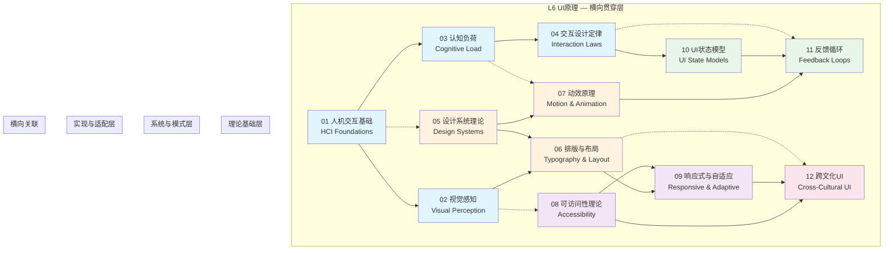

# UI原理

## 专题概述

**UI原理**作为理论层次模型中的 **L6 横向贯穿层**，并非孤立存在于技术栈的顶端，而是像一张精密的神经网络，横向渗透并影响着从 L0 数学基础到 L5 应用设计的每一个层次。
在现代 JavaScript/TypeScript 生态系统中，无论是构建一个 `React` 组件、设计一套 `Vue` 的响应式界面，还是打磨 `Svelte` 的交互细节，其底层都深受 UI 原理的支配与指导。

本专题系统性地覆盖了 **13 个核心子主题**：

1. **人机交互基础 (HCI)** — 理解用户与数字系统交互的心理学与工程学基础
2. **视觉感知** — 探索人类视觉系统如何处理界面信息，包括格式塔原理、色彩理论与视觉层级
3. **认知负荷理论** — 分析工作记忆限制对界面设计的影响，学习如何降低内在、外在与相关认知负荷
4. **交互设计定律** — 掌握 Fitts 定律、Hick 定律、Miller 定律等经典交互设计法则
5. **设计系统理论** — 从原子化设计到设计令牌，构建可扩展、可维护的界面设计体系
6. **排版与布局** — 深入字体选择、网格系统、留白艺术与阅读体验优化
7. **动效原理** — 理解动画的物理隐喻、时间曲线、编排原则与感知性能
8. **可访问性理论** — 基于 WCAG 标准，构建对所有用户（包括残障人士）友好的数字体验
9. **响应式与自适应** — 从设备无关设计到断点策略，掌握多设备时代的布局哲学
10. **UI状态模型** — 形式化定义界面状态的转换、副作用与一致性维护
11. **反馈循环** — 探索即时反馈、延迟反馈与预测性反馈在用户体验中的角色
12. **跨文化UI** — 理解文化维度理论对界面隐喻、色彩语义与信息架构的影响
13. **情感化设计** — 超越功能性，通过美学、愉悦感与品牌个性建立用户情感连接

UI 原理之所以被称为"横向贯穿层"，是因为它的影响超越了任何单一技术栈或框架。
当你在 `React` 中编写一个 `useState`  hook 来管理界面状态时，你实际上是在应用 **UI状态模型** 的理论；
当你在 CSS 中使用 `prefers-reduced-motion` 媒体查询时，你是在实践 **可访问性理论**；
当你为移动端设计触摸目标的大小时，你是在遵循 **交互设计定律**（如 Fitts 定律）。

> "优秀的设计是显而易见的。伟大的设计是透明的。" — Joe Sparano

---

## 核心内容导航

本专题包含 **12 篇深度文章** 与本首页，构成完整的 UI 原理知识体系。

### 01. 人机交互基础

**文件**: [01-hci-foundations.md](./01-hci-foundations.md)

人机交互（Human-Computer Interaction, HCI）是 UI 原理的根基学科。本文从认知心理学、人类工程学和社会学的交叉视角出发，系统阐述用户与数字界面交互时的感知-认知-行动循环。内容涵盖交互范式演进（命令行 → 图形界面 → 自然用户界面）、心智模型理论、 affordance（功能可见性）概念、 direct manipulation（直接操作）原则，以及以用户为中心的设计流程（UCD）。文章还将探讨在 JavaScript/TypeScript 生态中，现代框架如何通过声明式编程模型（如 `React` 的虚拟 DOM、 `Vue` 的响应式系统）来弥合开发者心智模型与用户心智模型之间的鸿沟。

> **关键概念**: affordance、心智模型、直接操作、感知-认知-行动循环、以用户为中心的设计

---

### 02. 视觉感知

**文件**: [02-visual-perception.md](./02-visual-perception.md)

人类的视觉系统并非被动接收像素，而是主动构建意义。本文深入解析格式塔心理学原理（接近性、相似性、连续性、闭合性、共同命运、图形-背景关系），揭示用户如何在毫秒级别组织界面元素。同时涵盖色彩理论（色相、饱和度、明度、色彩对比与可访问性）、视觉层级建立技巧（大小、重量、颜色、间距、位置的综合运用），以及视觉搜索模式（F型、Z型、层饼模式）。文章特别讨论了在暗色模式（dark mode）与高 DPI 屏幕普及的今天，视觉感知理论如何指导 `Tailwind CSS` 或 `styled-components` 中的颜色系统设计。

> **关键概念**: 格式塔原理、色彩理论、视觉层级、视觉搜索模式、暗色模式设计

---

### 03. 认知负荷理论

**文件**: [03-cognitive-load-theory.md](./03-cognitive-load-theory.md)

根据 John Sweller 的认知负荷理论，人类工作记忆的容量极为有限（约 4±1 个信息单元）。本文系统讲解三种认知负荷类型：内在认知负荷（intrinsic，由任务本身复杂性决定）、外在认知负荷（extraneous，由不良设计造成）与相关认知负荷（germane，有助于图式建构）。在 UI 设计语境下，文章详细分析信息分块（chunking）、渐进式披露（progressive disclosure）、视觉降噪、默认选项设计、分步向导等具体策略。对于前端开发者，本文还探讨了代码层面的认知负荷问题——为什么 `React` 的 hooks 规则、 `TypeScript` 的类型推断、`Vue` 的单文件组件（`SFC`）都旨在降低开发者的认知负荷。

> **关键概念**: 认知负荷类型、信息分块、渐进式披露、工作记忆限制、图式理论

---

### 04. 交互设计定律

**文件**: [04-interaction-design-laws.md](./04-interaction-design-laws.md)

交互设计定律不是束缚创造力的规则，而是理解人类行为模式的透镜。本文逐一解析最具影响力的设计定律及其在 UI 实现中的应用场景：

- **Fitts 定律**: 目标越大、距离越近，指向越快 → 影响按钮尺寸、边栏设计、悬浮操作按钮（FAB）布局
- **Hick 定律**: 选项越多，决策时间越长 → 主导航设计、命令面板、上下文菜单优化
- **Miller 定律 (7±2)**: 工作记忆容量限制 → 信息分块、电话号码格式化、面包屑深度控制
- **特斯勒定律 (Tesler's Law)**: 复杂性守恒 → 简约设计背后的权衡本质
- **奥卡姆剃刀**:  entities should not be multiplied without necessity → 界面元素最小化原则
- **雅各布定律**: 用户大部分时间花在其他网站上 → 遵循平台惯例与模式熟悉度
- **多尔蒂阈值**: 400ms 是交互响应的关键阈值 → 骨架屏、乐观更新、预加载策略
- **峰终定律**: 体验由峰值和结束时刻决定 → 微交互设计、加载完成动画

文章为每个定律提供 JavaScript/TypeScript 框架中的具体实现示例与反模式警示。

> **关键概念**: Fitts定律、Hick定律、Miller定律、复杂性守恒、雅各布定律、多尔蒂阈值

---

### 05. 设计系统理论

**文件**: [05-design-systems-theory.md](./05-design-systems-theory.md)

设计系统是从原子到页面的层级化设计语言与实现规范的统一体。本文从 Brad Frost 的原子化设计方法论（原子 → 分子 → 有机体 → 模板 → 页面）出发，深入探讨设计令牌（design tokens）作为设计与开发之间"唯一事实来源"的战略价值。内容涵盖组件库的架构模式（头less UI 与样式解耦）、主题化系统（CSS 变量、 `styled-system`、 `UnoCSS`）、文档驱动开发（Storybook、 `Vue` Styleguidist）、版本管理与演进策略。文章还分析了主流设计系统（Material Design、Ant Design、Carbon、Chakra UI、Radix UI）的理论差异与适用场景，并探讨在大型 `TypeScript` monorepo 中构建可扩展设计系统的工程实践。

> **关键概念**: 原子化设计、设计令牌、headless UI、主题化系统、组件库架构、monorepo

---

### 06. 排版与布局

**文件**: [06-typography-layout-grid.md](./06-typography-layout-grid.md)

排版是界面的声音，布局是信息的建筑。本文系统讲解数字排版的核心要素：字体分类（衬线、无衬线、等宽、展示字体）、可读性（readability）与易读性（legibility）的区别、行高与行长（measure）的黄金比例、垂直节奏（vertical rhythm）的建立、字体配对策略。在布局层面，文章深入解析网格系统（column grid、modular grid、baseline grid）、CSS Grid 与 Flexbox 的布局心智模型、响应式排版技术（fluid typography、 `clamp()` 函数）、容器查询（container queries）对组件级布局的影响。特别讨论了中文排版与 CJK 文字在 web 环境下的特殊考量，以及 `Tailwind CSS` 的排版插件（`@tailwindcss/typography`）如何封装最佳实践。

> **关键概念**: 可读性、易读性、垂直节奏、网格系统、流体排版、容器查询、CJK排版

---

### 07. 动效原理

**文件**: [07-motion-animation-principles.md](./07-motion-animation-principles.md)

动画不仅仅是装饰，它是界面状态转换的隐喻语言。本文从 Disney 动画十二原则在 UI 设计中的适化应用出发，讲解核心动效理论：缓动函数（easing functions）的心理感知差异、持续时间与人类反应时间的关系（200ms 以下感知为即时，300-500ms 为自然过渡）、编排（staging）与序列化（sequencing）原则。深入探讨物理动画（spring physics、friction、damping）与 `React Spring`、 `Framer Motion`、 `Vue` `<Transition>` 组件的实现映射。同时涵盖滚动驱动动画（scroll-linked animations）、手势动画（pan、pinch、swipe）、性能优化策略（ `will-change`、合成层、 `requestAnimationFrame`），以及最重要的 `prefers-reduced-motion` 媒体查询的伦理与实践意义。

> **关键概念**: 缓动函数、物理动画、编排原则、滚动驱动动画、手势动画、减少动效偏好

---

### 08. 可访问性理论

**文件**: [08-accessibility-theory.md](./08-accessibility-theory.md)

可访问性（Accessibility, a11y）不是功能增强，而是数字产品的基本人权。本文基于 WCAG 2.2 与 EN 301 549 标准，系统讲解可访问性的四大原则（POUR：可感知、可操作、可理解、健壮性）。内容涵盖：语义化 HTML 与 ARIA 角色的正确使用（以及滥用危害）、键盘导航与焦点管理（focus trap、focus visible、roving tabindex）、屏幕阅读器优化（live regions、heading 层级、alt 文本策略）、色彩对比度计算（WCAG AA/AAA 标准）、认知无障碍设计（阅读级别、一致导航、错误预防）。文章提供 `React`（ `react-aria`）、 `Vue`（ `vue-aria`）、 `Svelte` 中的可访问性最佳实践，以及自动化测试工具（axe-core、 Lighthouse、Pa11y）的集成方案。

> **关键概念**: WCAG、POUR原则、ARIA、键盘导航、屏幕阅读器、色彩对比度、认知无障碍

---

### 09. 响应式与自适应

**文件**: [09-responsive-adaptive-theory.md](./09-responsive-adaptive-theory.md)

从 Ethan Marcotte 提出响应式网页设计（RWD）至今，多设备界面设计已演变为一个成熟的理论领域。本文区分响应式（responsive）、自适应（adaptive）、弹性（fluid）与固定（fixed）设计的本质差异，讲解移动优先（mobile-first）与桌面优先（desktop-first）策略的权衡。深入分析断点（breakpoint）设置的科学方法（基于内容而非设备）、容器查询（container queries）革命、图片与媒体的自适应策略（ `srcset`、 `sizes`、 `picture` 元素、 `loading="lazy"`）、触控与指针输入的适配（pointer media query、hover media query、最小触控目标 44×44dp）。文章还探讨了在 `React`/`Vue` 框架中实现响应式状态管理的模式，以及 CSS 容器查询与组件化架构的天然契合。

> **关键概念**: 响应式设计、自适应设计、移动优先、断点策略、容器查询、触控目标、懒加载

---

### 10. UI状态模型

**文件**: [10-ui-state-models.md](./10-ui-state-models.md)

界面状态是前端应用最复杂的部分之一。本文从形式化角度定义 UI 状态模型：状态作为数据快照、状态转换函数（纯函数与副作用分离）、有限状态机（FSM）与状态图（statecharts）理论（基于 David Harel 的形式化方法）。深入讲解在 JavaScript/TypeScript 生态中的应用： `XState` 库的状态图实现、`Redux` 的动作-状态流、 `Vue` 的响应式状态系统、 `React` 的 `useReducer` 与状态提升模式。内容涵盖派生状态（derived state）与同步问题、乐观更新（optimistic UI）与最终一致性、URL 作为状态来源（shareable state）、表单状态机（empty → typing → validating → submitting → success/error）的建模。文章还讨论了 UI 状态与服务器状态的边界（React Query、SWR、 `Vue` Query 的缓存策略）。

> **关键概念**: 有限状态机、状态图、XState、乐观更新、派生状态、URL状态、表单状态机

---

### 11. 反馈循环

**文件**: [11-feedback-loops-ux.md](./11-feedback-loops-ux.md)

反馈是交互的灵魂，没有反馈的操作如同对着虚空说话。本文系统分类 UI 中的反馈类型：即时反馈（immediate，按钮按下态、输入验证）、延迟反馈（delayed，加载指示器、进度条）、预测性反馈（predictive，自动补全、预加载、骨架屏）与总结性反馈（summative，操作完成通知、撤销选项）。深入探讨反馈设计的认知科学基础——人类对等待时间的感知模型（0.1s 即时感、1s 保持流畅感、10s 注意力阈值）。文章详细分析加载状态设计模式（骨架屏 vs 旋转器 vs 渐进式加载）、微交互（micro-interactions）的设计原则、错误消息的文案工程（error message UX）、成功状态的庆祝式设计（celebration micro-interactions），以及在 `React`/`Vue` 中通过 `Suspense`、异步边界、过渡 API（ `React` Transition API、 `Vue` `<Transition>`）实现优雅反馈的技术方案。

> **关键概念**: 即时反馈、延迟反馈、骨架屏、微交互、等待感知、错误消息设计、Transition API

---

### 12. 跨文化UI

**文件**: [12-cross-cultural-ui.md](./12-cross-cultural-ui.md)

全球化产品的界面设计必须超越"翻译"的浅层理解。本文基于 Geert Hofstede 的文化维度理论、Edward Hall 的高低语境文化理论，系统分析文化差异对 UI 设计的影响：信息密度偏好（高语境文化接受密集信息，低语境文化偏好留白）、色彩语义的文化相对性（白色在东方代表哀悼，在西方代表纯洁）、图标与隐喻的跨文化可理解性（手势、动物、宗教符号）、阅读方向与布局（RTL 语言如阿拉伯语、希伯来语的镜像布局）、日期/数字/货币格式（国际化 API、 `Intl` 对象、`react-intl`、 `vue-i18n`）。文章提供国际化（i18n）与本地化（l10n）的工程实践指南，包括 `Unicode` 双向文本算法（bidi）、CSS 逻辑属性（logical properties）、以及为全球市场构建组件时的文化适应性策略。

> **关键概念**: 文化维度、高低语境、RTL布局、国际化、本地化、色彩语义、逻辑属性

---

## 知识关联图谱

以下 Mermaid 图展示了本专题 12 篇文章之间的知识关联与层次结构：

### 层次结构说明

| 层级 | 文章 | 定位说明 |
|------|------|----------|
| **理论基础层** | 01-04 | HCI、视觉感知、认知负荷与交互定律构成 UI 设计的四大支柱理论，是所有后续决策的依据 |
| **系统与模式层** | 05-07 | 在理论基础上建立可复用的设计系统、排版网格与动效语言，形成团队级的设计规范 |
| **实现与适配层** | 08-11 | 关注具体实现层面的约束与优化：可访问性、响应式适配、状态建模与反馈机制 |
| **全球化层** | 12 | 跨文化 UI 作为横向扩展维度，将前述所有设计决策置于全球文化语境中审视与调整 |

---

## 学习路径建议

根据你的角色背景与职业目标，我们提供三条差异化的学习路径：

### 路径 A：设计师路径（Designer Track）

> 适合 UX/UI 设计师、视觉设计师、产品设计师

**阶段 1：感知基础**（1-2 周）

- 从 [02 视觉感知](./02-visual-perception.md) 入手，建立格式塔原理与色彩理论的直觉
- 学习 [03 认知负荷](./03-cognitive-load-theory.md)，理解用户大脑的信息处理瓶颈

**阶段 2：交互语言**（2-3 周）

- 精读 [04 交互设计定律](./04-interaction-design-laws.md)，将定律转化为设计评审的检查清单
- 探索 [11 反馈循环](./11-feedback-loops-ux.md)，设计令人愉悦的微交互系统

**阶段 3：系统构建**（3-4 周）

- 学习 [05 设计系统理论](./05-design-systems-theory.md) 与 [06 排版与布局](./06-typography-layout-grid.md)
- 动手建立一套包含设计令牌、组件规范与文档的设计系统原型

**阶段 4：深度与广度**（持续）

- [07 动效原理](./07-motion-animation-principles.md) 提升界面的"生命感"
- [08 可访问性理论](./08-accessibility-theory.md) 与 [12 跨文化UI](./12-cross-cultural-ui.md) 确保设计的包容性与全球适应性

### 路径 B：开发者路径（Developer Track）

> 适合前端工程师、全栈开发者、客户端开发者

**阶段 1：工程基础**（1-2 周）

- 从 [10 UI状态模型](./10-ui-state-models.md) 开始，掌握 `XState`、 `Redux`、 `Vue` 响应式系统的形式化基础
- 学习 [09 响应式与自适应](./09-responsive-adaptive-theory.md)，深入 CSS Grid、容器查询与媒体查询的高级用法

**阶段 2：设计理论**（2-3 周）

- [01 人机交互基础](./01-hci-foundations.md) 帮助你理解为什么某些 API 设计更直觉（如 `Vue` 的指令系统）
- [04 交互设计定律](./04-interaction-design-laws.md) 指导组件的尺寸、间距与交互时序设计

**阶段 3：质量与性能**（2-3 周）

- [08 可访问性理论](./08-accessibility-theory.md)：掌握语义化 HTML、ARIA、键盘导航的实现细节
- [07 动效原理](./07-motion-animation-principles.md)：学习 `Framer Motion`、 `GSAP`、 `Vue` `<Transition>` 的最佳实践与性能优化

**阶段 4：系统集成**（持续）

- [05 设计系统理论](./05-design-systems-theory.md)：在 `TypeScript` monorepo 中构建 headless UI 组件库
- [12 跨文化UI](./12-cross-cultural-ui.md)：实现完整的 i18n/l10n 工程方案，包括 RTL 支持

### 路径 C：全栈路径（Full-Stack Track）

> 适合产品经理、技术负责人、创业者、独立开发者

**阶段 1：全景理解**（1 周）

- 通读本首页与所有文章摘要，建立 UI 原理的知识地图
- 重点阅读 [01 人机交互基础](./01-hci-foundations.md) 与 [03 认知负荷](./03-cognitive-load-theory.md)

**阶段 2：决策框架**（2 周）

- [04 交互设计定律](./04-interaction-design-laws.md) 与 [14 权衡分析框架](../application-design/14-trade-off-analysis-framework.md)（应用设计专题）对照学习
- [05 设计系统理论](./05-design-systems-theory.md) 与 [13 设计系统工程化](../application-design/13-design-systems-engineering.md) 交叉阅读

**阶段 3：专项深化**（按需）

- 根据项目需求深入特定子主题（如启动国际化项目前精读 [12 跨文化UI](./12-cross-cultural-ui.md)）
- 定期进行 [08 可访问性理论](./08-accessibility-theory.md) 的合规审计

---

## 与相关专题的交叉引用

UI 原理作为 L6 横向贯穿层，与理论层次中的多个专题存在深度关联：

### 与理论层次总论的关联

- **/theoretical-hierarchy/**: UI 原理在 [L0-L6 理论层次模型](../theoretical-hierarchy/index.md) 中被明确定位为 L6 横向贯穿层。推荐阅读 [06-ui-cross-layer-theory.md](../theoretical-hierarchy/06-ui-cross-layer-theory.md) 了解 UI 理论如何向下渗透至 L4 框架架构与 L5 应用设计层次。
- 理论层次总论中的 [05-framework-to-application.md](../theoretical-hierarchy/05-framework-to-application.md) 详细分析了前端框架的设计决策如何受到 UI 原理的约束与指导。

### 与框架架构模型的关联

- **/framework-models/**: 框架架构专题探讨了 `React`、 `Vue`、 `Angular`、 `Svelte` 等框架的组件模型、状态管理与渲染模型。UI 原理为这些技术选择提供了人文科学的评价维度——例如，`React` 的声明式编程模型为何更符合人类心智模型（见 [01 人机交互基础](./01-hci-foundations.md)），`Vue` 的模板语法为何降低了认知负荷（见 [03 认知负荷理论](./03-cognitive-load-theory.md)）。

### 与应用设计的关联

- **/application-design/**: 应用设计专题中的 [13 设计系统工程化](../application-design/13-design-systems-engineering.md) 与本专题的 [05 设计系统理论](./05-design-systems-theory.md) 形成理论与实践的闭环。同时，应用设计中的 [09 安全设计](../application-design/09-security-by-design.md) 与本专题的 [08 可访问性理论](./08-accessibility-theory.md) 共同构成了"包容性安全"的完整视角。

### 与移动端开发的关联

- **/mobile-development/**: 移动开发专题中的触控交互、手势设计、设备适配等内容与 [04 交互设计定律](./04-interaction-design-laws.md)（Fitts 定律在触控场景中的变体）、[09 响应式与自适应](./09-responsive-adaptive-theory.md)（移动优先策略）直接对应。

---

## 权威引用与参考文献

本专题的理论基础建立在以下权威学者、标准与著作之上：

### 人机交互与认知心理学

- **Donald Norman** — 《设计心理学》（*The Design of Everyday Things*）：affordance、心智模型、行动七阶段理论的奠基人
- **Jakob Nielsen** — 可用性十原则、Nielsen Norman Group 的系统性研究方法论
- **Ben Shneiderman** — 界面设计八项黄金法则、直接操作理论
- **Stuart Card, Thomas Moran, Allen Newell** — 《人机交互心理学》（*The Psychology of Human-Computer Interaction*）：GOMS 模型与认知架构

### 视觉感知与格式塔心理学

- **Max Wertheimer, Kurt Koffka, Wolfgang Köhler** — 格式塔心理学学派创始人
- **Rudolf Arnheim** — 《视觉思维》（*Visual Thinking*）：视觉感知的认知理论
- **Josef Albers** — 《色彩的相互作用》（*Interaction of Color*）：色彩感知的实验性研究

### 认知负荷理论

- **John Sweller** — 认知负荷理论（Cognitive Load Theory, 1988）的创立者
- **Richard E. Mayer** — 多媒体学习认知理论（CTML）
- **George A. Miller** — "神奇的数字 7±2"（*The Magical Number Seven, Plus or Minus Two*）

### 交互设计定律

- **Paul Fitts** — Fitts 定律（1954）
- **William Edmund Hick** — Hick 定律（1952）
- **Larry Tesler** — 复杂性守恒定律（Tesler's Law）
- **Walter Doherty** — 多尔蒂阈值（Doherty Threshold, 1982）

### 可访问性

- **W3C WCAG** — Web Content Accessibility Guidelines 2.2
- **WAI-ARIA** — Accessible Rich Internet Applications 规范
- **Section 508** — 美国康复法修正案
- **EN 301 549** — 欧洲无障碍标准

### 设计系统

- **Brad Frost** — 原子化设计（Atomic Design）方法论
- **Jina Anne** — 设计令牌（Design Tokens）概念的推广者
- **Nathan Curtis** — 设计系统团队组织与规模化策略

### 跨文化设计

- **Geert Hofstede** — 文化维度理论（Hofstede's Cultural Dimensions Theory）
- **Edward T. Hall** — 高低语境文化理论（*Beyond Culture*）
- **Aaron Marcus** — 跨文化用户界面设计系统方法论

---

## 实践资源与工具推荐

| 类别 | 工具/资源 | 用途 |
|------|-----------|------|
| 设计工具 | Figma, Sketch, Adobe XD | 界面设计与原型制作 |
| 设计系统文档 | Storybook, Styleguidist, Docusaurus | 组件文档与交互示例 |
| 动效原型 | Principle, After Effects, Framer | 高保真动效设计与交付 |
| 可访问性测试 | axe DevTools, Lighthouse, WAVE, Pa11y | 自动化无障碍检测 |
| 色彩对比 | WebAIM Contrast Checker, APCA Calculator | WCAG 对比度合规验证 |
| 响应式测试 | Responsively App, Chrome DevTools | 多设备视口同步测试 |
| 国际化 | FormatJS, `vue-i18n`, `react-intl`, `Intl` API | 多语言与本地化实现 |
| 状态机 | XState, Zag.js | 形式化 UI 状态管理 |
| 字体服务 | Google Fonts, Adobe Fonts, 阿里巴巴普惠体 | Web 字体托管与优化 |

---

## 持续演进

UI 原理是一个持续演进的领域。随着新交互范式的出现（语音界面、AR/VR、脑机接口）、新设备的普及（可折叠设备、车载屏幕、智能手表）以及新标准的发布（WCAG 3.0、APCA 对比度算法），本专题将定期更新以反映最新的理论进展与最佳实践。我们鼓励读者通过 [GitHub Issues](https://github.com/lu-yanpeng/JavaScriptTypeScript/issues) 或 [Pull Requests](https://github.com/lu-yanpeng/JavaScriptTypeScript/pulls) 参与贡献。

> "设计不仅仅是外观和感觉。设计是它的工作原理。" — Steve Jobs

---

*最后更新: 2026-05-01 | 分类: theoretical-foundations | 层次: L6 横向贯穿层*
