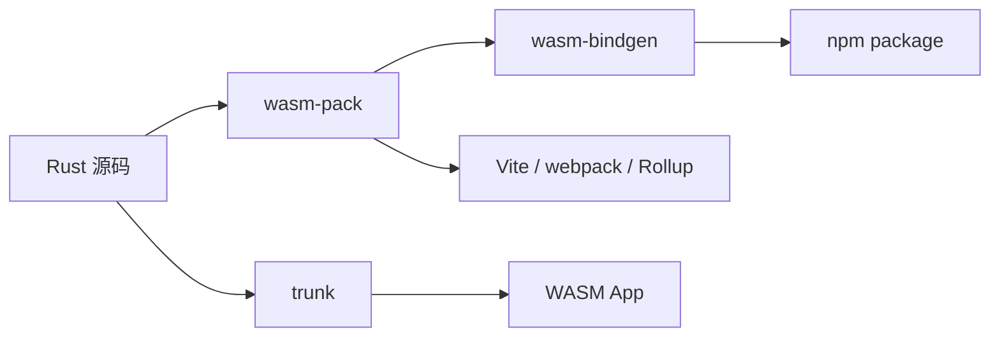

# 02. Rust → Wasm 工具链

> 使用 wasm-pack、wasm-bindgen 和 trunk 构建生产级 Rust Wasm 模块。

---

## 工具链概览



---

## 快速开始

### 1. 安装工具链

```bash
# Rust (via rustup)
curl --proto '=https' --tlsv1.2 -sSf https://sh.rustup.rs | sh

# wasm-pack
curl https://rustwasm.github.io/wasm-pack/installer/init.sh -sSf | sh

# wasm32 目标
rustup target add wasm32-unknown-unknown
```

### 2. 创建项目

```bash
wasm-pack new hello-wasm
cd hello-wasm
```

### 3. 编写 Rust 代码

```rust
// src/lib.rs
use wasm_bindgen::prelude::*;

#[wasm_bindgen]
pub fn add(a: i32, b: i32) -> i32 {
    a + b
}

#[wasm_bindgen]
pub struct Point {
    pub x: f64,
    pub y: f64,
}

#[wasm_bindgen]
impl Point {
    #[wasm_bindgen(constructor)]
    pub fn new(x: f64, y: f64) -> Point {
        Point { x, y }
    }

    pub fn distance(&self, other: &Point) -> f64 {
        ((self.x - other.x).powi(2) + (self.y - other.y).powi(2)).sqrt()
    }
}
```

### 4. 编译与发布

```bash
# 构建为 npm 包
wasm-pack build --target web

# 输出结构
pkg/
├── hello_wasm.d.ts      # TypeScript 类型定义
├── hello_wasm.js        # JS 胶水代码
├── hello_wasm_bg.wasm   # Wasm 二进制
└── package.json
```

### 5. 前端集成

```typescript
import init, { add, Point } from './pkg/hello_wasm.js';

async function main() {
  await init();  // 加载并实例化 Wasm 模块

  console.log(add(1, 2));  // 3

  const p1 = new Point(0, 0);
  const p2 = new Point(3, 4);
  console.log(p1.distance(p2));  // 5
}

main();
```

---

## wasm-bindgen 高级特性

### 与 JS API 交互

```rust
use wasm_bindgen::prelude::*;
use web_sys::console;

#[wasm_bindgen]
extern "C" {
    #[wasm_bindgen(js_namespace = console)]
    fn log(s: &str);

    #[wasm_bindgen(js_name = alert)]
    fn js_alert(s: &str);
}

#[wasm_bindgen]
pub fn greet(name: &str) {
    log(&format!("Hello, {}!", name));
    js_alert(&format!("Welcome, {}!", name));
}
```

### 接收/返回 JS 对象

```rust
use js_sys::{Array, Object, Reflect};
use wasm_bindgen::JsValue;

#[wasm_bindgen]
pub fn process_data(input: &JsValue) -> Result<JsValue, JsValue> {
    let obj = Object::new();
    Reflect::set(&obj, &"processed".into(), &true.into())?;
    Reflect::set(&obj, &"input".into(), input)?;
    Ok(obj.into())
}
```

---

## Trunk：纯前端 Rust 应用

Trunk 是 Rust/Wasm 的零配置构建工具，类似 Vite：

```bash
cargo install trunk
wasm-bindgen-cli

# 创建项目
cargo new --lib yew-app
cd yew-app
```

```rust
// 使用 Yew / Leptos / Dioxus 框架
use yew::prelude::*;

#[function_component(App)]
fn app() -> Html {
    html! {
        <div>
            <h1>{ "Hello from Rust + Yew!" }</h1>
        </div>
    }
}

fn main() {
    yew::Renderer::<App>::new().render();
}
```

```bash
# 开发服务器
trunk serve

# 生产构建
trunk build --release
```

---

## 框架选型

| 框架 | 范式 | 生态 | 适用场景 |
|------|------|------|----------|
| **Yew** | React-like (hooks) | 成熟 | 全功能 SPA |
| **Leptos** | Signals (fine-grained) | 快速增长 | 高性能响应式 |
| **Dioxus** | Cross-platform | 活跃 | 桌面 + Web 同构 |
| **Seed** | Elm-like | 小众 | 函数式偏好 |
