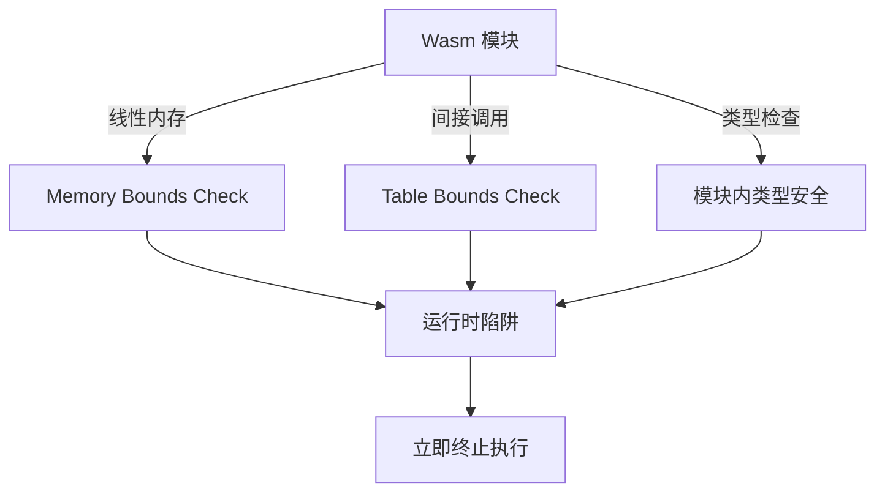

# 08. 安全模型与沙箱

> 能力安全、Spectre 缓解、内存隔离：Wasm 的安全边界与突破方法。

---

## 核心安全设计

WebAssembly 从出生就内建** defense in depth** 安全模型：



### 内存安全

- 所有内存访问通过**边界检查**（bounds check）
- 无指针算术越界（32/64 位偏移验证）
- 无未初始化内存读取（内存以零填充）

### 控制流安全

- 无任意跳转：只能调用已知函数或返回
- 间接调用通过 `call_indirect` + 表索引验证
- 结构化控制流（`block`/`loop`/`if`）防止栈破坏

---

## 能力安全（Capability-Based Security）

WASI Preview 2 的核心安全模型：

```bash
# 传统 POSIX：进程拥有用户全部权限
./app

# WASI：仅授予声明的能力
wasmtime run app.wasm \
  --dir /data::/data      \  # 只读访问 /data
  --env API_KEY::secret   \  # 只读环境变量
  --tcp-listen 8080         # 仅监听 8080
```

### 最小权限原则

```wit
// 模块仅请求需要的能力
package example:app;

world app-world {
    import wasi:filesystem/types@0.2.0;  // 需要文件系统
    import wasi:io/streams@0.2.0;        // 需要 IO
    // 不导入网络 = 无法访问网络
}
```

---

## Spectre 与侧信道缓解

Wasm 与 JS 共享进程地址空间，面临 Spectre 类攻击：

### 缓解措施

| 措施 | 机制 |
|------|------|
| **Site Isolation** | 不同站点在不同进程 |
| **Cross-Origin Isolation** | `Cross-Origin-Opener-Policy: same-origin` + `Cross-Origin-Embedder-Policy: require-corp` |
| **SharedArrayBuffer 限制** | 仅在隔离环境可用 |
| **32 位索引** | 即使 64 位平台也限制索引范围，减少推断窗口 |

启用 Cross-Origin Isolation：

```http
Cross-Origin-Embedder-Policy: require-corp
Cross-Origin-Opener-Policy: same-origin
```

```typescript
// 检查是否获得高精度计时器（Spectre 攻击前提）
if (crossOriginIsolated) {
  // 可用 SharedArrayBuffer 和 performance.measureUserAgentSpecificMemory()
}
```

---

## 供应链安全

Wasm 模块的二进制特性使其更难审计：

### 签名与验证

```bash
# 使用 sigstore 签名 Wasm 模块
cosign sign-blob --key cosign.key module.wasm

# 验证
wasmtime run --allow-precompiled module.wasm
```

### SBOM 生成

```bash
# 从 Rust 生成 SBOM
cargo auditable build --target wasm32-unknown-unknown
```

### 沙箱逃逸风险

| 风险 | 缓解 |
|------|------|
| 主机函数漏洞 | 审计所有 `extern "C"` 导入函数 |
| 编译器 bug | 使用官方工具链，保持更新 |
| 恶意预编译 | 拒绝 `.cwasm` 文件，从源码编译 |
| 资源耗尽 | 设置内存上限、 fuel/ gas 限制 |

---

## 运行时加固

```bash
# Wasmtime 安全选项
wasmtime run app.wasm \
  --max-memory-size 128MB \
  --max-table-elements 10000 \
  --fuel 100000000  # 指令数限制，防无限循环
```
