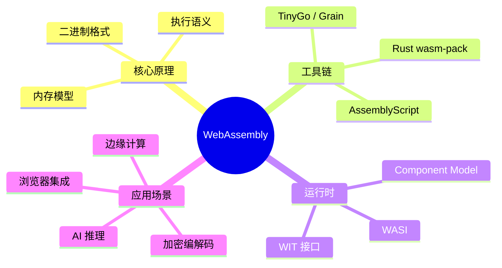

# ⚡ WebAssembly 深度专题

深度专题：从 Wasm 核心原理到 Rust/AssemblyScript 工具链，再到边缘计算与性能优化。

---

## 专题地图

---

## 章节导航

| # | 章节 | 核心内容 |
|---|------|----------|
| 01 | [WebAssembly 核心概念](./01-wasm-core-concepts) | 二进制格式、内存模型、栈机执行语义 |
| 02 | [Rust → Wasm 工具链](./02-rust-wasm-toolchain) | wasm-pack、wasm-bindgen、trunk |
| 03 | [AssemblyScript 与替代语言](./03-alternative-languages) | AssemblyScript、TinyGo、Grain、Swift Wasm |
| 04 | [WASI 与 Component Model](./04-wasi-component-model) | WASI Preview 2、WIT、能力安全模型 |
| 05 | [浏览器集成与 JS 互操作](./05-browser-js-interop) | SharedArrayBuffer、Worker、零拷贝、JSPI |
| 06 | [边缘计算中的 Wasm](./06-wasm-edge-computing) | Cloudflare Workers、Fastly、WasmEdge、Spin |
| 07 | [性能优化与基准测试](./07-performance-benchmarking) | 边界开销、SIMD、Streaming、内存管理 |
| 08 | [安全模型与沙箱](./08-security-sandbox) | 能力安全、Spectre 缓解、内存隔离 |

---

## 学习目标

完成本专题后，你将能够：

- 理解 WebAssembly 的栈机执行模型与线性内存架构
- 使用 Rust 或 AssemblyScript 编译生产级 Wasm 模块
- 利用 WASI 和 Component Model 构建可移植的服务端 Wasm
- 在浏览器和边缘环境中高效集成 Wasm 与 JavaScript
- 诊断和优化 Wasm 与 JS 之间的边界开销

---

## 相关专题

| 专题 | 关联点 |
|------|--------|
| [TypeScript 类型精通](../typescript-type-mastery/) | Wasm 模块的 TypeScript 类型声明与绑定生成 |
| [Edge Runtime](../edge-runtime/) | 边缘运行时与 Wasm 的协同部署模式 |
| [移动端跨平台](../mobile-cross-platform/) | 移动端 WebView 中 Wasm 的集成与性能 |
| [AI-Native Development](../ai-native-development/) | 端侧 AI 推理：TensorFlow.js Wasm 后端、ONNX Runtime |
| [数据库层](../database-layer/) | duckdb-wasm、sql.js 等 Wasm 数据库引擎 |
